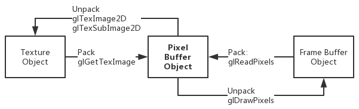
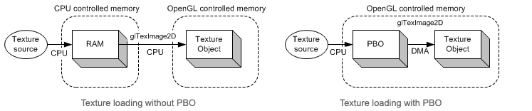

# 一、顶点信息传输

## 1. 立即模式 glBegin()/glEnd()

方式：立即绘制

优点：功能适配范围广，写法直观
缺点：频繁调用 OpenGL 函数，效率低，共享点使用次数多

例子：

1. 直接提交 OpenGL 命令到 GPU

```c
// Note that not all of OpenGL commands can be placed in between glBegin() and glEnd()
// Only a subset of commands can be used
// glVertex*(), glColor*(), glNormal*(), glTexCoord*(), glMaterial*(), glCallList(), etc.
glBegin(GL_TRIANGLES);
    glColor3f(1, 0, 0); // set vertex color to red
    glVertex3fv(v1);    // draw a triangle with v1, v2, v3
    glVertex3fv(v2);
    glVertex3fv(v3);
glEnd();
```

2. 将命令放到 DisplayList 后，批量一次传入到 GPU
   DisplayList 会将其中命令的所有资源存储到自己的内存中
   DisplayList 是服务端的状态，本身存储在 GPU 缓存中，只能存储与服务端有关的部分命令
   DisplayList 的命令和数据一旦上传便不可修改

```c
// create one display list
GLuint index = glGenLists(1);

// compile the display list, store a triangle in it
// Option: GL_COMPILE or GL_COMPILE_AND_EXECUTE(render)
glNewList(index, GL_COMPILE);
    glBegin(GL_TRIANGLES);
    glVertex3fv(v0);
    glVertex3fv(v1);
    glVertex3fv(v2);
    glEnd();
glEndList();
...

// draw the display list
glCallList(index);
...

// delete it if it is not used any more
glDeleteLists(index, 1);
```


## 2. VertexArray

方式：批量数据传入绘制

优点：数据以数组的形式**存储在应用缓存**，减少了 OpenGL 函数的频繁调用
缺点：每次绘制都要占用带宽上传到显存

例子：

```c
GLfloat vertices[] = {...}; // 36 of vertex coords

glUseProgram(progId);

// activate and specify pointer to vertex array
// 因为 vertices 存储在应用程序上，所以这里 enable client state
glEnableClientState(GL_VERTEX_ARRAY);
// 也可以用 
// glNormalPointer、glColorPointer、glIndexPointer、glTexCoordPointer、glEdgeFlagPointer
glVertexPointer(3, GL_FLOAT, 0, vertices);

// draw a cube
// 也可以用 glDrawElements、glDrawRangeElements
glDrawArrays(GL_TRIANGLES, 0, 36);

// deactivate vertex arrays after drawing
glDisableClientState(GL_VERTEX_ARRAY);
```


## 3. VertexBuffer

方式：批量数据传入绘制

优点：
1. 数据以数组的形式**存储在显卡高速缓存**，每次使用时不用重新上传，只需要在显卡绑定即可
2. 数据由于存储在显存，可以被应用程序在不同线程访问和修改

例子：

1. 创建和销毁

```c
GLuint vboId;                              // ID of VBO
GLfloat* vertices = new GLfloat[vCount*3]; // create vertex array

// generate a new VBO and get the associated ID
glGenBuffers(1, &vboId);

// bind VBO in order to use
// Option: GL_ARRAY_BUFFER or GL_ELEMENT_ARRAY_BUFFER
// This Option assists VBO to decide the most efficient locations of buffer objects
// For example, some systems may prefer indices in AGP or system memory, and vertices in video memory
// Once glBindBuffer() is first called, VBO initializes the buffer with a zero-sized memory buffer and set the initial VBO states, such as usage and access properties.
glBindBuffer(GL_ARRAY_BUFFER, vboId);

// upload data to VBO
// Option: glBufferSubData, GL_[STATIC/DYNAMIC/STREAM]_[DRAW/READ/COPY]
// GL_STATIC_DRAW 决定了数据的存储位置
// Static: 更新一次，使用多次
// Dynamic: 不断更新，使用多次
// Stream: 更新一次，最多使用几次
// Draw: application upload to GPU
// Read: GPU copy to application
// Copy: Draw and Read
glBufferData(GL_ARRAY_BUFFER, dataSize, vertices, GL_STATIC_DRAW);

// it is safe to delete after copying data to VBO
delete [] vertices;

// delete VBO when program terminated
glDeleteBuffers(1, &vboId);
```

2. 过去的使用方式：不同的 API  开启/关闭 不同的顶点属性
```c
glUseProgram(progId);

// bind VBOs for vertex array and index array
glBindBuffer(GL_ARRAY_BUFFER, vboId1);            // for vertex attributes
glBindBuffer(GL_ELEMENT_ARRAY_BUFFER, vboId2);    // for indices

glEnableClientState(GL_VERTEX_ARRAY);             // activate vertex position array
glEnableClientState(GL_NORMAL_ARRAY);             // activate vertex normal array
glEnableClientState(GL_TEXTURE_COORD_ARRAY);      // activate texture coord array

// do same as vertex array except pointer
glVertexPointer(3, GL_FLOAT, stride, offset1);    // last param is offset, not ptr
glNormalPointer(GL_FLOAT, stride, offset2);
glTexCoordPointer(2, GL_FLOAT, stride, offset3);

// draw 6 faces using offset of index array
glDrawElements(GL_TRIANGLES, 36, GL_UNSIGNED_BYTE, 0);

glDisableClientState(GL_VERTEX_ARRAY);            // deactivate vertex position array
glDisableClientState(GL_NORMAL_ARRAY);            // deactivate vertex normal array
glDisableClientState(GL_TEXTURE_COORD_ARRAY);     // deactivate vertex tex coord array

// bind with 0, so, switch back to normal pointer operation
glBindBuffer(GL_ARRAY_BUFFER, 0);
glBindBuffer(GL_ELEMENT_ARRAY_BUFFER, 0);
```

3. OpenGL 2.0 + 使用方式：同一个 API 开启/关闭 不同的顶点属性
```c
glUseProgram(progId);

// bind VBOs for vertex array and index array
glBindBuffer(GL_ARRAY_BUFFER, vboId1);            // for vertex coordinates
glBindBuffer(GL_ELEMENT_ARRAY_BUFFER, vboId2);    // for indices

glEnableVertexAttribArray(attribVertex);          // activate vertex position array
glEnableVertexAttribArray(attribNormal);          // activate vertex normal array
glEnableVertexAttribArray(attribTexCoord);        // activate texture coords array

// set vertex arrays with generic API
glVertexAttribPointer(attribVertex, 3, GL_FLOAT, false, stride, offset1);
glVertexAttribPointer(attribNormal, 3, GL_FLOAT, false, stride, offset2);
glVertexAttribPointer(attribTexCoord, 2, GL_FLOAT, false, stride, offset3);

// draw 6 faces using offset of index array
glDrawElements(GL_TRIANGLES, 36, GL_UNSIGNED_BYTE, 0);

glDisableVertexAttribArray(attribVertex);         // deactivate vertex position
glDisableVertexAttribArray(attribNormal);         // deactivate vertex normal
glDisableVertexAttribArray(attribTexCoord);       // deactivate texture coords

// bind with 0, so, switch back to normal pointer operation
glBindBuffer(GL_ARRAY_BUFFER, 0);
glBindBuffer(GL_ELEMENT_ARRAY_BUFFER, 0);
```

4. 更新 VAO
```c
// 方法 1：重新向 GPU 上传数据（缺点：应用程序和 GPU 要存储 2 份数据，每次更新都要占用带宽）
glBufferData(GL_ARRAY_BUFFER, dataSize, vertices, GL_STATIC_DRAW);

// 方法 2：通过映射 GPU 上缓存数据地址到应用程序的缓存地址
//        将应用程序对地址的操作用于对 GPU 缓存操作，达到在应用程序控制 GPU 缓存的效果

// bind then map the VBO
glBindBuffer(GL_ARRAY_BUFFER, vboId);

// Option: GL_READ_ONLY, GL_WRITE_ONLY, GL_READ_WRITE
// 如果 GPU 正在使用这个 buffer，将会返回 NULL
float* ptr = (float*)glMapBuffer(GL_ARRAY_BUFFER, GL_WRITE_ONLY);

// if the pointer is valid(mapped), update VBO
if(ptr)
{
    updateMyVBO(ptr, ...);          // custom function modify buffer data
    glUnmapBuffer(GL_ARRAY_BUFFER); // unmap it after use it's return GLboolean
}
```


# 二、Pixel Buffer

## 1. 创建和使用

Pixel Buffer Object 由 Vertex Buffer Object 扩展而来，因此对 Pixel Buffer 操作的许多细节和接口都与 Vertex Buffer 保持一致，这里不在赘述

例子：

```c
GLuint pboIds[2];

// Create
glGenBuffers(2, pboIds);

// Bind
// Option: GL_PIXEL_UNPACK_BUFFER / GL_PIXEL_PACK_BUFFER
glBindBuffer(GL_PIXEL_UNPACK_BUFFER, pboIds[0]);
// load data rgba
glBufferData(GL_PIXEL_UNPACK_BUFFER, 720 * 1280 * 4, NULL, GL_STREAM_DRAW);
// unbind
glBindBuffer(GL_PIXEL_UNPACK_BUFFER, 0);
...

// Note that glMapBuffer() causes sync issue
// If GPU is working with this buffer, glMapBuffer() will wait(stall)
// until GPU to finish its job. To avoid waiting (idle), you can call
// first glBufferData() with NULL pointer before glMapBuffer()
// If you do that, the previous data in PBO will be discarded and
// glMapBuffer() returns a new allocated pointer immediately
// even if GPU is still working with the previous data
glBufferData(GL_PIXEL_UNPACK_BUFFER, 720 * 1280 * 4, NULL, GL_STREAM_DRAW);

// Mapping PBO
glBindBuffer(GL_PIXEL_UNPACK_BUFFER, pboIds[0]);
GLubyte* ptr = (GLubyte*)glMapBuffer(GL_PIXEL_UNPACK_BUFFER, GL_WRITE_ONLY);
if(ptr)
{
  // Custom function: update data directly on the mapped buffer
  updatePixels(ptr, DATA_SIZE);
  // release pointer to mapping buffer
  glUnmapBuffer(GL_PIXEL_UNPACK_BUFFER);
}

// Delete PBO
glDeleteBuffers(1, &pboIds);
```


## 2. PBO、FBO、Texture Object



**Pack（OpenGL to Application）**
**glReadPixels**

1. 从 frame buffer 中读取数据
2. 将 frame buffer 数据写入 Pixel buffer


**Unpack（Application to OpenGL）**
**glDrawPixels**

1. 从 Pixel buffer 读取数据
2. 将 Pixel buffer 数据写入 frame buffer


## 3. Direct Memory Access

将数据转换到 Pixel Buffer Object 很快是由于：转到 PBO 的数据将会直接进入显卡缓存中，不通过 CPU 的调度

例如在加载纹理时：

1. 不使用 PBO
   在 CPU 的调度下，将图片资源加载到系统缓存，然后从系统缓存拷贝到 OpenGL 的纹理对象
2. 使用 PBO
   直接加载到 OpenGL 里的 PBO 下，然后拷贝到纹理对象
   整个过程由 GPU 完成，可以和 CPU 异步执行，效率提高



例子：

普通加载纹理的方式

```c
// Data is from CPU memory
glBindTexture(GL_TEXTURE_2D, textureId);
glTexImage2D(GL_TEXTURE_2D, 0, GL_BGRA, width, height, 0, GL_BGRA, GL_UNSIGNED_BYTE, data);
```


通过 PBO 加载纹理（PBO 创建时已经加载纹理数据）

```c
// bind the texture and PBO
glBindTexture(GL_TEXTURE_2D, textureId);
glBindBuffer(GL_PIXEL_UNPACK_BUFFER, pboIds[index]);

// copy pixels from PBO to texture object so the last param is 0 not data
// Use offset instead of pointer
glTexSubImage2D(GL_TEXTURE_2D, 0, 0, 0, width, height, GL_BGRA, GL_UNSIGNED_BYTE, 0);

// it is good idea to release PBOs with ID 0 after use
// Once bound with 0, all pixel operations are back to normal ways
glBindBuffer(GL_PIXEL_UNPACK_BUFFER, 0);
```


通过 PBO 加载/读取 Frame Buffer

```c
// set the target framebuffer to read
glReadBuffer(GL_FRONT);

// read pixels from framebuffer to PBO
// glReadPixels() should return immediately.
glBindBuffer(GL_PIXEL_PACK_BUFFER, pboIds[index]);
glReadPixels(0, 0, WIDTH, HEIGHT, GL_BGRA, GL_UNSIGNED_BYTE, 0);
```


# 三、Frame Buffer

> 定义：framebuffer 是 OpenGL 一系列数据存储的集合

**浮点帧缓冲 (Floating Point Framebuffer)**
当一个帧缓冲的颜色缓冲的内部格式被设定成了 `GL_RGB16F`, `GL_RGBA16F`, `GL_RGB32F`  或者 `GL_RGBA32F` 时，这些帧缓冲被叫做，浮点帧缓冲可以存储超过 0.0 到 1.0 范围的浮点值

当帧缓冲使用了一个标准化的定点格式(像 `GL_RGB` )为其颜色缓冲的内部格式，OpenGL 会在将这些值存入帧缓冲前自动将其约束到 0.0 到 1.0 之间


## 1. 不同种类的 framebuffer

1. **Default framebuffer**
   本地窗口系统创建和使用的 framebuffer，一定会显示到屏幕上，是本地系统创建 Context 的一部分，当 `glBindFramebuffer(GL_FRAMEBUFFER, 0);` 时，绑定的就是当前窗口系统提供的 default framebuffer
   这种 framebuffer 有本地窗口系统 API 创建提供，由 OpenGL 将其作为自己的输出给本地窗口系统来使用
   包含：多个（至少一个）色彩缓冲、一个深度缓冲、一个模板缓冲、一个累积缓冲
  2. **Frame Buffer Object**
     OpenGL 创建和使用的 framebuffer，可以不显示到屏幕上
     提供一个 FBO 对象来供 OpenGL 操作，FBO 对象可以有**多个（至少一个）色彩缓冲**，一个深度缓冲，一个模板缓冲（没有累积缓冲）


## 2. 内部数据对象

> framebuffer 提供的内部数据都以 attach 方式来赋予，并非内部创建
> 因此 framebuffer 内部数据的切换都要比单独切换 framebuffer 本身要快

切换 texture：**glFramebufferTexture2D**

1. attach 的 textureid 为 0，之前的纹理将会从 frame buffer 上解绑
2. 删除纹理时会自动从当前绑定的 framebuffer 上解绑，但如果当前纹理并不会从其他已 attach 的**非当前绑定的** framebuffer 解绑


切换 renderbuffer：**glFramebufferRenderbuffer**
1. renderbuffer 主要用来存储一些逻辑数据，而非图像数据

2. 可以通过 glGetRenderbufferParameteriv 来获取 renderbuffer 里数据的一些属性

   ```c
   int width;
   // Option: 
   // GL_RENDERBUFFER_WIDTH
   // GL_RENDERBUFFER_HEIGHT
   // GL_RENDERBUFFER_INTERNAL_FORMAT
   // GL_RENDERBUFFER_RED_SIZE
   // GL_RENDERBUFFER_GREEN_SIZE
   // GL_RENDERBUFFER_BLUE_SIZE
   // GL_RENDERBUFFER_ALPHA_SIZE
   // GL_RENDERBUFFER_DEPTH_SIZE
   // GL_RENDERBUFFER_STENCIL_SIZE
   glGetRenderbufferParameteriv(GL_RENDERBUFFER, GL_RENDERBUFFER_WIDTH, &width);
   ```

   

## 3. 创建和使用

例子：

```c
GLuint fboId;

// create a framebuffer object, you need to delete them when program exits.
glGenFramebuffers(1, &fboId);
glBindFramebuffer(GL_FRAMEBUFFER, fboId);

// create a renderbuffer object to store depth info
// NOTE: A depth renderable image should be attached the FBO for depth test.
// If we don't attach a depth renderable image to the FBO, then
// the rendering output will be corrupted because of missing depth test.
// If you also need stencil test for your rendering, then you must
// attach additional image to the stencil attachement point, too.
glGenRenderbuffers(1, &rboDepthId);
glBindRenderbuffer(GL_RENDERBUFFER, rboDepthId);
// allocat memory for renderbuffer
glRenderbufferStorage(GL_RENDERBUFFER, GL_DEPTH_COMPONENT, TEXTURE_WIDTH, TEXTURE_HEIGHT);
//glRenderbufferStorageMultisample(GL_RENDERBUFFER, fboSampleCount, GL_DEPTH_COMPONENT, TEXTURE_WIDTH, TEXTURE_HEIGHT);
glBindRenderbuffer(GL_RENDERBUFFER, 0);

// attach a texture to FBO color attachement point
glFramebufferTexture2D(GL_FRAMEBUFFER, GL_COLOR_ATTACHMENT0, GL_TEXTURE_2D, textureId, 0);
//glFramebufferTexture2D(GL_FRAMEBUFFER, GL_COLOR_ATTACHMENT0, GL_TEXTURE_2D, textureId, 0);

// attach a renderbuffer to depth attachment point
glFramebufferRenderbuffer(GL_FRAMEBUFFER, GL_DEPTH_ATTACHMENT, GL_RENDERBUFFER, rboDepthId);

//@@ disable color buffer if you don't attach any color buffer image,
//@@ for example, rendering the depth buffer only to a texture.
//@@ Otherwise, glCheckFramebufferStatus will not be complete.
//glDrawBuffer(GL_NONE);
//glReadBuffer(GL_NONE);

// trigger mipmaps generation explicitly
// NOTE: If GL_GENERATE_MIPMAP is set to GL_TRUE, then glCopyTexSubImage2D()
// triggers mipmap generation automatically. However, the texture attached
// onto a FBO should generate mipmaps manually via glGenerateMipmap().
glBindTexture(GL_TEXTURE_2D, textureId);
glGenerateMipmap(GL_TEXTURE_2D);
glBindTexture(GL_TEXTURE_2D, 0);
```


## 4. Multi Sample Anti Aliasing

多重采样抗锯齿功能**不会自动打开**

例子

```c
// Open MSAA
glEnable(GL_MULTISAMPLE); // default is enable

// create a 4x MSAA renderbuffer object for colorbuffer
int msaa = 4;
GLuint rboColorId;
glGenRenderbuffers(1, &rboColorId);
glBindRenderbuffer(GL_RENDERBUFFER, rboColorId);
glRenderbufferStorageMultisample(GL_RENDERBUFFER, msaa, GL_RGB8, width, height);

// create a 4x MSAA renderbuffer object for depthbuffer
GLuint rboDepthId;
glGenRenderbuffers(1, &rboDepthId);
glBindRenderbuffer(GL_RENDERBUFFER, rboDepthId);
// msaa: samples count
// get max count by use glGetIntegerv(GL_MAX_SAMPLES, &max_samples_count);
glRenderbufferStorageMultisample(GL_RENDERBUFFER, msaa, GL_DEPTH_COMPONENT, width, height);

// create a 4x MSAA framebuffer object
GLuint fboMsaaId;
glGenFramebuffers(1, &fboMsaaId);
glBindFramebuffer(GL_FRAMEBUFFER, fboMsaaId);

// attach colorbuffer image to FBO
glFramebufferRenderbuffer(GL_FRAMEBUFFER,       // 1. fbo target: GL_FRAMEBUFFER
                          GL_COLOR_ATTACHMENT0, // 2. color attachment point
                          GL_RENDERBUFFER,      // 3. rbo target: GL_RENDERBUFFER
                          rboColorId);          // 4. rbo ID

// attach depthbuffer image to FBO
glFramebufferRenderbuffer(GL_FRAMEBUFFER,       // 1. fbo target: GL_FRAMEBUFFER
                          GL_DEPTH_ATTACHMENT,  // 2. depth attachment point
                          GL_RENDERBUFFER,      // 3. rbo target: GL_RENDERBUFFER
                          rboDepthId);          // 4. rbo ID
```


### 4.1 多重采样 转 单采样

**多重采样后 framebuffer 的渲染结果不能直接使用，需要转换成 single-sample image 才能使用**

转换例子

```c
// copy rendered image from MSAA (multi-sample) to normal (single-sample)
// NOTE: The multi samples at a pixel in read buffer will be converted
// to a single sample at the target pixel in draw buffer.
glBindFramebuffer(GL_READ_FRAMEBUFFER, fboMsaaId); // src FBO (multi-sample)
glBindFramebuffer(GL_DRAW_FRAMEBUFFER, fboId);     // dst FBO (single-sample)

glBlitFramebuffer(0, 0, width, height,             // src rect
                  0, 0, width, height,             // dst rect
                  GL_COLOR_BUFFER_BIT,             // buffer mask(which buffers are copied)
                  GL_LINEAR);                      // scale filter
```


### 4.2 从 shader 里获取多重采样结果

```c
// shader 里自定义多重纹理采样

// 1. 使用 sampler2DMS 而不是 sampler2D
uniform sampler2DMS screenTextureMS; 

// 2. 使用 texelFetch
vec4 colorSample = texelFetch(screenTextureMS, TexCoords, 3);  // 取第4个子样本
```


## 5. 检查 framebuffer 的状态

例子

```c
bool checkFramebufferStatus(GLuint fbo)
{
    // check FBO status
    glBindFramebuffer(GL_FRAMEBUFFER, fbo); // bind
    GLenum status = glCheckFramebufferStatus(GL_FRAMEBUFFER);
    switch(status)
    {
    case GL_FRAMEBUFFER_COMPLETE:
        std::cout << "Framebuffer complete." << std::endl;
        return true;

    case GL_FRAMEBUFFER_INCOMPLETE_ATTACHMENT:
        std::cout << "[ERROR] Framebuffer incomplete: Attachment is NOT complete." << std::endl;
        return false;

    case GL_FRAMEBUFFER_INCOMPLETE_MISSING_ATTACHMENT:
        std::cout << "[ERROR] Framebuffer incomplete: No image is attached to FBO." << std::endl;
        return false;
/*
    case GL_FRAMEBUFFER_INCOMPLETE_DIMENSIONS:
        std::cout << "[ERROR] Framebuffer incomplete: Attached images have different dimensions." << std::endl;
        return false;

    case GL_FRAMEBUFFER_INCOMPLETE_FORMATS:
        std::cout << "[ERROR] Framebuffer incomplete: Color attached images have different internal formats." << std::endl;
        return false;
*/
    case GL_FRAMEBUFFER_INCOMPLETE_DRAW_BUFFER:
        std::cout << "[ERROR] Framebuffer incomplete: Draw buffer." << std::endl;
        return false;

    case GL_FRAMEBUFFER_INCOMPLETE_READ_BUFFER:
        std::cout << "[ERROR] Framebuffer incomplete: Read buffer." << std::endl;
        return false;

    case GL_FRAMEBUFFER_INCOMPLETE_MULTISAMPLE:
        std::cout << "[ERROR] Framebuffer incomplete: Multisample." << std::endl;
        return false;

    case GL_FRAMEBUFFER_UNSUPPORTED:
        std::cout << "[ERROR] Framebuffer incomplete: Unsupported by FBO implementation." << std::endl;
        return false;

    default:
        std::cout << "[ERROR] Framebuffer incomplete: Unknown error." << std::endl;
        return false;
    }
    glBindFramebuffer(GL_FRAMEBUFFER, 0);   // unbind
}
```


# Reference

1. [OpenGL Vertex Buffer Object (VBO)](http://www.songho.ca/opengl/gl_vbo.html)
2. [How to choose between GL_STREAM_DRAW or GL_DYNAMIC_DRAW?](https://stackoverflow.com/questions/8281653/how-to-choose-between-gl-stream-draw-or-gl-dynamic-draw)
3. [OpenGL Pixel Buffer Object](http://www.songho.ca/opengl/gl_pbo.html)
4. [OpenGL Frame Buffer Object](http://www.songho.ca/opengl/gl_fbo.html)