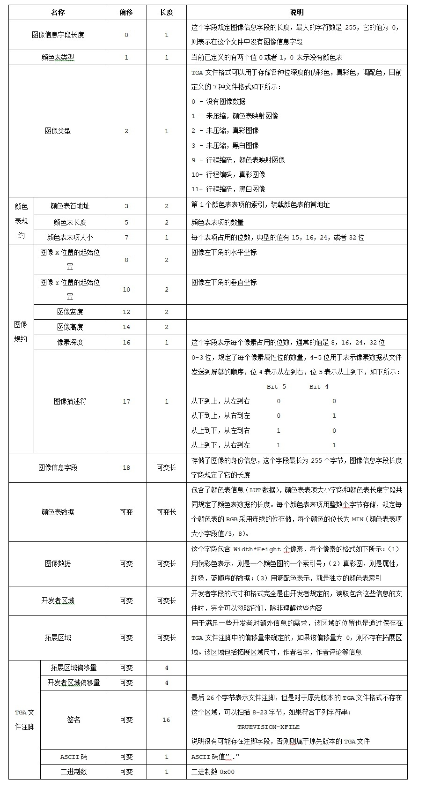

# 一、图片存储格式

## 1. BMP 文件

无损的图片格式，全称 Bitmap（无压缩，体积大）
可以直接存储图片数据，也可以采用索引表的存储方式。但即便采用了索引表的存储方式，也不能使体积缩小太多。图片的内存格式

适合：logos 等有明确边界的图片，程序的缓存文件（无压缩，可直接存储的特点）

格式：ARGB，BMP 文件的第一行数据是显示器的最后一行数据

内存排列：

- 位图文件头(bitmap-file header)

- 位图信息头(bitmap-informationheader)

- 颜色表(color table)

- 颜色点阵数据(bits data)

  

## 2. GIF 文件

无损的图片压缩格式，只能采用索引表的存储方式存储，因此最多能表示 256 种颜色
GIF 的图片善于做动画，并且支持 alpha 透明通道

适合：logos 等有明确边界的简单图片


## 3. PNG 文件

Portable Network Graphics
无损的图片压缩格式，不能做动画，支持 alpha 透明通道（透明效果优于 GIF）

- PNG-8：采用索引表的方式存储图片，最多能表示 256 种颜色（压缩后体积小于 GIF）
  适合：logos 等有明确边界的简单图片
- PNG-24：采用直接存储的方式存储图片，能存储上千种颜色（24 位存储一个像素）
  适合：兼顾好的压缩和效果的照片存储


## 4. JPEG 文件

Joint Photographic Experts Group
简称 jpg，有损的图片压缩格式，压缩后体积小（虽然有损，但不易被人眼察觉，24 位存储一个像素 RGB，**不支持透明**）
适合：只考虑体积照片的压缩

JPEG 格式图片是分为一个一个的段来存储的：
段的多少和长度并不是一定的。只要包含了足够的信息，该 JPEG 文件就能够被打开，呈现给人们

段的结构：

```c++
名称  字节数 数据  说明
------------------------------------------------------
段标识   1   FF   每个新段的开始标识
段类型   1        类型编码（称作“标记码”）
段长度   2        包括段内容和段长度本身,不包括段标识和段类型
段内容            ≤65533字节
```


JPEG 图片存储的段文件按顺序依次如下：

1. **SOI（文件头）**Start Of Image
   段标识：FF（标志新段的开始）
   段类型：D8（SOI 的段类型为 D8，表示文件头）
2. APP0（图像识别信息）Application data marker, type 0
   段标识：FF（标志新段的开始）
   段类型：E0（APP0 的段类型为 E0，定义交换格式和图像识别信息）
3. DQT（定义量化表）
4. SOF0（图像基本信息）
5. DHT（定义 Huffman 表）
6. DRI（定义重新开始间隔）
7. SOS（扫描行开始）
8. **EOI（文件尾）**End Of Image
   段标识：FF（标志新段的开始）
   段类型：D9（EOI 的段类型为 D9 表示文件尾）


## 5. SVG 文件

矢量的图片存储方案，内部存储的不是像素，而是曲线和线条
这使得即便是看起来很大的 SVG 图，存储起来会很小（前提是画面图像足够简单）
SVG 使用 XML 语法编写，并且可以在文本工具里修改（可以使用 JavaScript 快速修改 SVG 图片的颜色）

适合：logos 或 icons 等简单且需要适配不同尺寸的网站图片


## 6. TGA 文件

游戏中常用的图像格式

### 6.1 非压缩文件格式



### 6.2 压缩文件格式


# 二、三维文件格式

三维软件之间互相导入导出一般会涉及到一些格式不兼容的问题，不同的格式有着不同的定位及用处，有开源的也有商业的

| 格式                                     | 功能                                                         | 详情                                                         |
| ---------------------------------------- | ------------------------------------------------------------ | ------------------------------------------------------------ |
| **.abc**<br />Alembic                    | 动画、粒子、模型烘焙、流体                                   | 通用格式，有效地储存, 共享动画与特效场景<br />[官网](http://www.alembic.io/)<br />[为什么 CG 行业需要 Alembic（.abc） 通用格式](http://www.bgteach.com/article/131) |
| **.glTF**<br />GL Transmission Format    | 动画、场景、相机、网格、材质、纹理、着色器、着色程序         | json 格式描述<br />较少的冗余信息<br />[官网](https://www.khronos.org/gltf/)<br />[Github](https://github.com/KhronosGroup/glTF/blob/master/README.md) |
| **.fbx**<br />FilmBoX                    | 骨骼动画、材质、网格                                         | FilmBoX 这套软件所使用的格式，后改称 Motionbuilder<br />Autodesk 家族格式，在 3D Max、Maya、Softimage 等软件间进行**模型**、材质、**动作**和摄影机信息的互导，这样就可以发挥 3D Max 和 Maya 等软件的优势 |
| **.bvh**<br />BioVision                  | 骨骼动画                                                     | 对人体运动进行捕获后产生文件格式的文件扩展名，捕捉后的文件可以重复利用，应用在不同的角色骨骼驱动上制作动画 |
| **.obj**                                 | 主要支持多边形(Polygons)模型<br />不包含动画、材质特性、贴图路径、动力学、粒子等信息 | 几乎所有知名的 3D 软件都支持 OBJ 文件的读写                  |
| **.ply**<br />Polygon File Format        | 静态多边形模型，OBJ 格式的升级版<br />颜色、透明度、表面法向量、材质座标与资料可信度 | 改进了 Obj 格式所缺少的对任意属性及群组的扩充性<br />因此PLY格式发明了 "property" 及 "element" 这两个关键词，来概括 "顶点、面、相关资讯、群组" 的概念 |
| **.dae**<br />Data Acquisition Equipment | 骨骼动画、材质、网格                                         | xml 格式描述，3D Max、Maya，通过安装插件可导出<br />相比 FBX，对 dae 格式模型的载入有非常高的自由控制，是 FBX 格式代替品 |
| **.x3d**                                 | 多纹理、多遍绘制、支持 Shader 着色、支持多渲染目标、支持几何实例 | xml 格式描述，专为万维网而设计的三维图像标记语言             |
| **.stl**                                 | 三角面静态模型<br />只能描述三维物体的几何信息，不支持颜色材质等信息 | 计算机图形学处理 CG、数字几何处理如 CAD、 数字几何工业应用, 如三维打印机支持的最常见文件格式 |
| **.dxf**<br />Drawing Exchange File      | 三角面静态模型                                               | CAD 通用格式                                                 |
| **.3ds**                                 | 三角面静态模型                                               | 比较早的一种三维格式，三角面，最早游戏模型应用比较广泛<br />由于后期导入软件的不可编辑性、难以二次编辑现在逐渐的远离了我们的视线 |


# 三、三维软件

三维软件根据工作的功能分类为：

- 主体三维软件
  指能独立完成整个三维动画创作的平台性三维软件，具备建模、材质、灯光、渲染、动画、角色等一系列创作的需求，同时允许开发者对软件进行开发第三方插件以扩充软件主体的三维软件
  
  | 软件      | 简介                               | 功能                                                         |
  | --------- | ---------------------------------- | ------------------------------------------------------------ |
  | Blender   | 免费开源的三维软件                 | 建模、材质、灯光、渲染、雕刻、角色动画、纹理绘制、插件、摄影机跟踪、扣像、合成、游戏引擎 |
  | Maya      | 售价高昂，易学易用，制作效率高     | 建模、材质、灯光、渲染、角色动画、插件                       |
  | Cinema 4D | 许多一流艺术家和电影公司的首选     | 建模、材质、灯光、渲染、雕刻、角色动画、纹理绘制、插件       |
  | Houdini   | 完全是为电影而生                   | 建模、材质、灯光、渲染、特效、角色动画                       |
  | LightWave | 生物建模和角色动画方面功能异常强大 | 建模、材质、灯光、渲染、特效、角色动画                       |
  | Softimage | 2014 年三月，发布停产声明          | 建模、材质、灯光、渲染、特效、角色动画                       |

  
  
- 协助三维软件
  指能依赖三维主体软件存在，以强大的辅助完成高质量、高效率的流程，这种软件常常也属于单功能三维软件

  | 软件         | 简介                                                     | 功能                                                      |
  | ------------ | -------------------------------------------------------- | --------------------------------------------------------- |
  | Clarisse iFX | 以图像为核心<br />减少机器开始渲染最终图像所需的交互时间 | 导入模型、材质、灯光、即时渲染、特效、合成                |
  | Twinmotion   | 可以将项目导出为 .exe 可执行文件                         | 导入模型、材质、灯光、即时渲染、动画、展示、交互、VR、360 |
  | Lumion       | 实时3D可视化工具<br />用来制作电影和静帧作品             | 导入模型、材质、灯光、即时渲染、动画、展示、360           |
  | ZBrush       | 数字雕刻和绘画软件                                       | 雕刻、纹理                                                |


- 单功能三维软件
  一般在某个模块异常强大，由于着重解决流程中的一个环节，在效率上有着得天独厚的优势。 缺点也显而易见，需要主体三维软件的导入导出

  | 软件                 | 简介                                 | 功能                                                         |
  | -------------------- | ------------------------------------ | ------------------------------------------------------------ |
  | Marmoset Toolbag     | 实时材质编辑，渲染，动画编辑预览软件 | GPU、CPU 即时渲染器                                          |
  | Silo                 | 视频游戏及电影创建角色或建筑         | 建模、UV Mapping                                             |
  | Cycles Render Engine | blender 中的一种渲染引擎             | 基于光线追踪的渲染引擎，支持交互式渲染，内置一个新的光影节点系统、新的纹理工作流程和GPU加速，用户通过切换GPU渲染可以使渲染过程变得较为便捷 |


# Reference

- [What are the different usecases of PNG vs. GIF vs. JPEG vs. SVG?](https://stackoverflow.com/questions/2336522/what-are-the-different-usecases-of-png-vs-gif-vs-jpeg-vs-svg)

- [libpng](http://www.libpng.org/pub/png/libpng.html)

- [www.w3.org/Graphics](https://www.w3.org/Graphics/JPEG/itu-t81.pdf)

- [JPEG 解码器](https://zhuanlan.zhihu.com/p/27296876)

- [使用 libjpeg 进行图片压缩](https://zhuanlan.zhihu.com/p/126728039)

- [影像算法解析——JPEG 压缩算法](https://zhuanlan.zhihu.com/p/40356456)

- [TGA 文件格式解析](http://www.twinklingstar.cn/2013/471/tga-file-format/)

- [三维文件格式知多少 ](http://www.bgteach.com/article/132)

- [三维软件知多少](http://www.bgteach.com/article/40)

- [图片文件格式知多少 | jpeg、png、pdf、tga、tif、svg、esp、exr、hdr...](https://www.bgteach.com/article/133)

- [游戏制作行业为什么使用TGA格式的贴图而不使用PNG格式？ - 韦易笑的回答 - 知乎 ](https://www.zhihu.com/question/340196227/answer/789538293)

  

