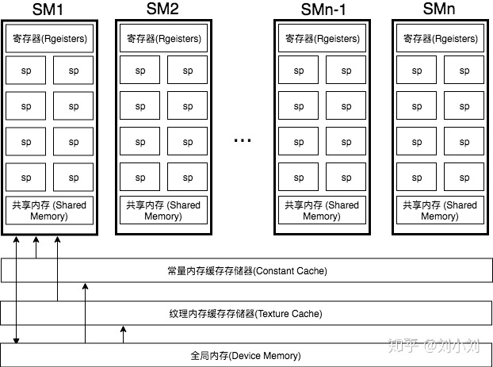

# 一、 GPU 的硬件架构

GPU 主要由 **显存 Device Memory** 和 **流多处理器 Stream Multiprocessors ** 组成（Stream Processors，SP 是 SM 中的一个 Core）


## 1. CPU vs GPU

相对于全面功能考虑的 CPU，GPU 有更多的 ALU（Arithmetic Logic Unit，逻辑运算单元），更少的逻辑控制单元和寄存器
GPU 的并行运算：与 CPU 上十几个线程的并行计算不同，GPU 的线程数可以达到上百万或更多


**缓存行 Cache-line**：缓存存储数据的最小单位

CPU 主要采用**三层**缓存（当今主流的 CPU 架构）

1. L1、L2 硬件缓存成为本地核心内缓存，即一个核一个
   如果是 4 核，那就是有 4 个 L1+4 个 L2
2. L3 硬件缓存是所有核共享的。即不管你的 CPU 是几核，这个 CPU 中只有一个 L3
3. L1 硬件缓存的大小是 64K，即 32K 指令缓存 +32K 数据缓存，L2 是 256K，L3 是 2M
   这不是绝对的，目前 Intel CPU 基本是这样的设计


GPU 主要采用**二层**缓存（缓存容量小，Cache 命中率低，延时较高）

1. L1 硬件缓存，速度最快，存储共享内存
   每个 SM 独立包含，一部分在 SM 内共用，一部分在每个 SP 内单独使用（用来交换共享内存）
2. L2 硬件缓存，速度低于 L1，存储只读常量、纹理
   多个 SM 共享使用
3. GPU 的全局内存最大为 12GB
   GPU 内存**不支持并发读取和并发写入**




## 2. Stream Multiprocessor

GPU 在 shader 中进行的向量运算采用 SIMD 或 MIMD 计算方式

- **SISD**（Single Instruction Single Data Stream，单指令单数据流）：传统顺序执行计算机使用
- **MIMD**（Multiple Instruction Stream Multiple Data Stream，多指令多数据流）：现代大多数计算机使用，使用多个控制器来异步地控制多个处理器，从而实现空间上的并行性。从硬件角度看，MIMD 需要消耗大量的晶体管数
- **SIMD**（Single Instruction Stream Multiple Data Stream，单指令多数据流）：GPU 内置计算方式，CPU 里也有相应的实现方法
- **MISD**（Multiple Instruction Stream Single Data Stream，多指令单数据流）


早期的 GPU，顶点着色器和像素着色器的硬件结构是独立的（顶点和像素线程资源不能共享）
使用统一着色器架构 **Unified shader Architecture**，VS、PS、GS、CS 都可以使用相同的硬件资源（线程共享）Stream Multiprocessor

<p>
    Stream Multiprocessor，SM 为 Shader 执行的地方，如右图一个多流处理器包含
    
</p>

1. **多边形引擎 PolyMorph Engine**：负责 attribute Setup、VertexFetch、曲面细分、栅格化
2. **多 ALU 逻辑运算 Core**（每个核代表一个线程，由 Warp 统一管理一组线程）
   Warp 中的多个线程是**单指令多线程**（相同的逻辑，不同的数据）
   当执行 if-else 语句、 for 循环次数 n 不是常量，或被 break 提前终止了但其他批次循环的内容还在执行时
   一个 Warp 线程组只会有部分满足逻辑条件的线程在执行，其他线程当前执行阶段会什么都不执行（被遮掩，但是仍然活跃）
   这相当于浪费了一部分线程资源，导致像 if-else 这样的语句是 false 的情况也占用了线程资源（占用了，但不使用）
3. **指令缓存 Instruction Cache**
4. **LD/ST（load/store）**：加载和存储数据
5. **SFU（Special function units）**：执行特殊数学运算（sin、cos、log 等）
6. **寄存器** 128KB
7. **L1 Cache**
   配合共享的 L2 Cache 做到 vertex-shader 和 pixel-shader 的数据通信
8. **Uniform Buffer** 的**部分**缓存
9. **Texture Cache 和 纹理读取单元**


## 3. GPU 处理 Shader

**Shader 处理流程**

1. CPU 端编译 Shader 源码为二进制（现代 GPU Shader 为二进制）
2. CPU 端将 shader 二进制指令经由 PCI-e 推送到 GPU 端
3. GPU 在执行代码时，会用 Context 将指令分成若干 Channel 推送到各个 SM 的存储空间


**Shader 的流水线多线程式处理**

多个 SP 里的多个运算单元同时运行同一个 Shader，但每个运算单元支撑的 1 个线程处理的数据又各不相同


# 二、CPU、GPU、显示器

## 1. <span id="gpu">CPU-GPU 异构系统</span>


**分离式**结构（左图）

- 结构：CPU 和 GPU 拥有各自的存储系统，两者通过 PCI-e 总线进行连接，可以共享一套虚拟地址空间，必要时会进行内存拷贝

- 缺点：PCI-e 相对于两者具有低带宽和高延迟，数据的**传输带宽**成了其中的性能瓶颈
- 应用的硬件设备：**PC**（CPU、GPU 存储**各自有存储系统**）、**移动端**（CPU、GPU **继承到了一个芯片，且共享物理内存**）
  很多 SoC （比如：移动端）都是集成了CPU 和 GPU，事实上这仅仅是在物理上进行了集成，并不意味着它们使用的（运行时）就是耦合式结构


**耦合式**结构（右图）

- 结构：CPU 和 GPU 集成到了一个芯片，GPU 没有独立的内存，与 GPU 共享系统内存，由 MMU 进行存储管理
- 应用的硬件设备：PS4


## 2. CPU-GPU Workflow

下图所示为 CPU-GPU 异构系统的工作流，当 CPU 遇到图像处理的需求时，会调用 GPU 进行处理，主要流程可以分为以下四步：

1. 将主存的处理数据 CPU 复制到 显存 GPU 中（可以通过 [DMA](./EXT0_GLBuffers&MultiSample.md) 跳过此步骤）
2. CPU 指令驱动 GPU
3. GPU 中的每个运算单元并行处理
4. GPU 将显存结果传回主存


## 3. CPU-GPU Data transmission


1. **MMIO（Memory-Mapped I/O）**
   CPU 通过 MMIO 访问 GPU 的寄存器状态
   通过 MMIO 传送数据块传输命令，支持 DMA 的硬件可以实现块数据传输

2. **GPU Context**
   上下文表示 GPU 的计算状态，在 GPU 中占据部分虚拟地址空间
   多个活跃态下的上下文可以在 GPU 中并存（一个 Context 对应一个 SP）

3. **CPU Channel**
   来自 CPU 操作 GPU 的命令存储在内存中，并提交至 GPU channel 硬件单元
   每个 GPU 上下文可拥有多个 GPU Channel
   每个 GPU 上下文都包含 GPU channel 描述符（GPU 内存中的内存对象）
   每个 GPU Channel 描述符存储了channel 的配置，如：其所在的页表
   每个 GPU Channel 都有一个专用的命令缓冲区，该缓冲区分配在 GPU 内存中，通过 MMIO 对 CPU 可见

4. **GPU 页表**
   GPU 上下文使用 GPU 页表进行分配，该表将**虚拟地址**空间与**其他地址空间**隔离开来
   GPU 页表与 CPU 页表分离，其驻留在 GPU 内存中，物理地址位于 GPU 通道描述符中
   通过 GPU channel 提交的所有命令和程序都在对应的 GPU 虚拟地址空间中执行
   GPU 页表将 GPU 虚拟地址不仅转换为 GPU 设备物理地址，还转换为主机物理地址
   这使得 GPU 页面表能够将 GPU 存储器和主存储器统一到统一的 GPU 虚拟地址空间中，从而构成一个完成的虚拟地址空间

5. **PFIFO Engine**
   一个提交 GPU 命令的特殊引擎
   维护多个独立的命令队列，即 channel（带有 put 和 get 指针的环形缓冲器）
   会拦截多有对通道控制区域的访问以供执行
   GPU 驱动使用一个通道描述符来存储关联通道的设置

6. **Buffer Object** 缓冲对象
   一块内存，可以用来存储纹理，渲染对象，着色器代码等等


## 4. 显示器的显示

从 CPU 通过 GPU 到显示的流程如下：

1. CPU 计算好显示内容提交至 GPU
2. GPU 渲染完成后将渲染结果存入帧缓冲区
3. 视频控制器会按照 `VSync` 信号逐帧读取帧缓冲区的数据
4. 帧缓冲区数据 经过转换后 由显示器进行显示


**显示器显示工作流程**

1. 显示器逐行刷新，每一行刷新完后会发出一个水平同步信号（horizonal synchronization），简称 **HSync**
2. 绘制下一行
3. 显示器一帧画面绘制完成后会发出一个垂直同步信号（vertical synchronization），简称 **VSync**


**双缓冲机制**

- 使用场景：防止在快速运动场景下，由于**显卡运算速率 > 显示器运算速率**导致快速运动的动作割裂情况（画面撕裂）
- 方法：使用两个帧缓冲，一个负责 GPU 写入，一个负责 显示器 读取，用垂直同步确保写入完成后将写入和读取帧缓冲互换角色
- 缺点：开启垂直同步，画面会有延迟（无法达到显卡的最大运算速率），但并没有卡顿
  `显卡绘制一帧时间 > 显示器刷新一帧时间 ? 显示器刷新(显卡等待) : 显示器显示上一帧，等待显卡绘制完成(屏幕卡顿);`
- 解决方法：用**三重缓冲**代替垂直同步
  三重缓冲：在双缓冲的基础上加了一个缓冲
  在等待垂直同步时，来回交替渲染两个离屏的缓冲区
  垂直同步发生时，屏幕缓冲区和最近渲染完成的离屏缓冲区交换，实现充分利用硬件性能的目的


# 三、测试 GPU 硬件信息

## 1. NV Shader 扩展功能

[NV shader thread group](https://www.opengl.org/registry/specs/NV/shader_thread_group.txt) 提供了 OpenGL 的扩展，可以查询 GPU 线程、Core、SM、Warp 等硬件相关的属性（需要支持 GLVersion 4.3+ 的硬件）

```c
// 开启扩展
#extension GL_NV_shader_thread_group : require     (or enable)

WARP_SIZE_NV	// 单个线程束的线程数量
WARPS_PER_SM_NV	// 单个SM的线程束数量
SM_COUNT_NV		// SM数量

uniform uint  gl_WarpSizeNV;	// 单个线程束的线程数量
uniform uint  gl_WarpsPerSMNV;	// 单个SM的线程束数量
uniform uint  gl_SMCountNV;		// SM数量

in uint  gl_WarpIDNV;		// 当前线程束id
in uint  gl_SMIDNV;			// 当前线程束所在的SM id，取值[0, gl_SMCountNV-1]
in uint  gl_ThreadInWarpNV;	// 当前线程id，取值[0, gl_WarpSizeNV-1]

in uint  gl_ThreadEqMaskNV;	// 是否等于当前线程id的位域掩码。
in uint  gl_ThreadGeMaskNV;	// 是否大于等于当前线程id的位域掩码。
in uint  gl_ThreadGtMaskNV;	// 是否大于当前线程id的位域掩码。
in uint  gl_ThreadLeMaskNV;	// 是否小于等于当前线程id的位域掩码。
in uint  gl_ThreadLtMaskNV;	// 是否小于当前线程id的位域掩码。

in bool  gl_HelperThreadNV;	// 当前线程是否协助型线程(Draw quad 时，不在当前图元上的像素所在的线程)
/**
   The variable gl_HelperThreadNV specifies if the current thread is a helper thread. In implementations supporting this extension, fragment shader invocations may be arranged in SIMD thread groups of 2x2 fragments called "quad".  When a fragment shader instruction is executed on a quad, it's possible that some fragments within the quad will execute the instruction even if they are not covered by the primitive.  Those threads are called helper threads.  Their outputs will be discarded and they will not execute global store functions, but the intermediate values they compute can still be used by thread group sharing functions or by fragment derivative functions like dFdx and dFdy.
*/
```


## 2. Sample Code

```C
// VS
#version 430 core
layout (location = 0) in vec3 aPos;

void main() {
	gl_Position = vec4(aPos, 1.0f);
}

// FS
#version 430 core
#extension GL_NV_shader_thread_group : require

uniform uint  gl_WarpSizeNV;	// 单个线程束的线程数量
uniform uint  gl_WarpsPerSMNV;	// 单个SM的线程束数量
uniform uint  gl_SMCountNV;		// SM数量

in uint  gl_WarpIDNV;		// 当前线程束id
in uint  gl_SMIDNV;			// 当前线程所在的SM id，取值[0, gl_SMCountNV-1]
in uint  gl_ThreadInWarpNV;	// 当前线程id，取值[0, gl_WarpSizeNV-1]

out vec4 FragColor;

void main() {
	// SM id
	float lightness0 = gl_SMIDNV / gl_SMCountNV;
    // warp id
    float lightness1 = gl_WarpIDNV / gl_WarpsPerSMNV;
    // thread id
	float lightness2 = gl_ThreadInWarpNV / gl_WarpSizeNV;
    
	FragColor = vec4(lightness0);
}
```


**SM id 的结果 lightness0 分析：**

1. 通过计算画面色阶总数得出 SM 的总数
2. 通过单个三角面内重复的像素块个数推算每个 SM 内的核心数
3. 不同三角形的接缝处出现断层，说明同一个像素块如果分属不同的三角形，就会分配到不同的 SM 进行处理
   由此推断，**相同面积的区域，如果所属的三角形越多，就会导致分配给 SM 的次数越多，消耗的渲染性能也越多**


# 四、GPU 硬件渲染模式

## 1. IMR

 **Immediate Mode Rendering 立即渲染模式**：PC 端


- 优点：顶点着色器和其它几何体相关着色器的输出数据能存储在 GPU 上（FIFO 缓冲区），直到管道中的下一阶段准备使用数据

- 缺点：由于根据图元划分绘制批次，GPU 对整个帧缓冲进行随机访问，帧缓冲只能存储在外部 DRAM 上，导致高分辨率时内存**带宽负载高**

- 优化：降带宽，将最近访问的帧缓冲存储排布在靠近 GPU 的位置来提高内存命中率
  
- 方法：**优先根据图元来划分绘制批次**
  
  
  
  ```python
  # 每个顶点几何图形画完后直接做像素颜色，此时像素颜色不确定，需要多次读写 framebuffer（深度值的不同）
  for draw in renderPass:
      for primitive in draw:
          for vertex in primitive:
              execute_vertex_shader(vertex)
              
          if primitive not culled:
              for fragment in primitive:
                  execute_fragment_shader(fragment)
  ```
  


## 2. TB[D]R

**Tile Based [Deferred] Rendering 基于切片的[延迟]渲染**：移动端


- 优点：
  可以将整个颜色、深度和模板的工作集存储在快速的 On-chip RAM 上（GPU 直连，不用带宽） 
  深度测试和混合透明像素所需帧缓冲数据也存储在 GPU 内部，通过提高缓存命中来降低了带宽消耗

- 缺点：
  GPU 必须将每个顶点的变化数据和 Tile 的中间状态存储到主内存中，着色阶段随后读取这些数据
  通过**延迟一帧**的方式降低了带宽

- 方法：**优先根据帧缓冲来划分绘制批次**，将帧缓冲切分为几个固定大小的 Tile，分别渲染每个 Tile 上的像素
  
  
  
  ```python
  # Pass 1. 将所有几何图元属性处理后，逐个划分到对应的 Tile 中
  for draw in renderPass:
      for primitive in draw:
          for vertex in primitive:
              execute_vertex_shader(vertex)
          if primitive not culled:
              append_tile_list(primitive)
  
  # Pass 2. 根据当前 Tile 的图元属性绘制当前 Tile 所包含的所有像素
  for tile in renderPass:
      for primitive in tile:
          for fragment in primitive:
              execute_fragment_shader(fragment)
  ```
  


# 五、GPU 硬件新特性

## 1. Pixel Local Storage

支持平台：OpenGL ES、Metal、Vulkan、D3D

**Pixel Local Storage（PLS）**是一种数据存取方式，用 PLS 声明的数据将保存在 GPU 的 Tile buffer 上
应用：**延迟着色**所需的 **GBuffer** 数据一直处于 PLS 之中，最好解析后返回最终颜色，而**不需要将 GBuffer 写回系统显存**

```glsl
// 1. 光照累积
__pixel_localEXT FragData // 可读写数据
{
    layout(rgba8) highp vec4 Color;
    layout(rg16f) highp vec2 NormalXY;
    layout(rg16f) highp vec2 NormalZ_LightingB;
    layout(rg16f) highp vec2 LightingRG;
} gbuf;

void main() {
    vec3 Lighting = CalcLighting(gbuf.NormalXY, gbuf.NormalZ_LightingB.x);
    gbuf.LightingRG += Lighting.xy;
    gbuf.NormalZ_LightingB.y += Lighting.z;
}

// 2. 最终着色
// __pixel_local_outEXT 只读数据
__pixel_local_inEXT FragData // 只读数据
{
    layout(rgba8) highp vec4 Color;
    layout(rg16f) highp vec2 NormalXY;
    layout(rg16f) highp vec2 NormalZ_LightingB;
    layout(rg16f) highp vec2 LightingRG;
} gbuf;

out highp vec4 FragColor;

void main() {
    FragColor = resolve(gbuf.Color, gbuf.LightingRG, gbuf.NormalZ_LightingB.y);
}
```


## 2. Subpass

支持平台：Metal、Vulkan、D3D

SubPass 与 Pixel Local Storage 类似也是存储数据到 GPU 的 Tile buffer 上，借鉴了 TBDR 的延迟一帧的 1 Pass 拆成 图元处理 Pass 和 着色 Pass 这样两个 Subpass 的想法


限制：

- 所有 Subpass 必须在同一个 Render Pass 中（不能是上一个）
- 无法在超过 GPU Tile buffer 范围外进行采样

```c
// 读
// LOAD_OP_LOAD：从全局内存加载 Attachment 到 Tile
// LOAD_OP_CLEAR：清理Tile缓冲区的数据。
// LOAD_OP_DONT_CARE：不对 Tile 缓冲区的数据做任何操作，通常用于 Tile 内的数据会被全部重新，效率高于 LOAD_OP_CLEAR

// 写
// STORE_OP_STORE：将 Tile 内的数据存储到全局内存
// STORE_OP_DONT_CARE：不对 Tile 缓冲区的数据做任何存储操作

// 1. Attachment
VkAttachmentDescription colorAttachment = {};
colorAttachment.format = VK_FORMAT_B8G8R8A8_SRGB;
colorAttachment.samples = VK_SAMPLE_COUNT_1_BIT;
// 标明 loadOp 为 DONT_CARE
colorAttachment.loadOp = VK_ATTACHMENT_LOAD_OP_DONT_CARE;
// 标明 storeOp 为 DONT_CARE
colorAttachment.storeOp = VK_ATTACHMENT_STORE_OP_DONT_CARE;

// 2. 为了让 Attachment 存储到 Tile 内，必须使用标记 TRANSIENT_ATTACHMENT 和 LAZILY_ALLOCATED
VkImageCreateInfo imageInfo{VK_STRUCTURE_TYPE_IMAGE_CREATE_INFO};
imageInfo.flags		= flags;
imageInfo.imageType	= type;
imageInfo.format	= format;
imageInfo.extent	= extent;
imageInfo.samples	= sampleCount;
// Image 使用 TRANSIENT_ATTACHMENT 的标记
imageInfo.usage		= VK_IMAGE_USAGE_TRANSIENT_ATTACHMENT_BIT;

VmaAllocation memory;
VmaAllocationCreateInfo memoryInfo{};
memoryInfo.usage		  = memoryUsage;
// Image 所在的内存使用 LAZILY_ALLOCATED 的标记
memoryInfo.preferredFlags = VK_MEMORY_PROPERTY_LAZILY_ALLOCATED_BIT;

// 创建 Image
auto result = vmaCreateImage(device.get_memory_allocator(), &imageInfo, memoryInfo, &handle, &memory, nullptr);
```


# 六、常见问题

## 1. PCIe BindWidth

显存的带宽比内存的大很多（显存的位宽大）

- **内存** 和 **显存** 之间的 PCIe 总线带宽过小是 CPU 和 GPU 交互的瓶颈
- 在移动端，由于其[耦合式的物理架构](#gpu)，带宽是一种多设备（CPU、GPU、AUDIO 等）共享的资源，而且**处理器通过带宽对存储的访问很耗电**
- OpenGL 的**显示列表**，将一组绘制指令放到 GPU 上，CPU 只要发一条 "执行这个显示列表" 这些指令就执行，而不必每次渲染都发送大量指令到 GPU，从而节约 PCIe 带宽


移动设备的特点：不同于 PC 端的 CPU 和 GPU 纯粹地追求计算性能，移动端在尺寸、能耗、硬件性能等诸多方面都存在显著的差异

1. 性能（**P**erformance）：移动设备的各类元件（CPU、带宽、内存、GPU等）的性能都只是PC设备的数十分之一
2. 能耗（**P**ower）：为了满足足够长的续航和散热限制，必须严格控制移动设备的整机功率
   PC 设备通常可以安装散热风扇、甚至水冷系统，而移动设备不具备这些主动散热方式，只能靠热传导散热
   如果散热不当，CPU 和 GPU 都会<u>主动降频</u>，以非常有限的性能运行，以免设备元器件因过热而损毁
3. 面积（**A**rea）：移动端的便携性就要求整机只能限制在非常小的体积之内


## 2. Pipeline Barrier

Vulkan、Metal、DX12 等现代图形 API 可以精确指定渲染管线屏障 Barrier 的等待阶段
避免 TBDR 这种 VS 和 FS 分两个 Pass 等待期间造成的 GPU 流水线并发率低，提高 Shader 在 GPU 运行的并发效果


## 3. GPU 访问内存

由于 TBDR 的 Tile GPU 缓存拆分，GPU 在访问内存时，多组 ALU 计算单元核需要串行访问


# Reference

1. [NV extensions](https://www.khronos.org/registry/OpenGL/extensions/NV/)
2. [GDC Vault](https://gdcvault.com/browse/?categories=PgTaVr)
3. [Siggraph Conference Content](https://www.siggraph.org/learn/conference-content/)
4. [Rendering pipeline: The hardware side](https://slideplayer.com/slide/11059244/)
4. [Introduction to GPU Architecture](http://haifux.org/lectures/267/Introduction-to-GPUs.pdf)
4. [An Introduction to Modern GPU Architecture](http://download.nvidia.com/developer/cuda/seminar/TDCI_Arch.pdf)
4. [Revisting Co-Processing for Hash Joins on the Coupled CPU-GPU Architecture](https://www.slideshare.net/mohamedragabslideshare/p12-29046493)
4. [Understanding GPU caches](https://www.rastergrid.com/blog/gpu-tech/2021/01/understanding-gpu-caches/)
8. [Transitioning from OpenGL to Vulkan](https://developer.nvidia.com/transitioning-opengl-vulkan)
9. [Next Generation OpenGL Becomes Vulkan: Additional Details Released](https://www.anandtech.com/show/9038/next-generation-opengl-becomes-vulkan-additional-details-released)
10. [Bringing Fortnite to Mobile with Vulkan and OpenGL ES](https://www.khronos.org/assets/uploads/developers/library/2019-gdc/Vulkan-Bringing-Fortnite-to-Mobile-Samsung-GDC-Mar19.pdf)
5. [Graphics Processing Unit(GPU) Memory Hierarchy](http://meseec.ce.rit.edu/551-projects/spring2015/3-2.pdf)[Tile-Based Rendering](https://developer.arm.com/solutions/graphics-and-gaming/developer-guides/learn-the-basics/tile-based-rendering)
6. [Understanding Render Passes](https://developer.arm.com/solutions/graphics-and-gaming/developer-guides/learn-the-basics/understanding-render-passes)
6. [Asynchronous Shaders](http://developer.amd.com/wordpress/media/2012/10/Asynchronous-Shaders-White-Paper-FINAL.pdf)
7. [GameDev Best Practices](https://developer.samsung.com/galaxy-gamedev/best-practice.html)
8. [Accelerating Mobile XR](https://community.arm.com/cfs-file/__key/communityserver-blogs-components-weblogfiles/00-00-00-20-66/siggraph_2D00_2018_2D00_mmg_2D00_2_2D00_rob_2D00_xr.pdf)
9. [Google Developer Contributes Universal Bandwidth Compression To Freedreno Driver](https://www.phoronix.com/scan.php?page=news_item&px=Freedreno-UBWC-A6XX)
10. [Using pipeline barriers efficiently](https://github.com/KhronosGroup/Vulkan-Samples/blob/master/samples/performance/pipeline_barriers/pipeline_barriers_tutorial.md#the-sample)
11. [Graphics Shaders - Theory and Practice 2nd Edition](http://cs.uns.edu.ar/cg/clasespdf/GraphicShaders.pdf)
11. [Unreal Engine 4: Mobile Graphics on ARM CPU and GPU Architecture](https://armkeil.blob.core.windows.net/developer/Files/pdf/graphics-and-multimedia/Unreal Engine 4 Mobile Graphics on ARM CPU and GPU Architecture.pdf)
12. [渲染优化-从GPU的结构谈起](https://zhuanlan.zhihu.com/p/58694744)
12. [Render Graph 与现代图形 API](https://zhuanlan.zhihu.com/p/425830762)
7. [计算机那些事(8)——图形图像渲染原理](http://chuquan.me/2018/08/26/graphics-rending-principle-gpu/)
7. [移动游戏性能优化通用技法](https://www.cnblogs.com/timlly/p/10463467.html)
7. [写实大世界游戏渲染技术详解 GPU 优化](https://mp.weixin.qq.com/s/T1t7dQwmxoUfuz1ik2USVg)
7. [剖析虚幻渲染体系（12）- 移动端专题Part 2（GPU架构和机制）](https://www.cnblogs.com/timlly/p/15546797.html)

