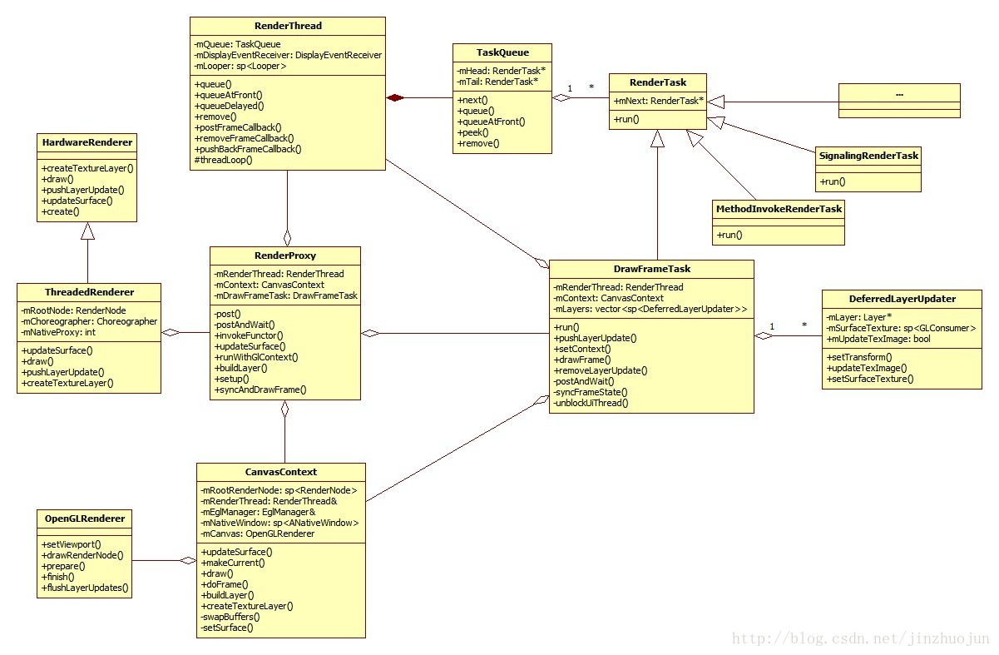

# 零、代码 Debug

> 关于性能的衡量 帧率/单帧时间，**建议采用单帧时间**
>
> 由于 帧率 = 60 / 单帧时间，他们之间的关系不是线性的，例如在减少同样时间消耗的情况下：
> 低帧率区间进步缓慢，每秒 10fps 下，帧时间减少 2ms，帧率提高到 10.2fps
> 高帧率区间进步明显，每秒 25fps 下，帧时间减少 2ms，帧率提高到 26.3fps


第三方跨平台框架

- [Flutter外接纹理](https://zhuanlan.zhihu.com/p/42566807)


# 一、Android 平台

>图片有不清晰的地方，可以点开连接看大图

## 1. 数据的封装

### 1.1 Surface
内存中的一段绘图缓冲区，是对 framebuffer 的 Java 封装对象


### 1.2 SurfaceTexture
内存中的一段绘图缓冲区，对 EGL texture 的 Java 封装对象

数据源：android.hardware.camera2, MediaCodec, MediaPlayer 和 Allocation 这些类的目标视频数据输出对象

限制：API 11 存在，Android 3.0 及其后才能使用

特点：可以接收一个 EGL texture 的纹理 ID 来产生，可以做到**离线渲染**

关键方法：

- updateTexImage（从内容流中获取当前帧，使得内容流中的一些帧可以跳过）

- 通过 调用 getTransformMatrix 获取纹理的旋转情况


SurfaceTexture 使用流程


## 2. 数据的展示和刷新

### 2.1 SurfaceView

父类：View

限制：API 1 存在

回调方法运行线程：主线程

优点：有自己的 Surface 来刷新，可以做到**局部刷新，独立线程刷新数据**

缺点：不能进行 Transition，Rotation，Scale 等变换，这导致 SurfaceView 在由于刷新不受主线程控制，**滑动时可能有黑边**

关键方法：getHolder（获取 SurfaceHolder ，SurfaceHolder 持有 Surface 数据对象）


### 2.2 GLSurfaceView

父类：SurfaceView

限制：API 3 存在，Android 1.5 及其后才能使用

关键方法：


### 2.3 TextureView

父类：View

限制：API 14 存在，Android 4.0 及其后才能使用，只能针对用于硬件加速（没有 GPU 就无法使用）

回调方法运行线程：主线程（在Android 5.0 引入渲染线程后，它是在渲染线程中做的）

特点：没有自己的 Surface 来刷新，使用所在的 window 来**全局刷新**，可以进行 Transition，Rotation，Scale 等变换，**滑动时没有黑边**

关键方法：

- getSurfaceTexture（可能返回 null）

- setSurfaceTextureListener

  ```java
  public DrawTextureView(Context context, AttributeSet attrs, int defStyleAttr) {
    super(context, attrs, defStyleAttr);
    this.setSurfaceTextureListener(this);
  }
  
  @Override
  public void onSurfaceTextureAvailable(SurfaceTexture surface, int width, int height) {
    mSurface = new Surface(surface);
  }
  
  @Override
  public void onSurfaceTextureSizeChanged(SurfaceTexture surface, int width, int height) {}
  
  @Override
  public boolean onSurfaceTextureDestroyed(SurfaceTexture surface) {  
    return true;
  }
  
  @Override
  public void onSurfaceTextureUpdated(SurfaceTexture surface) {}
  ```
  
  
  

### 2.4 Android 5.0 引入渲染线程




## 3. EGL 环境配置

> 如果 OpenGL 是打印机，EGL 就是纸。EGL：作为 OpenGL ES 和本地窗口的桥梁，不同平台的 EGL 实现方式不一样


### 3.1 渲染同步问题


本地环境和客户端环境

- 本地窗口环境：Windows、X
- 客户端环境：3D 渲染器 OpenGL、2D 矢量图形渲染器 [OpenVG](https://baike.baidu.com/item/OpenVG/7922699?fr=aladdin)


同一个 surface 上可能 **同时异步** 执行了 <u>本地窗口环境</u> 和 <u>客户端环境</u> 的命令

- 本地环境等待客户端环境渲染完成，效果同 glFinish 或 vgFinish 一致
  [EGLBoolean eglWaitClient(void);](https://www.khronos.org/registry/EGL/sdk/docs/man/html/eglWaitClient.xhtml)
- 客户端环境等待本地环境渲染完成
  [EGLBoolean eglWaitNative(EGLint engine);](https://www.khronos.org/registry/EGL/sdk/docs/man/html/eglWaitNative.xhtml)


### 3.2 获取 EGL 版本信息

1. [EGLBoolean eglInitialize(EGLDisplay dpy, EGLint *major, EGLint *minor);](https://www.khronos.org/registry/EGL/sdk/docs/man/html/eglInitialize.xhtml)
   本质是初始化函数，但也能通过返回 major，minor 来获取当前 display 硬件设备支持的 OpenGL ES 版本号
2. [const char* eglQueryString(EGLDisplay dpy, EGLint name);](https://www.khronos.org/registry/EGL/sdk/docs/man/html/eglQueryString.xhtml)
   查询当前 display 硬件设备有哪些  EGL 的扩展支持，**调用前必须先通过 eglInitialize 初始化 EGL**


### 3.3 EGL 的 Context 和 Surface

EGL 主要作用是将渲染绘制到本地窗口上

EGL 可以销毁本地资源（各种 surface 类型）
只有一个方法，[EGLBoolean eglDestroySurface(EGLDisplay display, EGLSurface surface);](https://www.khronos.org/registry/EGL/sdk/docs/man/html/eglDestroySurface.xhtml)

EGL 可以创建本地环境的资源（各种 surface 类型）格式有

1. pixel buffer（存储在显存上）
   OpenGL API 方面，[EGLSurface eglCreatePbufferSurface(...)](https://www.khronos.org/registry/EGL/sdk/docs/man/html/eglCreatePbufferSurface.xhtml)
   OpenVG API 方面，[EGLSurface eglCreatePbufferFromClientBuffer(...)](https://www.khronos.org/registry/EGL/sdk/docs/man/html/eglCreatePbufferFromClientBuffer.xhtml)
2. frame buffer（存储在显存上）
   本地环境 API 创建的 window 内的 surface，[EGLSurface eglCreateWindowSurface(...)](https://www.khronos.org/registry/EGL/sdk/docs/man/html/eglCreateWindowSurface.xhtml)
   
3. 本地环境 API 创建的 [pixmap（常用做本地图像的内部存储）](https://franz.com/support/documentation/current/doc/cg/cg-pixmaps.htm)，[EGLSurface eglCreatePixmapSurface(...);](https://www.khronos.org/registry/EGL/sdk/docs/man/html/eglCreatePixmapSurface.xhtml)
	Pixmap：将图像以像素颜色数组的结构来存储的对象
	Bitmap：用 1 bit 来存储 1 个像素颜色的 Pixmap


**EGLContext 上下文创建步骤**

```c
#include <stdlib.h>
#include <unistd.h>
#include <EGL/egl.h>
#include <GLES/gl.h>

typedef ... NativeWindowType;
extern NativeWindowType createNativeWindow(void);

// 虽然是一维数组，但还是要采用 id, value, id, value ... 的存储方式
const EGLint attribute_list[] =
{
    EGL_RENDERABLE_TYPE, EGL_OPENGL_ES3_BIT_KHR,
  	//EGL_WINDOW_BIT EGL_PBUFFER_BIT we will create a pixelbuffer surface
    EGL_SURFACE_TYPE, EGL_PBUFFER_BIT,
    EGL_RED_SIZE,   	8,
    EGL_GREEN_SIZE, 	8,
    EGL_BLUE_SIZE,    8,
    EGL_ALPHA_SIZE,   8, // if you need the alpha channel
    EGL_DEPTH_SIZE,   8, // if you need the depth buffer
    EGL_STENCIL_SIZE, 8,
    EGL_NONE
};

// EGL context attributes
const EGLint ctxAttr[] = {
    EGL_CONTEXT_CLIENT_VERSION, 2,
    EGL_NONE
};

void createGLESEnv()
{
    EGLint num_config;
    EGLint numConfigs;
    EGLint eglMajVers;
    EGLint eglMinVers;
  
    EGLConfig config;
    EGLDisplay m_eglDisplay;	// 关联系统物理屏幕，表示显示设备句柄
    EGLContext m_eglContext;
    EGLSurface m_eglSurface;  // EGLSurface 和 Java 的 Surface 没有关系，是两个独立的对象
    NativeWindowType native_window;

    // 1. get an EGL display connection
    m_eglDisplay = eglGetDisplay(EGL_DEFAULT_DISPLAY);
    if(EGL_NO_DISPLAY == m_eglDisplay) {
      Log.e("ERROR: get an EGL display connection");
    }

    // 2. initialize the EGL display connection
    if (!eglInitialize(m_eglDisplay, &eglMajVers, &eglMinVers)) {
			Log.e("ERROR: initialize the EGL display connection");
    }

    // 3. get an appropriate EGL frame buffer configuration
    if(!eglChooseConfig(m_eglDisplay, attribute_list, &config, 1, &num_config)) {
      Log.e("ERROR: get an appropriate EGL frame buffer configuration");
    }

    // 4. create an EGL rendering context
    m_eglContext = eglCreateContext(m_eglDisplay, config, EGL_NO_CONTEXT, ctxAttr);	
  	if (EGL_NO_CONTEXT == m_eglContext) {
      EGLint error = eglGetError();
      if(error == EGL_BAD_CONFIG) {
        Log.e("ERROR: create an EGL rendering context");
      }
		}

    // 5. create a native window
    native_window = createNativeWindow();

    // 6. create an EGL window surface
    m_eglSurface = eglCreateWindowSurface(m_eglDisplay, config, native_window, NULL);

    // 7. connect the context to the surface
    if (!eglMakeCurrent(m_eglDisplay, m_eglSurface, m_eglSurface, m_eglContext)) {
			Log.e("ERROR: connect the context to the surface");
    }
}

void destroyGlESEnv()
{
    if (m_eglDisplay != EGL_NO_DISPLAY) {
        eglMakeCurrent(m_eglDisplay, EGL_NO_SURFACE, EGL_NO_SURFACE, EGL_NO_CONTEXT);
        eglDestroyContext(m_eglDisplay, m_eglContext);
        eglDestroySurface(m_eglDisplay, m_eglSurface);
        eglReleaseThread();
        eglTerminate(m_eglDisplay);
    }

    m_eglDisplay = EGL_NO_DISPLAY;
    m_eglSurface = EGL_NO_SURFACE;
    m_eglContext = EGL_NO_CONTEXT;
}

int main(int argc, char ** argv)
{
    createGLESEnv();

    glClearColor(1.0, 1.0, 0.0, 1.0);
    glClear(GL_COLOR_BUFFER_BIT);
    glFlush();

    // 所有的绘制步骤在后台绘制，当绘制完成时切换前后台缓冲，确保显示的一直是绘制完成的画面
    eglSwapBuffers(m_eglDisplay, m_eglSurface);
  
  	destroyGlESEnv();

    return EXIT_SUCCESS;
}
```


## 4. 平台问题

### 4.1 TEXTURE_EXTERNAL_OES

[TEXTURE_EXTERNAL_OES](https://www.khronos.org/registry/OpenGL/extensions/OES/OES_EGL_image_external.txt) 是 OpenGL ES 在 Android 上的扩展，在获取相机纹理时只有 TEXTURE_EXTERNAL_OES 类型的纹理

使用扩展纹理 TEXTURE_EXTERNAL_OES 步骤

1. 创建纹理时

   ```java
   // 注意 GLES11Ext
   GLES20.glBindTexture(GLES11Ext.GL_TEXTURE_EXTERNAL_OES, texId);
   
   GLES20.glTexParameterf(GLES11Ext.GL_TEXTURE_EXTERNAL_OES, GL11.GL_TEXTURE_MIN_FILTER, GL11.GL_LINEAR);
   GLES20.glTexParameterf(GLES11Ext.GL_TEXTURE_EXTERNAL_OES, GL11.GL_TEXTURE_MAG_FILTER, GL11.GL_LINEAR);
   GLES20.glTexParameteri(GLES11Ext.GL_TEXTURE_EXTERNAL_OES, GL11.GL_TEXTURE_WRAP_S, GL11.GL_CLAMP_TO_EDGE);
   GLES20.glTexParameteri(GLES11Ext.GL_TEXTURE_EXTERNAL_OES, GL11.GL_TEXTURE_WRAP_T, GL11.GL_CLAMP_TO_EDGE);
   ```

2. 在 fragment shader 里要提前声明使用的扩展

   ```c
   #extension GL_OES_EGL_image_external : require
   uniform samplerExternalOES u_texture; // 代替 sampler2D
   void main() {}
   ```

   

### 4.2 Java 成员变量和 C++ 指针的 JNI 层绑定

绑定指针

- Java 类中，声明一个为 long 的长整型类型的成员变量代表 C++ 指针的句柄

- C / C++ 文件中，每次获取 jlong 的成员变量时**强制转换为指针来使用**

  ```c
  #include <jni.h>
  
  jfieldID inline getHandleField(JNIEnv *env, jobject obj)
  {
      jclass c = env->GetObjectClass(obj);
      // J is the type signature for long:
      return env->GetFieldID(c, "nativeHandle", "J");
  }
  
  template <typename T>
  T *getHandle(JNIEnv *env, jobject obj)
  {
      jlong handle = env->GetLongField(obj, getHandleField(env, obj));
      return reinterpret_cast<T *>(handle);
  }
  
  template <typename T>
  void setHandle(JNIEnv *env, jobject obj, T *t)
  {
      jlong handle = reinterpret_cast<jlong>(t);
      env->SetLongField(obj, getHandleField(env, obj), handle);
  }
  
  // Use Example
  MyObject* ptr = new MyObject();
  setHandle<MyObject>(env, object， ptr)；
  ptr = getHandle<MyObject>(env, object);
  ```

  

绑定智能指针

- Java 类中，声明一个为 long 的长整型类型的成员变量代表 C++ 指针的句柄

- C / C++ 文件中，每次获取 jlong 的成员变量时**强制转换为包含智能指针的对象的指针来使用**

  ```c
  template <typename T>
  class SmartPointerWrapper {
      std::shared_ptr<T> mObject;
  public:
      template <typename ...ARGS>
      explicit SmartPointerWrapper(ARGS... a) {
          mObject = std::make_shared<T>(a...);
      }
  
      explicit SmartPointerWrapper (std::shared_ptr<T> obj) {
          mObject = obj;
      }
  
      virtual ~SmartPointerWrapper() noexcept = default;
  
      void instantiate (JNIEnv *env, jobject instance) {
          setHandle<SmartPointerWrapper>(env, instance, this);
      }
  
      jlong instance() const {
          return reinterpret_cast<jlong>(this);
      }
  
      std::shared_ptr<T> get() const {
          return mObject;
      }
  
      static std::shared_ptr<T> object(JNIEnv *env, jobject instance) {
          return get(env, instance)->get();
      }
  
      static SmartPointerWrapper<T> *get(JNIEnv *env, jobject instance) {
          return getHandle<SmartPointerWrapper<T>>(env, instance);
      }
  
      static void dispose(JNIEnv *env, jobject instance) {
          auto obj = get(env,instance);
          delete obj;
          setHandle<SmartPointerWrapper>(env, instance, nullptr);
      }
  };
  
  // Use Example
  SmartPointerWrapper<Object> obj = new SmartPointerWrapper<Object>(arguments);
  obj->instantiate(env,instance);
  ```


## 5. Debug

1. [系统自带的 GPU 呈现分析](https://zhuanlan.zhihu.com/p/22334175)
2. [高通骁龙 Adreno GPU Profiler 调试工具（建议在 windows 下使用，mac 下测试无用）](https://gameinstitute.qq.com/community/detail/123051)
3. [GAPID 调试 Android 应用，需要 Android stuido 停用 adb 的使用](http://www.geeks3d.com/20171214/google-gapid-capture-vulkan-and-opengl-es-calls-on-android-windows-macos-and-linux/)
4. 部分 vivo 手机会出现安装 app 失败的问题，需要在 Android Studio 设置里的 Build > Instant Run > disable Instant Run


# 二、iOS 平台

## 1. 数据封装

### 1.1 内存与纹理建立映射关系

**CVOpenGLESTextureCacheCreateTextureFromImage**

- 从 **CVOpenGLESTextureCacheRef** 纹理缓存中获取一个新的纹理，或者符合传入参数的已创建的纹理
- 将一段内存与 **CVOpenGLESTextureCacheRef** 中的一个纹理建立映射关系

```objc
+ (CVReturn)createTextureFromPixelBuffer:(CVImageBufferRef __nonnull)pixelBuffer
                                   width:(int)width
                                  height:(int)height
                                   cache:(CVOpenGLESTextureCacheRef __nonnull)textureCache
                               cvTexture:(CVOpenGLESTextureRef* __nonnull)cvTexture
                            textureOuput:(unsigned int* __nullable)textureOuput
{
  CVPixelBufferLockBaseAddress(pixelBuffer, kCVPixelBufferLock_ReadOnly);
  CVReturn result = CVOpenGLESTextureCacheCreateTextureFromImage(kCFAllocatorDefault,
                                                                 textureCache,
                                                                 pixelBuffer,
                                                                 NULL,
                                                                 GL_TEXTURE_2D,
                                                                 GL_RGBA,
                                                                 width,
                                                                 height,
                                                                 GL_BGRA,
                                                                 GL_UNSIGNED_BYTE,
                                                                 0,
                                                                 cvTexture);
  CVPixelBufferUnlockBaseAddress(pixelBuffer, kCVPixelBufferLock_ReadOnly);
  
  if (NULL == textureOuput) {
    glBindTexture(CVOpenGLESTextureGetTarget(*cvTexture), CVOpenGLESTextureGetName(*cvTexture));
  } else  {
    *textureOuput = CVOpenGLESTextureGetName(*cvTexture);
    glBindTexture(CVOpenGLESTextureGetTarget(*cvTexture), *textureOuput);
  }
  
  glTexParameteri(GL_TEXTURE_2D, GL_TEXTURE_MIN_FILTER, GL_LINEAR);
  glTexParameteri(GL_TEXTURE_2D, GL_TEXTURE_MAG_FILTER, GL_LINEAR);
  glTexParameteri(GL_TEXTURE_2D, GL_TEXTURE_WRAP_S, GL_CLAMP_TO_EDGE);
  glTexParameteri(GL_TEXTURE_2D, GL_TEXTURE_WRAP_T, GL_CLAMP_TO_EDGE);
  glBindTexture(GL_TEXTURE_2D, 0);
  
  return result;
}
```


## 2. 数据的展示和刷新

### 2.1 CAEAGLLayer

CAEAGLLayer  是 UIView 的 OpenGL 展示层，可以通过重写 UIView 的以下方法来创建 CAEAGLLayer 对象

```objective-c
+ (Class)layerClass
{
  return [CAEAGLLayer class];
}
```


CAEGALLayer 的配置

```objc
CAEAGLLayer *layer = (CAEAGLLayer *)self.layer;
layer.opaque = YES;
layer.drawableProperties = @{
  kEAGLDrawablePropertyRetainedBacking: [NSNumber numberWithBool:false],
  kEAGLDrawablePropertyColorFormat: kEAGLColorFormatRGBA8
};
```


### 2.2 GLKViewController

GLKViewController 内含 GLKView，内部已经创建好了 OpenGL 的上下文，并且可以通过 `self.preferredFramesPerSecond` 来控制刷新帧率。详见 [Apple 官方文档](https://developer.apple.com/library/archive/documentation/3DDrawing/Conceptual/OpenGLES_ProgrammingGuide/DrawingWithOpenGLES/DrawingWithOpenGLES.html#//apple_ref/doc/uid/TP40008793-CH503-SW1)


### 2.3 CADisplayLink

当系统屏幕刷新时，通过 CADisplayLink 绑定的回调函数获取屏幕刷新帧率

```objc
- (void)createDisplayLink {
    CADisplayLink *displayLink = [CADisplayLink displayLinkWithTarget:self
                                                             selector:@selector(step:)];
    [displayLink addToRunLoop:[NSRunLoop currentRunLoop]
                      forMode:NSRunLoopCommonModes];
}

- (void)step:(CADisplayLink *)sender {
    NSLog(@"%f", sender.targetTimestamp);
}
```


## 3. EGL 环境配置

### 3.1 EGL 的 Context 

[Configuring OpenGL ES Contexts](https://developer.apple.com/library/archive/documentation/3DDrawing/Conceptual/OpenGLES_ProgrammingGuide/WorkingwithOpenGLESContexts/WorkingwithOpenGLESContexts.html#//apple_ref/doc/uid/TP40008793-CH2-SW1)

```objc
// 1. 创建上下文
EAGLContext *firstContext = [[EAGLContext alloc] initWithAPI:kEAGLRenderingAPIOpenGLES2];

// 2. 使用共享上下文
//    把新建的上下文放到已有上下文的 EAGLSharegroup 中来确保 EAGLSharegroup 中的上下文进行资源共享
// 注：EAGLSharegroup 为不透明类，只读，不可自行创建和修改
EAGLContext* secondContext = [[EAGLContext alloc] initWithAPI:[firstContext API] 
                                                   sharegroup:[firstContext sharegroup]];

// 3. 设置上下文为当前上下文
if ([EAGLContext currentContext] != firstContext) {
  [EAGLContext setCurrentContext:firstContext];
}
```


## 4. 平台问题

### 4.1 证书问题

1. [苹果开发者账号申请流程完整版](https://www.jianshu.com/p/655380201685)


## 5. Debug

1. [使用Xcode GPU Frame Caputre教程](https://www.cnblogs.com/TracePlus/p/4093830.html)


# 三、QT 平台

## 1. 数据封装

### 1.1 QSurface

内存中的一段绘图缓冲区，对 framebuffer 的 Qt 封装对象
有 OpengLSurface、OpenVGSurface（2D）、RasterSurface等多种类型


### 1.2 QOffscreenSurface

不需要在创建 QWindow 的情况下创建，本地窗口内存中的一段绘图缓冲区
可以获取 QOffscreenSurface 中创建的 OpenGL 资源，但无法通过 read pixel 的形式获取像素数据


### 1.3 QGLFunctions

QGLFunctions 提供 OpenGL ES 2.0 头文件接口功能，内部成员函数都是 OpenGL 函数，如果要使用 Qt 提供的 OpenGL 函数需要：继承 QGLFunctions 

如果想使用 OpenGL ES 2.0 意外的 API，需要继承 QOpenGLFunctions_3_3[_Core/Compatibility] 类


### 1.2 QGLBuffer、QGLColormap、QGLPixelBuffer...

Qt 将 OpenGL 许多用 C 风格的写成的对象封装为 Qt 内部的对象以方便与 Qt 其他的对象交互


## 2. 数据的展示和刷新

### 2.1 QGLWidget

QGLWidget 继承自QWidget，绑定当前窗口的显存，内置 OpenGL 上下文

- void initializeGL()：初始化 OpenGL 上下文
- void resizeGL(int w, int h)：设置 OpenGL view port
- void paintGL()：绘制 OpenGL 场景


## 3. GL 环境配置

### 3.1 链接库 QtOpenGL

使用 Qt 内部封装的 OpenGL 函数前，需要在 qmake 的 .pro 里添加 QT += opengl 库


### 3.2 配置 QOpenGLContext

QOpenGLContext 代表本地窗口的 OpenGL 上下文，渲染在 QSurface 上

```c++
void GLWidget::initializeGL()
{
    QOpenGLContext* context = QOpenGLContext::currentContext();
    QSurface* mainSurface = context->surface();

  	// 创建离屏渲染的 surface
    QOffscreenSurface* renderSurface = new QOffscreenSurface(nullptr, this);
	  // 设置 QSurfaceFormat
    renderSurface->setFormat(context->format()); 
    renderSurface->create();

  	// 设置当前 context 为 NULL
    context->doneCurrent();
  
  	// 设置当前 context 为 GLWidget 一开始默认的当前上下文
    context->makeCurrent(mainSurface);
}

int main(int argc, char *argv[]) {
    QSurfaceFormat format;
    format.setMajorVersion(3);
    format.setMinorVersion(3);
    format.setProfile(QSurfaceFormat::CoreProfile);
    format.setOption(QSurfaceFormat::DebugContext);
  
  	// 设置 Qt 的 QOpenGLContext, QWindow, QOpenGLWidget 中 QSurface 默认的格式
  	// 这个默认的全局通用格式会被 Qt 内部的函数设置的格式覆盖
    QSurfaceFormat::setDefaultFormat(format);
  
  	QApplication a(argc, argv);
    a.setWindowIcon(QIcon(":/resources/Editor.ico"));
 
    QMainWindow w;
    w.show();
  
    return a.exec();
}
```


## 4. 平台问题

如果使用的是不通平台的 OpenGL 原生的库，需要根据所在平台的不同在 qmake 的 .pro 里添加不同的库文件

```cmake
win32-g++ {
    LIBS += -lopengl32
}
win32-msvc*{
    LIBS += opengl32.lib
}

unix {
		
}
```


## 5. Debug

查看 OpenGL 上下文信息

```c++
// ViewRender 继承自 QOpenGLWidget 和 QOpenGLFunctions
void ViewRender::logCtxInfo()
{
    QOpenGLContext *ctx = QOpenGLContext::currentContext();
    QOpenGLContext *defaultCtx = context();
    GLint attributeNumber;
    glGetIntegerv(GL_MAX_VERTEX_ATTRIBS, &attributeNumber);
    qDebug() << "Has default context: " <<  (defaultCtx != nullptr ? "Yes" : "No") << endl
             << "Default context is current context: " << (defaultCtx == ctx ? "Yes" : "No")  << endl
             << "Renderer: " << (const char*)glGetString(GL_RENDERER) << endl
             << "Version:  " << (ctx->isOpenGLES() ? "OpenGL ES" : "OpenGL") << (const char*)glGetString(GL_VERSION) << endl
             << "Shader Version:" << (const char*)glGetString(GL_SHADING_LANGUAGE_VERSION) << endl
             << "R:" << ctx->format().redBufferSize() << endl
             << "G:" << ctx->format().greenBufferSize() << endl
             << "B:" << ctx->format().blueBufferSize() << endl
             << "A:" << ctx->format().alphaBufferSize() << endl
             << "Depth:   " << ctx->format().depthBufferSize() << endl
             << "Stencil: " << ctx->format().stencilBufferSize() << endl
             << "Pixel Radio: " << devicePixelRatio() << endl
             << "Support Attribute Number: " << attributeNumber << endl;
}
```


查看 OpenGL 错误信息

```c++
#ifndef QT_NO_DEBUG
#define glCheckError() glCheckError_(__FILE__, __LINE__, this)
#else
#define glCheckError()
#endif

GLenum glCheckError_(const char *file, int line, QAbstractOpenGLFunctions* obj) {
    GLenum errorCode;
    while ((errorCode = obj->glGetError()) != GL_NO_ERROR) {
        std::string error;
        switch (errorCode) {
            case GL_INVALID_ENUM:                  error = "INVALID_ENUM"; break;
            case GL_INVALID_VALUE:                 error = "INVALID_VALUE"; break;
            case GL_INVALID_OPERATION:             error = "INVALID_OPERATION"; break;
            case GL_STACK_OVERFLOW:                error = "STACK_OVERFLOW"; break;
            case GL_STACK_UNDERFLOW:               error = "STACK_UNDERFLOW"; break;
            case GL_OUT_OF_MEMORY:                 error = "OUT_OF_MEMORY"; break;
            case GL_INVALID_FRAMEBUFFER_OPERATION: error = "INVALID_FRAMEBUFFER_OPERATION"; break;
        }
        std::cout << "Error:" << error << " File:" << file <<  " Line:" << line << std::endl;
    }
    return errorCode;
}
```


# Reference

- [A C++ Smart Pointer wrapper for use with JNI](https://www.studiofuga.com/2017/03/10/a-c-smart-pointer-wrapper-for-use-with-jni/)
- [Android Graphics 官方文档](https://source.android.com/devices/graphics)
- [Android中的 EGL 扩展](http://ju.outofmemory.cn/entry/146313)
- [SurfaceView、SurfaceHolder、Surface](https://blog.csdn.net/holmofy/article/details/66578852)
- [TextureView、SurfaceTexture、Surface](https://blog.csdn.net/Holmofy/article/details/66583879)
- [SurfaceView、TextureView、SurfaceTexture 等的区别](https://www.cnblogs.com/wytiger/p/5693569.html)
- [OpenGL ES：EGL 接口解析与理解](https://blog.csdn.net/xuwei072/article/details/70049004)
- [OpenGL ES：EGL简介](https://blog.csdn.net/iEearth/article/details/71180457)
- [Android中 的 GraphicBuffer 同步机制 Fence](https://blog.csdn.net/jinzhuojun/article/details/39698317)
- [深入 Android 渲染机制](https://www.cnblogs.com/ldq2016/p/6668148.html)
- [Android Deeper(01) - Graphic Architecture](http://hukai.me/android-deeper-graphics-architecture/)
- [Apple OpenGL ES Programming Guide](https://developer.apple.com/library/archive/documentation/3DDrawing/Conceptual/OpenGLES_ProgrammingGuide/Introduction/Introduction.html?language=objc#//apple_ref/doc/uid/TP40008793)
- [Android 相机开发中的尺寸和方向问题](https://glumes.com/post/android/android-camera-aspect-ratio--and-orientation/)
- [Google 官方相机 Demo](https://github.com/google/cameraview)
- [Android 音视频开发打怪升级](https://mp.weixin.qq.com/s/4Rn5Z54lu3O55c7MK3nNpg)

