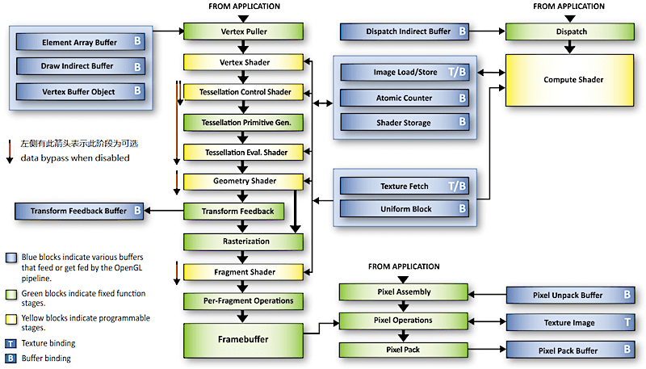

# 一、OpenGL 简介

>  OpenGL 作为图形硬件标准，是最通用的图形管线版本
>  使用 OpenGL 自带的数据类型可以确保各平台中每一种类型的大小都是统一的
>
>  **OpenGL 只是一个标准/规范，具体的实现是由驱动开发商针对特定显卡来实现**


## 1. OpenGL Context

由于 OpenGL 内部是一个类似于全局变量的状态机

- 切换状态 `glEnable()`、 `glDisable()` 
- 查询状态 `glIsEnabled()` 
- 存储状态 `glPushAttrib()`：保存 OpenGL 当前属性状态信息到属性栈中
- 恢复之前存储的状态 `glPopAttrib()`：从属性栈中获取栈首的一系列属性值


**OpenGL Context 的接口和实现没有统一的标准，随着不同操作系统平台的不同而不同** 

OpenGL 命令执行的结果影响 OpenGL 状态（由 OpenGL context 保存，包括OpenGL 数据缓存）或 影响帧缓存

1. 使用 OpenGL 之前必须先创建 OpenGL Context，并 make current 将创建的 上下文作为当前线程的上下文

2. **OpenGL 标准并不定义如何创建 OpenGL Context，这个任务由其他标准定义**
   如GLX（linux）、WGL（windows）、EGL（一般在移动设备上用）

3. 上下文的描述类型有 **core profile (不包含任何弃用功能)** 或 **compatibility profile (包含任何弃用功能)** 两种
   如果创建的是 core profile OpenGL context，调用如 glBegin() 等兼容 API 将产生GL_INVALID_OPERATION 错误（用 glGetError() 查询）

4. 共享上下文

   一个窗口的 Context 可以有多个，在某个线程创建后，所有 OpenGL 的操作都会转到这个线程来操作
   两个线程同时 make current 到同一个绘制上下文，会导致程序崩溃 

   一个线程同一时间只能用一个上下文，一个线程可以切换多个上下文
   
   一般每个窗口都有一个上下文，可以保证上下文间的不互相影响
   通过**创建上下文时传入要共享的上下文**，多个窗口的上下文之间图形资源可以共享
   可以共享的：纹理、shader、Vertex Buffer 等，外部传入对象
   不可共享的：Frame Buffer Object、Vertex Array Object（内存）、Vertex Buffer Object（显存）、等 OpenGL 内置容器**对象**


## 2. OpenGL 的环境配置流程

### 2.1 动态获取 OpenGL 函数地址

OpenGL 只是一个标准/规范，具体的实现是由驱动开发商针对特定显卡来实现，而且 OpenGL 驱动版本众多，它大多数函数的位置都**无法在编译时确定下来，需要在运行时查询**
因此，在编写与 OpenGL 相关的程序时需要开发者自己来获取 OpenGL 函数地址

相关库可以提供 OpenGL 函数获取地址后的头文件：[GLAD](https://github.com/Dav1dde/glad)


### 2.2 创建上下文

OpenGL 创建上下文的操作在不同的操作(窗口)系统上是不同的，所以需要开发者自己处理：**窗口的创建、定义上下文、处理用户输入**

相关库可以摆脱平台的限制，提供一个较为统一的接口和窗口、上下文用来渲染：[GLUT](http://freeglut.sourceforge.net/)、SDL、SFML、[GLFW](http://www.glfw.org/download.html)


## 3. OpenGL 的执行模型（Client - Server 模型）

> 主函数在 CPU 上执行，图形渲染在 GPU 上执行
> 虽然 GPU 可以编程，但这样的程序也需要在 CPU 上执行来操作 GPU

基本执行模型：CPU 上 push command 命令，GPU 上执行命令的渲染操作

- **应用程序 和 GPU 的执行通常是异步的**
  OpenGL API 调用返回 != OpenGL 在 GPU 上执行完了相应命令，但保证按调用顺序执行
  同步方式：**glFlush()** 强制发出所有 OpenGL 命令并在此函数返回后的有限时间内执行完这些 OpenGL 命令
  异步方式：**glFinish()** 等待直到**此函数之前**的 OpenGL 命令执行完毕才返回

- **应用程序 和 OpenGL 可以在也可以不在同一台计算机上执行**
  一个网络渲染的例子是通过 Windows 远程桌面在远程计算机上启动 OpenGL 程序，应用程序在远程计算机执行，而 OpenGL 命令在本地计算机执行（**将几何数据**而不是将渲染结果图像通过网络传输）

  > 当 Client 和 Server 位于**同一台计算机**上时，也称 GPU 为 Device，CPU 为 Host
  > Device、Host 这两个术语通常在用 GPU 进行通用计算时使用

- **内存管理**
  CPU 上由程序准备的缓存数据（buffer、texture 等）存储在显存（video memory）中，这些数据从程序到缓存中拷贝，也可以再次拷贝到程序的缓存中
  
- **数据绑定发生在 OpenGL 命令调用时**
  应用程序传送给 GPU 的数据在 OpenGL API 调用时解释，在调用返回时完成
  例，指针指向的数据给 OpenGL 传送数据，如 glBufferData()  在此 API 调用返回后修改指针指向的数据将不再对 OpenGL 状态产生影响


## 4. OpenGL 的着色器程序 Shader

### 4.1 不同平台的 shader 编译

OpenGL 的 GLSL（OpenGL Shading Language）

- 跨平台
- 运行时，将 GLSL 源码交给 GPU 图形驱动厂商编译成汇编语言后由 GPU 执行


DirectX 的 HLSL（High Level Shading Language）

- 微软独占，可以提前编译成机器语言，在运行时直接在 GPU 执行

  

NVIDIA 的 CG（C for Graphic）

- 跨平台，根据平台的不同编译成相应的中间语言


### 4.2 Shader 接口一致性

> shader link 到 program 里可以 detached 后继续使用，这样便无法抓取 shader 查看

- Vertex Shader 的 输入 和 应用程序的顶点属性数据接口 一致
- Vertex Shader 的 输出 和 Fragment Shader 对应的 输入 一致
- Fragment Shader 的 输出 和 帧缓存的颜色缓存接口 一致


固定管线功能阶段需要的一些特定输入输出由着色器的内置输出输入变量定义，如下图


### 4.3 GLSL 版本变化

通过**首行使用** `#version` 来说明当前 OpenGL Shader Language 版本


**GLSL 版本号对应 **

- OpenGL 和 OpenGL 的 Shading Language 版本对应
  | **Version OpenGL** | 2.0 | 2.1 | 3.0 | 3.1 | 3.2 | 3.3 | 4.0 | 4.1 | 4.2 | 4.3 |
  | --- | --- | --- | --- | --- | --- | --- | --- | --- | --- | --- |
  | **Version GLSL** | 110 | 120 | 130 | 140 | 150 | 330 | 400 | 410 | 420 | 430 |

- OpenGL ES 和 OpenGL ES 的 Shading Language 版本对应
  | **Version OpenGL ES** | 2.0 | 3.0 |
  | --------------------- | --- | --- |
  | **Version GLSL ES**   | 100 | 300 |


**GLSL 版本功能区别 **

1. GLSL 130+ 版本
   用 `in` 和  `out` 替换了 `attribute` 和 `varying`
2. GLSL 330+ 版本
   用 `texture` 替换了 `texture2D` 
   增加了 layout 内存布局功能
3. [其他版本重要功能变化](https://github.com/mattdesl/lwjgl-basics/wiki/glsl-versions)


### 4.4 编写 shader 的注意事项

精度问题

1. 颜色和单位向量用 lowp 精度
2. 减少对 highp 的使用


慎用分支和循环语句

1. GPU 使用了不同于 CPU 的技术来实现分支语句
2. 最坏情况下，花在一个分支上的时间相当于运行了所有的分支语句
3. 使用大量流程控制语句，shader 性能可能会成倍下降
4. 分支语句判断用的条件变量最好是常数
5. 每个分支中的操作指令数尽量少
6. 分支嵌套层数少


## 5. 渲染同步

### 5.1 同步异步的渲染方式 glFlush/glFinish

> 提交给 OpenGL 的指令并不是马上送到驱动程序里执行的，而是放到一个缓冲区里面，等这个缓冲区满了再一次过发到驱动程序里执行，glFlush 可以只接提交缓冲区的命令到驱动执行，而不需要在意缓冲区是否满了

同步方式：[void glFlush()](https://www.khronos.org/opengl/wiki/GLAPI/glFlush) 强制发出所有 OpenGL 命令并在此函数返回后的**有限时间**内执行这些 OpenGL 命令（这些命令可能没有执行完）
异步方式：[void glFinish()](https://www.khronos.org/opengl/wiki/GLAPI/glFinish) 等待直到**此函数之前**的 OpenGL 命令执行完毕才返回


### 5.2 垂直同步 vsync

由于显示器的刷新一般是逐行进行的，因此为了防止交换缓冲区的时候屏幕上下区域的图像分属于两个不同的帧，因此交换一般会等待显示器刷新完成的信号，在显示器两次刷新的间隔中进行交换，这个信号就被称为垂直同步信号，这个技术被称为垂直同步

定义：确保显卡的运算频率（GPU 一秒绘制的帧数）和 显示器刷新频率（硬件决定）一致，防止在快速运动场景下，由于**显卡运算速率大于显示器运算速率**导致快速运动的动作割裂情况（画面撕裂）

流程：`显卡绘制一帧时间 > 显示器刷新一帧时间 ? 显示器刷新(显卡等待) : 显示器显示上一帧，等待显卡绘制完成(屏幕卡顿);`

缺点：开启垂直同步，画面会有延迟（无法达到显卡的最大运算速率），但并没有卡顿

**规避缺点的方法**：用三重缓冲代替垂直同步（三重缓冲：在双缓冲的基础上加了一个缓冲，引入了三缓冲区技术，在等待垂直同步时，来回交替渲染两个离屏的缓冲区，而垂直同步发生时，屏幕缓冲区和最近渲染完成的离屏缓冲区交换，实现充分利用硬件性能的目的）


## 6. 高版本 Feature

### 6.1 Draw Indirect

Indirect：绘制数据直接从显存拿，非直接传输的关系，便于通过 compute shader 直接在 GPU 端直接修改 Buffer 内容

- **Draw Instanced（GPU Instance）**
  绘制多个相同的 Mesh，但它们的位置可以各部相同（如：绘制有多个相同士兵的军队）
  需要完全一样的顶点、索引、渲染状态和材质数据，只允许 Transform 不一样

  ```c
  // 普通绘制
  void glDrawArrays(GLenum mode, GLint first, GLsizei tCount);
  // 绘制多个相同的 Mesh 
  void glDrawArraysInstanced(GLenum mode, GLint first, GLsizei tCount, GLsizei meshCount);

- **Draw Instanced Indirect**
  一次只能绘制一个 Mesh
  Mesh 数据直接从显存里获取数据，并非直接传输关系因此称为 Indirect

  ```c++
  // 1. 创建显存 Mesh 数据等参数
  typedef struct {
  	GLuint vertexCount;
  	GLuint instanceCount; // 绘制 Mesh 个数
  	GLuint firstVertex;
  	GLuint baseInstance;
  } DrawArraysIndirectCommand;
  
  static const DrawArraysIndirectCommand arraysCommand = {
    3, // Three vertices in total, making one triangle
    1, // Draw one copy of this triangle
    0, // Starting index
    0  // Reserved
  }; 
  assert(sizeof(DrawArraysIndirectCommand) == 16);
  
  GLuint arrayCommandBuffer;
  glCreateBuffers(1, &arrayCommandBuffer);
  glNamedBufferData(arrayCommandBuffer, sizeof(DrawArraysIndirectCommand), &arraysCommand, GL_STATIC_DRAW);
  
  // 2. 直接获取显存数据绘制
  void glDrawArraysIndirect(
    GLenum mode,         // GL_TRIANGLES
    const void *indirect // NULL 因为已经 bind GPU buffer 了
  );
  ```

- **Multi Draw Indirect**
  绘制多个相同的 Mesh，Mesh 数据直接从显存里获取数据（一份数据有多个 Mesh 需要的 CMD）

  ```c
  // 1. 创建
  DrawArraysIndirectCommand draws[] =
  { // 一份数据
  	{
  		42, // Vertex count
  		1,  // Instance count
  		0,  // First vertex
  		0   // Base instance
  	},
  	{ /** ... */}
  };
  GLuint buffer;
  glGenBuffers(1, &buffer);
  glBindBuffer(GL_DRAW_INDIRECT_BUFFER, buffer);
  glBufferData(GL_DRAW_INDIRECT_BUFFER, sizeof(draws), draws, GL_STATIC_DRAW);
  
  // 2. 直接获取显存数据绘制
  void glMultiDrawElementsIndirect(
    GLenum mode,           // GL_TRIANGLES
    GLenum type,           // GL_UNSIGED_INT
    const void * indirect, // NULL 因为已经 bind GPU buffer 了
    GLsizei drawcount,     // sizeof(draws)/sizeof(draws[0])
    GLsizei stride         // 0
  );
  ```

  


# 二、渲染管线

> 所谓 OpenGL 管线（OpenGL pipeline），就是指 OpenGL 的渲染过程，即从输入数据到最终产生渲染结果数据所经过的通路及所经受的处理

真实生活中的流水线：


 OpenGL 4.4 渲染管线



DirectX3D 12 渲染管线


## 1. 应用阶段

应用阶段是开发者可以完全把控的阶段

**绘制物体的包围盒一共有两种，且同时使用**

1. 球体包围盒（用于快速碰撞检测）：尺寸比其包含的对象要大
2. 箱体包围盒（更准确的碰撞检测）：更接近于对象形状，但是计算量大


一般游戏引擎的绘制顺序

```c
// 每一帧：Draw layer > Draw Technique > Draw Pass
// 每一 Pass：相关 view、相关 shader、相关 material、相关 object
for each view {
    bind view resources					// camera, environment...
      
    for each shader {
        bind shader pipeline
        bind shader resources			// shader control values
          
			for each material {
        		bind material resources	// material params and textures
              
            for each object {
              	bind object reources	// object transforms
                draw object
                  
            } // object
          
        } // material
      
    } // shader
  
} // view
```

### 1.1 计算 Level Of Detail

作用：让近处物体的网格更细致（LOD 0），远处物体的网格更稀疏（LOD n），以便场景运行更流畅

方法：根据一定标准切换 LOD 等级，提前设置好 LOD 等级对应的标准
如果达到标准，就会替换当前 Mesh 为对应的 LOD 等级

常用的 LOD 判断标准有：

1. 视距 View Distance：物体球体包围盒，距离视点的距离
2. 屏占比 Screen Size：物体箱体包围盒，经过透视投影变换后，在当前屏幕渲染像素总数的占比
   比例范围 0.0 ~ 1.0，1.0 表示屏占比 100%


### 1.2 距离体积剔除

在场景里放入一个**箱体**，在箱体范围内通过设置绘制物体的 尺寸 与对应的 相机最大距离 来剔除物体

- 物体尺寸：指的是物体球体包围盒的**直径**大小
- 相机最大距离：物体与相机的距离大于这个距离后相应 物体尺寸的物体会被剔除，如果不设置（值为 0）将永远不会剔除与其配对的物体尺寸


### 1.3 视锥剔除


> 在裁剪空间下更容易进行视锥剔除，详见 几何阶段的视锥剔除

在世界空间下的视锥剔除流程（剔除的是包围盒 Mesh 对象，而非单个三角面图元）

1. 计算包围要绘制物体的 AABB 盒
2. 获得视锥体六个面的平面方程
3. 判断 AABB 盒的最小点和最大点在六个面的内侧还是外侧
4. 剔除掉最小和最大点完全在外侧的物体

```c++
// 视锥体的六个平面方程，用于视锥剔除
// 所得的法向都是指向内部的（面向原点）
void GetViewingFrustumPlanesByProjM4(std::vector<glm::vec4> & result , const glm::mat4 &vp) {
	//左侧  
	result[0].x = vp[0][3] + vp[0][0];
	result[0].y = vp[1][3] + vp[1][0];
	result[0].z = vp[2][3] + vp[2][0];
	result[0].w = vp[3][3] + vp[3][0];
	//右侧
	result[1].x = vp[0][3] - vp[0][0];
	result[1].y = vp[1][3] - vp[1][0];
	result[1].z = vp[2][3] - vp[2][0];
	result[1].w = vp[3][3] - vp[3][0];
	//上侧
	result[2].x = vp[0][3] - vp[0][1];
	result[2].y = vp[1][3] - vp[1][1];
	result[2].z = vp[2][3] - vp[2][1];
	result[2].w = vp[3][3] - vp[3][1];
	//下侧
	result[3].x = vp[0][3] + vp[0][1];
	result[3].y = vp[1][3] + vp[1][1];
	result[3].z = vp[2][3] + vp[2][1];
	result[3].w = vp[3][3] + vp[3][1];
	//Near
	result[4].x = vp[0][3] + vp[0][2];
	result[4].y = vp[1][3] + vp[1][2];
	result[4].z = vp[2][3] + vp[2][2];
	result[4].w = vp[3][3] + vp[3][2];
	//Far
	result[5].x = vp[0][3] - vp[0][2];
	result[5].y = vp[1][3] - vp[1][2];
	result[5].z = vp[2][3] - vp[2][2];
	result[5].w = vp[3][3] - vp[3][2];
}

//点到平面距离 d =  Ax + By + Cz + D;
// d < 0 点在平面法向反方向所指的区域
// d > 0 点在平面法向所指的区域
// d = 0 在平面上
// d < 0为 false
bool Point2Plane(const glm::vec3 &v,const glm::vec4 &p) {
	return p.x * v.x + p.y * v.y + p.z * v.z + p.w >= 0;
}

std::vector<glm::vec4> ViewPlanes;
//构造函数中
ViewPlanes.resize(6, glm::vec4(0));

void UpdateViewPlanes() {
	ViewingFrustumPlanes(ViewPlanes,  ProjectMatrix * ViewMatrix);
}

bool ViewCull(const glm::vec4 &v1,const glm::vec4 &v2,const glm::vec4 &v3) {
	glm::vec3 minPoint, maxPoint;
	minPoint.x = min(v1.x, min(v2.x, v3.x));
	minPoint.y = min(v1.y, min(v2.y, v3.y));
	minPoint.z = min(v1.z, min(v2.z, v3.z));
	maxPoint.x = max(v1.x, max(v2.x, v3.x));
	maxPoint.y = max(v1.y, max(v2.y, v3.y));
	maxPoint.z = max(v1.z, max(v2.z, v3.z));
	// Near 和 Far 剔除时只保留完全在内的
	if (!Point2Plane(minPoint, ViewPlanes[4]) || !Point2Plane(maxPoint, ViewPlanes[4])) {
		return false;
	}
	if (!Point2Plane(minPoint, ViewPlanes[5]) || !Point2Plane(maxPoint, ViewPlanes[5])) {
		return false;
	}
	if (!Point2Plane(minPoint, ViewPlanes[0]) && !Point2Plane(maxPoint, ViewPlanes[0])) {
		return false;
	}
	if (!Point2Plane(minPoint, ViewPlanes[1]) && !Point2Plane(maxPoint, ViewPlanes[1])) {
		return false;
	}
	if (!Point2Plane(minPoint, ViewPlanes[2]) && !Point2Plane(maxPoint, ViewPlanes[2])) {
		return false;
	}
	if (!Point2Plane(minPoint, ViewPlanes[3]) && !Point2Plane(maxPoint, ViewPlanes[3])) {
		return false;
	}
	return true;
}
```


### 1.4 遮挡剔除


#### 1.4.1 遮挡查询 - 硬件

**一、CPU-Driven 的剔除**

以下方法均可以通过 CPU 读取深度，或者采用硬件提供的 Early-Z 功能在<u>片源着色执行前</u>从 GPU 读取深度

- **中小场景剔除**：将 Mesh 对象的包围盒（或最高 LOD 级别的模型）写入到 z-buffer 上，然后使用物体的包围盒传入到 GPU 进行遮挡测试
  从 GPU 回读数据到 CPU 通常很慢，因此通常会将得到的数据放在下一帧中作为剔除数据来使用，这样遮挡剔除其实是延迟一帧生效的（一般这种延迟影响不大）[OpenGL 的查询方式 Query Object](https://www.khronos.org/opengl/wiki/Query_Object)，[DirectX 的查询方式 Predication queries](https://docs.microsoft.com/en-us/windows/win32/direct3d12/predication-queries)

- **大场景剔除 HZB**，Hierarchical z-buffer：多 Mip 层级的 z-buffer
  Pass 1：Level n 的 Mip 记录 Level n-1 中周围**四个像素**中**最远处**的深度值（这样只要符合高等级的 Mip 深度，就能覆盖到低等级）
  Pass 2：根据 Mesh 对象包围盒的大小判断选择哪个 Level 的 Mip，选定 Level 后通过比较 Mip 上的深度值来判断是否被遮挡


**二、GPU-Driven 的剔除**

1. 创建 Indirect 指令队列，将所有待渲染物体的渲染指令录入
2. 对渲染物体进行遮挡剔除，将剔除结果写入到 buffer 中
3. 根据结果 GPU 会选择性执行录入的 Indirect 渲染指令，达到剔除的效果


#### 1.4.2 遮挡查询 - 软件（移动平台）

将 Mesh 对象的包围盒（或最高 LOD 级别的模型）软光栅到 CPU 内存中的 z-buffer 上，然后根据 z-buffer 中 的深度信息来判断那些 Mesh 对象需要剔除
支持任意大小的场景，CPU 端压力较大


#### 1.4.3 静态剔除 - 预计算（移动平台）


在场景里放入一个**箱体**，在箱体范围内将场景划分成一个个 Cell（适合中小型场景的性能优化）

- Precomputed Visibility Volumes 预计算可见性（无法剔除动态物体）
  每个 Cell 区域预计算出相机在这个 Cell 范围内所有可能看到的物体，并将信息存储下来
  在运行时直接查表来得到所有静态物体的可见信息
- [Portal-Culling](https://www.gamedeveloper.com/programming/sponsored-feature-next-generation-occlusion-culling)（可以剔除动态物体）
  每个 Cell 区域预计算出两个相邻 Cell 之间的连通性，并将信息存储下来
  在运行时根据相机所在的 Cell 间的连通性信息 和 相机观察方向快速计算出目标物体是否处于可见范围内


## 2. 几何阶段

几何阶段里的部分流程（从视锥剔除开始）开发者无法控制，由不同平台的系统驱动自行完成


### 2.1 Vertex Shader

#### 2.1.1 观察/相机 空间


**LookAt 矩阵**：将世界空间坐标 乘以 lookat 矩阵 可以得到相机的 观察空间
$$
LookAt =
\begin{bmatrix}
\color{red}{R_x} & \color{red}{R_y} & \color{red}{R_z} & 0 \\
\color{green}{U_x} & \color{green}{U_y} & \color{green}{U_z} & 0 \\
\color{blue}{D_x} & \color{blue}{D_y} & \color{blue}{D_z} & 0 \\
0 & 0 & 0 & 1
\end{bmatrix}
\begin{bmatrix}
1 & 0 & 0 & \color{orange}{-P_x} \\
0 & 1 & 0 & \color{orange}{-P_y} \\
0 & 0 & 1 & \color{orange}{-P_z} \\
0 & 0 & 0 & 1
\end{bmatrix}
$$
相机对象和 LookAt 矩阵是两套不同的坐标系：
相机对象的坐标系要和自己所处的世界坐标的坐标系保持一致，而 LookAt 的坐标系必须与世界坐标系的 Z 轴方向相反

- 其中，P 为相机的位置、U 为相机的 Y 轴、R 为相机的 X 轴、D 为相机指向的方向和相机的 Z 轴相反
- 相机对象的 Z 轴和 LookAt 矩阵 D 相反，其他轴和 LookAt 矩阵的基坐标相同，同时也和世界坐标的基坐标相同
  因此，如果 相机对象为右手坐标系，LookAt 矩阵为左手坐标系，这样是方便其他方向的移动

```c
// 1. 计算 lookAt 矩阵的坐标系（根据指向的 目标坐标和相机坐标 求得）
glm::vec3 cameraFront = glm::normalize(cameraTarget - cameraPos);		// 指向目标物体
glm::vec3 lookAtDirection = glm::normalize(cameraPos - cameraTarget); 	// 指向相机

glm::vec3 WorldUp = glm::vec3(0.0f, 1.0f, 0.0f); 
glm::vec3 lookAtRight = glm::normalize(glm::cross(WorldUp, lookAtDirection)); // LookAt 为右手坐标系
glm::vec3 lookAtUp = glm::cross(lookAtDirection, lookAtRight);

// 2. 计算相机对象的坐标系（根据欧拉角 Yaw，Pich 求得）
glm::vec3 cameraFront;
cameraFront.x = cos(glm::radians(Yaw)) * cos(glm::radians(Pitch));
cameraFront.y = sin(glm::radians(Pitch));
cameraFront.z = sin(glm::radians(Yaw)) * cos(glm::radians(Pitch));
cameraFront = glm::normalize(cameraFront);

cameraRight = glm::normalize(glm::cross(cameraFront, WorldUp));  // 相机对象为左手坐标系
cameraUp    = glm::normalize(glm::cross(cameraRight, cameraFront));
```


#### 2.1.2 透视/正交 投影变换

将观察空间的坐标转换到投影空间（一个 Frustum 平截头体空间），详见 [矩阵变换，透视投影](../LinearAlgebra/Part1_Matrix.md)


**OpenGL 的透视投影矩阵为**

- 列主序矩阵
- 相机坐标系为 **右手坐标系**
- Z 的标准设备空间范围限定为 [-w, w]

$$
M_{OpenGL} * P = 
\begin{bmatrix}
near \over right & 0 & 0 & 0 \\
0 & near \over top & 0 & 0\\
0 & 0 & -{{far+near} \over {far - near}} & -{2\cdot far \cdot near \over {far - near}}\\
0 & 0 & -1 & 0\\
\end{bmatrix}
\begin{bmatrix}
x \\ y \\ z \\ 1
\end{bmatrix}
= 
\begin{bmatrix}
{near \over right}x \\ {near \over top}y \\ {-{{far+near} \over {far - near}}}z -{2 \cdot far \cdot near \over {far - near}} \\ -z
\end{bmatrix}
$$

**DriectX  的透视投影矩阵为**

- 行主序矩阵
- 相机坐标系为 **左手坐标系**
- Z 的标准设备空间范围限定为 [0,w]

$$
P * M_{DriectX} = 
\begin{bmatrix}
x & y & z & 1
\end{bmatrix}
\begin{bmatrix}
near \over right & 0 & 0 & 0 \\
0 & near \over top & 0 & 0\\
0 & 0 & {far \over {far - near}} & 1 \\
0 & 0 & -{far \cdot near \over {far - near}} & 0\\
\end{bmatrix}
= 
\begin{bmatrix}
{near \over right}x & {near \over top}y & {{far \over {far - near}}}z -{far \cdot near \over {far - near}} & z
\end{bmatrix}
$$


### 2.2 Tessellation Shader

曲面细分阶段：降低带宽负载，通过较少的 Mesh，经过 曲面细分的算法计算可以生成更精细的 Mesh 网格（方便 Level Of Details 的实现）

1. Tessellation **control** shaders (**H**ull **S**haders) 
2. Tessellation **evaluation** shaders (**D**omain **S**haders)


### 2.3 Geometry Shader

几何着色阶段：可以由已知的图元生成新的图元（点、线、面），一般多用于

- 由顶点产生的粒子特效
- 几何曲面细分
- [Shadow Volume 加速](https://developer.nvidia.com/gpugems/gpugems3/part-ii-light-and-shadows/chapter-11-efficient-and-robust-shadow-volumes-using)
- 只用一个 Pass 绘制 Cube map（6 个面）


### 2.4 裁剪（硬件实现）

#### 2.4.1 视锥剔除

一个面的三个顶点如果都被剔除，则当前**三角形**被剔除

```c
std::uint8_t checkViewCut(const glm::vec4& v)
{
    auto ret = (std::uint8_t)0;
    
    if      (v.x < -v.w) ret |= 1;
    else if (v.x >  v.w) ret |= 2;
    if      (v.y < -v.w) ret |= 4;
    else if (v.y >  v.w) ret |= 8;
    if      (v.z < -v.w) ret |= 16;
    else if (v.z >  v.w) ret |= 32;
    
    return ret;
}
```


#### 2.4.2 齐次坐标裁剪


裁剪后三角网格的数量和连接方式可能会变（裁剪得到的顶点属性值会提前插值好）
假设 $P(x,y,z,w)$ 为投影空间内部的一个点，则
$$
-1 <= x/w <=1 \\
-1 <= y/w <=1 \\
-1 <= z/w <=1 \\

-w <= x <= w \\
-w <= y <= w \\
-w <= z <= w
$$
由 [线与面的关系判断](../LinearAlgebra/Part3_Triangles.md) 可知，如果线 $Q_1Q_2$ 与面交与点 $I$，则
$$
\begin{align}
Q_1&=(x_1,y_1,z_1,w_1) \\
Q_2&=(x_2,y_2,z_2,w_2) \\\\
I &= Q_1 + t(Q_2 - Q_1) \\
w_1 + t(w_2 - w_1) &= x_1 + t(x_2 - x_1) \\
t &= {{w_1 - x_1} \over (w_1 - x_1) - (w_2 - x_2)} 
\end{align}
$$
注意：为了防止透视除法除的 $w$ 为 0，这里裁剪的时候还要裁剪掉一个 $w=1e-5$ 这样一个极小数的平面

```c
enum AXIS {
    X = 0,
    Y = 1,
    Z = 2,
    W = 3
}

// EX: 0,1,2,3
//     3-0, 0-1, 1-2
void clipInHomoCoord(std::vector<Vertex>& vertIn, std::vector<Vertex>& vertOut, AXIS axis, bool isNegative)
{
    vertOut.clear();

    int preDot = -1;
    int curDot = -1;
    float w = 1.0f;
    float flag = isNegative ? -1.0f : 1.0f;
    for (int i = 0; i < vertIn.size(); ++i)
    {
        Vertex& preVert = vertIn[(i + vertIn.size() -1) % vertIn.size()];
        Vertex& curVert = vertIn[i];
        preDot = flag * preVert.position[axis] <= preVert.position.w ? 1 : -1；
        curDot = flag * curVert.position[axis] <= curVert.position.w ? 1 : -1;
        if (preDot * curDot < 0) // put intersection point first
        {
            w = preVert.position.w - flag * curVert.position[axis];
            w = w / (w - (curVert.position.w - flag * curVert.position[axis]));
            vertOut.push_back( lerp(preVert, curVert, w) ); 
        }
        if (curDot > 0)			// then put original point
        {
            vertOut.push_back(curVert);
        }
    }
}

// how to call clip function
std::vector<Vertex> vertIn;
std::vector<Vertex> vertOut;
clipInHomoCoord(vertIn, vertOut, X, true);	// clip on x axis
clipInHomoCoord(vertOut, vertIn, X, false);
clipInHomoCoord(vertIn, vertOut, Y, true); 	// clip on y axis
clipInHomoCoord(vertOut, vertIn, Y, false);
clipInHomoCoord(vertIn, vertOut, Z, true);	// clip on z axis
clipInHomoCoord(vertOut, vertIn, Z, false);

auto& vertexOut = vertIn;	// output

// draw point order must use trangles fan
GL_TRIANGLE_FAN
```


#### 2.4.3 透视除法和 NDC 空间

通过透视除法将 <u>齐次坐标</u> 转换为的 <u>非齐次坐标</u> 具体见 [矩阵变换，齐次空间](../LinearAlgebra/Part1_Matrix.md)
将坐标点从 投影空间 转换到 NDC （Normalized Device Coordinates  标准设备坐标系）空间

```c
// Scope: [-w, w]
glm::vec4 proj;

// 如果 w 为 0，表示一个三维坐标点，则 令 w 为 1.0，表示一组齐次坐标点
if (0 == proj.w) proj.w = 1e-5f;

// Scope: [-1, 1]
glm::vec4 ndc = glm::vec4(proj.x / proj.w, 
                          proj.y / proj.w, 
                          proj.z / proj.w,
                          1.0f);
```


#### 2.4.4 将坐标映射到屏幕上

**屏幕坐标和像素的映射关系**

- 屏幕坐标是 2D 纹理坐标
  归一化后的裁剪坐标转换到屏幕坐 标的矩阵
  $$
  \begin{bmatrix}
  {width \over 2} & 0 & 0 & {width \over 2} \\
  0 & {height \over 2} & 0 & {height \over 2} \\
  0 & 0 & 1 & 0 \\
  0 & 0 & 0 & 1
  \end{bmatrix}
  $$

- 屏幕坐标表示的是屏幕空间中的像素坐标

- OpenGL 和 DirectX 10 以后的版本认为 像素中心 对应 屏幕坐标的值为 0.5，例：
  屏幕分辨率为 400 X 300，则其屏幕坐标 x 的范围是 [0.5, 400.5]，y 的范围是 [0.5, 300.5]
  $$
  Screen_x = (1 + x_{标准设备坐标}) \cdot {Pixel_{width} \over 2} \\
  Screen_y = (1 + y_{标准设备坐标}) \cdot {Pixel_{height} \over 2}
  $$
  


#### 2.4.5 背面剔除 2D

在绘制 Enclosed solid 物体时，有正面自遮挡了其背面的三角面的情况，这时候需要剔除不需要被看到的三角面

1. 在平台的坐标系下，根据三角形两边的叉乘可以知道三角面的法线朝向
2. 根据法线的朝向可以判断当前三角面是正面还是背面
3. 根据需求剔除正面或者背面的三角面，以减少不必要的 drawcall


#### 2.4.6 视口剔除 2D

光栅化时，根据设置的 Viewport 大小来限定光栅化范围（限定逐行光栅化的行数和列数）
以达到只有视口内部的数据被刷新了，避免了不必要的计算


## 3. 着色阶段

### 3.1 光栅化（硬件实现）

1. **三角形设置 Triangle Setup**
   计算三角网格表示数据（每条边上的像素坐标）
2. **三角遍历 Triangle Traversal**
   查找被三角形覆盖的像素，生成一个图元，这一过程又称扫描变换 Scan Conversion
3. **光栅化 Rasterization**
   在三角形中心坐标中，将顶点信息线性差值并根据渲染目标像素个数，对一个三角形图元信息做离散化处理


### 3.2 Early-Z / Pixel Shader

**Pre-Z**：应用阶段实现，需要单独 Pass，只写入深度，开启  Alpha 测试，用来剔除**透明像素**
**Early-Z**（Z-cull）：需要硬件支持，只能用来剔除**不透明 像素块（相邻的 4 个像素）**
<u>提前在 Pixel Shader 着色前判断，防止 Pixel Shader 计算后在进行深度测试才被 discard 而带来的不必要计算</u>
使用 Early-Z 需要关闭深度写入，无法进行 Alpha 混合，每次使用的深度需要 Clear 一下
使用 Early-Z 需要**从前向后**渲染不透明物体，才能体现出它的优势


### 3.3 逐像素处理（可配置）

1. **Scissor 测试**
   裁剪测试，查看是否设置裁剪区域，如果有在裁剪区域外的像素会被剔除

1. **Alpha 测试**
   过滤掉那些透明的片段，让剩下的不透明片段来写入缓存
   **提前 Alpha 测试**，在 Pixel Shader 阶段提前根据像素的 alpha 值，使用 GLSL 的 discard 命令剔除像素
   例：一个草的方形图片其透明的部分像素应该被剔除掉
   
1. **Stencil 测试**
   模版测试，根据二值图的模版 buffer 在当前 color buffer 上填充其他颜色
   例：给一张白纸画一个红印章（或文字），这样会使得存储更少，不需要每个像素都存储印章的单一颜色
   
   
2. **深度测试**
   深度缓冲中每个像素（或超采样）都有对应的深度值（通过三角形顶点深度信息差值得到）
   深度测试通过，深度缓冲将会更新深度值
   因为每个像素都有深度，所以不会存在两个图元交叉的深度问题
   深度测试之后，Alpha 混合之前，会**更新 Occlusion query**
   
   
2. **Alpha 混合**
   开启 alpha 混合会关闭深度写入（如果不关闭后面片元将会被踢出，无法进入到 alpha 混合缓解混合颜色）
   但是深度测试依旧可以进行，**深度值对 Alpha 混合来说是只读的**
   
   为了正确的做 alpha 混合，一般流程如下
   
   1. 确保混合的 alpha 物体是凸面体，将复杂的模型拆分成可独立排序的多个子模型
      从而防止循环重叠半透明物体出现
   2. 先渲染所有不透明物体，并且开启他们的深度测试和深度写入
   3. 开启深度测试，关闭深度写入（当前深度值已经确定）
      把半透明物体按照深度值依次排序，**从后向前渲染**（确保半透明物体被不透明物体遮挡）
      但这仍会存在两个图元交叉，导致从后向前渲染排序有误的问题。可以通过添加 alpha 缓存，或者使用排序无关的半透明混合方式（Depth peeling）


# 三、常见问题

## 1. Alpha 预乘

关闭 Alpha 预乘的混合方式（假设：透明物体 B 在 A 前面）
$$
\begin{align}
A &= (A_r,A_g,A_b, \alpha_A)\\
B &= (B_r,B_g,B_b, \alpha_B)\\
M_{rgb} &= \alpha_B B + (1-\alpha_B)\alpha_A A\\
\alpha_M &= \alpha_B + (1-\alpha_B)\alpha_A
\end{align}
$$

开启 Alpha 预乘的混合方式（假设：透明物体 B 在 A 前面）
透明图像边缘是黑色，为了防止在混合多个透明物体时 alpha 遮罩外的颜色由于不是黑色 0，而带来的混合颜色的色差
$$
  \begin{align}
  A' &= (\alpha_A A_r,\alpha_A A_g,\alpha_A A_b, \alpha_A)\\
  B' &= (\alpha_B B_r,\alpha_B B_g,\alpha_B B_b, \alpha_B)\\
  M'_{rgb} &= B' + (1-\alpha_B) A'\\
  \alpha_M &= \alpha_B + (1-\alpha_B)\alpha_A \\
  M_{rgb} &= M'_{rgb} / \alpha _M
  \end{align}
$$


## 2. Overshading / Quad overdraw

**四个相邻的 [Pixel  Quad](https://www.khronos.org/registry/OpenGL/extensions/NV/NV_shader_thread_group.txt) 是 Early-Z 的最小剔除单位**
**硬件原因**：一个 GPU 内 SM 的 Warp 同时处理相邻的 2x2 个像素（每个线程处理一个像素，但是同指令，不同数据）
四个像素中非当前图元数据的输出值会被丢弃，但其插值数据仍会被使用（例：dFx，dFy）

- 业务场景：由于三角形（相对于像素大小）过于密集同一 drawcall 里，多个图元之间对像素数据的重复绘制
- 解决方法：一般使用 Level Of Details 技术可以缓解


## 3. GPU 指令依赖

GPU 指令组之间存在数据依赖关系，会拉长指令组之间的执行时间
下图蓝色椭圆气泡 bubble 的产生是为了解决 GPU 指令组之间的数据依赖，bubble 其实际上指空等待


## 4. Compute Shader

DirectX3D 12 Compute Shader pipeline


[Compute Shader](https://en.wikipedia.org/wiki/Compute_kernel) 指一个过程：多用于卷积核 kernel 的并行加速计算 与 GPU 共享顶点着色器和像素着色器的执行单元，并不局限于图形渲染领域，多用于并行计算领域


# Reference

1. [SIGGRAPH courses](http://advances.realtimerendering.com/)
1. [OpenGL Loading Library](https://www.khronos.org/opengl/wiki/OpenGL_Loading_Library)
2. [OpenGL Tools](http://www.opengl-tutorial.org/miscellaneous/useful-tools-links/)
5. [GLSL Versions](https://github.com/mattdesl/lwjgl-basics/wiki/glsl-versions)
6. [learnopengl-Blending](https://learnopengl-cn.github.io/04 Advanced OpenGL/03 Blending/)
7. [TriangleRasterization](http://www.sunshine2k.de/coding/java/TriangleRasterization/TriangleRasterization.html#algo2)
8. [Platform-specific rendering differences](https://docs.unity3d.com/Manual/SL-PlatformDifferences.html)
9. [Stateless, layered, multi-threaded rendering](https://blog.molecular-matters.com/2014/11/06/stateless-layered-multi-threaded-rendering-part-1/)
10. [Graphics pipeline](https://en.wikipedia.org/wiki/Graphics_pipeline)
10. [Pipeline stall](https://en.wikipedia.org/wiki/Pipeline_stall)
11. [Game Programming Patterns](http://gameprogrammingpatterns.com/contents.html)
12. [Shader detached program](https://github.com/google/gapid/issues/398)
13. [Explaining Homogeneous Coordinates & Projective Geometry](https://www.tomdalling.com/blog/modern-opengl/explaining-homogenous-coordinates-and-projective-geometry/)
14. [Fast Extraction of Viewing Frustum Planes from the WorldView-Projection Matrix](http://link.zhihu.com/?target=http%3A//www8.cs.umu.se/kurser/5DV180/VT18/lab/plane_extraction.pdf)
15. [OpenGL Projection Matrix (songho.ca)](http://www.songho.ca/opengl/gl_projectionmatrix.html)
16. [3D Clipping in Homogeneous Coordinates. | Development Chaos Theory (chaosinmotion.com)](https://chaosinmotion.com/2016/05/22/3d-clipping-in-homogeneous-coordinates/)
17. [Clipping using homegeneous coordinates by James F. Blinn and Martin E. Newell](https://link.zhihu.com/?target=https%3A//fabiensanglard.net/polygon_codec/clippingdocument/p245-blinn.pdf)
18. [CLIPPING by Kenneth I. Joy](https://link.zhihu.com/?target=https%3A//fabiensanglard.net/polygon_codec/clippingdocument/Clipping.pdf)
19. [Clipping implementation](https://link.zhihu.com/?target=https%3A//fabiensanglard.net/polygon_codec/)
20. [Nvidia GPU Programming](https://developer.download.nvidia.cn/GPU_Programming_Guide/GPU_Programming_Guide_G80.pdf)
20. [Per-Sample Processing](https://www.khronos.org/opengl/wiki/Per-Sample_Processing)
20. [OGL-Community LOD Selection](https://community.khronos.org/t/lod-selection/49560)
20. [3D C/C++ tutorials](http://www.3dcpptutorials.sk/index.php)
24. [Developing a Software Renderer Part 1](https://trenki2.github.io/blog/2017/06/06/developing-a-software-renderer-part1/)
25. [Render Hell !!!!!](https://simonschreibt.de/gat/renderhell-book1/)
20. [移动游戏性能优化通用技法](https://www.cnblogs.com/timlly/p/10463467.html)
20. [水平同步 垂直同步](https://blog.csdn.net/hankern/article/details/90344384)
21. [Android 的 16ms 和垂直同步以及三重缓存](https://www.jianshu.com/p/3750db831aca)
21. [计算机图形学补充2：齐次空间裁剪(Homogeneous Space Clipping) - 知乎 (zhihu.com)](https://zhuanlan.zhihu.com/p/162190576)
22. [从零开始的软渲染器（2.5）- 再谈裁剪与剔除 - 知乎 (zhihu.com)](https://zhuanlan.zhihu.com/p/97371838)
23. [深入剖析 GPU Early Z 优化](https://zhuanlan.zhihu.com/p/53092784)
24. [【Ogre编程入门与进阶】第十章 Ogre场景管理](https://blog.csdn.net/zhanghua1816/article/details/8130251)

