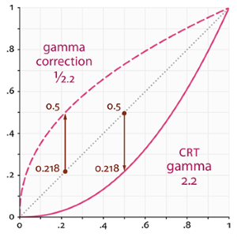

# 一、概率与统计

**随机变量** $X$​：可能取很多不同值的变量

**随机变量分布函数** $X \sim p(x)$​​​​​​​：
连续的分布函数又称**概率密度函数** Probability Density Function(PDF)，指不同概率事件下随机变量和概率的映射关系

某一个随机变量 $x$ 对应的概率 $P$​
$$
\begin{align}
离散：P &= p(x), & dx = 1\\
连续：P &= p(x)dx \\
\\
所有概率和：\sum p(x) &= 1
\end{align}
$$
**均值**：统计所有数据得到的结果

**期望** $E$​​：
抽取部分数据得到的**平均概率值**，无限接近于均值
$$
\begin{align}
\lim_{x \to \infty} E[X]&= \bar X \\
离散： E[X] &= \sum _{i=1}^{n} x_ip(x_i)，p(x) \geq 0\\
连续： E[X] &= \int_1^n xp(x)dx \\
\\
对于随机变量X,Y \\
Y &= f(X) \\
E[Y] &= E[f(x)] \\
&= \int f(x)p(x)dx
\end{align}
$$
**方差 Variance**：
用来度量随机变量和其期望（即均值）之间的**分散程度**，波动越大，方差越大
$$
\begin{align}
Var(x) 
&= s^2 \\
&= \sum _{i=1}^n(x_i - \bar x)^2f(x) \\
&=E((x - \bar x)^2) \\
&=E(x^2 - 2x\bar x + \bar x^2) \\
&=E(x^2) - 2E(x \bar x) + E(\bar x^2) \\
&=E(x)^2 - 2 \sum x \bar x p(x) + \sum \bar x^2 p(x) \\
&=E(x)^2 - 2 \bar x \sum xp(x) + \bar x^2 \sum p(x) \\
&=E(x)^2 - 2 \bar xE(x) + \bar x^2 \\
&=E(x)^2 - 2E(x)E(x) + (E(x))^2 \\
&=E(x)^2 - (E(x))^2
\end{align}
$$
**协方差**：
衡量两个变量之间的变化方向关系
$$
cov(X,Y) = E(XY) - E(X)E(Y)
$$

## 1. 蒙特卡洛积分

**概率密度函数 PDF  (probability density function)**：随着连续随机变量样本在整个样本集上发生的<u>概率</u>
**累积分布函数 CDF (Cumulative Distribution Function)**：随着连续随机变量而变化的<u>概率积分值</u>，CDF 的导数是 PDF

**大数定理**：抽样检测一部分数据得出的结果虽然不能完全代表整个样品，但结果随着采样数量的增加而逐渐接近

**蒙特卡洛积分** 主要是统计和概率理论的组合。

蒙特卡洛可以帮助我们离散地解决人口统计问题，而不必考虑**所有**人
蒙特卡洛积分在计算机图形学中非常普遍，因为它是一种以高效的离散方式对连续的积分求近似而且非常直观的方法：对任何面积/体积进行采样——例如半球 Ω ——在该面积/体积内生成数量 N 的随机采样，权衡每个样本对最终结果的贡献并求和


## 2. 球协函数


# 二、物理理论

## 1. 光学现象

光线实际上可以被认为是一束没有耗尽就不停向前运动的能量，而光束是通过碰撞的方式来消耗能量

### 间接光照

也称反射照明，通过其他物体反射的光线照亮物体的光照效果


### 环境光遮蔽

常用来模拟大面积的光源对整个场景的光照


### 反射 Reflection

指镜子会反射场景中一摸一样像的效果


### 折射 Refraction

光的折射是指光从一种介质斜射入另一种介质时，传播方向发生改变，从而使光线在不同介交界处发生的偏折


### 散射 Scattering

光经过透明物体的折射后聚焦在一定范围上的效果


## 2. 材质属性

### 粗糙度 Roughness

用统计学的方法来概略的估算微平面的粗糙程度
表示半程向量（Blinn-Phong 中）的方向与微平面平均取向方向一致的概率

微平面的取向方向与中间向量的方向越是一致，镜面反射的效果就越是强烈越是锐利


### 透光性
即透明度，描述物质透过光线的程度
物体的透光性主要取决于物质内部结构对外来光子的吸收和散射
散射越多越不透明，散射越少越透明（例：水对光的散射少折射多，为透明的）


### 各向性 
描述物质任意一点的物理和化学等属性跟方向是否相关

**各向同性** isortropy：与方向**无关**
在计算机图形学，特别是实时渲染领域，通常将物体简化成均匀的，即各向同性的

**各向异性** anisortropy：与方向**有关**
金属面经过拉丝后会有各项异性的效果


### 导电性 / 金属度 Metallic
因为导体和非导体如此的不同，通常用金属度来控制一个材质是否为金属
金属度可以用灰度值，也可以用二值图来表示物体表面具有金属特性的位置

**绝缘体**：也称电介质，常见的绝缘体包含干燥的木材、塑料、橡胶、纸张等

**导体**：导电性强，常见的有金属、电解质、液体等
导体有更强的反射，导体的反射光颜色可能会与 Albedo（固有色，金属没有漫反射）不同


## 3. 能量守恒


**能量守恒** Energy Conservation：出射光线的能量永远不能超过入射光线的能量（发光面除外）
入射光线的能量，一部分被镜面反射、（散射后）漫反射出去，一部分被吸收，最后一部分被透射（折射）出去
$$
E_{in} = E_{specular} + E_{diffuse} + E_{absorb} + E_{refract}
$$

根据能量守恒，在不同的材质下可以忽略其他微弱的能量消耗

- 对于光强度，反射 + 折射 = 1.0
- 对于光强度，镜面反射 + 漫反射 = 1.0
- 随着粗糙度的上升镜面反射区域的会增加，但是镜面反射的亮度却会下降


## 4. 辐射量

辐度学和色度学的单位是一一对应的，在 **游戏引擎** 和 **建筑照明** 设计里经常使用**色度学**单位。具体见 [从真实世界到渲染](https://zhuanlan.zhihu.com/p/118272193)
其他相关的辐照单位对应的色度学单位如下：


以下主要用辐度学来解释 辐射量

### $Q_e$ 辐射能 Energy

代表单个光子的辐射能，表示为 $Q_e = {hc \over \lambda}$，单位是焦耳 $J$
其中 $h$：Planck 常量（常数），$c$：光的速度（常数），$\lambda$：光的波长


### $\Phi_e$ 辐通量/光通量 $lumens/lm$

辐通量 Radiant flux 又称功率，代表<u>单位时间</u>内发射、接收或传输的能量 $\Phi_e = {dQ \over dt}$，单位是瓦特 $W$

<u>光源发射的全部能量</u>（单位时间内）
1700 lm = 100 W 灯泡的辐射能


### $E_e$ 辐照度/光照度 $lux/lx$
平行光的辐照度 Irradiance：**垂直于光线方向**的 **单位面积** 上 **单位时间** 内穿过的能量，单位是 $W/m^2$

<u>光源发射的能量到达某一表面上的强度</u>（单位时间内）


与平行光线垂直的平面 $A^\bot$ 上的辐照度 $E_e = {\Phi_e \over A\cos \theta}$
与距离 (单位：米 $m$) 的平方成反比


### $I_e$ 辐强度/光强度 $cd/candela$
辐强度 Radiant intensity：表示**元立体角**内的辐通量大小 $I_e = {d\Phi \over d\Omega}$，单位是 $W/sr$

<u>光源从一个立体角发射出的能量</u>（单位时间）


- Angle 角，圆的弧长比半径

- Solid Angle 立体角，$\Omega = {A \over r^2}$，表示符号 $\Omega / \omega$， 单位 球面度 $sr$
  在[球坐标系](https://baike.baidu.com/item/球坐标系) $(r,\theta,\phi)$ 下，观测点为球心，构造一个单位球面：
  任意物体投影到该单位球面上的投影面积，即为该物体相对于该观测点的立体角

$$
\begin{align}
dA_2 &= rsin \theta d\phi * rd\theta = r^2(sin\theta d\phi d\theta) \\
d\Omega &= {dA_2 \over r^2} = sin\theta d \theta d \phi \\
\Omega &= \int d \Omega \\
\Omega_{总面积} &= \int _0^{2\pi} d\phi \int_0^{\pi} sin\theta d\theta = 4\pi
\end{align}
$$


### $L_e$ 辐亮度/光亮度 $nit（cd/m^2）$

辐亮度 Radiance：表示从**单位立体角**反射出去的**单位面积**上的辐通量，单位 $W/(m^2 \cdot sr)$

<u>光源从一个立体角发射出的能量到达某一个表面，反射出去的能量</u>（单位时间）


描述传感器（摄影机，人眼等)感受辐射最常用的量，辐亮度与距离无关
其中，
$\theta$ 入射光线与平面法线的夹角
$A$ 真实的平面面积，是 $A^{\bot}$ 的投影
$A^{\bot}$ 表示垂直光线方向的平面面积
$$
L_e = {d^2 \Phi_e \over d A^\bot \cdot d \Omega} = {d^2 \Phi_e \over cos\theta dA \cdot d\Omega}
$$


# 三、基于物理的渲染

## 2. 渲染方程

**渲染方程**（着色流程）

- 先有了一个渲染方程，才会有对应的材质类型
- 传统的渲染方程为每种材质写一个特定的 Shader
- 为了一个万能的 Shader 就可以渲染大部分类型的材质，需要基于物理的方式来渲染
  **Physically Based Rendering 基于物理**的渲染（非真实的物理渲染）是为了使用一种更符合物理学规律的方式来模拟光线
  <span style="color:red">PBR 并不需要追求和照片一样真实的效果，只是为了有一个近乎万能的渲染方法</span>


### 2.1 入射光线总量（精确光源）

实际渲染方程在计算时，由于**光源的类型**确定（精确光源 Punctual light sources）可以进一步简化渲染方程
每一个光源的计算的统一公式为

- $f$：双向反射分布函数
- $v$：观察方向
- $n$：法线方向
- $l_i$：光源方向
- $C_i$：光源颜色

$$
L_o(v) = \pi f(l_i, v) C_i(n \cdot l_i)
$$


### 2.2 反射光线总量（BRDF）

**双向反射分布函数** BRDF（Bidirectional Reflectance Distribution Function）
表示有多少比例的光反射到了观察方向上（遵守能量守恒），可以近似的求出每束光线对一个给定了材质属性的平面上最终反射出来的光线所作出的**贡献程度**
$$
f_r = k_d\cdot f_{lambert} + k_s \cdot f_{reflection}
$$

其中，$k_d + k_s = 1$

- $k_d$ 折射光线能量比率

- $k_s$ 反射光线能量比率


## 3. PBR 材质

物理的材质模型遵循 **能量守恒** Energy Conservation：出射光线的能量永远不能超过入射光线的能量（发光面除外）

- 根据能量守恒，随着粗糙度的上升镜面反射区域的会增加，但是镜面反射的亮度却会下降
- 反射/镜面反射 + 折射/漫反射 = 1.0（光强度）


**PBR 材质贴图**

- <u>环境光遮蔽 Ambient Occlusion 贴图</u>（漫反射、高光反射）
  固定光源的辐照度贴图，多用于大场景的环境光
  为表面和周围潜在的几何图形指定了一个额外的阴影因子
  网格/表面的环境遮蔽贴图可以通过实时动态生成，或者由 3D 建模软件提前烘焙生成
- <u>反照率 Albedo 贴图</u>（漫反射）
  为每一个金属的纹素（Texel 纹理像素）指定表面颜色（固有色）或者基础反射率，只包含表面的颜色
  反照率贴图和漫反射贴图的区别，反照率贴图只有固有色没有其他的阴影细节纹理，漫反射贴图是一些细节纹理和固有色的集合
- <u>粗糙度 Roughness / 光滑度 Smoothness 贴图</u>（高光反射）
  微表平面模型的简化，以纹素为单位指定某个表面有多粗糙，粗糙度 = 1.0 – 光滑度
- <u>金属度 Metallic 贴图</u>（高光反射）
- <u>法线 Normal 贴图</u>（高光反射）
  计算反射光线强度时使用
  根据分布方向的 一致 / 非一致性，可模拟出 各项异性 Anisotropic / 各项同性 Isotropic 材质
  


### 3.1 漫反射

漫反射的**输入颜色**为 Albedo 贴图，它不收光照的影响，没有阴影为物体本来的颜色

1. 不考虑光源方向
   假设在所有方向观察亮度都是相同的，因此 $f_{lambert}$ 是常数

$$
\begin{align}
\int_{\Omega} f_{lambert} L_{Input} cos\theta d\omega' &= L_{Output}\\
L_{Input} f_{lambert} \int_{\Omega} cos\theta d\omega' &= L_{Output}\\
f_{lambert} \int_0^{2\pi} d\phi \int_0^{\pi\over 2} cos\theta d\theta &= 1\\
f_{lambert} \pi &= 1\\
f_{lambert} &= {color \over \pi}, \space color[0,1]
\end{align}
$$

2. 考虑光源方向
   根据入射精确光源计算漫反射分量，可见和简化的 lambert 光照模型计算方法一致

$$
\begin{align}
L_o(v) &= \pi f(l_i, v) C_i(n \cdot l_i) \\
L_{lambert} &= \pi f_{lambert} C_i(n \cdot l_i) \\
&= C_i(n \cdot l_i)
\end{align}
$$


### 3.2 高光反射（微平面模型）

高光反射模型 Cook-torrance，字母 D, F, G 分别代表着一种类型的函数，各个函数分别用来近似的计算出表面反射特性的一个特定部分
$$
f_{cook-torrance} = {DFG \over 4(\omega_o \cdot n)(\omega_i \cdot n)}
$$


**正态分布函数** Normal Distribution Function
用来估算微平面的主要函数，估算在受到表面**粗糙度**的影响下，取向方向与中间向量一致的微平面的数量
以下设给定向量 $h$，通过 NDF 函数 Trowbridge-Reitz GGX 计算与 $h$ 方向一致的概率
$h$：平面法向量 $n$ 和光线方向向量之间的中间向量
$\alpha$：表面的粗糙度（参数）
$$
NDF_{GGXTR}(n,h,\alpha) = {\alpha^2 \over \pi((n\cdot h)^2(\alpha^2-1)+1)^2}
$$
传统的微平面模型的问题：太过于平滑，不能表现小于一个像素的几何级的细节


#### 3.2.2 G 微平面自成阴影

几何函数 Geometry Function：用来描述微平面自成阴影的属性
当一个平面相对比较粗糙的时候，平面表面上的微平面有可能挡住其他的微平面从而**减少表面所反射的光线**

1. 单纯的计算平面遮挡的几何函数可采用 GGX 与 Schlick-Beckmann 近似的结合体
   因此又称为 Schlick-GGX 
   $v$：观察方向
   $\alpha$：表面的粗糙度（参数）
   $k_{direct}$：直接光照
   $k_{IBL}$：IBL（Image based lighting）基于图像的光照

   - 其光源不是可分解的直接光源，而是将周围环境整体视为一个大光源
   - 通常使用（取自现实世界或从 3D 场景生成的）环境立方体贴图 (Cubemap) 
     我们可以将立方体贴图的每个像素视为光源，在渲染方程中直接使用它

   $$
   \begin{align}
   k_{direct} &= {(\alpha + 1)^2 \over 8} \\
   k_{IBL} &= {\alpha ^2 \over 2} \\
   G_{SchlickGGX}(n,v,k) &= {n \cdot v \over (n\cdot v)(1-k) + k}
   \end{align}
   $$

2. 将观察方向（几何遮蔽 Geometry Obstruction）和光线方向向量（几何阴影 Geometry Shadowing）都考虑进去后采用 Smith’s method 方法计算
   $v$：观察方向
   $l$：光线方向
   $$
   G_{Smith}(n,v,l,k) = G_{SchlickGGX}(n,v,k) \cdot G_{SchlickGGX}(n,l,k)
   $$


## 4. 全局光照 Global illumination

全局光照 GI (环境光)：主要对以下生活中的现象进行模拟


**离线渲染方案**

1. 路径追踪 
2. 光子映射 Photon Mapping 
3. 辐射度 只能模拟漫反射现象


**实时渲染方案**

- 屏幕空间（SSGI）
  仅限于摄像机视图中的对象和光照，用于生成光照数据
  如果明亮的光源在视野之外或被场景内的物体阻挡，可能会导致不和谐的结果
  1. 屏幕环境光遮蔽
  2. 屏幕空间反射
- 世界空间
  1. 体素 Voxel Cone Tracing
  2. 距离场 Distance Field
  3. 实时光线追踪


**基于图像的照明 IBL**
通常使用（取自现实世界或从3D场景生成的）环境立方体贴图 (Cubemap) ，我们可以将立方体贴图的**每个像素视为光源**，在渲染方程中直接使用它
这种方式可以有效地捕捉环境的全局光照和氛围，使物体**更好地融入**其环境

根据渲染总方程（高光反射模型 Cook-torrance）

- 表示点 $p$ 在 $\omega_o$ 方向被反射出的**辐亮度**的**总和**
- 它包含以 $p$ 为球心的单位半球领域 $\Omega$ 内所有入射方向的 $d\omega_i$ 之和
- 其中
  $\omega_o$ 观察/出射方向
  $\omega_i$ 光线入射方向
  $n\cdot\omega_i$ 入射方向和法线的夹角 $cos\theta$ 值

$$
\begin{align}
L_o(p,\omega_o) &= \int_{\Omega} (k_d{color \over \pi} + k_s{DFG \over 4(\omega_o \cdot n)(\omega_i \cdot n)})L_i(p,w_i)n\cdot\omega_id\omega_i \\
&= \int_{\Omega} k_d{color \over \pi}L_i(p,w_i)n\cdot\omega_id\omega_i + \int_{\Omega} k_s{DFG \over 4(\omega_o \cdot n)(\omega_i \cdot n)}L_i(p,w_i)n\cdot\omega_id\omega_i \\
&= k_d{color \over \pi}\int_{\Omega} L_i(p,w_i)n\cdot\omega_id\omega_i + \int_{\Omega} k_s{DFG \over 4(\omega_o \cdot n)(\omega_i \cdot n)}L_i(p,w_i)n\cdot\omega_id\omega_i \\
&= L_{o 漫反射} + L_{o 镜面反射}
\end{align}
$$

可知

- 漫反射与 物体的位置 和 入射光线方向 有关
- 镜面反射与 物体的位置、入射光线方向、<u>出射光线方向</u> 有关


### 4.1 IBL 漫反射

#### 4.1.1 辐照度图

- 预先烘焙：根据环境贴图计算
  实时计算：预计算在一个<u>固定位置</u>下新的立方体贴图，它在每个采样方向（也就是纹素）中存储漫反射积分的结果，这些结果是通过卷积计算出来的
- 在图的每个像素上通过对光的辐射范围半球 $\Omega$ 上的大量方向进行离散采样并对其辐射度取平均值，来**计算每个输出采样方向的积分**


#### 4.1.2 反射探针（实时计算 IBL）

- 辐照度贴图是从<u>固定位置</u>获得的光照贴图，在不同的室内场景位置中我们会使用不同的辐照度贴图来达到环境光动态变化的效果
  这个固定位置我们称为反射探针
- 根据当前视点的辐照度为：与其距离最近的几个反射探针处辐照度的插值


**IBL 漫反射贴图 制作流程**

1. 读取 hdr 图(从球体投影到平面上的图)，转换为距柱状投影图(Equirectangular Map)
   实际读取图片到 float texture 就可以

2. 等距柱状投影图 转换为 立方体贴图
   采用不同的观察空间，从柱状投影图逐个绘制纹理到对应的立方体贴图上（可以通过缩小立方图来提高效率）

   ```c
   #version 330 core
   out vec4 FragColor;
   in vec3 localPos; // 经过 VS 插值后的顶点坐标（模型空间）
   
   uniform sampler2D equirectangularMap;
   
   const vec2 invAtan = vec2(0.1591, 0.3183);
   // 球体 UV 坐标转 笛卡尔 uv 坐标
   vec2 SampleSphericalMap(vec3 v) {
       vec2 uv = vec2(atan(v.z, v.x), asin(v.y));
       uv *= invAtan;
       uv += 0.5;
       return uv;
   }
   
   void main() {       
       vec2 uv = SampleSphericalMap(normalize(localPos)); // make sure to normalize localPos
       vec3 color = texture(equirectangularMap, uv).rgb;
   
       FragColor = vec4(color, 1.0);
   }
   ```

3. 生成辐照度贴图
   计算立方体贴图的卷积，通过对**有限数量的所有方向**采样以近似求解（卷积，离散均匀采样积分）
   下图为球形坐标系
   

   球形坐标系 和 笛卡尔坐标系 的互相转换如下
   $$
   \begin{align}
   x &= rsin\theta cos\phi \\
   y &= rcos\theta \\
   z &= rsin\theta sin\phi \\\\
   r &= \sqrt {x^2 + y^2 + z^2} \\
   \theta &= cos^{-1}{y \over r} \\
   \phi &= tan^{-1}{z \over x} \\\\
   L_o(p,\omega_o) &= k_d{color \over \pi}\int_{\Omega} L_i(p,w_i)n\cdot\omega_id\omega_i \\
   L_o(p,\phi_o, \theta_o) &= k_d{color \over \pi} \int_{\phi = 0}^{2 \pi} \int_{\theta = 0}^{\pi \over 2} L_i(p,\phi_i, \theta_i) cos\theta sin\theta d\phi d\theta
   \end{align}
   $$

   ```c
   vec3 irradiance = vec3(0.0);  
   
   // 根据法线制作 TBN 切线坐标矩阵
   vec3 up    = vec3(0.0, 1.0, 0.0);
   vec3 right = cross(up, normal);
   up         = cross(normal, right);
   
   float sampleDelta = 0.025;
   float nrSamples = 0.0;
   // 半球采样：phi 绕 y 轴 360，theta 绕 z 轴 180
   for(float phi = 0.0; phi < 2.0 * PI; phi += sampleDelta) {
       for(float theta = 0.0; theta < 0.5 * PI; theta += sampleDelta) {
           // 球形坐标 转 笛卡尔坐标 (切线空间)
           vec3 tangentSample = vec3(sin(theta) * cos(phi),  
                                     sin(theta) * sin(phi), 
                                     cos(theta));
           // 切线空间转换为世界空间
           vec3 sampleVec = tangentSample.x * right + 
                            tangentSample.y * up + 
                            tangentSample.z * N; 
   
           irradiance += texture(environmentMap, sampleVec).rgb * cos(theta) * sin(theta);
           nrSamples++;
       }
   }
   irradiance = PI * irradiance * (1.0 / float(nrSamples));
   ```

4. 根据生成的辐照度贴图 模拟菲涅耳效应
   由于 IBL 的漫反射环境来自环境的所有方向，没有一个确定的方向来计算菲涅耳效应
   简化后，用法线和视线之间的夹角计算菲涅耳系数

   ```c
   vec3 fresnelSchlickRoughness(float cosTheta, vec3 F0, float roughness) {
       return F0 + (max(vec3(1.0 - roughness), F0) - F0) * pow(1.0 - cosTheta, 5.0);
   }  
   
   vec3 kS = fresnelSchlickRoughness(max(dot(N, V), 0.0), F0, roughness); 
   ```


### 4.2 IBL 高光反射

**重要性采样**：只在某些区域生成采样向量，该区域围绕微表面半向量，受粗糙度限制

1. 通过低差异序列根据索引整数获得均匀的随机数
2. 根据粗糙度和微表面等属性进行重要性质采样


在实时状态下，对每种可能的 **入射光线** 和 出射光线 的组合预计算该积分是不可行的
**Epic Games 的分割求和近似法**将预计算分成两个单独的部分求解，再将两部分组合起来得到后文给出的预计算结果
$$
\begin{align}
f_r(p, w_i, w_o) &= k_s{DFG \over 4(\omega_o \cdot n)(\omega_i \cdot n)} \\
L_o(p, \omega_o) &= \int_{\Omega} k_s{DFG \over 4(\omega_o \cdot n)(\omega_i \cdot n)}L_i(p,w_i)n\cdot\omega_id\omega_i \\
&= \int_{\Omega} f_r(p, w_i, w_o)L_i(p,w_i)n\cdot\omega_id\omega_i \\
&= \int_{\Omega} L_i(p,w_i)d\omega_i * \int_{\Omega}f_r(p, w_i, w_o)n\cdot \omega_i d\omega_i \\\\
&= 预滤波环境贴图 * 镜面反射积分
\end{align}
$$

1. 制作**预滤波环境贴图**

   它类似于辐照度图，是预先计算的环境卷积贴图，但这次考虑了粗糙度。因为随着粗糙度的增加，参与环境贴图卷积的采样向量会更分散，导致反射更模糊，所以对于卷积的每个粗糙度级别，我们将按顺序把模糊后的结果存储在预滤波贴图的 mipmap 中，注意开启 `glEnable(GL_TEXTURE_CUBE_MAP_SEAMLESS);  `  让立方体接缝过渡自然

   可以通过 [cmftStudio](https://github.com/dariomanesku/cmftStudio) 或 [IBLBaker](https://github.com/derkreature/IBLBaker) 等工具生成预计算贴图

   

   ```c
   #version 330 core
   out vec4 FragColor;
   in vec3 WorldPos;
   
   uniform samplerCube environmentMap;
   uniform float roughness;
   
   const float PI = 3.14159265359;
   
   float DistributionGGX(vec3 N, vec3 H, float roughness) {
       float a = roughness*roughness;
       float a2 = a*a;
       float NdotH = max(dot(N, H), 0.0);
       float NdotH2 = NdotH*NdotH;
   
       float nom   = a2;
       float denom = (NdotH2 * (a2 - 1.0) + 1.0);
       denom = PI * denom * denom;
   
       return nom / denom;
   }
   
   // http://holger.dammertz.org/stuff/notes_HammersleyOnHemisphere.html
   // efficient VanDerCorpus calculation
   // 整数变小数：把十进制数字的二进制表示 镜像翻转 到小数点右边
   float RadicalInverse_VdC(uint bits) {
        bits = (bits << 16u) | (bits >> 16u);
        bits = ((bits & 0x55555555u) << 1u) | ((bits & 0xAAAAAAAAu) >> 1u);
        bits = ((bits & 0x33333333u) << 2u) | ((bits & 0xCCCCCCCCu) >> 2u);
        bits = ((bits & 0x0F0F0F0Fu) << 4u) | ((bits & 0xF0F0F0F0u) >> 4u);
        bits = ((bits & 0x00FF00FFu) << 8u) | ((bits & 0xFF00FF00u) >> 8u);
        return float(bits) * 2.3283064365386963e-10; // / 0x100000000
   }
   
   // 低差异序列：根据索引来生成均匀随机数，避免伪随机带来的不均匀采样
   vec2 Hammersley(uint i, uint N) {
   	return vec2(float(i)/float(N), RadicalInverse_VdC(i));
   }
   
   // 重要性采样
   vec3 ImportanceSampleGGX(vec2 Xi, vec3 N, float roughness) {
   	float a = roughness*roughness;
   	
     // 根据随机数获得随机角度
   	float phi = 2.0 * PI * Xi.x;
   	float cosTheta = sqrt((1.0 - Xi.y) / (1.0 + (a*a - 1.0) * Xi.y));
   	float sinTheta = sqrt(1.0 - cosTheta*cosTheta);
   	
   	// 根据随机角度获得半角向量，从球坐标转换为笛卡尔坐标
   	vec3 H;
   	H.x = cos(phi) * sinTheta;
   	H.y = sin(phi) * sinTheta;
   	H.z = cosTheta;
   	
   	// 将半角向量从切线空间转换为世界空间
   	vec3 up        = abs(N.z) < 0.999 ? vec3(0.0, 0.0, 1.0) : vec3(1.0, 0.0, 0.0);
   	vec3 tangent   = normalize(cross(up, N));
   	vec3 bitangent = cross(N, tangent);
   	
   	vec3 sampleVec = tangent * H.x + bitangent * H.y + N * H.z;
   	return normalize(sampleVec);
   }
   
   void main(){		
   	  // 在卷积环境贴图时事先不知道镜面反射方向, 因此假设镜面反射方向总是等于输出方向 w_o
   		// 这意味着掠角镜面反射效果不是很好
       vec3 N = normalize(WorldPos);
       vec3 R = N;
       vec3 V = R;
   
       const uint SAMPLE_COUNT = 1024u;
       vec3 prefilteredColor = vec3(0.0);
       float totalWeight = 0.0;
       
       for(uint i = 0u; i < SAMPLE_COUNT; ++i) {
           // 根据重要性采样随机生成半角向量 H
           vec2 Xi = Hammersley(i, SAMPLE_COUNT);
           vec3 H = ImportanceSampleGGX(Xi, N, roughness);
           vec3 L  = normalize(2.0 * dot(V, H) * H - V);
   
           float NdotL = max(dot(N, L), 0.0);
           if(NdotL > 0.0) {
               float D   = DistributionGGX(N, H, roughness);
               float NdotH = max(dot(N, H), 0.0);
               float HdotV = max(dot(H, V), 0.0);
               float pdf = D * NdotH / (4.0 * HdotV) + 0.0001; 
   
               float resolution = 512.0; // resolution of source cubemap (per face)
               float saTexel  = 4.0 * PI / (6.0 * resolution * resolution);
               float saSample = 1.0 / (float(SAMPLE_COUNT) * pdf + 0.0001);
   
               float mipLevel = roughness == 0.0 ? 0.0 : 0.5 * log2(saSample / saTexel); 
               
               // 根据纹理的 LOD 大小来加载纹理
               prefilteredColor += textureLod(environmentMap, L, mipLevel).rgb * NdotL;
               totalWeight      += NdotL;
           }
       }
   
       prefilteredColor = prefilteredColor / totalWeight;
       FragColor = vec4(prefilteredColor, 1.0);
   }
   ```

2. 制作 **BRDF 积分贴图**
   存储：入射角方向，建议存储为 512 x 512 大小的支持存储 mip 级别的 .dds 文件
   横坐标：BRDF 的输入 $n\cdot \omega_i$（范围在 0.0 和 1.0 之间，$\omega_i$ 为光源到片源方向，$\omega_o$ 为视点到片源方向）
   纵坐标：粗糙度
   将环绕模式设置为  `GL_CLAMP_TO_EDGE` 以防止边缘采样的伪像，并且在 NDC (译注：Normalized Device Coordinates) 屏幕空间四边形上绘制积分贴图

   

   根据 $n \cdot \omega_o$、表面粗糙度、菲涅尔系数 $F_0$ 来计算 BRDF 方程的卷积
   并且假设在纯白的环境光或者辐射度恒定为 1，为了减少因变量的个数，我们做以下化简
   $$
   \begin{align}
   \int_{\Omega}f_r(p, w_i, w_o)n\cdot \omega_i d\omega_i &= 
   \int_{\Omega}f_r(p, w_i, w_o){F(\omega_o, h) \over F(\omega_o, h)}n\cdot \omega_i d\omega_i\\
   &=\int_{\Omega}{f_r(p, w_i, w_o) \over F(\omega_o, h)}F(\omega_o, h)n\cdot \omega_i d\omega_i\\
   &=\int_{\Omega}{f_r(p, w_i, w_o) \over F(\omega_o, h)}(F_0 + (1-F_0)(1-\omega_o \cdot h)^5)n\cdot \omega_i d\omega_i\\
   设 \space \alpha = (1 - \omega_o \cdot h)^5, \space 则：\\
   &=\int_{\Omega}{f_r(p, w_i, w_o) \over F(\omega_o, h)}n\cdot \omega_i (F_0 + (1-F_0)\alpha) d\omega_i\\
   &=\int_{\Omega}{f_r(p, w_i, w_o) \over F(\omega_o, h)}n\cdot \omega_i (F_0 + \alpha -F_0 *\alpha) d\omega_i\\
   &=\int_{\Omega}{f_r(p, w_i, w_o) \over F(\omega_o, h)}n\cdot \omega_i (F_0 * (1 -\alpha)+ \alpha) d\omega_i\\
   &=\int_{\Omega}{f_r(p, w_i, w_o) \over F(\omega_o, h)}n\cdot \omega_i (F_0 * (1 -\alpha)) d\omega_i + \int_{\Omega}{f_r(p, w_i, w_o) \over F(\omega_o, h)}n\cdot \omega_i \alpha d\omega_i\\
   &=F_0\int_{\Omega}{f_r(p, w_i, w_o) \over F(\omega_o, h)}n\cdot \omega_i (1 -\alpha) d\omega_i + \int_{\Omega}{f_r(p, w_i, w_o) \over F(\omega_o, h)}n\cdot \omega_i \alpha d\omega_i\\
   &=F_0\int_{\Omega}{f_r(p, w_i, w_o) \over F(\omega_o, h)}n\cdot \omega_i (1 -(1 - \omega_o \cdot h)^5) d\omega_i + \int_{\Omega}{f_r(p, w_i, w_o) \over F(\omega_o, h)}n\cdot \omega_i (1 - \omega_o \cdot h)^5 d\omega_i\\
   &=F_0 A + B\\
   \end{align}
   $$
   转换为代码为：

   ```glsl
   float GeometrySchlickGGX(float NdotV, float roughness) {
       // 不使用 IBL 
     	// float a = (roughness + 1.0);
       // float k = (a * a) / 8.0;
     
       // 使用 IBL 后和不用 IBL 这里公式略有不同
       float a = roughness;
       float k = (a * a) / 2.0; 
   
       float nom   = NdotV;
       float denom = NdotV * (1.0 - k) + k;
   
       return nom / denom;
   }
   
   float GeometrySmith(vec3 N, vec3 V, vec3 L, float roughness) {
       float NdotV = max(dot(N, V), 0.0);
       float NdotL = max(dot(N, L), 0.0);
       float ggx2 = GeometrySchlickGGX(NdotV, roughness);
       float ggx1 = GeometrySchlickGGX(NdotL, roughness);
   
       return ggx1 * ggx2;
   }
   
   vec2 IntegrateBRDF(float NdotV, float roughness) {
       vec3 V;
       V.x = sqrt(1.0 - NdotV*NdotV);
       V.y = 0.0;
       V.z = NdotV;
   
       float A = 0.0;
       float B = 0.0;
   
       vec3 N = vec3(0.0, 0.0, 1.0);
   
       const uint SAMPLE_COUNT = 1024u;
       for(uint i = 0u; i < SAMPLE_COUNT; ++i) {
           // 根据重要性采样随机生成入射光线和反射光线的 半角向量
           vec2 Xi = Hammersley(i, SAMPLE_COUNT);
           vec3 H  = ImportanceSampleGGX(Xi, N, roughness);
           vec3 L  = normalize(2.0 * dot(V, H) * H - V);
   
           float NdotL = max(L.z, 0.0);
           float NdotH = max(H.z, 0.0);
           float VdotH = max(dot(V, H), 0.0);
   
           if(NdotL > 0.0) {
               float G = GeometrySmith(N, V, L, roughness);
               float G_Vis = (G * VdotH) / (NdotH * NdotV);
               float Fc = pow(1.0 - VdotH, 5.0);
   
               A += (1.0 - Fc) * G_Vis;
               B += Fc * G_Vis;
           }
       }
       A /= float(SAMPLE_COUNT);
       B /= float(SAMPLE_COUNT);
       return vec2(A, B);
   }
   
   void main()  {
       vec2 integratedBRDF = IntegrateBRDF(TexCoords.x, TexCoords.y);
       FragColor = integratedBRDF;
   }
   ```

3. 结合预滤波环境和 BRDF 积分贴图，完成 IBL 反射

   ```glsl
   uniform samplerCube prefilterMap; // 预滤波环境贴图
   uniform sampler2D   brdfLUT;  	  // BRDF 积分贴图
   
   void main() {
       [...]
       vec3 R = reflect(-V, N);   
       const float MAX_REFLECTION_LOD = 4.0;
       vec3 prefilteredColor = textureLod(prefilterMap, R,  roughness * MAX_REFLECTION_LOD).rgb;    
     
     	vec3 F = FresnelSchlickRoughness(max(dot(N, V), 0.0), F0, roughness);
   
       vec3 kS = F;
       vec3 kD = 1.0 - kS;
       kD *= 1.0 - metallic;     
   
       vec3 irradiance = texture(irradianceMap, N).rgb;
       vec3 diffuse    = irradiance * albedo;
   
       const float MAX_REFLECTION_LOD = 4.0;
       vec3 prefilteredColor = textureLod(prefilterMap, R,  roughness * MAX_REFLECTION_LOD).rgb;   
       vec2 envBRDF  = texture(brdfLUT, vec2(max(dot(N, V), 0.0), roughness)).rg;
   	
       // specular 由于已经乘过了菲涅尔系数，所以这里不用乘以 kS
       vec3 specular = prefilteredColor * (F * envBRDF.x + envBRDF.y);
   
       vec3 ambient = (kD * diffuse + specular) * ao; 
       [...]
   }
   ```


### 4.3 屏幕空间反射和平面反射

/images/PlanarReflection.png)

**屏幕空间反射 Screen Space Reflections：**

- 优点：效率高，只考虑屏幕内的反射光
- 缺点：可靠性差，无法反射画面外或被遮挡的物体


**平面反射 Planar Reflections：**

- 优点：反射保持了连贯和精准，平面反射能够无视摄像机视角，反射画面外的物体
- 缺点：染开销较高，因为平面反射实际上将从**反射方向**再次对整个场景进行渲染


## 5. PBR 代码实现

预计算的方法 **Precomputation-based methods**

```c
// 方法一：根据统一数据计算 FS
#version 330 core
out vec4 FragColor;
in vec2 TexCoords;
in vec3 WorldPos;
in vec3 Normal;

// material parameters
uniform vec3 albedo;
uniform float metallic;
uniform float roughness;
uniform float ao;

// lights
uniform vec3 lightPositions[4];
uniform vec3 lightColors[4];

uniform vec3 camPos;

const float PI = 3.14159265359;

// 3.1 正态分布函数：计算微表面粗糙度（高光区域）
float DistributionGGX(vec3 N, vec3 H, float roughness) {
    float a = roughness*roughness;
    float a2 = a*a;
    float NdotH = max(dot(N, H), 0.0);
    float NdotH2 = NdotH*NdotH;

    float nom   = a2;
    float denom = (NdotH2 * (a2 - 1.0) + 1.0);
    denom = PI * denom * denom;

	  // 避免在 NdotV=0.0 or NdotL=0.0 情况下出现除零错误
    return nom / max(denom, 0.0000001); 
}

// 3.2.1 几何函数：微表面自成阴影的程度
float GeometrySchlickGGX(float NdotV, float roughness) {
    float r = (roughness + 1.0);
    float k = (r*r) / 8.0;

    float nom   = NdotV;
    float denom = NdotV * (1.0 - k) + k;

    return nom / denom;
}
// 3.2.2 同时考虑观察方向和光源方向下的 几何函数值
float GeometrySmith(vec3 N, vec3 V, vec3 L, float roughness) {
    float NdotV = max(dot(N, V), 0.0);
    float NdotL = max(dot(N, L), 0.0);
    float ggx2 = GeometrySchlickGGX(NdotV, roughness);
    float ggx1 = GeometrySchlickGGX(NdotL, roughness);

    return ggx1 * ggx2;
}

// 3.3 菲涅尔方程：不同观察角下反射光线的强度
vec3 fresnelSchlick(float cosTheta, vec3 F0) {
    return F0 + (1.0 - F0) * pow(max(1.0 - cosTheta, 0.0), 5.0);
}

void main() {		
    vec3 N = normalize(Normal);
    vec3 V = normalize(camPos - WorldPos);

    // 1. 计算基础反照率：根据金属度来计算高光色是折射的固有色还是反射的高光色
    //    在菲涅尔反射中作为某类材质的固定参数使用
    vec3 F0 = vec3(0.04); 
    F0 = mix(F0, albedo, metallic);

    // 2. 前向渲染：使用双向反射分布函数 BRDF，累计处理每个光源的光照强度
    vec3 Lo = vec3(0.0);
    for(int i = 0; i < 4; ++i) {
      
        // 2.1 根据光体积，计算光源的光照强度
        vec3 L = normalize(lightPositions[i] - WorldPos);
        vec3 H = normalize(V + L);
        float distance = length(lightPositions[i] - WorldPos);
        float attenuation = 1.0 / (distance * distance);
        vec3 radiance = lightColors[i] * attenuation;

        // 2.2 计算双向反射分布函数的 Cook-Torrance
        float NDF = DistributionGGX(N, H, roughness);   
        float G   = GeometrySmith(N, V, L, roughness);      
        vec3  F   = fresnelSchlick(clamp(dot(H, V), 0.0, 1.0), F0);
           
        vec3 nominator    = NDF * G * F; 
        float denominator = 4 * max(dot(N, V), 0.0) * max(dot(N, L), 0.0);
        // 避免在 NdotV=0.0 or NdotL=0.0 情况下出现除零错误
        vec3 specular = nominator / max(denominator, 0.001); 
        
        // 2.3 计算光的辐射率强度，不用 Blinn-Phone 因为它不遵循能量守恒，更像是 BRDF 的替代简化版
        float NdotL = max(dot(N, L), 0.0);  
      
        // 2.4 计算反射和折射系数
        // kS 镜面反射强度：源于菲涅尔方程
        vec3 kS = F;
        // kD 漫反射强度（折射强度）：1.0 - 高光反射
        // 这个能量守恒总量是 1.0，要大于 1.0 除非是自发光物体
        vec3 kD = vec3(1.0) - kS;
        // kD 要考虑金属材质：因为金属不会折射光线，因此不会有漫反射
        kD *= 1.0 - metallic;	        

        // 4. 计算出射光的反射强度总量
        // Cook-Torrance 方程中的 F 就是 ks，因此方程的结果 specular 已经计入了 ks，不需要再次乘以 ks
        Lo += (kD * albedo / PI + specular) * radiance * NdotL;
    }   
    
    // 环境光照强度（将会被 IBL 基于图像的环境光代替）
    vec3 ambient = vec3(0.03) * albedo * ao;

    vec3 color = ambient + Lo;
    color = color / (color + vec3(1.0)); // HDR 色调映射
    color = pow(color, vec3(1.0/2.2)); 	 // gamma 矫正
  
    FragColor = vec4(color, 1.0);
}

// 方法二：根据贴图计算 FS
uniform sampler2D normalMap;
uniform sampler2D albedoMap;
uniform sampler2D metallicMap;
uniform sampler2D roughnessMap;
uniform sampler2D aoMap;

// ...

// 将法线向量从 切线空间 转换为 世界空间
vec3 getNormalFromMap() {
    vec3 tangentNormal = texture(normalMap, TexCoords).xyz * 2.0 - 1.0;

    vec3 Q1  = dFdx(WorldPos);
    vec3 Q2  = dFdy(WorldPos);
    vec2 st1 = dFdx(TexCoords);
    vec2 st2 = dFdy(TexCoords);

    vec3 N   = normalize(Normal);
    vec3 T  = normalize(Q1*st2.t - Q2*st1.t);
    vec3 B  = -normalize(cross(N, T));
    mat3 TBN = mat3(T, B, N);

    return normalize(TBN * tangentNormal);
}

// ...

void main() {		
    // 从纹理中获取多变的材质贴图
    // albedo 从贴图的非线性 sRGB 空间转化为线性的 RGB 空间
    vec3 albedo     = pow(texture(albedoMap, TexCoords).rgb, vec3(2.2));
    float metallic  = texture(metallicMap, TexCoords).r;
    float roughness = texture(roughnessMap, TexCoords).r;
    float ao        = texture(aoMap, TexCoords).r;

    vec3 N = getNormalFromMap();
    vec3 V = normalize(camPos - WorldPos);
    
    vec3 F0 = vec3(0.04); 
    F0 = mix(F0, albedo, metallic);

    // 反射方程
    vec3 Lo = vec3(0.0);
    for(int i = 0; i < 4; ++i) {
        // ...
    }   
    
    // ...
}
```


# 四、屏幕色彩校正（后处理）

**后处理体积** *Post Processing Volume*：为了能在三维空间能更清楚的限制后处理范围，通过设置后处理体积（和场景内物体求交，排除多余的物体）来提高后处理效率，明确后处理对象范围


## 1. 自动曝光（眼部适应）

曝光：单位时间接收到的光的辐通量
自动曝光：可再现人眼适应不同光照条件的体验，例如从昏暗的室内走到明亮的室外，或从室外走到室内

游戏引擎中的自动曝光分别有以下方式：

1. **基本的自动曝光方法**（根据当前屏幕画面实时测光）
   测光值：计算屏幕内场景亮度对数的平均值
   对输出到屏幕的纹理做下采样，取当前像素上下左右四个像素的值为平均值（边缘纹理拉伸采样）
   根据下采样纹理宽高各取一半继续下采样，一次次下采样下来最后得到一个 1x1 的纹理，这个纹理颜色就是当前场景内的平均亮度

2. **根据直方图计算自动曝光**（根据当前屏幕画面实时测光）
   测光值：计算屏幕内场景亮度对数的直方图，通过分析直方图得出亮度平均值
   原图像长宽各缩小一半后，通过 GPU 并发的统计这张图的直方图存成纹理，供 CPU 程序使用

3. **手动调节自动曝光**（不测光）
   通过手动设置：感光度 ISO、快门速度 Shutter Speed、光圈大小 Aperture(F-stop)、曝光补偿 Exposure compensation
   EV100：表示感光度为 100 时的曝光强度，是计算曝光的基准数值
   其中如果不考虑[物理相机曝光](../../Blog/base/Part3_Camera.md)的情况，EV100 的值取 0
   $$
   \begin{align}
   EV100 &= log_2{光圈^2 \over 快门速度} - log_2{ISO \over 100}\\
   曝光 &= {1 \over 2^{(EV100 + 曝光补偿)}} \\\\
   屏幕像素 &= 曝光 * 物体经过PBR后的表面亮度
   \end{align}
   $$
   

## 2. Gamma 矫正


作用：我们在应用中配置的亮度和颜色是基于监视器所看到的，这样所有的配置实际上是非线性的亮度/颜色配置

**源起**：

1. 人眼看到的颜色亮度空间变化是**非线性**的
2. 我们用来记录/展示画面的媒介上，动态范围和灰阶预算是有限的。（无论**纸张**还是屏幕）
3. **韦伯定律**
   **人对自然界刺激的感知，是非线性的，外界以一定的比例加强刺激，对人来说，这个刺激是均匀增长的**

早期 CRT 阴极射线管显示器：显示的颜色亮度空间变化和人眼看到的基本相似，也是**非线性**的

不经过 Gamma 矫正的光照是不符合真实显示器的情况（左图 Gamma 矫正后的光照，右图没有经过后处理的原始光照）


**1. Gamma 曲线就是把物理光强和美术灰度做了一个幂函数映射**
Gamma 曲线就是将在显示器选中的颜色经过矫正后成为线性的便于计算，最后通过显示器又显示出来
曲线如下图：

- 灰色点线：线性颜色/亮度值
- 红色虚线：gamma 矫正曲线
- 红色实线：人眼和 CRT 显示器看到的效果



**2. sRGB 纹理**

是一种非线性纹理，将线性空间的图片经过显示器一样的 gamma 处理后得到的图片
非线性纹理在进行线性混合时会出现混合错误，原因如下（$x^{1 \over \gamma}$ 非线性纹理像素值）
$$
0.5 * (x^{1 \over \gamma} + y^{1 \over \gamma}) < (0.5 * (x+y))^{1 \over \gamma}
$$


使用方法：

1. 开启 OpenGL 自己的 sRGB 帧缓冲，在颜色存储到缓冲前会先 gamma 2.2 矫正 sRGB 颜色

   ```C++
   // 开启 sRGB 帧缓冲
   glEnable(GL_FRAMEBUFFER_SRGB);
   
   // 纹理格式设置为 sRGB，这样在读取 sRGB 图片的时候会首先做一个逆向的 gamma 矫正
   // 防止最后的 sRGB 缓冲统一 gamma 矫正的时候，在这个纹理上进行重复矫正
   glTexImage2D(GL_TEXTURE_2D, 0, GL_SRGB, width, height, 0, GL_RGB, GL_UNSIGNED_BYTE, image);
   ```

2. 在 frame shader 里自定义 gamma 矫正

   ```c++
   void main() {
       // do super fancy lighting 
       [...]
     
       float gamma = 2.2;
       // 1. 对于普通格式的纹理导入了 sRGB 图片，进行反向 gamma 矫正，防止 2. 统一 gamma 矫正时，做了重复的 gamma 矫正
   		vec3 diffuseColor = pow(texture(diffuseSRGB, texCoords).rgb, vec3(gamma));
       // 2. 对线性空间的颜色进行 gamma 矫正，让显示器显示的和实际计算的颜色一致
       fragColor.rgb = pow(fragColor.rgb, vec3(1.0/gamma));
   }
   ```


## 3. High Dynamic Range 高动态范围

**源起**：人眼的工作原理，当光线很弱的啥时候，人眼会自动调整从而使过暗和过亮的部分变得更清晰，就像人眼有一个能自动根据场景亮度调整的自动曝光滑块

HDR 渲染的真正优点在庞大和复杂的场景中应用复杂光照算法会被显示出来

1. 浮点帧缓冲：可以存储超过 0.0 到 1.0 范围的浮点值

   ```c++
    // GL_RGB16F 格式的浮点帧缓冲
    glTexImage2D(GL_TEXTURE_2D, 0, GL_RGB16F, SCR_WIDTH, SCR_HEIGHT, 0, GL_RGB, GL_FLOAT, NULL);  
   ```

2. **色调映射** Tone Mapping：将所有的浮点颜色通过一些方法映射到 <u>Low Dynamic Range</u> 0.0 - 1.0 的范围中，是一种模拟胶片对光线反应的方法，该方法要符合[学院色彩编码系统（ACES）](http://www.oscars.org/science-technology/sci-tech-projects/aces)针对电视和电影设定的行业标准

   ```c++
   uniform float exposure; // 无确定范围，曝光值
                           // 越高：暗部细节越多
                           // 越低：亮部细节越多
   void main() {
       const float gamma = 2.2;
       vec3 hdrColor = texture(hdrBuffer, TexCoords).rgb;
   
       // Tone Mapping 方法 1: Reinhard 色调映射
       // 分散整个 HDR 颜色值到 LDR 颜色值上，所有的值都有对应
       vec3 mapped = hdrColor / (hdrColor + vec3(1.0));
       // Tone Mapping 方法 2: 曝光色调映射
       vec3 mapped = vec3(1.0) - exp(-hdrColor * exposure);
   
       // Gamma 校正
       mapped = pow(mapped, vec3(1.0 / gamma));
   
       color = vec4(mapped, 1.0);
   }  
   ```


## 4. 颜色查找表 LUT

颜色查找表 ([LookUp Table](https://zhuanlan.zhihu.com/p/43241990))：将一种颜色映射为另一种颜色，可以提供更精细的色彩变换，从而可用于去饱和度之类的用途

注意：LUT 发生在低动态范围（LDR）中以及在 sRGB 空间中输出到显示器的最终图像颜色上，所以它只是与显示器支持对应的一张适时的快照，**不一定在它输出到的所有显示器上都呈现相同外观**

下图为 256 * 1 像素的渐进纹理和其对应的效果


# 五、离线渲染

## 1. 光线追踪 Ray Tracing

优点：真实，多用于离线渲染
缺点：计算量大

前提：

- **假设**光线近似直线传播

- **假设**光线交叉后仍然互不影响

- 光路可逆：从光源到人眼的路径 == 从人眼到光源

  

### 1.1 Whitted-Style Ray Tracing

方法

1. 从相机出发，向场景投射光线
2. 将场景进行合理分割，方便快速找到光线与物体的相交点
3. 判断光线与距离相机最近的地方相交(反射)，在相交处计算物体颜色
4. 光线会折射多次，在每一次折射点计算颜色值
   


### 1.2 渲染方程推导


折射点渲染方程推导：

1. 考虑**自发光物体 Emission** 的光照

2. 考虑多个光源的光照

3. 考虑到面光源，将**累加 sum** 替换为**积分 integral** 更准确

4. 考虑到其他物体反射的光线（**间接光照 inter reflection**）

5. 渲染方程化简
   $$
   \begin{align}
   设:\\
   E &= L_e(x, \omega_r)\\
   L &= L_r(x, \omega_r) =L_i(x, \omega_i)\\
   K &= \int_{\Omega}f(x,\omega_i, \omega_r) \cos \theta_i d\omega_i \\
   则 \space 渲染方程简化为：\\
   L &= E + KL \\
   L - KL &= E \\
   (I - K)L &= E \\
   L &= (I - K)^{-1} E \\
   L &= (I + K + K^2 + K^3 + ...)E \\
   L &= E + KE + K^2E+ K^3E + ... \\
   其中：\\
   直接光照 &= KE \\
   间接光照 &= K^2E \\
   二次间接光照 &= K^3E \\
   ...
   \end{align}
   $$


## 2. 路径追踪 Path Tracing


# Reference

- [概率密度函数(PDF)](https://www.jianshu.com/p/70b188d512aa)
- [Render Hell !!!!!](https://simonschreibt.de/gat/renderhell-book1/)
- [3D C/C++ tutorials](http://www.3dcpptutorials.sk/index.php)[3D C/C++ tutorials](http://www.3dcpptutorials.sk/index.php)
- [smallpt: Global Illumination in 99 lines of C++](http://www.kevinbeason.com/smallpt/)
- [Physically Based Rendering](http://www.codinglabs.net/article_physically_based_rendering.aspx)
- [Physically Based Rendering - Cook–Torrance](http://www.codinglabs.net/article_physically_based_rendering_cook_torrance.aspx)
- [Rendering the world of Far Cry 4](http://www.gdcvault.com/play/1022235/Rendering-the-World-of-Far)
- [SIGGRAPH 2014 Moving Frostbite to PBR - Frostbite](https://www.ea.com/frostbite/news/moving-frostbite-to-pb)
- [The Mathematics of Shading](https://www.scratchapixel.com/lessons/mathematics-physics-for-computer-graphics/mathematics-of-shading)
- [Physically Based Shading and Image Based Lighting](https://www.trentreed.net/blog/physically-based-shading-and-image-based-lighting/)
- [Disney animation papers](https://www.disneyanimation.com/technology/publications/#papers)
- [PHYSICALLY-BASED RENDERING REVOLUTIONIZES PRODUCT DEVELOPMENT](https://pny.com/File Library/Unassigned/Moor-Whitepaper-Download.pdf)
- [A MultiAgent System for Physically based Rendering Optimization](http://www.weiss-gerhard.info/publications/D02.pdf)
- [Physically Based Shading on Mobile](https://medium.com/spaceapetech/physically-based-shading-on-mobile-d7d4e90bb4bd)
- [Applying Visual Analytics to Physically-Based Rendering](http://cg.ivd.kit.edu/publications/2018/visual_analytics_pbr/preprint.pdf)
- [An Inexpensive BRDF Model for Physically based Rendering](http://mathinfo.univ-reims.fr/IMG/pdf/An_inexpensive_BRDF_model_for_Physically-based_rendering_-_Schlick.pdf)
- [Optimizing PBR](https://community.arm.com/cfs-file/__key/communityserver-blogs-components-weblogfiles/00-00-00-20-66/siggraph2015_2D00_mmg_2D00_renaldas_2D00_slides.pdf)
- [SubSurface Profile Shading Model](https://docs.unrealengine.com/en-us/Engine/Rendering/Materials/LightingModels/SubSurfaceProfile)
- [Physically Based Materials in Unreal Engine 4](https://docs.unrealengine.com/en-us/Engine/Rendering/Materials/PhysicallyBased)
- [A Multi-Ink Color-Separation Algorithm Maximizing Color Constancy](https://pdfs.semanticscholar.org/9e56/8b13ea51ca3c669186624566f672eb547857.pdf)
- [Unidirectional Reflectance of Imperfectly Diffuse Surfaces](https://www.onacademic.com/detail/journal_1000035238254910_7744.html#)
- [Adopting a physically based shading model](https://seblagarde.wordpress.com/2011/08/17/hello-world/)
- [SaschaWillems / Vulkan-glTF-PBR](https://juejin.im/repo/5a8127a4f265da02d800abba)
- [The Beginner’s Guide to Physically Based Rendering in Unity](https://blog.teamtreehouse.com/beginners-guide-physically-based-rendering-unity)
- [Image Based Lighting](https://chetanjags.wordpress.com/2015/08/26/image-based-lighting/)
- [Using Image Based Lighting (IBL)](https://www.indiedb.com/features/using-image-based-lighting-ibl)
- [Converting a Cubemap into Equirectangular Panorama](https://stackoverflow.com/questions/34250742/converting-a-cubemap-into-equirectangular-panorama)
- [Does PBR incur a performance penalty by design?](https://computergraphics.stackexchange.com/questions/1568/does-pbr-incur-a-performance-penalty-by-design)
- [Lec 2: Shading Models](http://www.cs.cornell.edu/courses/cs5625/2013sp/lectures/Lec2ShadingModelsWeb.pdf)
- [Unity Blog !!](https://blog.unity.com/)
- [Unity_Shaders_Book](https://github.com/candycat1992/Unity_Shaders_Book)
- [使用顶点投射的方法制作实时阴影](https://zhuanlan.zhihu.com/p/31504088)
- [弧长和曲面面积](https://blog.csdn.net/sunbobosun56801/article/details/78657455)
- [深入浅出基于物理的渲染一](https://zhuanlan.zhihu.com/p/33630079)
- [Unity 手册/图形/图形概述](https://docs.unity3d.com/cn/current/Manual/RenderingPaths.html)
- [彻底看懂 PBR/BRDF 方程](https://zhuanlan.zhihu.com/p/158025828)
- [PBR 材质系统原理简介](https://blog.csdn.net/weixin_42660918/article/details/80989738)
- [BRDF 材质贴图](https://blog.csdn.net/mconreally/article/details/50629098)
- [BRDF（双向反射分布函数）](https://zhuanlan.zhihu.com/p/21376124)
- [PBR 材质基础概念，限制及未来发展](https://blog.csdn.net/qq_42145322/article/details/100621811)
- [【Unity】Compute Shader 计算 BRDF 存储到纹理](https://www.cnblogs.com/jaffhan/p/7389450.html)
- [Create icosphere mesh by code](http://blog.andreaskahler.com/2009/06/creating-icosphere-mesh-in-code.html)
- [低差异序列（一）- 常见序列的定义及性质](https://zhuanlan.zhihu.com/p/20197323?columnSlug=graphics)
- [【图形学】我理解的伽马校正（Gamma Correction）](https://blog.csdn.net/candycat1992/article/details/46228771/)
- [A Standard Default Color Space for the Internet - sRGB](https://www.w3.org/Graphics/Color/sRGB)
- [为什么线性渐变的填充，直方图的两头比中间高？ - 黄一凯的回答 - 知乎](https://www.zhihu.com/question/61996849/answer/193452971)

