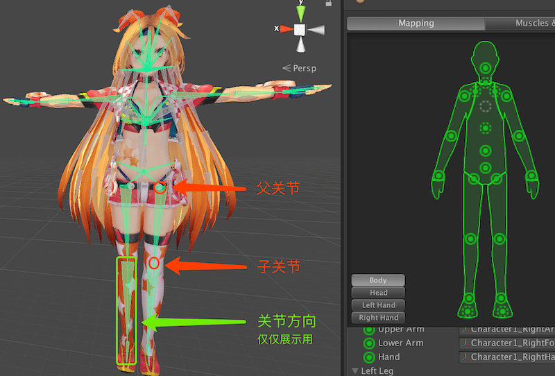
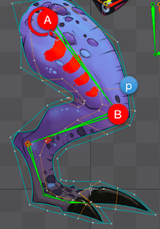
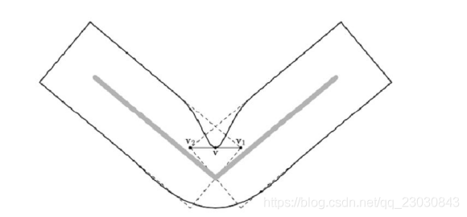
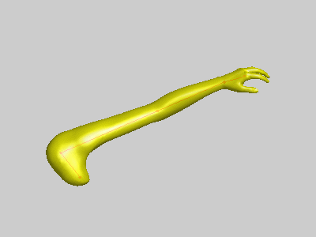
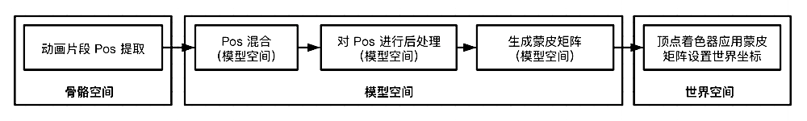

# 一、纹理动画

## 1. 序列帧动画

序列帧动画：

- 依次播放一系列关键帧图片，当播放速度达到一定数值时，看起来就是一个连续的动画
- 多用于游戏 2D 中做循环动作的角色，或者制作 3D 模型，做三渲二的序列帧效果

优点：灵活性强，不需要任何物理计算就可以达到非常细腻的效果

缺点：

- 效果固定，只能从一个角度观看
- 时间较长的序列帧动画会消耗大量的内存和显存，对于移动端来说，会造成一段时间的内存波动

## 2. Sprite 动画

生成 Sprite 序列帧动画的工具：[TexturePacker](https://www.codeandweb.com/texturepacker)

方法：多张序列帧图片合成一张纹理，每个序列帧在纹理中的大小是一样的，通过不断变换对合成纹理的局部采样位置来实现帧动画的切换

优点：多张序列帧图片合成一张纹理，减少纹理的读取次数，提高效率

缺点：

- 效果固定，只能从一个角度观看
- 时间较长的序列帧动画会消耗大量的内存和显存，对于移动端来说，会造成一段时间的内存波动

# 二、顶点动画

## 1. 广告牌

广告牌（Billboarding）根据视角方向旋转一个贴有纹理的多边形（通常是四边形）使得多边形总是面对着摄像机

**应用场景：烟雾，云朵，闪光效果**

和构建相机坐标系的方法类似，需要在广告牌的多边形上构建基坐标系：

1. 在多边形上选取坐标原点（一般为多边形的中心点）
2. 由于一般广告牌的**表面法向量为指向相机的方向**和世界坐标下竖直向上的方向为已知
   从而：设世界坐标下竖直向上的方向为 Y 轴（0，1，0），则垂直于 Y 轴和表面法线构成平面的为 X 轴
   $X = Y_{up} \times Normal$
3. Z 轴在 Y 轴和广告牌表面法线构成的平面内，但 Z 轴不一定是法线，需要重新计算
   Z 轴直于 X 轴和 Y 轴构成的平面 $Z = X \times Y_{up}$
4. 将 X、Y、Z 轴**归一化**后作为广告牌的模型矩阵
5. 根据实际广告牌的中心点在世界坐标系下的位置，将广告牌上的顶点逐个进行位移、MVP 变换，裁剪后绘制到屏幕上

## 2. Morph 动画

记录多个关键动作中的模型所有顶点的位置，通过在运行中对前后的两个关键动作的模型顶点做线性插值，来达到动画的效果

- 只存储模型网格变化的顶点
- 多用于人物表情等对动画细节要求较高的地方

## 3. 骨骼蒙皮动画

### 3.1 功能作用

> 刚性物体：物体在运动中形状不会发生改变

<u> 刚性阶层动画</u>

- 方法：动画不是一个整体的 Mesh, 而是分成很多部分 Mesh
  通过一个父子层次结构将这些分散的 Mesh 组织在一起，父 Mesh 带动其下子 Mesh 的运动
- 优点：刚性阶层动画将动画角色以树状的数据结构存储，制作灵活，美术工作量小，方便角色动画运动
- 缺点：由于各部分 Mesh 中的顶点是固定在其 Mesh 坐标系中的，所以关节处在运动时会产生裂缝，只适合机械或者皮影风格的角色

骨骼蒙皮动画

- 方法：通过动画关键帧数据控制骨架的变换，使骨架在两个姿态间的线性插值变化，从而带动绑定在骨架上模型顶点 Mesh 的运动，最终形成动画效果
- 优点：由于**每个顶点可以被多个骨骼控制**，关节在运动时没有裂缝
  多套 Mesh 可以共享一个骨骼的动画效果，节省资源

### 3.2 数据存储结构

**骨骼和关节的关系**：骨骼是一个坐标空间，关节是骨骼坐标空间的原点
骨骼没有长度，但在编辑器中为了方便展示，会给骨骼绘制长度

**骨架：有层次的关节组成的树形结构**

- 关节：包含多种顶点信息的树形结构中的节点
- **关节权重**：所有关节的权重和为 1
  顶点存储受哪些关节的影响（Unity 里 1 个顶点最多受 4 个关节的影响）并记录下受每个关节影响的权重
- [**插槽** Socket/Slot](https://www.52vr.com/extDoc/ue4/CHN/Engine/Content/Types/SkeletalMeshes/Sockets/index.html)：一个骨骼拥有了插槽，说明这个骨骼可以挂载一个 Mesh 对象，让这个对象**相对于这个骨骼**旋转，位移等运动
  比如，一个人物模型的手骨骼上通常会有插槽，方便在手上放置不同的武器
- 根关节：可以通过平移和旋转根关节移动并确定整个骨架在世界空间中的位置和方向
- 父关节：自身运动可以影响所有子关节的运动
- 子关节：自身运动不会影响父关节，但处于父关节的坐标系中

**姿势：关节相对于某坐标系的位置、朝向、缩放**

- 绑定姿势：顶点网格在 <u>绑定骨骼前</u> 默认的姿势（又称参考姿势，一般为 T 字形）
- 局部姿势：关节相对于父关节的偏移，结构 TQS（位置、朝向、缩放）根关节的父节点是世界坐标系原点
- 全局姿势：关节相对于模型空间或者世界空间的姿势

### 3.3 骨骼蒙皮的计算

如下图，点 B 是骨骼 A 的子骨骼，点 p 为跟随 B 的网格上的一个顶点

**隐含条件** 绑定姿势下的相对位置均已知

1. **绑定姿势下**：点 p 相对于 B 的位置表示为 PB0
   **目标姿势下**：点 p 相对于 B 的位置表示为 PB1
   由于 p 跟随 B 运动，相对于 B 时 p 是不动的，因此 PB0 == PB1，点 p 相对于 B 的相对位置可以表示为 PB

2. 顶点<u>关联一根</u>骨骼时
   **绑定姿势下（当前帧）：**已知
   点 B 在模型空间<u>相对父骨骼</u>的位置为 $M_{B0}$
   点 p 在模型空间<u>相对父骨骼</u>的位置为 $M_{p0} = PB * M_{B0}$
   则，$PB = M_{p0} * M_{B0}^{-1}$
   
   **目标姿势下（下一帧）：**
   已知：点 B 在模型空间<u>相对父骨骼</u>的位置为 $M_{B1}$
   求得：点 p 在模型空间<u>相对父骨骼</u>的位置为 $M_{p1} = PB * M_{B1} = M_{p0} * M_{B0}^{-1} * M_{B1}$
   
   其中，通过已知可求得的矩阵 $M_{sn} = M_{B0}^{-1} * M_{Bn}$ 称为蒙皮矩阵
   
3. 顶点<u>关联多根</u>骨骼时
   关联的所有骨骼的权重和为 $W_0 + W_1 + ... + W_n = 1$
   $M_{p1} = M_{p0} * (W_0*M_{s0} + W_1*M_{s1} + ... + W_n*M_{sn})$

### 3.4 线性混合蒙皮（Linear Blending Skinning，LBS）

<u>在三维空间的旋转动画中</u>
使用**线性插值矩阵**会有信息丢失，这个时候需要使用**线性插值对偶四元数**来达到平滑动画的效果
为了减少 CPU 的压力，这些计算可以放在 GPU 里来做

比如：两个手臂向相反方向旋转同样角度时，手肘关节的变化
$$
0.5 * 
\begin{bmatrix}
0 & -1 & 0 \\
1 & 0 & 0 \\
0 & 0 & 1
\end{bmatrix}
+ 
0.5 * 
\begin{bmatrix}
0 & 1 & 0 \\
-1 & 0 & 0 \\
0 & 0 & 1
\end{bmatrix}
= 
\begin{bmatrix}
0 & 0 & 0 \\
0 & 0 & 1 \\
0 & 0 & 1
\end{bmatrix}
$$

- 线性混合蒙皮算法因其原理为线性计算，有一个无法克服的缺陷:：对于比较灵活的关节（如肩膀），当关节处旋转角度很大时，会产生皮肤失真的结果
  比如皮肤的塌陷、扭曲打结（裹糖纸）等现象
  
- 采用矩阵来计算旋转信息
  

- 采用对偶四元数来计算旋转信息
  

# 三、动画混合

将两个或多个**动画片段**的当前**骨架姿态**以一定的方式通过程序进行实时混合

**注意：**骨骼之间的混合不能使用最终的矩阵来混合（矩阵无法做动画各个属性的线性计算），需要分别对生成矩阵的 SQT 进行单独混合

# 四、动画流水线

动画后处理：动画片段混合以外的骨架姿势修改。包括：IK 处理，物理效果（动画融合物理打击效果）

**骨骼**：一根骨骼实际上是一个点（在编辑器里常常会把骨骼间连成线段）
**骨骼 Pos**：基于骨架参考姿势的变换矩阵，是所有骨骼 Transform （位移+旋转+缩放）的集合
**蒙皮**：将网格顶点，根据设计好的蒙皮权重 和 上一步计算好的骨骼 Pos 计算后得到新网格顶点的过程

# Reference

- [OpenGEX 官网](http://www.opengex.org/)
- [骨骼动画原理](https://www.cnblogs.com/tandier/p/10087656.html)
- [骨骼蒙皮动画算法（Linear Blending Skinning）](https://www.cnblogs.com/shushen/p/5987280.html)
- [Skeletal Animation 理论与实践](https://zhuanlan.zhihu.com/p/27073261)
- [Skinned Mesh 原理解析和一个最简单的实现示例](https://blog.csdn.net/n5/article/details/3105872)
- [UE4 动画系统笔记](https://blog.csdn.net/hechao3225/article/details/113531847)
- [浅析 UE 动画系统](https://zhuanlan.zhihu.com/p/393884450)

