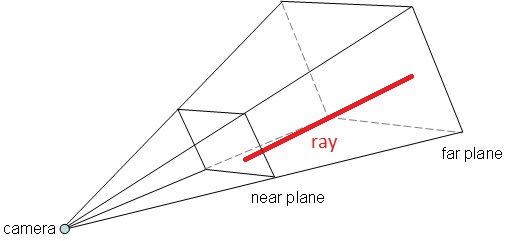
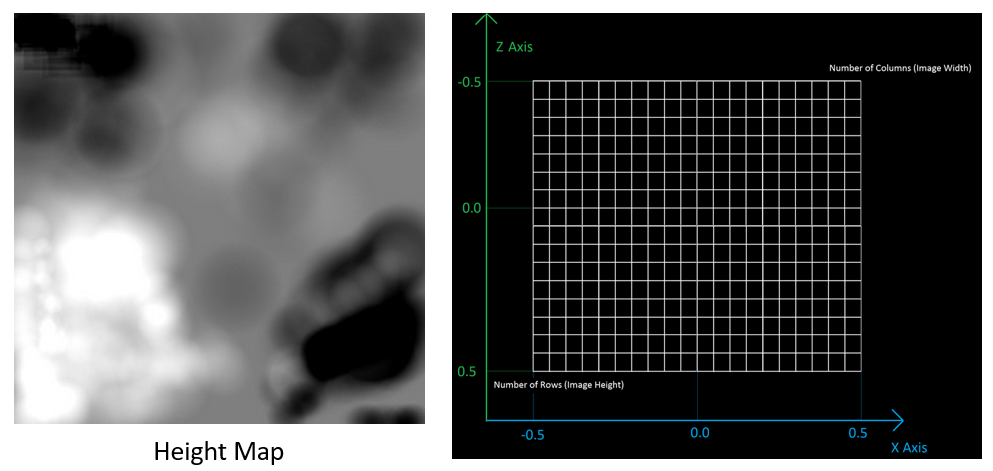
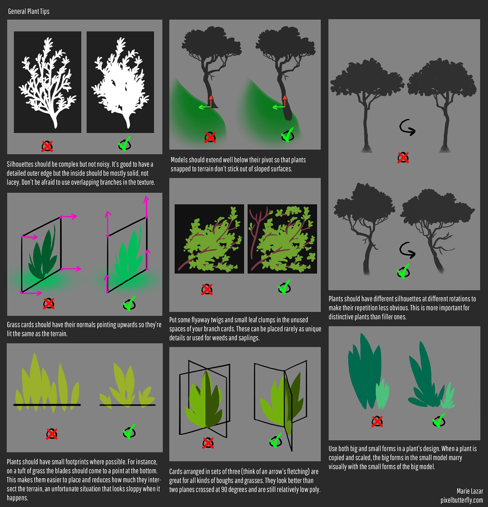

# 一、后处理特效


## 1. HDR

高动态范围（High Dynamic Range，HDR）

- 亮的东西可以变得非常亮，暗的东西可以变得非常暗，而且充满细节

- 显示器被限制为只能显示值为 0.0 到 1.0 间的颜色，但是在光照方程中却没有这个限制

- 通过使片段的颜色超过1.0，我们有了一个更大的颜色范围


HDR 原本只是被运用在摄影上，摄影师对同一个场景采取不同曝光拍多张照片，捕捉大范围的色彩值。这些图片被合成为 HDR 图片，从而综合不同的曝光等级使得大范围的细节可见


## 2. 泛光 Bloom

方法：

1. 根据一个阈值提取出图像中较亮的区域，把它们存储在一张渲染纹理上
2. 利用高斯模糊对这张渲染纹理进行模糊处理，从而模拟光线扩散的泛光效果
3. 将模糊后的图像和原图像进行混合


## 3. 运动模糊

运动模糊：真实世界中的摄像机的一种效果（相机曝光时，拍摄场景发生变化，就会产生模糊效果）

方法一：

- 步骤：利用累积缓存（accumulation buffer）来混合多张连续的图像，将它们取平均值来作为最后的模糊图像
- 缺点：性能消耗很大，因为在同一帧里要渲染多次场景
- 优化：只保存上一帧的渲染效果，不断把上一帧图像和当前图像叠加（alpha 混合），从而产生运动轨迹的视觉效果


方法二：

- 步骤：利用速度缓存（velocity buffer）存储各个像素当前的运动速度，利用改值来决定模糊的方向和大小
- 优化：通过上一帧的相机位置和投影得到上一帧点的坐标与当前帧求深度位置差，即运动速度。最后，通过运动速度决定了 3 X 3 的均值滤波的各个方向的采样步长来做模糊


## 4. 全局雾化

雾的计算：$Color_{out} = f * Color_{fog} +(1-f) * Color_{origin}$

雾的系数 $f$ 计算：使用噪声纹理强度图，乘以雾的系数，让雾的系数变化更自然

1. 线性，$d_{max}$ 和 $d_{min}$ 分别表示受雾影响的最小距离和最大距离
   $f = {d_{max} - |z| \over d_{max} - d_{min}}$
2. 指数，$d$ 控制雾浓度的参数
   $f = e^{-d-|z|}$
3. 指数的平方，$d$ 控制雾浓度的参数
   $f = e^{-(d-|z|)^2}$


# 二、其他

## 1. 描边

### 1.1 向外扩张

1. 让背面面片在视角空间下把模型顶点沿着法线的方向**向外扩张**一段距离，让背部轮廓可见
   为了防止背面面片有 Z 轴方向内凹的模型，先给让背面面片尽可能平整
   让所有背面面片的法线 Z 轴统一为一个定值，然后在归一化法线

   ```glsl
   viewNormal.z = -0.5;
   viewNormal = normalize(viewNormal);
   viewPos = viewPos + viewNormal * outlineWidth;
   ```

2. 使用轮廓线的颜色渲染背面的面片

3. 渲染正面面片


### 1.2 检测轮廓线

1. 检测边是否为轮廓线
   通过判断两个相邻的三角片面是否一个朝正面，一个朝背面
   $(n_0 \cdot v) * (n_1 \cdot v) < 0$ 其中，$n_0$ 和 $n_1$ 为相邻两个三角面的法向量，$v$ 是从视角指向顶点的方向
2. 单独渲染轮廓线（可以进行风格化渲染，水磨笔触的描边）


## 2. 3D 拾取

### 2.1 颜色拾取

1. **绘制颜色索引**
   创建 FrameBuffer，附着一张颜色纹理 RGB，一张深度纹理
   根据物体的 ID，物体的绘制批次 来给物体离屏渲染着色
    ```c
   #version 330
   
   uniform uint gObjectIndex; // 绘制对象的 ID：随着对象的更新而更新
   uniform uint gDrawIndex;   // 绘制批次的 ID：对象的绘制批次
   
   out vec3 FragColor;
   
   void main()
   {
     // gl_PrimitiveID：默认不使用 GS 为 0，使用 GS 时会被赋值，每次 drawcall 会更新
     // gl_PrimitiveID + 1：为了区分背景色黑色和索引色
     FragColor = vec3(float(gObjectIndex), float(gDrawIndex), float(gl_PrimitiveID + 1));
   }
    ```

2. **拾取颜色**
   通过 glReadPixels 拾取点选的颜色值，根据颜色值判断点击的物体
   
    ```c
    BYTE bArray[3];
    glReadPixels(mp.x, mp.y, 1, 1, GL_RGB, GL_UNSIGNED_BYTE, bArray);
    ```


### 2.2 射线拾取

1. **确定射线**
   将屏幕的点击位置映射到近平面和远平面的点，两个点的连线就是 射线

   

   ```c
   // 直接调用 glm 的 unProject 函数来确定射线
   glm::vec3 glm::unProject(glm::vec3 const& win, 
                            glm::mat4 const& model, 
                            glm::mat4 const& proj, 
                            glm::ivec4 const& viewport);
   
   // 以下为 glm unProject 的具体实现
   template<typename T, typename U, qualifier Q>
   GLM_FUNC_QUALIFIER vec<3, T, Q> unProject(vec<3, T, Q> const& win, 
                                             mat<4, 4, T, Q> const& model, 
	                                          mat<4, 4, T, Q> const& proj, 
                                             vec<4, U, Q> const& viewport)
   {
   #		if GLM_CONFIG_CLIP_CONTROL & GLM_CLIP_CONTROL_ZO_BIT
   	return unProjectZO(win, model, proj, viewport);
   #		else
   	return unProjectNO(win, model, proj, viewport);
   #		endif
   }
   
   template<typename T, typename U, qualifier Q>
   GLM_FUNC_QUALIFIER vec<3, T, Q> unProjectNO(vec<3, T, Q> const& win, 
                                               mat<4, 4, T, Q> const& model, 
                                               mat<4, 4, T, Q> const& proj, 
                                               vec<4, U, Q> const& viewport)
   {
     mat<4, 4, T, Q> Inverse = inverse(proj * model);
   
     vec<4, T, Q> tmp = vec<4, T, Q>(win, T(1));
     tmp.x = (tmp.x - T(viewport[0])) / T(viewport[2]);
     tmp.y = (tmp.y - T(viewport[1])) / T(viewport[3]);
     tmp = tmp * static_cast<T>(2) - static_cast<T>(1);
   
     vec<4, T, Q> obj = Inverse * tmp;
     obj /= obj.w;
   
     return vec<3, T, Q>(obj);
   }
   
   template<typename T, typename U, qualifier Q>
   GLM_FUNC_QUALIFIER vec<3, T, Q> unProjectZO(vec<3, T, Q> const& win, 
                                               mat<4, 4, T, Q> const& model, 
                                               mat<4, 4, T, Q> const& proj, 
                                               vec<4, U, Q> const& viewport)
   {
     mat<4, 4, T, Q> Inverse = inverse(proj * model);
     
     vec<4, T, Q> tmp = vec<4, T, Q>(win, T(1));
     tmp.x = (tmp.x - T(viewport[0])) / T(viewport[2]);
     tmp.y = (tmp.y - T(viewport[1])) / T(viewport[3]);
     tmp.x = tmp.x * static_cast<T>(2) - static_cast<T>(1);
     tmp.y = tmp.y * static_cast<T>(2) - static_cast<T>(1);
   
     vec<4, T, Q> obj = Inverse * tmp;
     obj /= obj.w;
   
     return vec<3, T, Q>(obj);
   }
   ```
   
2. **找到射线的碰撞**
   将每个物体的碰撞体设置为球体，求射线与球心最近的对象
   判断射线是否与最近的球体相交（具体方法见 [三维距离检测/点到直线最近点](../LinearAlgebra/Part3_Triangles.md)）


## 3. 粒子系统


## 4. 地貌生成

### 4.1 高度贴图

地貌的高低起伏一般通过编辑器在 CPU 内处理为 Mesh 数据，其基本原理是

1. 通过绘制黑白的高度图来生成 3D 地貌顶点 Mesh 数据
   一个高度图上的像素对应一个顶点的高度数据分量
2. 高度图的 UV 表示 Mesh 的 XZ 坐标
3. 高度图的像素颜色可以通过范围映射将 [0, 255]  映射为 [-128, 128] 来表示 Mesh 的 Y 轴坐标 （高低起伏，只修改高度值，不会修改水平面坐标）
4. 根据 Mesh 在生成顶点法线等顶点属性




### 4.2 植被覆盖

植被可以是树、花、草，每一种绘制流程都相似，以草为例：
通过 Geometry Shader 来实时生成固定的草的 Mesh 顶点并绘制

1. 一个草的片面由 4 个顶点构成的 2 个三角形
2. 草可以有多种类型的片面
3. 需要一张对应高度贴图的草种类贴图来描述每个位置草的种类
4. 通过 GS，将一个地貌 Mesh 的顶点扩展为
   一个草的片面（像向日葵一样跟随相机朝向）
   三个草的片面（根据固定偏移随机旋转，让每个顶点不同，每一帧的每个顶点相同的随机值，相同的旋转）
5. 根据草种类纹理选择草的种类，绘制草的片面
6. 可以使用三角函数，通过整体上下周期偏移来制造草的高低起伏（做到风吹草浪的效果）


制作植被时，有以下情况还需要注意：




# 三、游戏引擎

## 1. Handle 的作用

**Handle 类似于指针，实际上是一个整数类型，不直接引用内存，可以有以下映射内存的方式**

- 作为索引直接引用
- 经过一系列加密方法映射到内存地址
  比如：用 8 位密码将 16 位索引加密。将 4 位类型、4 位权限、8 位密码、16 位加密索引之后打包成一个 32 位的整数作为 Handle


**Handle 的类型**

通过给 Handle 套上结构体，确保在内存占用不变的情况下让编译器区分 Handle 类型，将问题前置到编译阶段

```c
struct VertexBufferHandle { uint16_t idx; };
struct ProgramHandle { uint16_t idx; };
```


**设计接口时 Handle 比指针优势**

1. 指针作用太强，可做的事情太多
   接口设计中，功能刚刚好就够了，并非越多权限越好的，权限越多就越危险（不容易解耦）
2. Handle 只是个整数，里面实现可以隐藏起来
   假如直接暴露了指针，也就暴露了指针类型，用户就会看到更多的细节
3. 所有资源在内部管理，通过 Handle 作为中间层，可以有效判断 Handle 是否合法，而防止了野指针的情况
4. Handle 只是个整数，所有的语言都有整数这种类型，但并非所有语言都有指针
   接口只出现 Handle，方便将实现绑定到各种语言


# Reference

- [3D Picking](http://ogldev.atspace.co.uk/www/tutorial29/tutorial29.html)
- [light house / opengl-selection-tutorial](http://www.lighthouse3d.com/tutorials/opengl-selection-tutorial/)
- [learnopengl-Bloom](https://learnopengl-cn.github.io/05 Advanced Lighting/07 Bloom/)
- [learnopengl-HDR](https://learnopengl-cn.github.io/05 Advanced Lighting/06 HDR/)
- [learnopengl-AntiAliasing](https://learnopengl-cn.github.io/04 Advanced OpenGL/11 Anti Aliasing/)
- [HDR Tone Mapping](https://zhuanlan.zhihu.com/p/26254959)
- [OGL-Particle System using Transform Feedback](http://ogldev.atspace.co.uk/www/tutorial28/tutorial28.html)
- [Open Dynamics Engine](http://www.ode.org)
- [Open Dynamics Engine Doc](http://ode.org/ode-latest-userguide.html)
- [bgfx 学习笔记（5）- Handle 的作用和分配](https://zhuanlan.zhihu.com/p/63012167)
- [OGRE 的渲染流程分析](https://zhuanlan.zhihu.com/p/113368993)
- [Redundancy vs dependencies: which is worse?](http://yosefk.com/blog/redundancy-vs-dependencies-which-is-worse.html)
- [Multilayered Terrain](https://www.mbsoftworks.sk/tutorials/opengl3/21-multilayered-terrain/)
- [Terrain Pt. 2 - Waving Grass](https://www.mbsoftworks.sk/tutorials/opengl3/29-terrain-pt2-waving-grass/)
- [Creating a Stylized Chaparral Environment in UE4](https://80.lv/articles/creating-a-stylized-chaparral-environment-in-ue4/)

