# 一、信号与系统

信号可以来自于很多外部设备：录音机、温度计、相机

**信号处理的方向**：并不关心数据以怎样自然规律产生，而是重点放在如何改变输入的信号数据

- 模拟信号：连续不断的，针对具体外界做出的具体测量值，没有取值范围
- 数字信号：离散采样的，具有时间和幅度两个分量，将模拟信号限定在一个**固定**的测量范围后，表示**局部模拟信号**波动的值，在传输时具有较强的抗干扰能力


## 1. 信号的系统

> 信号的系统指一系列处理信号的**方法**

### 1.1 系统的分类

以下系统类型可以组合为多个系统类型

- **线性转换** Linear / **非线性转换** Non-linear
  线性：输入信号与输出信号满足可加性和同质性（缩放一致）
  $$
  \alpha \cdot x(t) \rarr [Linear \space System] \rarr \alpha \cdot y(t) \\
  x_1(t) + x_2(t) \rarr [Linear \space System] \rarr y_1(t) + y_2(t) \\
  \alpha \cdot x_1(t) + \beta \cdot x_2(t) 
  \rarr [Linear \space System] \rarr 
  \alpha \cdot y_1(t) + \beta \cdot y_2(t) \\
  $$
  
- **时不变** time-inveriant / **时变** time-varying
  时不变：同样的时间偏移，输入和输出的值是对应的
$$
x(t-t_0) \rarr [Time-Invariant \space System] \rarr y(t-t_0)\\
$$

- 因果系统 Causal
根据现在和过去的输入输出值推出输出值


### 1.2 对信号分析和表达的作用域

- 时域：从时间的角度分析信号
- 频率域：从信号频率角度分析信号
- 空间域：从信号发生空间位置角度分析信号


## 2. 信号的分类

> 信号在离散和连续时有相同也有不同的特性，比如：一个正弦信号，如果周期不是整数，那虽然在连续信号里它具有周期性，但是在离散信号里，没有周期性

**脉冲信号**：一种**离散信号**（即，离散时间信号，指信号在时间这个轴上是离散的），波形之间在 Y 轴不连续，具有一定周期性


### 2.1 单位脉冲信号

一维信号中的单位脉冲信号

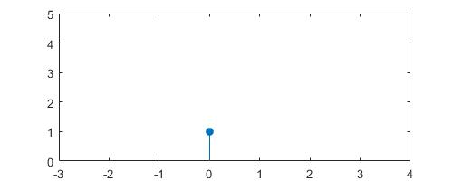

$$
\begin{array}{rrl}
Original & \delta(n) =& 
\begin{cases}
1,& n=0\\
0,& otherwise
\end{cases}\\
Offset & \delta(n-n') =& 
\begin{cases}
1,& n=n'\\
0,& otherwise
\end{cases}\\\\
2D \space Discrete & \delta(n) =& f_1(n_1)\cdot f_2(n_2)
\end{array}
$$


二维信号中的单位脉冲信号

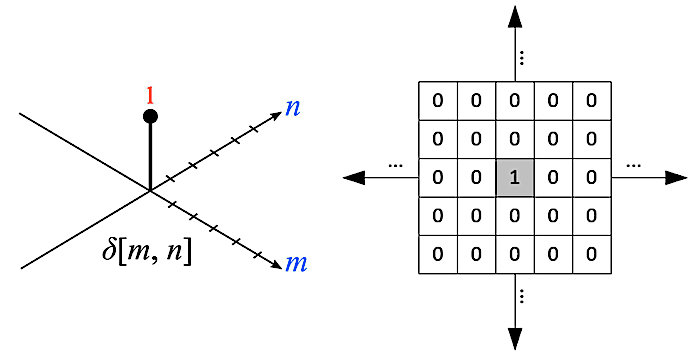
$$
\begin{array}{rrl}
Original & \delta(m,n) =& 
\begin{cases}
1,& m=n=0\\
0,& otherwise
\end{cases}\\
Offset & \delta(m-m',n-n') =& 
\begin{cases}
1,& m=m',n=n'\\
0,& otherwise
\end{cases}
\end{array}
$$


### 2.2 单位跃阶信号

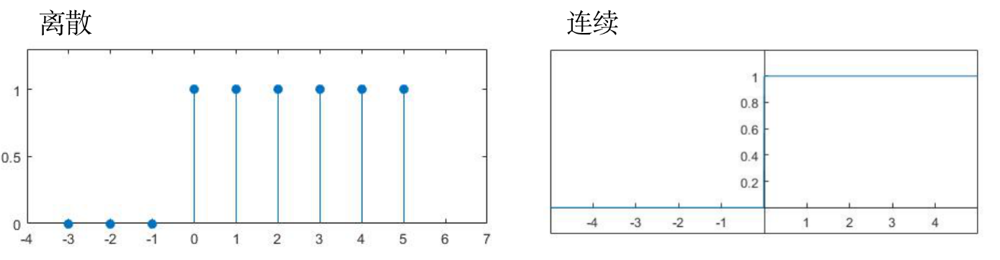
$$
\begin{array} {rrl}
Original & u(n) =& 
\begin{cases}
1,& n\geq0\\
0,& otherwise
\end{cases}\\
Offset & u(n-n') =& 
\begin{cases}
1,& n \geq n'\\
0,& otherwise
\end{cases}\\\\
2D \space Discrete & u(n_1, n_2) =& 
u_1(n_1)\cdot u_2(n_2)
\end{array}
$$


### 2.3 正弦信号

A 振幅，$\omega_0$ 频率，$\phi$ 相位（指偏移量），$T_0 = {2 \pi \over \omega_0}$ 周期
$$
u(t) = A \space cos(\omega_0 t + \phi)
$$

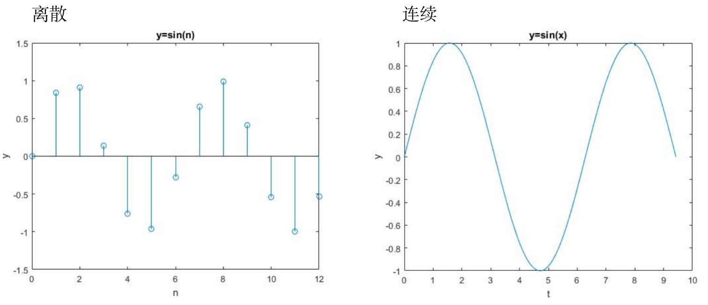


### 2.4 指数信号

指数信号
$$
u(t) = C e^{at}，(C \space 和 \space a \space 是实数)
$$
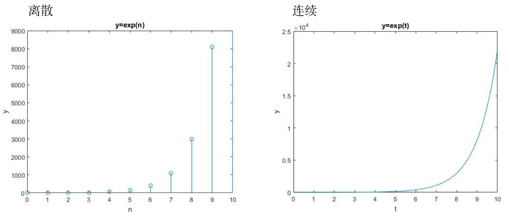


复指数信号
$$
\begin{align}
u(t) &= C e^{at}，(C \space 和 \space a \space 是复数)\\
u(t) &= |C|e^{rt}e^{(j\omega_0t+ \theta)}
\end{align}
$$

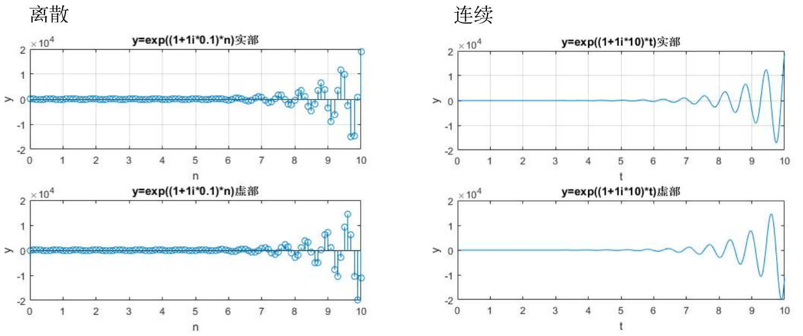


# 二、卷积

## 1. 信号的拆解

> 一般来说，一个脉冲信号可以被分解为多个单位脉冲信号加权之和

### 1.1 傅立叶级数

傅立叶级数：任何周期函数，都可以用一系列的 sin 函数 和 cos 函数的和来表示


### 1.2 离散信号序列的拆解

以下图的一维 $x$ 信号序列为例：

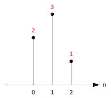

已知单位脉冲信号序列 $\delta[n]$：
$$
\delta(n) =
\begin{cases}
1,& n=0\\
0,& otherwise
\end{cases}\\
$$
则脉冲信号序列 $x[n]$：
$$
\begin{array}{lll}
x[0] &= 2 &= 2 \cdot \delta[n - 0] &= x[0] \cdot \delta[n - 0] \\
x[1] &= 3 &= 3 \cdot \delta[n - 1] &= x[1] \cdot \delta[n - 1] \\
x[2] &= 1 &= 1 \cdot \delta[n - 2] &= x[2] \cdot \delta[n - 2] \\ \\
\end{array} \\
\begin{array}{llll}
当 \space n \in [1,2,3] \space 时 & x[n] &= x[0] + x[1] + x[2] \\
& &= x[0] \cdot \delta[n - 0] + x[1] \cdot \delta[n - 1] + x[2] \cdot \delta[n - 2]\\ \\
当 \space n \in (-\infin, \infin) \space 时 & x[n] &= \sum_{k = - \infin}^\infin x[k] \cdot \delta[n - k]
\end{array}
$$


同理，二维离散信号序列也可以拆解为：
$$
\begin{array}{lll}
当 \space n \in [1,2,3] \space 时 & 
x[m][n] &= x[0][0] \cdot \delta[m][n] + x[1][2] \cdot \delta[m-1][n-2] + ... +  x[m][n]\cdot \delta[0][0]\\
当 \space n \in (-\infin, \infin) \space 时 &
x[m][n] &= 
\sum_{i = - \infin}^\infin
\sum_{j = - \infin}^\infin 
x[i][j] \cdot \delta[m - i][n - j]
\end{array}
$$


## 2. 单位脉冲响应

**单位脉冲响应**：通过单位脉冲信号输入**线性时不变系统**后，得到的输出信号，一般用 $h[n]$ 表示
一般作为卷积的参数之一，使得全部的信号能通过该方法处理

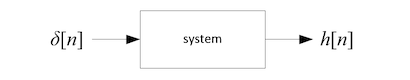

### 2.1 单位脉冲响应的特性

以下特性，适用于一维和二维等信号

1. 系统以时间为变量时，输入单位脉冲会得到对应时间偏移的单位脉冲响应
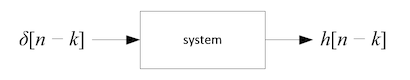

2. 系统为线性变换系统时，单位脉冲响应结果也满足对应输入的线性变换
   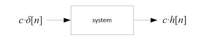
   
3. 多个单位脉冲输入时，在经过系统处理后也会得到相应数目个单位响应脉冲
   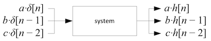


结合**单位脉冲响应的性质**和**离散信号的拆解方式**后的处理过程，就是卷积

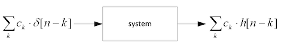


### 2.2 二维的单位脉冲响应（卷积核）

一般来说二维的脉冲响应（卷积核）多以中心为起点排列，如下图**（具体原理参考数值积分）**

- 注意：输入信号的排列方式与二维脉冲响应信号的排列**无关**

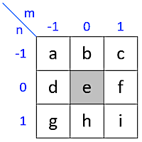


**为了减少计算量**，我们可以通过将一个二维脉冲响应（卷积核）拆解为两个一维脉冲响应分别依次（顺序可以颠倒）做卷积
这样假如原本为 3X3 的卷积核，**9 个输入**要做 9 X 9 = 81 次乘法，拆分后只需要做 9 + 9 =18 次乘法

- 作用：**通过拆解来降低二维脉冲响应的计算量**

- 例，其中 * 表示卷积：
  $$
  \begin{array}{lrl}
  \because & y[m,n] =& x[m,n] * h[m,n] = 
  \sum_{j = - \infin}^\infin
  \sum_{i = - \infin}^\infin
  x[i,j] \cdot h[m-i,n-j] \\
  &=& h[m,n] * x[m,n] = 
  \sum_{j = - \infin}^\infin
  \sum_{i = - \infin}^\infin
  h[i,j] \cdot x[m-i,n-j] \\
  &=& (h_1[m] \cdot h_2[n]) * x[m,n],(线性代数中对矩阵的向量拆分) \\
  &=& 
  \sum_{j = - \infin}^\infin
  \sum_{i = - \infin}^\infin
  (h_1[i] \cdot h_2[j]) \cdot x[m-i,n-j] \\
  &=& 
  \sum_{j = - \infin}^\infin
  h_2[j] \cdot(\sum_{i = - \infin}^\infin h_1[i] \cdot x[m-i,n-j]) \\
  &=& h_2[j] * (h_1[i] * x[m-i,n-j]) \\\\
  or 
  &=& h_1[i] * (h_2[j] * x[m-i,n-j]) \\
  \\
  \therefore &
  \begin{bmatrix}
  A \cdot a & A \cdot b & A \cdot c \\
  B \cdot a & B \cdot b & B \cdot c \\
  C \cdot a & C \cdot b & C \cdot c 
  \end{bmatrix}
  =& 
  \begin{bmatrix}A \\ B \\ c\end{bmatrix}
  \cdot 
  \begin{bmatrix}a & b & c\end{bmatrix} \\
  &
  x[m,n] * 
  \begin{bmatrix}
  A \cdot a & A \cdot b & A \cdot c \\
  B \cdot a & B \cdot b & B \cdot c \\
  C \cdot a & C \cdot b & C \cdot c 
  \end{bmatrix}
  =& x[m,n] * 
  \begin{pmatrix}
  \begin{bmatrix}A \\ B \\ c\end{bmatrix}
  \cdot 
  \begin{bmatrix}a & b & c\end{bmatrix} 
  \end{pmatrix}\\
  &=&
  \begin{pmatrix} x[m,n] * \begin{bmatrix}A \\ B \\ c\end{bmatrix} \end{pmatrix}
  * 
  \begin{bmatrix}a & b & c\end{bmatrix} 
  \end{array}
  $$
  


## 3. 离散时阈下的卷积

**卷积公式（一维信号）**，其中
y 为输出信号序列（卷积结果）
x 为输入信号序列
h 当前输入信号对应的**脉冲响应结果**（信号系统处理后的到的值）
n 当前输入信号的序列号
$$
y[n] = \sum_{k = -\infin}^\infin x[k]\cdot h[n - k]
$$


## 4. 卷积

### 4.1 一维信号的卷积过程

假设：

信号序列 $x[n] = \{ 3, 4, 5 \}$ 当 n 取 0 - 2 之外的值时信号均为 0 
单位脉冲信号随着时间变化后的**响应脉冲**为 $h[n] = \{ 2, 1 \}$ 当 n 取 0 - 1 之外的值时脉冲响应均为 0 

求卷积：
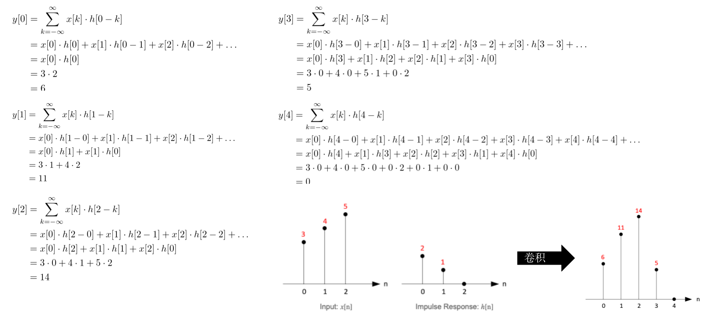
$$
\begin{array}{lll}
y[0] &= x[0]·h[0] & 需要采样 \space x_0  \\
y[1] &= x[1]·h[0] + x[0]·h[1] & 需要采样 \space x_0,x_1 \\
y[2] &= x[2]·h[0] + x[1]·h[1] & 需要采样 \space x_1,x_2 \\
y[3] &= x[3]·h[0] + x[2]·h[1] & 需要采样 \space x_2,x_3 \\
\end{array}
$$

归纳可得，其中 i 表示 **信号序号**，k 表示 **响应脉冲序号**
$$
y[i] =
\begin{cases}
x[0]·h[0] & k = 0 \\
x[i]·h[0] + x[i - 1]·h[1] + x[i - 2]·h[2] + ...+x[i - (k-1)]·h[k-1] & k \gt 0
\end{cases}
$$


CPU 代码计算示例

- 注意：卷积后的结果可能会超出原来数值的范围，即使原来的数值都在范围内

```c
// 1D convolution
// We assume input and kernel signal start from t=0.
bool convolve1D(float* in, float* out, int dataSize, float* kernel, int kernelSize)
{
    int i, j, k;

    // check validity of params
    if(!in || !out || !kernel || dataSize <=0 || kernelSize <= 0) return false;

    // start convolution from out[kernelSize-1] to out[dataSize-1] (last)
    for(i = kernelSize-1; i < dataSize; ++i)
    {
        out[i] = 0;                             // init to 0 before accumulate

        for(j = i, k = 0; k < kernelSize; --j, ++k)
            out[i] += in[j] * kernel[k];
    }

    // convolution from out[0] to out[kernelSize-2]
    for(i = 0; i < kernelSize - 1; ++i)
    {
        out[i] = 0;                             // init to 0 before sum

        for(j = i, k = 0; j >= 0; --j, ++k)
            out[i] += in[j] * kernel[k];
    }

    return true;
}
```


### 4.2 二维信号的卷积过程

二维信号的卷积是一维信号卷积的扩展，根据二维的单位脉冲响应和二维的信号拆解可得

- 注意：二维响应信号（卷积核）在最后使用的时候和原来**左右上下都颠倒**

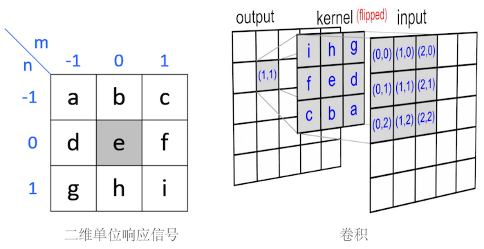


例：在采样（输入）是（1，1）位置的卷积计算为


卷积的输入、卷积核、卷积输出如下

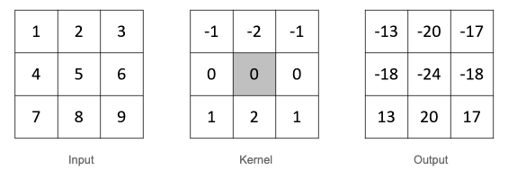


CPU 代码计算示例

- 注意：卷积后的结果可能会超出原来数值的范围，即使原来的数值都在范围内

```c
bool convolve2D(int* in, int* out, int dataSizeX, int dataSizeY, 
                float* kernel, int kernelSizeX, int kernelSizeY)
{
    int i, j, m, n;
    int *inPtr, *inPtr2, *outPtr;
    float *kPtr;
    int kCenterX, kCenterY;
    int rowMin, rowMax;                             // to check boundary of input array
    int colMin, colMax;                             //
    float sum;                                      // temp accumulation buffer

    // check validity of params
    if(!in || !out || !kernel) return false;
    if(dataSizeX <= 0 || kernelSizeX <= 0) return false;

    // find center position of kernel (half of kernel size)
    kCenterX = kernelSizeX >> 1;
    kCenterY = kernelSizeY >> 1;

    // init working  pointers
    // note that it is shifted (kCenterX, kCenterY)
    inPtr = inPtr2 = &in[dataSizeX * kCenterY + kCenterX];  
    outPtr = out;
    kPtr = kernel;

    // start convolution
    for(i= 0; i < dataSizeY; ++i)           	 // number of rows
    {
        // compute the range of convolution
        // the current row of kernel should be between these
        rowMax = i + kCenterY;
        rowMin = i - dataSizeY + kCenterY;

        for(j = 0; j < dataSizeX; ++j)     		// number of columns
        {
            // compute the range of convolution, 
            // the current column of kernel should be between these
            colMax = j + kCenterX;
            colMin = j - dataSizeX + kCenterX;

            sum = 0;                           // set to 0 before accumulate

            // flip the kernel and traverse all the kernel values
            // multiply each kernel value with underlying input data
            for(m = 0; m < kernelSizeY; ++m)   // kernel rows
            {
                // check if the index is out of bound of input array
                if(m <= rowMax && m > rowMin)
                {
                    for(n = 0; n < kernelSizeX; ++n)
                    {
                        // check the boundary of array
                        if(n <= colMax && n > colMin)
                            sum += *(inPtr - n) * *kPtr;

                        ++kPtr;            // next kernel
                    }
                }
                else
                    kPtr += kernelSizeX;   // out of bound, move to next row of kernel

                inPtr -= dataSizeX;        // move input data 1 raw up
            }

            // convert integer number
            if(sum >= 0) *outPtr = (int)(sum + 0.5f);
            else *outPtr = (int)(sum - 0.5f);

            kPtr = kernel;      // reset kernel to (0,0)
            inPtr = ++inPtr2;   // next input
            ++outPtr;           // next output
        }
    }

    return true;
}
```


# 三、傅立叶变换


# Reference

1. [正弦信号，指数信号](https://www.cnblogs.com/zhiyinglky/p/5805315.html)
2. [跃阶信号](https://www.cnblogs.com/zhiyinglky/p/5805314.html)
3. [单位脉冲响应、单位阶跃响应的作用是什么？](https://know.baidu.com/question/b83161b20e2bf9de79624dd98fa89b47c70e1cf)
4. [Fundamentals of Digital Image and Video Processing](https://github.com/giosans/Fundamentals-of-Digital-Image-and-Video-Processing-course)
5. [Signals and Systems](http://open.163.com/movie/2011/8/7/A/M8AROL7GG_M8AROT67A.html)
6. [Convolution](http://www.songho.ca/dsp/convolution/convolution.html)
7. [Proof of Separable Convolution 2D](http://www.songho.ca/dsp/convolution/convolution2d_separable.html)