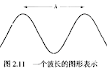
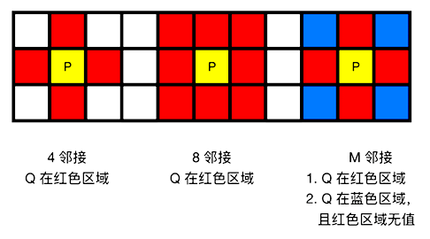
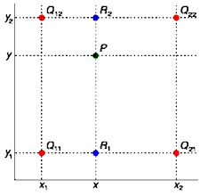
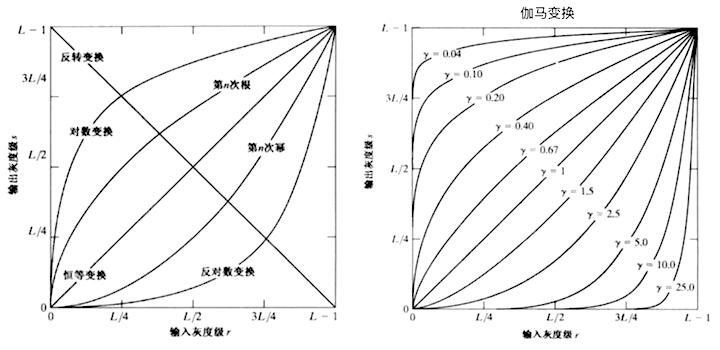
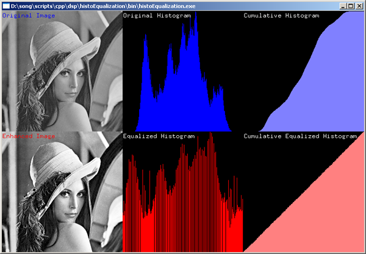
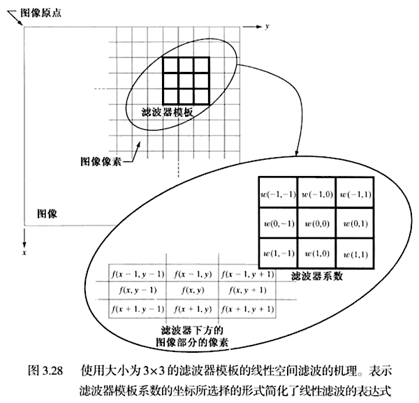
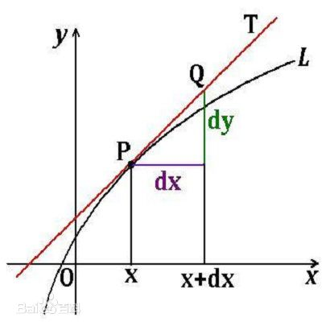
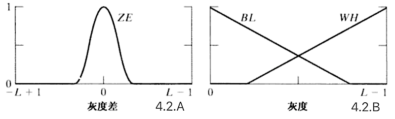

# 一、图像处理基本


## 1. 光谱即是电磁波谱

- 波长：从红光到紫光，波长不断变短（对于可见光，波长不同，颜色不同）

  

- 灰度级：从黑到白的单色光度量范围
  单色光：无色光，没有颜色的光
  强度：即灰度，单色光的唯一属性

- 发光强度：光源流出的能量总和

- 光通量：观察者从光源感受到的能量，**单位：流明 lumen （LM）**

- 亮度：物体表面的反光率，实际上不能度量，色彩的强度（人眼对亮度的敏感 > 色彩）


## 2. 数字图像
### 2.1 图像属性

- 图像的本质：一个二维数组（矩阵）

- 原点：左上角

- 动态范围：**图中**最大灰度 / **图中**最小灰度

- 噪声：图中多余的干扰信息，低于**图中**最小灰度，便会出现

- 饱和度：即**图中**最大灰度，高于这个值，图中的灰度将会被剪裁掉（彩图中是灰度和色调的比例，0% 灰色 ～ 100% 完全饱和）

- 对比度：**图中**最大灰度 **-** **图中**最小灰度

- 图像分辨率（空间分辨率）：每单位距离的点个数 

  > 相关单位：dpi([点每英寸](https://baike.baidu.com/item/%E7%82%B9%E6%AF%8F%E8%8B%B1%E5%AF%B8)）、lpi（线每英寸）和ppi（[像素每英寸](https://baike.baidu.com/item/%E5%83%8F%E7%B4%A0%E6%AF%8F%E8%8B%B1%E5%AF%B8))

$$
PPI = {\sqrt{像素长^2 + 像素宽^2} \over \sqrt{屏幕长^2 + 屏幕宽^2}}
$$

### 2.2 像素

- 邻接性：
  有时候也用非矩形的邻域（比如：圆形），但矩形邻域是目前为止最好的邻域，因为它在计算上更为容易

  

- 像素通路：从起点像素到终点像素相邻像素的连线
  必须保证唯一，创建通路前要确定使用哪种邻接

- 像素间距离计算：例，求 $A(x_a, y_a)、B(x_b, y_b)$ 间的距离
  欧式距离：最短距离 $D_e(A, B) = \sqrt{(x_b - x_a)^2+ (y_b - y_a)^2}$
  D4 距离：每次只能横、竖、走 4 邻接像素 $D_4(A,B) = |x_b - x_a|, |y_b - y_a|$
  D8 距离：每次只能横、竖、**斜**走 8 邻接像素 $D_8(A,B) = max(|x_b - x_a|, |y_b - y_a|)$


## 3. 图像处理

### 3.1 图像的收缩和放大

- 线性插值（nearest）：例，根据 $Q(x_0,y_0)，R(x_1,y_1)  \Rightarrow  P_{插值后}(x, y)$
  $$
  {y - y_0 \over x - x_0} = {y_1 - y_0 \over x_1 - x_0}
  $$

- 双线性插值（bilinear）：**结果与插值的 X、Y 方向先后顺序无关**
  缺点：对角线过渡不平滑，细节退化
  计算方法：

  1. X 方向线性插值：根据 4 个 Q 点分别求出 R1，R2
  2. Y 方向线性插值：根据 R1，R2 求出 P
  
  
- 双三次内插值（bicubic）：双线性插值的三维拓展


### 3.2 图像的线性操作

- 阵列操作：表示图像的矩阵中每个对应元素之间的操作
  例，**阵列**相乘
  $$
  \begin{bmatrix}
  \color{red}{a_{11}} & \color{red}{a_{21}} \\
  a_{12} & a_{22} \\
  \end{bmatrix}
  \begin{bmatrix}
  \color{green}{b_{11}} & b_{21} \\
  \color{green}{b_{12}} & b_{22} \\
  \end{bmatrix}
  =
  \begin{bmatrix}
  \color{red}{a_{11}}\color{green}{b_{11}} & \color{red}{a_{21}}b_{21} \\
  a_{12}\color{green}{b_{12}} & a_{22}b_{22} \\
  \end{bmatrix}
  $$

- 符合线性代数的条件下使用线性代数公式
  例，**矩阵**相乘：行 X 列
  $$
  \begin{bmatrix}
  \color{red}{a_{11}} & \color{red}{a_{21}} \\
  a_{12} & a_{22} \\
  \end{bmatrix}
  \begin{bmatrix}
  \color{green}{b_{11}} & b_{21} \\
  \color{green}{b_{12}} & b_{22} \\
  \end{bmatrix}
  =
  \begin{bmatrix}
  \color{red}{a_{11}}\color{green}{b_{11}}+\color{red}{a_{21}}\color{green}{b_{12}} &
  \color{red}{a_{11}}b_{21}+\color{red}{a_{21}}b_{22} \\
  a_{12}\color{green}{b_{11}}+a_{22}\color{green}{b_{12}} & a_{12}b_{21}+a_{22}b_{22} \\
  \end{bmatrix}
  $$

- [其他线性代数问题](https://github.com/CatOnly/CrashNote/blob/master/LinearAlgebra/Part0.md)


### 3.3 图像的概率方法

- 基本概率：概率 = 符合条件事件数 / 事件总数
- 期望值：概率加权后的和
  当事件总数不可知（或者无法求得），但是知道概率分布（符合条件的每个概率值），从而求得的整体的平均值
- 方差：随机变量和期望的偏离程度
  方差公式：$\sigma^2 = {\sum_1^n(X - \mu)^2 \over n}, \sigma 标准差、X 随机变量、\mu期望、n随机变量总量$
- **概率密度函数（PDF）**：连续随机变量存在随机变量 $x$ 与其出现的概率 $f(x)$，求规定 $x$ 范围内的可能性，就是求概率密度函数 $f(x)$ 在这个范围的积分
- **累积分布函数（CDF）**：概率密度函数的积分，能完整描述一个实随机变量 $X$ 的概率分布


### 3.4 图像的灰度变换函数 

- 图像反转：$ s = (L-1) -r $
  突出图像暗区域中白色或灰色部分

- 对数变换：$s = c \cdot  log(1 + r)，c  常数$
  主要用来压缩像素值变化较大的动态范围

- 伽马变换：$s = c \cdot r^\gamma，c 常数$
  又称幂律变换，当 c = 1 时，**显著**提高暗部亮度，可以提高亮部的亮度，如图下所示

  


### 3.5 图像的直方图处理

作用：通过在单张灰度图中统计 0 - 255 每个灰度级出现的总次数（概率），作为图像增强或图像阈值判断标准
限制：直方图只能测量一种强度值（R、G、B、A、Gray）的分布概率范围
特点：暗的图像直方图主要分布在灰度级低的位置，高对比度的图像直方图分布均匀，低对比度的直方图主要分布在灰度级的中间位置

直方图的生成

```c
int pixelCount = width * height;
for (int i = 0; i < pixelCount; ++i )
{
    histogram[imageData[i]]++; // 计算单张图中每个灰度级出现的总次数
}
```


累加直方图：在单张灰度图中统计 0 - 255 每个灰度等级，小于等于该灰度的等级出现总次数之和

生成累加直方图

```c
// build a cumulative histogram as LUT (Look Up Table)
int sum = 0;
for (int i=0; i < HISTOGRAM_SIZE; ++i )
{
    sum += histogram[i];
    sumHistogram[i] = sum;
}
```


**直方图均衡**：利用图像直方图 **对** 对比度进行调整的**方法**

- 作用：用于作为增强局部对比度而不影响整体对比度的自适应工具

- 方法：原始直方图 => 累加直方图 =>将最大强度通过出现概率平滑过度到每个像素  => 均衡后的直方图

  ```c
  // 一、直接对图像进行直方图均衡
  // transform image using sum histogram as a LUT (Look Up Table)
  for (int i = 0; i < pixelCount; ++i )
  {
    	// 通过这张图的最大强度和当前像素的累加出现概率来求出修改后的像素值
      outImage[i] = sumHistogram[image[i]] * MAX_INTENSITY / pixelCount;
  }
  
  // 二、由于 pixelCount 远大于 HISTOGRAM_SIZE 这种固定值
  //    通过提前制作的查找表来做直方图均衡（减少计算量，提高效率）
  // build a LUT containing scale factor
  for (int i=0; i < HISTOGRAM_SIZE; ++i )
  {
      sum += histogram[i];
      lut[i] = sum * MAX_INTENSITY / pixelCount;
  }
  
  // transform image using sum histogram as a LUT
  for (int i = 0; i < pixelCount; ++i )
  {
      outImage[i] = lut[image[i]];
  }
  ```

- 效果对比：均衡后的累加直方图几乎是线性增长的

  

  

**直方图匹配**：处理图像使其得到指定的概率密度

- 作用：通过得到**指定**概率密度的 灰度变换函数使图像局部增强
- 方法：不需要求得 灰度变换函数，只需要存储 灰度变换函数对应的 输入输出表格用查表法来得到相应的数据


# 二、空间域滤波

> 空间域技术：直接在图像像素上操作，针对图像本身，**可用于非线性滤波，这在频率域中无法做到**
>
> 滤波：接受/拒绝 一定的频率分量
> 低通滤波器：通过低频的滤波器处理结果模糊（平滑）的图像
> 空间滤波器（也称为，空间掩膜、核、模版、窗口）

## 1. 空间滤波基础

- 空间滤波方法：通过中心像素和其邻域**执行特定的方法**生成新像素
- 空间滤波器（模版）：通过特定的方法得到的对应像素的权重集合
- 线性空间滤波器：执行特定的方法是线性操作的空间滤波器（对于边缘像素的计算结果，根据纹理的环绕方式的不同而不同）
  
  空间相关/卷积：滤波器移过图像，计算每个位置乘积之和得出对应像素值的处理方法

> 离散单位冲激：包含单个 1 其余都是 0 的函数/矩阵

- 处理方法，**空间相关**：
    $$
    输入图像
    \begin{bmatrix}
    0 & 0 & 0 & 0 & 0\\
    0 & 0 & 0 & 0 & 0\\
    0 & 0 & \color{red}1 & 0 & 0\\
    0 & 0 & 0 & 0 & 0\\
    0 & 0 & 0 & 0 & 0
     \end{bmatrix}
     \Rightarrow
     滤波器 w
     \begin{bmatrix}
    1 & 2 & 3\\
    4 & 5 & 6\\
    7 & 8 & 9
     \end{bmatrix}
     {逐像素处理 \over \Rightarrow}
     全部相关结果
    \begin{bmatrix}
    0 & 0 & 0 & 0 & 0 & 0 & 0 & 0 & 0\\
    0 & 0 & 0 & 0 & 0 & 0 & 0 & 0 & 0\\
    0 & 0 & 0 & 0 & 0 & 0 & 0 & 0 & 0\\
    0 & 0 & 0 & \color{red}9 & \color{red}8 & \color{red}7 & 0 & 0 & 0\\
    0 & 0 &0 & \color{red}6 & \color{red}5 & \color{red}4 & 0 & 0 & 0\\
    0 & 0 &0 & \color{red}3 & \color{red}2 & \color{red}1 & 0 & 0 & 0\\
    0 & 0 & 0 & 0 & 0 & 0 & 0 & 0 & 0\\
    0 & 0 & 0 & 0 & 0 & 0 & 0 & 0 & 0\\
    0 & 0 & 0 & 0 & 0 & 0 & 0 & 0 & 0
     \end{bmatrix}
     { 剪裁 \over \Rightarrow}
    输出图像
    \begin{bmatrix}
    0 & 0 & 0 & 0 & 0\\
    0 & \color{red}9 & \color{red}8 & \color{red}7 & 0\\
    0 & \color{red}6 & \color{red}5 & \color{red}4 & 0\\
    0 & \color{red}3 & \color{red}2 & \color{red}1 & 0\\
    0 & 0 & 0 & 0 & 0
     \end{bmatrix}
    $$

- 处理方法，**空间卷积**：
  $$
  输入图像
  \begin{bmatrix}
  0 & 0 & 0 & 0 & 0\\
  0 & 0 & 0 & 0 & 0\\
  0 & 0 & \color{red}1 & 0 & 0\\
  0 & 0 & 0 & 0 & 0\\
  0 & 0 & 0 & 0 & 0
   \end{bmatrix}
   {180 度翻转 w  \over \Rightarrow}
   滤波器 w^T
   \begin{bmatrix}
  9 & 8 & 7\\
  6 & 5 & 4\\
  3 & 2 & 1
   \end{bmatrix}
   {逐像素处理 \over \Rightarrow}
   全部卷积结果
  \begin{bmatrix}
  0 & 0 & 0 & 0 & 0 & 0 & 0 & 0 & 0\\
  0 & 0 & 0 & 0 & 0 & 0 & 0 & 0 & 0\\
  0 & 0 & 0 & 0 & 0 & 0 & 0 & 0 & 0\\
  0 & 0 & 0 & \color{red}1 & \color{red}2 & \color{red}3 & 0 & 0 & 0\\
  0 & 0 & 0 & \color{red}4 & \color{red}5 & \color{red}6 & 0 & 0 & 0\\
  0 & 0 & 0 & \color{red}7 & \color{red}8 & \color{red}9 & 0 & 0 & 0\\
  0 & 0 & 0 & 0 & 0 & 0 & 0 & 0 & 0\\
  0 & 0 & 0 & 0 & 0 & 0 & 0 & 0 & 0\\
  0 & 0 & 0 & 0 & 0 & 0 & 0 & 0 & 0
   \end{bmatrix}
   { 剪裁 \over \Rightarrow}
  输出图像
  \begin{bmatrix}
  0 & 0 & 0 & 0 & 0\\
  0 & \color{red}1 & \color{red}2 & \color{red}3 & 0\\
  0 & \color{red}4 & \color{red}5 & \color{red}6 & 0\\
  0 & \color{red}7 & \color{red}8 & \color{red}9 & 0\\
  0 & 0 & 0 & 0 & 0
   \end{bmatrix}
  $$
  


## 2. 平滑空间滤波器

**作用：用于模糊处理，降低噪声**
使用 3 X 3、5 X 5 或更大的空间滤波器，效果更明显

### 2.1 平滑线性滤波器（均值滤波器）

方法：中心像素的值为滤波器模版邻域内像素简单的加权平均值
特点：滤波器个系数加权之和为 1
缺点：出现边缘模糊
例：
$$
\begin{array}{rr}
{ 1 \over 9 } \times
 \begin{bmatrix}
1 & 1 & 1\\
1 & 1 & 1\\
1 & 1 & 1
 \end{bmatrix}
 &
 { 1 \over 16 } \times
  \begin{bmatrix}
1 & 2 & 1\\
2 & 4 & 2\\
1 & 2 & 1
 \end{bmatrix}
\\
均值滤波器 A & 均值滤波器 B
\end{array}
$$

### 2.2 统计排序（非线性）滤波器

方法：中心像素的值为滤波器模版邻域内像素值安一定规则排序后，从统计排序结果中选取的

缺点：非线性滤波器可能改变图像的性质，这在医学是不能接受的

例：中值滤波，中心像素的值为滤波器模版邻域内像素值从小到大排列后，位置排在中间的像素的值


## 3. 锐化空间滤波器

**作用：突出灰度过渡的部分**
锐化空间滤波器的关键数学工具：**微分**
**微分**：函数  $f(x)$ 在 $dx$ 的微分是，函数  $f(x)$ 在 $dx$ 处的极限，具体意义如下

- 直线 T 为 曲线 $f(x)$ 上 P 点的切线，是 ${df \over dx}$ 的图像
  曲线 L 为 曲线 $f(x)$ 的图像
- 当增量 $dx$ 趋于无穷小时， $f(x) - df$ 的差别也趋于无穷小，所以**在 P 点附近**可以用 切线 T 来的代替曲线 L 的值



一维的微分公式
- 一阶微分：${df \over dx} = {f(x+1) - f(x) \over (x+1) -x} = f(x+1) - f(x)$
- 二阶微分：${d^2f \over dx^2} = {d({df \over dx})\over dx} = f(x+1) +f(x-1) - 2f(x)$

### 3.1 梯度（一阶微分）

特点：边缘增强

方法：

- 具有旋转不变的特性（各向同性），根据对一阶微分 ${df \over dx}$ 的计算不同而不同，基本思路是：
  $g_{中心}(x,y) = \sqrt{({df \over dx})^2 + ({df \over dy})^2}$
- 具有旋转改变的特性（各向异性），为了方便计算：
  $g_{中心}(x,y) \approx |{df \over dx}| + |{df \over dy}|$
- 为不影响其他像素的值，滤波器个系数加权和为 0

### 3.2 拉普拉斯算子（二阶微分）

特点：增强图像细节，增强灰度的突变，减弱灰度的缓慢变化区
缺点：比梯度操作产生更多的噪点

拉普拉斯算子是二维的二阶微分，公式为：$\Delta^2f(x, y) = f(x+1,y) +f(x-1,y)+f(x,y+1) +f(x,y-1)-4f(x,y)$

使用方法：

- $g_{中心}(x,y) = f_{中心}(x,y)+滤波器中心系数的符号\cdot \Delta^2f(x,y)$
- 为不影响其他像素的值，滤波器个系数加权和为 0

### 3.3 非锐化掩蔽和高提升滤波（不用微分）

方法：原图像 A ${模糊 \over \Rightarrow}$ 模糊图像 G ${A - G \over \Rightarrow}$ 差值图像 D ${A + D \over \Rightarrow}$ 锐化图像

### 3.4 多种滤波的混合使用举例

锐化图像：原图像 $\rightarrow$ 梯度滤波 $\rightarrow$ 平滑线性滤波 $\rightarrow$ 拉普拉斯滤波 $\rightarrow$ 锐化后的图像


## 4. 模糊技术

作用：为处理不严密信息提供了一种形式

模糊集合：集合中的某元素 A 在集合中的隶属度（符合集合定义的程度，一般介于 0 ～ 1）组成的有序对

集合操作与数学计算：

- 集合 A   的补集：$1 - A$
- 集合 AB 的并集：$max(A, B)$
- 集合 AB 的交集： $min(A, B)$

**方法**：

1. 找到处理图像的**各个**影响因素和其对应的隶属度的关系 A、B、C...
2. 将**各个**关键关系 A、B、C… 进行集合操作得到模糊集合
3. 将模糊集合通过**一种计算方法**（以下几个例子都用了计算集合中心的方法）得出一个计算方程

### 4.1 模糊技术处理灰度

根据 黑、灰、白 和 其隶属度的关系 的模糊集合，使用重心的计算方法得到灰度处理方法
$$
v_{输出} = {
f_黑(x_{隶属度}) \times  v_黑 + g_灰(x_{隶属度}) \times  v_灰 + h_白(x_{隶属度}) \times  v_白 
\over 
f_黑(x_{隶属度})  + g_灰(x_{隶属度})  + h_白(x_{隶属度}) 
}
$$

### 4.2 模糊技术进行空间滤波

假设 黑色 == 平滑，白色 == 边缘，则边缘检测如下

图 4.2.A 为：灰度差为 0 和其集合隶属关系
图 4.2.B 为：黑色 和 白色与其集合隶属关系
根据图 4.2.A、B 构成的模糊集合通过边缘提取的计算方法（只要与中心像素 **4邻接**的两个**相邻**灰度差均为 0 时，中间点为白色）




# 三、频率域滤波
> 傅立叶概念：$任何周期函数 = (系数 1 \times 正弦) 和/或 (系数2 \times 余弦)$

常用数学公式
$$
\begin{align}
复数 &= 实数_{实部} + 实数_{虚部}\cdot i_{虚数单位}, (i_{虚数单位} = \sqrt{-1} )\\
复数的共轭 &= 实数_{实部} - 实数_{虚部}\cdot i\\
f(x)_{复数} &= R(x)_{实部} + J(x)_{虚部} \cdot i\\
f(x)_{复数的共轭} &= R(x)_{实部} - J(x)_{虚部} \cdot i\\
复数_{极坐标下} &= \sqrt{实部^2 + 虚部^2}(cos\theta + i \cdot sin\theta)\\
复数_{极坐标下}  &= \sqrt{实部^2 + 虚部^2}e^{i\theta},(欧拉公式: e^{\theta i} = cos\theta + i\cdot sin\theta，e = 2.71828 …)\\
f(x)_{傅立叶级数} &= \sum_{n = -\infty}^\infty c_n e^{i{2\pi n\over T_{周期}}x},(i = \sqrt{-1}, c_n = {1 \over T}\int_{-{T \over 2}}^{T \over 2} f(x)e^{-i{2\pi n\over T}x}dx, n = 0, \pm1, \pm2...)
\end{align}
$$

## 1. 频率域滤波基础
### 1.1 基本概念

### 1.2 傅立叶变换
#### 1.2.1 取样函数的傅立叶变换
#### 1.2.2 单变量的离散傅立叶变换(DTF)
#### 1.2.3 二维离散傅里叶变换的性质

## 2. 频率域滤波平滑图像
## 3. 频率域滤波锐化图像

## 4. 选择性滤波

## 5. 滤波器实现


# Reference

1. [Histogram](http://www.songho.ca/dsp/histogram/histogram.html)