# 一、彩色图像处理

人眼对明暗比颜色更加敏感，RGB 色光三原色中人眼对绿色比较敏感


## 1. 颜色的特性

### 1.1  颜色的心理学特征：人对光的感觉而产生的光的特性

**色彩 Hue：**
光谱（一定电磁频谱范围内）中的主频率/主波长

**纯度 Purity / 饱和度 Satruation：**
一种颜色混合白色的比例（100% 是无白光混合，纯度最高），**纯度高了色彩会鲜亮**

**色度 Chromaticity：**
代表了光的纯度和色彩这两种特征的组合

**亮度 Brightness：**
光源的强度/振幅，物体表面的反光率（实际上不能度量，人眼对亮度的敏感 > 色彩）

- Luminance(Y)：物理度量，没有具体的大小范围，是某个方向上行进的每单位面积光的发光强度
- Luma(Y')：通过将物理度量的亮度伽马矫正后，具有固定大小范围的相对亮度


### 1.2 直观的颜色概念

**明暗 Shades：**
纯色颜料里添加黑色颜料

**色泽 Tints：**
纯色颜料里添加白色颜料

**色调 Tones：**
纯色颜料里同时添加黑色和白色颜料

**补色 Complementary Color：**
两个颜色相加是白色，则互为补色（在色环上，与一个色调直接相对的另一端）
让颜色**变亮**不是加白，是**减去补色**，这样**色调才不会改变**（用于增强图像暗区细节）


## 2. 色彩模型

> 颜色模型是在某种情况下对颜色的特征和行为的解释，没有哪种颜色模型能解决所有的颜色问题
>
> 较少的颜色比使用较多的颜色能产生更令人满意的显示，淡色和暗色的混合比纯色彩更柔和


### 2.1 RGB 色彩模型

特点：基于三刺激理论，适合色彩生成，适合硬件设备对于色彩的实现

加色混色模型：颜色混在一起亮度增大，**R**ed、**G**reen、**B**lue 三种颜色的取值范围是 [0, 255]

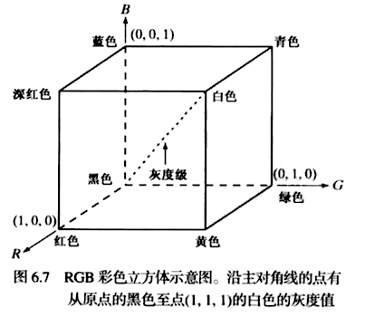

使用 RGB 色彩模型的应用：

- [3D LUT 的 Unity 实现](https://zhuanlan.zhihu.com/p/43241990)
- [3D LUT Creator Tutorials](https://www.3dlutcreator.com/3d-lut-creator---tutorials.html)


### 2.2 CMY 和 CMYK 色彩模型 	 

特点：适合色彩生成，适合硬件设备对于色彩的实现

减色混色模型：颜色混在一起亮度降低，**C**yan (青)、**M**agenta (品红)、**Y**ellow(黄)、Blac**K**(黑)，加入黑色是因为打印时由品红、黄、青构成的黑色不够纯粹

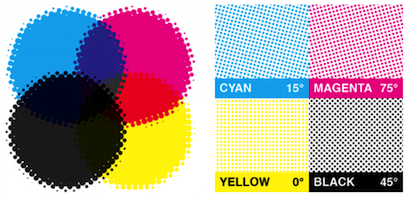

#### 2.2.1 RGB 与 CMY 的转换

- 公式：假设所有彩色值都归一化到了 [0, 1] 的范围内
  ​
  $$
  \begin{bmatrix}
  C\\
  M\\
  Y
  \end{bmatrix}
  =
  \begin{bmatrix}
  1\\
  1\\
  1
  \end{bmatrix}
  - 
  \begin{bmatrix}
  R\\
  G\\
  B
  \end{bmatrix}
  $$


### 2.3 HSI、HSL 和 HSV 色彩模型 

特点：适合色彩描述、电脑绘画、图像算法的处理，人能观察的色彩并不是由 RGB 三种颜色混合而成，而是取决于颜色的亮度、色调、饱和度。**HSI、HSL、HSV 方便和RGB 进行互相转换**
> HSI、HSL 和 HSV 更多的是一种色彩模型，并不是一个绝对不变的色彩空间，它的取值范围，取决于来自于 RGB 输入的取值范围

#### 2.3.1 关键概念

- **H**ue：色相，决定什么颜色，对应 **红 (0°) 绿(120°) 蓝(240°)** 首尾相接的色相环值，取值范围 [0, 360)
- **S**aturation：饱和度，决定颜色浓淡，一种颜色混合白光的比例（100% 是无白光混合），物体反射的颜色，**饱和度高了色彩会鲜亮**
- **V**alue：饱和度值
- **L**ightness：明度，光源的明暗，人们所感知到的色彩明暗度
- Brightness/Luminance/Intensity：亮度，光的振幅，物体表面的反光率，表面色彩白色的多少
- Chroma：色度 = 色相(方向) + 饱和度(大小)，一种颜色混合白光的比例（100% 是无白光混合）

#### 2.3.2 各自的特点

HSI 主要用于方便处理图片色彩，而非用于修改和选择颜色
HSL 和 HSV 有相同的灰度定义，但在 饱和度 和 亮度的定义方面是不同的：

- 亮度：HSL 最大为 0.5，HSV 最大为 1
- 饱和度：饱和度为 1 时，HSL 亮度为 0.5，HSV 亮度为 1


明度和亮度：都决定照射在颜色上的白光有多亮，亮度与颜色的辐射能量有关，但能量高的颜色不一定明度高。例，蓝色的能量很高，但其明度却低 [more](https://en.wikipedia.org/wiki/HSL_and_HSV)

HSL、HSV、HSI缺点：

- 在高色度上的亮度相对于 YUV 偏离过多
- 在选择颜色和配色方案上存在问题


#### 2.3.3 转换公式推导

从 RGB 到 HSI 或 HSL 或 HSV 的 Hue 是由 RGB 的如下整投影得到的：

- M：max(R, G, B) 、m：min(R, G, B)、C：色度 = M - m

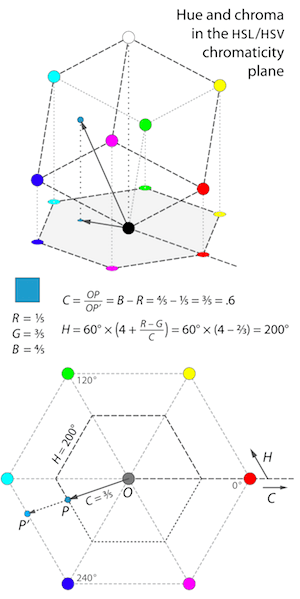

- I: HSI 里的 I，Y'：YUV 里的灰度值
  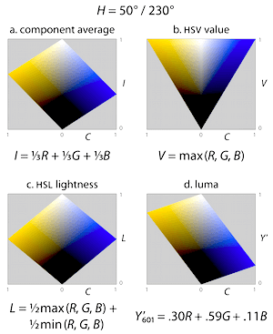

#### 2.3.4 RGB 与 HSL 的互相转换

**RGB 转 HSL**

- 公式：
  如果 R = G = B 时，颜色是非彩色的，H (色相) 无定义，H = S = 0
  max 是 R、G、B 中的最大值
  min  是 R、G、B 中的最小值

  $R \in [0,1], G \in [0,1], B \in [0,1]$
  $H \in [0, 360), S \in [0,1], L \in [0,1]$
  ​
  $$
  \begin{aligned}
  
  H &= 
  \begin{cases}
  0, &\text{if max = min}\\
  {G - B \over max - min} \times 60  , &\text{if max = R  and G $\geq$ B} \\
  {G - B \over max - min} \times 60  + 360, &\text{if max = R  and G $\lt$ B}\\
  {B - R \over max - min} \times 60  + 120, &\text{if max = G}\\
  {R - G \over max - min} \times 60  + 240, &\text{if max = B} \\
  \end{cases} \\\\
  L &= \frac 12(max + min) \\\\
  S & = 
  \begin{cases}
  0 , &\text{if max = min or L = 1}\\
  {max - min \over 1 - |2L - 1|}  , &\text{otherwise}
  \end{cases} 
  \end{aligned}
  $$

- 代码：

  ```c
  // GLSL
  vec3 RGBToHSL(vec3 color) {
      float minRGB = min(min(color.r, color.g), color.b);
      float maxRGB = max(max(color.r, color.g), color.b);
      float sum = maxRGB + minRGB;
      float chroma = maxRGB - minRGB;
      float luminance = 0.5 * sum;
  
      vec3 hsl = vec3(0.0, 0.0, luminance);
   
      if (chroma == 0.0) return hsl; // R = G = B, 颜色是非彩色的 S = 0，这是色相无定义 H = 0
  
      // Saturation
      hsl.y = luminance == 1.0 ? 0.0 : chroma / (1.0 - abs(2.0 * luminance - 1.0));
      
      // Hue 原来范围是 [0, 360), 这里默认输入的范围是 [0, 1]
      /** 尽管这样并不一定能真的提高效率，但是这个规避 if else 的思想值得思考 
          vec3 comp;
          comp.rg = vec2(equal(rgb.rg, vec2(maxRGB)));
          float invertR = 1.0 - comp.r;       // 0 or 1
          comp.g *= invertR;                  // g = invertR * g
          comp.b  = invertR * (1.0 - comp.g); // b = invertR * invertG
          hsl.x = dot(comp, vec3((color.g - color.b) / chroma, (color.b - color.r) / chroma + 2.0, (color.r - color.g) / chroma + 4.0));
          hsl.x /= 6.0;
      */
      if (color.r == maxRGB) {
          hsl.x =  (color.g - color.b) / chroma / 6.0;         
      } else if (color.g == maxRGB) {
          hsl.x = ((color.b - color.r) / chroma + 2.0) / 6.0; 
      } else {
          hsl.x = ((color.r - color.g) / chroma + 4.0) / 6.0; 
      }
  	
      // Optimize
      // hsl.x += 1.0 - step(0.0, hsl.x);
      if (hsl.x < 0.0) hsl.x += 1.0; 
      
      return hsl;
  }
  ```

**HSL 转 RGB**
- 公式：
  如果 S (饱和度)  = 0，则颜色是非彩色的。H (色相)无意义， R = G = B = L (亮度)
  如果 S (饱和度) != 0，有如下公式

  $R \in [0,1], G \in [0,1], B \in [0,1]$
  $H \in [0, 360), S \in [0,1], L \in [0,1]$
  > H' 取整数时，两边计算结果相同

  $$
  \begin{aligned}
  H' &= {H \over 60}\\
  C &= (1 - |2L - 1|) \times S \\
  X &=  (1 - |H' \pmod 2 - 1|)\times C \\
  m &= L - \frac 12 C \\\\
  (R, G, B) &= 
  \begin{cases}
  (C + m, X + m,  m), &\text{if $0 \leq H' \leq 1$}\\
  (X + m, C + m,  m), &\text{if $1 \leq H' \leq 2$} \\
  (m, C + m,  X + m), &\text{if $2 \leq H' \leq 3$} \\
  (m, X + m,  C + m), &\text{if $3 \leq H' \leq 4$} \\
  (X + m, m,  C + m), &\text{if $4 \leq H' \leq 5$} \\
  (C + m, m,  X + m), &\text{if $5 \leq H' \lt 6$} \\
  \end{cases}\\
  \end{aligned}
  $$

- 代码：
```c
vec3 HSLToRGB(vec3 color) {
    if (color.y == 0.0) return vec3(color.z); // Luminance
    
    float hue = color.x;
    hue *= 6.0; 					  // Hue 默认范围是 [0, 1]
    float chroma = (1.0 - abs(2.0 * color.z - 1.0)) * color.y;
    float m = color.z - 0.5 * chroma; // Lightness
    float x = (1.0 - abs(mod(hue, 2.0) - 1.0)) * chroma;
    
    if (hue < 1.0){
        return vec3(chroma + m, x + m, m);
    } else if (hue < 2.0){
        return vec3(x + m, chroma + m, m);
    } else if (hue < 3.0){
    	return vec3(m, chroma + m, x + m);
    } else if (hue < 4.0){
        return vec3(m, x + m, chroma + m);        
    } else if (hue < 5.0){
        return vec3(x + m, m, chroma + m);
    } else {
        return vec3(chroma + m, m, x + m);
    }
}
```

#### 2.3.5 RGB 与 HSV 的互相转换

**RGB 转 HSV**

- 公式：
  如果 R = G = B 时，颜色是非彩色的，H (色相) 无定义，H = S = 0
  max 是 R、G、B 中的最大值
  min  是 R、G、B 中的最小值

  $R \in [0,1], G \in [0,1], B \in [0,1]$
  $H \in [0, 360), S \in [0,1], V \in [0,1]$

$$
\begin{aligned}

H &= 
\begin{cases}
0, &\text{if max = min}\\
{G - B \over max - min} \times 60  , &\text{if max = R  and G $\geq$ B} \\
{G - B \over max - min} \times 60  + 360, &\text{if max = R  and G $\lt$ B}\\
{B - R \over max - min} \times 60  + 120, &\text{if max = G}\\
{R - G \over max - min} \times 60  + 240, &\text{if max = B} \\
\end{cases} \\\\
S & = 
\begin{cases}
0 , &\text{if max = 0}\\
{max - min \over max}, &\text{if max $\neq 0$}
\end{cases} \\\\
V &= max
\end{aligned}
$$

- 代码：

 ```c
// GLSL
vec3 RGBToHSV(vec3 color) {
	float minRGB = min(min(color.r, color.g), color.b);
    float maxRGB = max(max(color.r, color.g), color.b);
    float sum = maxRGB + minRGB;
    float chroma = maxRGB - minRGB;
    
    // V = maxRGB;
    vec3 hsv = vec3(0.0, 0.0, maxRGB);
    if (chroma == 0.0) return hsv;
    
    // Saturation
    hsv.y = maxRGB == 0.0 ? 0.0 : chroma / maxRGB;
    
    // Hue 原来范围是 [0, 360), 这里默认输入的范围是 [0, 1]
    if (color.r == maxRGB) {
        hsv.x =  (color.g - color.b) / chroma / 6.0;         
    } else if (color.g == maxRGB) {
        hsv.x = ((color.b - color.r) / chroma + 2.0) / 6.0; 
    } else {
        hsv.x = ((color.r - color.g) / chroma + 4.0) / 6.0; 
    }
   
    // Optimize
    // hsv.x += 1.0 - step(0.0, hsv.x);
    if (hsv.x < 0.0) hsv.x += 1.0; 
    
    return hsv;
}
 ```

**HSV 转 RGB**

- 公式：
  如果 S (饱和度)  = 0，则颜色是非彩色的。H (色相)无意义， R = G = B = L (亮度)如果 S (饱和度) != 0，有如下公式

  $R \in [0,1], G \in [0,1], B \in [0,1]$
  $H \in [0, 360), S \in [0,1], V \in [0,1]$
  
  $$
  \begin{aligned}
  H' &= {H \over 60}\\
  C &= V \times S \\
  X &=  (1 - |H' \pmod 2 - 1|)\times C \\
  m &= V - C \\\\
  (R, G, B) &= 
  \begin{cases}
  (C + m, X + m,  m), &\text{if $0 \leq H' \leq 1$}\\
  (X + m, C + m,  m), &\text{if $1 \leq H' \leq 2$} \\
  (m, C + m,  X + m), &\text{if $2 \leq H' \leq 3$} \\
  (m, X + m,  C + m), &\text{if $3 \leq H' \leq 4$} \\
  (X + m, m,  C + m), &\text{if $4 \leq H' \leq 5$} \\
  (C + m, m,  X + m), &\text{if $5 \leq H' \lt 6$} \\
  \end{cases}\\
  \end{aligned}
  $$
  > **⌊ ⌋ Floor    向下取整：** 比自己小的最大整数，舍弃小数位
  > **⌈ ⌉ Ceiling 向上取整：** 比自己大的最小整数，有小数位就进 1
  > $\equiv$ ：
  >
  > 1. 恒等号 一般用于一些参变量恒为一个常数或恒定表达式时，总等于关系与变量无关。例 $f(x) \equiv k，f(x)$ 的值始终为 k 而与 x 无关
  > 2. 同余符号，例 $a \equiv b \pmod c$ ，a 和 b 分别除以 c 得到的余数相同

- 代码：
 ```c
// GLSL
vec3 HSVToRGB(vec3 color) { 
    if (color.y == 0.0) return vec3(color.z); // Luminance
    
    float hue = color.x;
    hue *= 6.0; 			     // Hue 默认范围是 [0, 1]
    float chroma = color.z * color.y;
    float m = color.z - chroma;  // Lightness
    float x = (1.0 - abs(mod(hue, 2.0) - 1.0)) * chroma;
    
    if (hue < 1.0){
        return vec3(chroma + m, x + m, m);
    } else if (hue < 2.0){
        return vec3(x + m, chroma + m, m);
    } else if (hue < 3.0){
    	return vec3(m, chroma + m, x + m);
    } else if (hue < 4.0){
        return vec3(m, x + m, chroma + m);        
    } else if (hue < 5.0){
        return vec3(x + m, m, chroma + m);
    } else {
        return vec3(chroma + m, m, x + m);
    }
}
 ```

#### 2.3.6 RGB 与 HSI 的互相转换

**RGB 转 HSI**

- 公式：
  如果 R = G = B 时，颜色是非彩色的，H (色相) 无定义，H = S = 0
  max 是 R、G、B 中的最大值
  min  是 R、G、B 中的最小值

  $R \in [0,1], G \in [0,1], B \in [0,1]$
  $H \in [0, 360), S \in [0,1], I \in [0,1]$
  
  $$
  \begin{aligned}
  H &= 
  \begin{cases}
  0, &\text{if max = min}\\
  {G - B \over max - min} \times 60  , &\text{if max = R  and G $\geq$ B} \\
  {G - B \over max - min} \times 60  + 360, &\text{if max = R  and G $\lt$ B}\\
  {B - R \over max - min} \times 60  + 120, &\text{if max = G}\\
  {R - G \over max - min} \times 60  + 240, &\text{if max = B} \\
  \end{cases} \\\\
  I &= \frac 1 3 (R+G+B)\\\\
  S & = 
  \begin{cases}
  0 , &\text{if $I$ = 0}\\
  1 - {min \over I}, &\text{if $I \neq 0$}
  \end{cases} \\
  \end{aligned}
  $$

- 代码：
```c
// GLSL
vec3 RGBToHSI(vec3 color) {
	float minRGB = min(min(color.r, color.g), color.b);
    float maxRGB = max(max(color.r, color.g), color.b);
    float sum = maxRGB + minRGB;
    float chroma = maxRGB - minRGB;
    
    // Intensity;
    float intensity = dot(vec3(0.3333), color);
    vec3 hsi = vec3(0.0, 0.0, intensity);
    if (chroma == 0.0) return hsi;
    
    // Saturation
    hsi.y = intensity == 0.0 ? 0.0 : 1.0 - minRGB / intensity;
    
    // Hue 原来范围是 [0, 360), 这里默认输入的范围是 [0, 1]
    if (color.r == maxRGB) {
        hsi.x =  (color.g - color.b) / chroma / 6.0;         
    } else if (color.g == maxRGB) {
        hsi.x = ((color.b - color.r) / chroma + 2.0) / 6.0; 
    } else {
        hsi.x = ((color.r - color.g) / chroma + 4.0) / 6.0; 
    }
   
    // Optimize
    // hsi.x += 1.0 - step(0.0, hsi.x);
    if (hsi.x < 0.0) hsi.x += 1.0; 
    
    return hsi;
}
```

**HSI 转 RGB**

- 公式：
  如果 S (饱和度)  = 0，则颜色是非彩色的。H (色相)无意义， R = G = B = L (亮度)
  如果 S (饱和度) != 0，有如下公式

  $R \in [0,1], G \in [0,1], B \in [0,1]$
  $H \in [0, 360), S \in [0,1], I \in [0,1]$
  ​
  $$
  \begin{aligned}
  H' &= {H \over 60}\\
  Z &= 1 - |H' \pmod 2 - 1| \\
  C &=  {3 \cdot S \cdot I \over 1 + Z} \\
  X &= C \cdot Z\\
  m &= (1 - S) \cdot I \\\\
  (R, G, B) &= 
  \begin{cases}
  (C + m, X + m,  m), &\text{if $0 \leq H' \leq 1$}\\
  (X + m, C + m,  m), &\text{if $1 \leq H' \leq 2$} \\
  (m, C + m,  X + m), &\text{if $2 \leq H' \leq 3$} \\
  (m, X + m,  C + m), &\text{if $3 \leq H' \leq 4$} \\
  (X + m, m,  C + m), &\text{if $4 \leq H' \leq 5$} \\
  (C + m, m,  X + m), &\text{if $5 \leq H' \lt 6$} \\
  \end{cases}\\
  \end{aligned}
  $$

- 代码：
```c
// GLSL
vec3 HSIToRGB(vec3 color) { 
    if (color.y == 0.0) return vec3(color.z); // Luminance
    
    float hue = color.x;
    hue *= 6.0;						   // Hue 默认范围是 [0, 1]
    float tmp = 1.0 - abs(mod(hue, 2.0) - 1.0);
    float chroma = 3.0 * color.y * color.z / (1.0 + tmp);
    float x = chroma * tmp;
    float m = (1 - chroma) * color.z;  // Lightness

    if (hue < 1.0){
        return vec3(chroma + m, x + m, m);
    } else if (hue < 2.0){
        return vec3(x + m, chroma + m, m);
    } else if (hue < 3.0){
    	return vec3(m, chroma + m, x + m);
    } else if (hue < 4.0){
        return vec3(m, x + m, chroma + m);        
    } else if (hue < 5.0){
        return vec3(x + m, m, chroma + m);
    } else {
        return vec3(chroma + m, m, x + m);
    }
}
```
## 3. 色彩编码 YUV 和 YCbCr 

> YUV 和 YCbCr 更多的是一种色彩模型，并不是一个绝对不变的色彩空间，它的取值范围，取决于来自于 RGB 输入的取值范围

特点：适合电视系统，数码摄影的色彩**压缩和传输**

### 3.1 区分 YUV、YCbCr、Y'CbCr 

**YUV、YCbCr、Y'CbCr 相似之处**

- Y 表示亮度，Y' 表示经过伽马矫正后的亮度
- U 和 Cb 代表蓝色与亮度差
- V 和 Cr 代表红色与亮度差


**YUV、YCbCr 不同之处**

- YUV：处理**模拟信号**的数据格式
  Y 的范围是 [0, 1]，UV 的范围是 [-0.5, 0.5]
- YCbCr (又称 YPbPr)：处理**数字信号**的数据格式，**YUV 色彩空间被缩放和偏移后是 YCbCr**
  当使用 8 位存储单个分量时，Y 的范围是 [16, 235]，UV 的范围是 [16, 240]


### 3.2 YUV 的采样方式和存储格式

> 数字信号通常被压缩以减少文件大小并节省传输时间。由于人类视觉系统对亮度的变化比颜色更敏感，因此，视频系统可以通过向亮度分量 Y，赋予更多的带宽来优化，而不是在色差分量UV中 [more](https://en.wikipedia.org/wiki/Chroma_subsampling)

**采样方式**
采样通常为YUV J:A:B 三部分的比率，采样都从图片的左上角第一行逐行开始

- J：单行水平方向的采样像素总个数，通常为 4
- A：在两行采样像素矩形中，每行采样像素中色彩样本的个数
- B：在两行采样像素矩形中，每列竖直方向色彩样本不同个数之和
  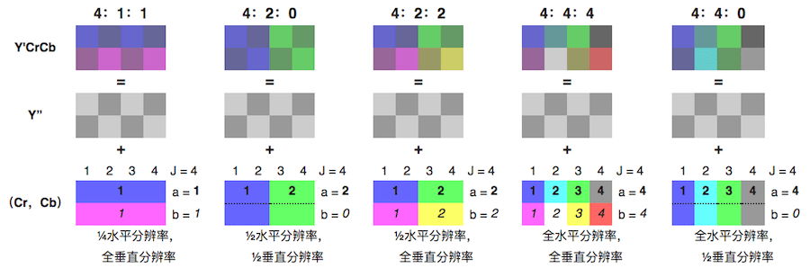

**存储格式**

- 打包格式（packed）：YUV 存储在一个数组中（YUV 数据相邻）
- 平面格式（planar）：Y、U、V 或 Y 、UV 分别作为不同的平面存储（YUV 数据互相独立）

**采样方式 + 存储方式，实例**
以下存储，一个像素点对应一个 Y，四个像素点根据采样比例不同对应不同个数的 UV

- 采样方式 4:4:4 每像素 32 位（打包格式）
  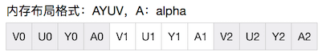

- 采样方式 4:2:2 每像素 16 位（打包格式）
  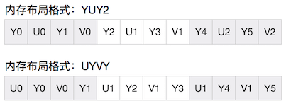

- 采样方式 4:2:0 每像素 16 位（平面格式）
  IMC2：在同一行数组中，先有 V 数据，再有 U 数据
  YV12：在同一行数组中，只有 V 数据，当所有的 V 数据读取完后，才会只有紧跟的 U 数据
  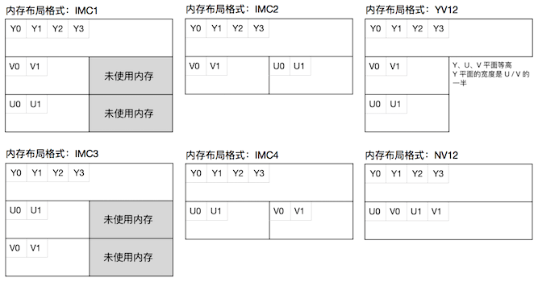


假设一个分辨率为 6X4 的 YUV420 格式图像，采样方式和存储方式如下图

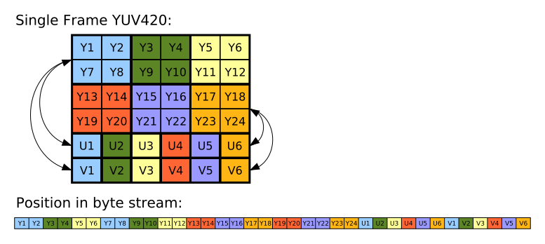

假设一个分辨率为 8X4 的 YUV420 格式图像

- YUV422p：Y(行X列) + U(行X列 / 2) + V(行X列 / 2)
- I420（打包格式：YV12）：Y(行X列) + V(行X列 / 4) + U(行X列 / 4)
- YUV420p：Y(行X列) + U(行X列 / 4) + V(行X列 / 4)
  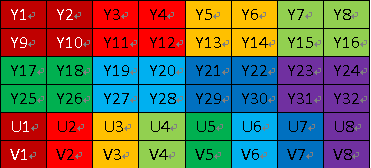
- YUV420sp（打包格式：NV12）：Y(行X列) + UV(行X列 / 2) 
  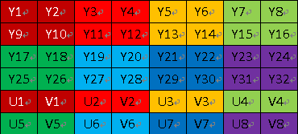


### 3.3 RGB 与 YUV 的互相转换

模拟信号格式的 YUV 转换基本公式，其中 $K_R+K_G+K_B = 1 $
$$
\begin{align}
Y &= K_R \cdot R + K_G \cdot G + K_B \cdot B \\
C_B &= {1 \over 2} \cdot {B - Y \over 1 - K_B}\\
C_R &= {1 \over 2} \cdot {R - Y \over 1 - K_R}
\end{align}
$$
$RGB \in [0,1]、Y \in [0,1]、U \in [-0.436,0.436]、V \in [-0.615,0.615]$，[more](https://en.wikipedia.org/wiki/YUV)

- 以下转换为 RGB 到 *SDTV / BT.601* 的转换
    ```c
    vec3 RGBToYUVBT601(vec3 rgb) {
        // mat3(列向量1，列向量2，列向量3)
        return rgb * mat3(
            0.299,    0.587,    0.114,
           -0.14713, -0.2886,   0.436,
            0.615,   -0.51499, -0.10001
                   );
    }
    
    vec3 YUVBT601ToRGB(vec3 yuv) {
        return yuv * mat3(
            1.0,      1.0,     1.0,
            0.0,     -0.39465, 2.03211,
            1.13983, -0.5806,  0.0
        );
    }
    ```

- 以下转换为 RGB 到 *HDTV / BT.709* 的转换
    ```c
    vec3 RGBToYUVBT709(vec3 rgb) {
        // mat3(列向量1，列向量2，列向量3)
        return rgb * mat3(
            0.2126,   0.7152,   0.0722,
           -0.09991, -0.33609,  0.436,
            0.615,   -0.55861, -0.05639
        );
    }
    
    vec3 YUVBT709ToRGB(vec3 yuv) {
        return yuv * mat3(
            1.0,  0.0,      1.28033,
            1.0, -0.21482, -0.38059,
            1.0,  2.12798,  0.0 
        );
    }
    ```

### 3.4 更多色彩模型的转换

- [YY Color Convertor](https://github.com/ibireme/yy_color_convertor)


# Reference

1. [Lumiance 计算性能优化](http://www.songho.ca/dsp/luminance/luminance.html)
2. [Luminance 和 Luma 的区别](https://cs.stackexchange.com/questions/92569/what-is-the-difference-between-luma-and-luminance)
3. [Fast branchless RGB to HSV conversion in GLSL](http://lolengine.net/blog/2013/07/27/rgb-to-hsv-in-glsl)
4. [YUV 维基百科](https://en.wikipedia.org/wiki/YUV)
5. [YUV 的采样方式](https://en.wikipedia.org/wiki/Chroma_subsampling)
6. [YUV 的打包方式](https://msdn.microsoft.com/en-us/library/aa904813%28VS.80%29.aspx)
7. [YUV 420 数据格式详解](http://www.cnblogs.com/azraelly/archive/2013/01/01/2841269.html)
8. [IJKPlayer](https://github.com/bilibili/ijkplayer)

