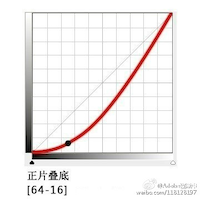

<h1>
PS 中的图像处理技术
</h1>

# 一、混合透明模式

**声明**

以下公式描述中：

- 0代表纯黑色 0x000
  1代表纯白色 0xFFF
- a 表示当前图层 (activity layer)，取值范围 0 ~ 1
  b 表示背景图层 (background layer)，取值范围 0 ~ 1
- a，b 图层如果为同一张图像，那么结果就是对同一图像的明暗做出了修改

## 1. 普通 Normal

### 1.1 正常 Normal

公式：$f(a,b) = a$

### 1.2 溶解 Dissolve

上层中随机抽取一些像素作为透明，使其可以看到下层，随着上层透明度越低，可看到的下层区域越多（不是真正的溶解）

公式：$f(a,b) = random(a,b)$

## 2. 加深 Darken

### 2.1 变暗 Darken

比较上下层像素后取相对较暗的像素作为输出（与变暗 Lighten 效果相反）
RGB 每个色彩通道分别比较取最小

公式：$f(a,b) = min(a,b)$

### 2.2 深色 Darker Color

比较上下层像素后取相对较暗的像素作为输出（与浅色 Lighter Color 效果相反）
比较 RGB 三个色彩通道数值之和取最小

公式：$f(a,b) = min(a_r + a_g + a_b, \space b_r + b_g + b_b)$

### 2.3 正片叠底 Multiply

该效果将两层像素的标准色彩值相乘后输出
其效果可以形容成：两个幻灯片叠加在一起然后放映，透射光需要分别通过这两个幻灯片，从而被削弱了两次

公式：$f(a,b) = ab$

### 2.3 颜色加深 Color Burn

如果上层越暗，则下层获取的光越少（与颜色加深 Color Dodge 相反）

- 上层为全黑色，则下层越黑

- 上层为全白色，则根本不会影响下层：结果最亮的地方不会高于下层的像素值

公式：$f(a,b) = 1-{1-b \over a}$

### 2.4 线性加深 Linear Burn

如果上下层的像素值之和小于 1，输出结果将会是纯黑色（与线性减淡 Linear Dodge 相反）
如果将上层反相，结果将是纯粹的数学减

公式：$f(a,b) = a+b-1$

## 3. 减淡 Lighten

### 3.1 变亮 Lighten

比较上下层像素后取相对较亮的像素作为输出（与变暗 Darken 相反）
RGB 每个色彩通道分别比较取最大

公式：$f(a,b) = max(a,b)$

### 3.5 浅色 Lighter Color

比较上下层像素后取相对较暗的像素作为输出（与深色 Darker Color 效果相反）
比较 RGB 三个色彩通道数值之和取最大

公式：$f(a,b) = max(a_r + a_g + a_b, \space b_r + b_g + b_b)$

### 3.2 滤色 Screen

上下层像素的标准色彩值反相后相乘后输出，输出结果比两者的像素值都将要亮
就好像两台投影机分别对其中一个图层进行投影后，然后投射到同一个屏幕上

如果两个图层反相后，采用 Multiply 模式混合，则将和对这两个图层采用 Screen 模式混合后反相的结果完全一样

公式：$f(a,b)=1-(1-a)(1-b)\\ 1-f(a,b)=(1-a)(1-b)$

### 3.3 颜色减淡 Color Dodge

该模式下，上层的亮度决定了下层的暴露程度（与颜色加深 Color Burn 相反）
如果上层越亮，下层获取的光越多，也就是越亮

公式：$f(a,b) = {b \over 1-a}$

### 3.4 线性减淡 Linear Dodge

将上下层的色彩值相加，结果将更亮（与线性加深 Linear Burn 相反）

公式：$f(a,b) = a+b$

## 4. 对比 Contrast

### 4.1 叠加 Overlay

依据下层色彩值的不同，该模式可能是 Multiply，也可能是 Screen 模式
上层决定了下层中间色调偏移的强度

公式：$f(a,b)=\begin{cases}2ab, & if \space a < 0.5\\ 1-2(1-a)(1-b), & otherwise \end{cases}$

### 4.2 柔光 Soft Light

叠加模式下，过上层的颜色高于 50% 灰，则下层越亮，反之越暗
以 Gamma 值范围为 2.0 到 0.5 的方式来调制下层的色彩值，结果将是一个非常柔和的组合

公式：$f(a,b) =\begin{cases}2ab+a^2(1-2b), & if \space a < 0.5\\ 2a(1-b)+ \sqrt{a}(2b-1), & otherwise \end{cases}$

### 4.3 强光 Hard Light

叠加模式下，过上层的颜色高于 50% 灰，则下层越亮，反之越暗

公式：$f(a,b) =\begin{cases}2ab, & if \space a < 0.5\\ 1-2(1-a)(1-b), & otherwise \end{cases}$

### 4.4 亮光 Vivid Light

**非常强烈**的增加了对比度，特别是在高亮和阴暗处
阴暗处应用颜色加深 Color Burn
高亮处应用颜色减淡 Color Dodge

公式：$f(a,b) =\begin{cases}1-{1-b \over 2a}, & if \space a \leq 0.5\\ {b \over 2(1-a)}, & otherwise \end{cases}$

### 4.5 线性光 Linear Light

增加了对比度，特别是在高亮和阴暗处（**比亮光 Vivid Light 对比度增加的少**）
类似于线性加深 Linear Burn，只不过是加深了上层的影响力

公式：$f(a,b) = b+2a-1$

### 4.6 点光 Pin Light

中间调几乎是不变的下层，但是两边是变暗 Darken 和变亮 Light 模式的组合

公式：$f(a,b) = \begin{cases}2a-1, & if \space 2a-1>b\\ b, & if \space 2a-1<b<2a\\ 2a, & if \space b>2a\end{cases}$

### 4.7 实色混合 Hard mix

**最终结果仅包含 6 种基本颜色**，每个通道要么就是 0，要么就是 1

公式：$f(a,b) =\begin{cases}0, & if \space a<1-b\\ 1, & if \space a>1-b \end{cases}$

## 5. 差集 Inversion/Cancelation

### 5.1 差值 Difference

用于比较两个不同版本的图片：如果两者完全一样，则结果为全黑

公式：$f(a,b) = abs(b-a)$

### 5.2 排除 Exclusion

亮的图片区域将导致另一层的反相，很暗的区域则将导致另一层完全没有改变

公式：$f(a,b) = a+b-2ab$

### 5.3 减去 Subtract

公式：$f(a,b) = b-a$

### 5.4 划分 Divide

公式：$f(a,b) = b/a$

## 6. 色彩模型 Component

### 6.1 色相 Hue

在 HSB 色彩模型中，使用当前图层的色相，使用背景图层的饱和度和明度

公式：$H_cS_cB_c = \color{red}{H_a}S_bB_b$

### 6.2 颜色 Color

在 HSB 色彩模型中，使用当前图层的色相和饱和度，使用背景图层的明度

公式：$H_cS_cB_c = \color{red}{H_aS_a}B_b$

### 6.3 饱和度 Saturation

在 HSB 色彩模型中，使用当前图层的饱和度，使用背景图层的色相和明度

公式：$H_cS_cB_c = H_b\color{red}{S_a}B_b$

### 6.4 明度 Luminosity

在 HSB 色彩模型中，使用当前图层的明度，使用背景图层的色相和饱和度（与颜色相反）

公式：$H_cS_cB_c = H_bS_b\color{red}{B_a}$

# Reference

- [Photoshop Blend Modes Explained](https://photoblogstop.com/photoshop/photoshop-blend-modes-explained)
- [Wiki: Blend modes](https://en.wikipedia.org/wiki/Blend_modes)
- [Adobe blending-modes](https://helpx.adobe.com/cn/photoshop/using/blending-modes.html)
- [stackoverflow: how-does-photoshop-blend-two-images-together](https://link.jianshu.com/?t=http://stackoverflow.com/questions/5919663/how-does-photoshop-blend-two-images-together)
