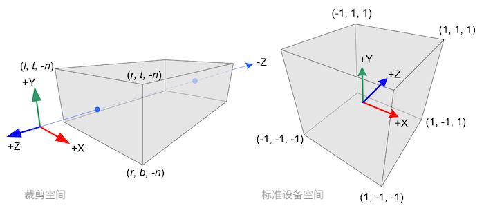

[TOC]

# 一、矩阵变换

## 1. 基础知识

### 1.1 GPU 中矩阵间的计算方式

> 注意：
>
> 1. 在矩阵乘法中，顺序很重要，变换的几何意义由 右 -> 左 变换
> 2. 建议在组合矩阵时，先缩放，后旋转，最后位移
>    否则它们会（消极地）互相影响，比如：比如向某方向移动2米，2米也许会被缩放成1米

- 阵列操作：图像的矩阵中每个对应元素之间的操作（矩阵间的 加、减，矩阵和数字的加、减、乘）
  例，**矩阵**和数字相减
  $$
  \begin{bmatrix}
  \color{red}{a_{11}} & \color{red}{a_{21}} \\
  a_{12} & a_{22} \\
  \end{bmatrix}
  - 2
  =
  \begin{bmatrix}
  \color{red}{a_{11}} - 2 & \color{red}{a_{21}} - 2 \\
  a_{12} - 2 & a_{22} - 2 \\
  \end{bmatrix}
  $$

- 符合线性代数的条件下使用线性代数公式
  例，**矩阵**相乘：行 X 列
  $$
  \begin{bmatrix}
  \color{red}{a_{11}} & \color{red}{a_{21}} \\
  a_{12} & a_{22} \\
  \end{bmatrix}
  \begin{bmatrix}
  \color{green}{b_{11}} & b_{21} \\
  \color{green}{b_{12}} & b_{22} \\
  \end{bmatrix}
  =
  \begin{bmatrix}
  \color{red}{a_{11}}\color{green}{b_{11}}+\color{red}{a_{21}}\color{green}{b_{12}} &
  \color{red}{a_{11}}b_{21}+\color{red}{a_{21}}b_{22} \\
  a_{12}\color{green}{b_{11}}+a_{22}\color{green}{b_{12}} & a_{12}b_{21}+a_{22}b_{22} \\
  \end{bmatrix}
  $$
  如果使用 **glsl** 的内置函数 `matrixcompmult`，矩阵之间也可以实现**阵列相乘**
  $$
  \begin{align}
  M_1 &= \begin{bmatrix}
  \color{red}{a_{11}} & \color{red}{a_{21}} \\
  a_{12} & a_{22} \\
  \end{bmatrix} \\
  M_2 &= \begin{bmatrix}
  \color{green}{b_{11}} & b_{21} \\
  \color{green}{b_{12}} & b_{22} \\
  \end{bmatrix}\\
  matrixcompmult(M_1, M_2) &=
  \begin{bmatrix}
  \color{red}{a_{11}}\color{green}{b_{11}} & \color{red}{a_{21}}b_{21} \\
  a_{12}\color{green}{b_{12}} & a_{22}b_{22} \\
  \end{bmatrix}
  \end{align}
  $$

### 1.2 矩阵变换组合

OpenGL，Unity，Unreal 默认为**列向量优先存储：矩阵由列向量构成**
$$
\begin{align}
v_{世界} &= M_{模型 \to世界} \cdot v_{模型} \\
v_{视点} &= V_{世界 \to 视点} \cdot v_{世界}\\
v_{屏幕} &= P_{视点 \to 透视} \cdot v_{视点}\\
&= P_{视点 \to 透视} \cdot V_{世界 \to 视点} \cdot M_{模型 \to 世界} \cdot v_{模型}
\end{align}
$$

### 1.3 齐次空间

齐次坐标：将一个原本是 n 维的向量用一个 n+1 维向量来表示

齐次坐标的齐次性：**多个齐次坐标表示的是一个点**，例：下表中的齐次坐标都表示 (1/3, 2/3) 这一个点

| 齐次坐标     | 非 齐次坐标                   |
| ------------ | ----------------------------- |
| (x, y, w)    | (x/w,  y/w)                   |
| (1, 2, 3)    | (1/3,  2/3)                   |
| (2, 4, 6)    | (2/6,  4/6) = (1/3,  2/3)     |
| (1a, 2a, 3a) | (1a/3a,  2a/3a) = (1/3,  2/3) |

几何意义：

- 为了避免用 $\infty$ 这样无法量化的符号来表示无限远
- 在非齐次坐标空间，两条平行线不会相交
  在齐次坐标空间，两条平行线在无限远处相交于一点
- n 维向量在参与 与 n+1 维向量的运算时，通过引入齐次坐标，使 n 维向量变为 n+1 维向量与 n+1 维向量运算，由于齐次坐标的齐次性，所以这样的升维计算并不影响最终结果
  例：由于矩阵的加法总比乘法需要的矩阵高一维，所以需要**引入齐次坐标来合并矩阵的乘法和加法**

**齐次坐标表示两条平行线相交**：

- 在笛卡尔坐标系中，对于以下方程
  如果 C $\neq$ D，方程无解
  如果 C $=$ D，方程表示的两条线是同一条线
  $$
  \begin{cases}
  Ax+By+C=0\\
  Ax+By+D=0
  \end{cases}
  $$

- 在投影空间中，对于以下方程
  如果 C $\neq$ D，由 (C - D)w = 0 得 w = 0，**即当 w = 0 时并非无意义，而是表示一个无穷远**，所以两条平行线相交于点 (x, y, 0)，这个点在无穷远处
  如果 C $=$ D，方程表示的两条线是同一条线
  $$
  \begin{cases}
  A{x\over w}+B{y\over w}+C=0\\
  A{x\over w}+B{y\over w}+D=0
  \end{cases}
  \rightarrow
  \begin{cases}
  Ax+By+Cw=0\\
  Ax+By+Dw=0
  \end{cases}
  $$

**齐次坐标区分点和向量**：

I. 设基坐标为 (x, y, z)，原点为 O，则**点比向量需要额外的信息**

- 向量 $\vec V(v_1, v_2, v_3) = v_1x + v_2y + v_3z$
- 点 $P(p_1, p_2, p_3) - O = p_1x + p_2y + p_3z \rightarrow P(p_1, p_2, p_3) = p_1x + p_2y + p_3z + O$

II. 在齐次坐标 (x, y, z, w) 中，w = 0 代表无穷远，即一个方向
- 非齐次坐标 转 齐次坐标
  点     (x, y, z) 转为 (x, y, z, 1)
  向量 (x, y, z) 转为 (x, y, z, 0)

- 齐次坐标 转 非齐次坐标
  (x, y, z, 1) 转为 点     (x, y, z)
  (x, y, z, 0) 转为 向量 (x, y, z)

III. 应用：深度缓冲

### 1.4 左右手坐标系

判断叉乘后的方向

- 在右手坐标系下，使用 **右手定则** 判断叉乘的方向
- 在左手坐标系下，使用 **左手定则** 判断叉乘的方向

### 1.5 惯性坐标系

定义：原点在模型坐标系原点上，坐标轴平行于世界坐标轴
作用：简化世界坐标系到模型坐标系的转换

与其他坐标系的转化：物体坐标系 ${旋转 \over \to}$ 惯性坐标系 ${平移 \over \to}$ 世界坐标系

## 2. 线形变换矩阵

### 2.1 2D 变换矩阵

### 2.2 Scale

缩放比例为 K 在不同的坐标轴上的缩放比例不同，**这里假设 缩放方向 N 必过原点，且 N 为单位向量**

推导：
$$
\begin{align}
v_{||} &= {n \cdot v \over ||n||} \cdot {n \over ||n||} = (v \cdot n)n\\
v'_{||} &= kv_{||}\\
v'_{\bot} &= v_{\bot} (与缩放方向垂直的方向不受缩放的影响) \\
v' &= v'_{||} + v'_{\bot}\\
&= k(v \cdot n)n + (v - (v \cdot n)n)\\
&= v+(k -1)(v \cdot n)n
\end{align}
$$

- 核心公式：将三个基向量 v 分别沿 n 向量方向缩放后的向量构成的列矩阵为沿向量 n 的缩放矩阵
  $$
  v_{缩放后} = v + (K_{比例} - 1)(v \cdot n_{缩放方向})n_{缩放方向}
  $$

- 由 **基坐标** 构成的 **列向量** 变化矩阵
    $$
    \begin{array}{cc}
    \begin{bmatrix}
    K_x & 0 &0 \\
    0 & K_y & 0\\
    0 & 0 & K_z
    \end{bmatrix}&
    \begin{bmatrix}
    1+(K-1)x^2 & (K-1)yx & (K-1)zx\\
    (K-1)xy & 1+(K-1)y^2& (K-1)zy\\
    (K-1)xz & (K-1)yz& 1+(K-1)z^2
    \end{bmatrix}\\
    沿坐标轴缩放 & 沿任意向量N_{(x,y,z)}缩放K
    \end{array}
    $$

### 2.3 Reflect

缩放比例为 -1 时，就是镜像，**这里假设 缩放方向 n 必过原点，且 N 为单位向量**

- 核心公式：将三个基向量 v 分别沿 n 向量方向缩放 -1 （缩放核心公式的比例 K = -1）后的向量构成的列矩阵为沿向量 n 的镜像矩阵
  $$
  v_{镜像后} = v - 2(v \cdot n_{镜像方向})n_{镜像方向}
  $$

- 由 **基坐标** 构成的 **列向量** 变化矩阵
  $$
  \begin{array}{cccc}
  \begin{bmatrix}
  -1 & 0 & 0\\
  0 & 1 & 0\\
  0 & 0 & 1
  \end{bmatrix} &
  \begin{bmatrix}
  1 & 0 & 0\\
  0 & -1 & 0\\
  0 & 0 & 1
  \end{bmatrix} &
  \begin{bmatrix}
  -1 & 0 & 0\\
  0 & -1 & 0\\
  0 & 0 & 1
  \end{bmatrix} &
  \begin{bmatrix}
  1-2x^2 & -2yx & -2zx\\
  -2xy & 1-2y^2 & -2zy\\
  -2xz & -2yz & 1-2z^2
  \end{bmatrix}
  \\沿 X 轴镜像 & 沿 Y 轴镜像 & 沿 y=-x 轴镜像 & 沿任意单位向量N_{(x,y,z)}镜像 
  \end{array}
  $$

### 2.4 Rotate

设 在**右手坐标系**，旋转角**逆时针**为正方向，**缩放方向 n 必过原点，且 N 为单位向量**

- 核心公式：将三个基向量 v 分别绕向量 n 旋转后（代入核心公式后）的向量构成的列矩阵为 绕向量 n 的旋转矩阵，[公式推导](#4.2.3 三维空间旋转的拆分)
  $$
  v_{旋转后} = v \cdot cos\theta  + (v \cdot n_{旋转轴})n_{旋转轴}(1 - cos\theta) + (v \times n_{旋转轴})sin\theta
  $$

- 由 **基坐标** 构成的 **列向量** 变化矩阵
    $$
    \begin{array}{cccc}
    \begin{bmatrix}
    1 & 0 & 0\\
    0 & cos\theta & sin\theta\\
    0 &-sin\theta & cos\theta
    \end{bmatrix} &
    \begin{bmatrix}
    cos\theta & 0 & -sin\theta\\
    0 & 1 & 0\\
    sin\theta & 0 & cos\theta
    \end{bmatrix} &
    \begin{bmatrix}
     cos\theta & sin\theta & 0\\
    -sin\theta & cos\theta & 0\\
    0 & 0 & 1
    \end{bmatrix} & = &
    \begin{bmatrix}
    (1-cos\theta)x^2 + cos\theta & (1-cos\theta)yx+sin\theta z & (1-cos\theta)zx - sin\theta y\\
    (1-cos\theta)xy - sin\theta z & (1-cos\theta)y^2 + cos\theta & -(1-cos\theta)zy + sin\theta x\\
    (1-cos\theta)xz + sin\theta y & (1-cos\theta)yz - sin\theta x & (1-cos\theta)z^2 + cos\theta
    \end{bmatrix}\\
    沿 X 轴旋转 & 沿 Y 轴旋转 & 沿 Z 轴旋转 & &沿任意向量N_{(x,y,z)}旋转 \theta
    \end{array}
    $$

### 2.5 Shear

变化后体积和面积保持不变

- 核心公式：x' = x + sy

- 方法：将三个基向量 v 分别取出 x，y，z 中的任意一个值，乘以变换因子，在把它加到 x，y，z 中的其他轴的值上，例：取 x 乘以变换因子 K
  $$
  v_{切变后} =
  \begin{bmatrix}
  x \\ y + x * K_y \\ z + x * K_z
  \end{bmatrix}
  $$

- 由 **基坐标** 构成的 **列向量** 变化矩阵
  $$
  \begin{array}{cccc}
  \begin{bmatrix}
  1 & K_y & K_z\\
  0 & 1 & 0\\
  0 & 0 & 1
  \end{bmatrix} &
  \begin{bmatrix}
  1 & 0 & 0\\
  K_x & 1 & K_z\\
  0 & 0 & 1
  \end{bmatrix} &
  \begin{bmatrix}
  1 & 0 & 0\\
  0 & 1 & 0\\
  K_x & K_y & 1
  \end{bmatrix}
  \\沿 X 轴切变 & 沿 Y 轴切变  & 沿 Z 轴切变 
  \end{array}
  $$

## 3. 几何变换

### 3.1 基础变换

**可逆变换**

- 可以**撤销**原来的变换
- 变换矩阵是**非奇异**
- 变换矩阵行**列式不为零**

**等角变换**

- 变换后向量的**夹角不变**
- 包括：平移、旋转、均匀缩放（镜像不是）

**正交变换**

- 变换矩阵 列/行 互相保持垂直，切为单位向量
- 包括：平移、旋转、镜像
- 变换矩阵行列式为 $\pm 1$
- **可根据 正交变换矩阵 = 逆矩阵 求逆矩阵**

**刚体变换**

- 只改变位置和方向
- 包括：平移、旋转（镜像不是）
- 例子：渲染中视野相机的变换

### 3.2 线性变换（可逆）

定义：

- 原点固定
- 直线变换后保持直线
- 网格保持 **平行** 且 **等距分布**

实质：线形变换不会导致平移（原点位置不变）
$$
F(ka + b) = kF(a) + F(b)
$$

### 3.3 仿射变换（可逆）

仿射变换：*用于改变模型的位置和形状*

定义：
- 直线变换后保持直线
- 网格保持 **平行** 且 **等距分布**

实质：
- 仿射变换 = 线性变换 + 平移
- 一个向量空间 变换为 另一个向量空间
- 增加一个维度后可以同过 **高维度的线性变换** 代替 **低维度的仿射变换**

变换矩阵：例子，平移变换
$$
\begin{bmatrix}x & y & z & \color{red}1\end{bmatrix}
\cdot
\begin{bmatrix}
1 & 0 & 0 & 0\\
0 & 1 & 0 & 0\\
0 & 0 & 1 & 0\\
\color{red}{\Delta x} & \color{red}{\Delta y} & \color{red}{\Delta z} & \color{red}{1}\\
\end{bmatrix}
= \begin{bmatrix}x + \color{red}{\Delta x} & y + \color{red}{\Delta y} & z + \color{red}{\Delta z} & \color{red}1\end{bmatrix}
$$

同过 **高维度的线性变换** 代替 **低维度的仿射变换**
 

### 3.4 投影变换（不可逆）

#### 3.4.1 投影

投影是降维操作，数学上的投影为了便于计算将投影后的物体和被投影的物体放在一侧

$$
\begin{align}
P  &= (x,y,z) \\
P' &= ({x \over z}, {y \over z}, z)
\end{align}
$$

#### 3.4.2 正交投影

OpenGL、Unity 中的正交投影（相机坐标系为右手坐标系）

几何意义：
- 图像远近大小相同
- 点到投影后对应点的连线(投影线)与其他**投影线互相平行**
- 在线形缩放的基础上，沿投影方向的缩放比例为 0，其他缩放比例不变

简单的正交投影矩阵：
$$
\begin{array}{cccc}
\begin{bmatrix}
1 & 0 & 0\\
0 & 1 & 0\\
0 & 0 & 0
\end{bmatrix} &
\begin{bmatrix}
1 & 0 & 0\\
0 & 0 & 0\\
0 & 0 & 1
\end{bmatrix} &
\begin{bmatrix}
0 & 0 & 0\\
0 & 1 & 0\\
0 & 0 & 1
\end{bmatrix} &
\begin{bmatrix}
1- x^2 & -yx & -zx\\
-xy & 1- y^2 & -zy\\
-xz & -yz & 1- z^2
\end{bmatrix} 
\\沿 Z 轴投影到 XY平面 & 沿 Y 轴投影到 XZ平面  & 沿 X 轴投影到 YZ平面 & 沿 N(x,y,z) 投影到垂直于 N 的平面上
\end{array}
$$

**OpenGL 中的正交投影矩阵** [推导过程](http://www.songho.ca/opengl/gl_projectionmatrix.html)

$$
M_{正交} = 
\begin{bmatrix}
2 \over {right - left} & 0 & 0 & -{{right + left}\over{right - left}}\\
0 & 2 \over {top - bottom} & 0 & -{{top + bottom}\over{top - bottom}}\\
0 & 0 & -2 \over {far - near} & -{{far + near}\over{far - near}}\\
0 & 0 & 0 & 1
\end{bmatrix}
{
投影体对称
\over
\Longrightarrow
}
\begin{bmatrix}
1 \over right & 0 & 0 & 0\\
0 & 1 \over top & 0 & 0\\
0 & 0 & -2 \over {far - near} & -{{far + near}\over{far - near}}\\
0 & 0 & 0 & 1
\end{bmatrix}
$$

DriectX  的正交投影矩阵为

- **行主序矩阵**
-  Z 的标准设备空间范围限定为 [0,1]
- 相机坐标系为 **左手坐标系**

$$
M_{DriectX \space 正交} = 
\begin{bmatrix}
1 \over right & 0 & 0 & 0 \\
0 & 1 \over top & 0 & 0\\
0 & 0 & {1 \over {far - near}} & 0\\
0 & 0 & -{ near \over {far - near}} & 1\\
\end{bmatrix}
$$

**另一种表示 OpenGL、Unity 正交投影矩阵的方式**
$$
M_{正交} = 
\begin{bmatrix}
1 \over Aspect \cdot Size & 0 & 0 & 0\\
0 & 1 \over Size & 0 & 0\\
0 & 0 & -2 \over {far - near} & -{{far + near}\over{far - near}}\\
0 & 0 & 0 & 1
\end{bmatrix}
$$

**标准设备空间坐标的转换**

1. 得到裁剪空间的坐标

$$
M_{正交}
\begin{bmatrix}
x \\ y \\ z \\ 1
\end{bmatrix}
= 
\begin{bmatrix}
{1 \over right}x \\ {1 \over top}y \\ {-2 \over {far - near}}z -{{far + near}\over{far - near}} \\ 1
\end{bmatrix}
$$

2. 裁剪：取裁剪空间坐标的 x, y, z 的值均在 [-1, 1] 范围内的值
3. 此时 w 分量为 1，得到标准设备空间坐标

#### 3.4.3 透视投影

OpenGL、Unity 中的透视投影（相机坐标系为右手坐标系）

几何意义：

- 图像近大远小
- 点到投影后对应点的连线(投影线)与其他**投影线相交于一点**（投影中心）
- 小孔成像：投影中心 在 投影平面 前

**OpenGL 中透视投影矩阵**，[推导过程](http://www.songho.ca/opengl/gl_projectionmatrix.html)

FOV：Field Of View (视场角) 决定视野范围，视场角越大，焦距越小

Aspect：横纵比，宽 : 高

$$
M_{透视} = 
\begin{bmatrix}
2 \cdot near \over {right - left} & 0 & {right + left}\over{right - left} & 0\\
0 & 2 \cdot near \over {top - bottom} & {top + bottom}\over{top - bottom} & 0\\
0 & 0 & -{{far + near} \over {far - near}} & -{2 \cdot far \cdot near \over {far - near}}\\
0 & 0 & -1 & 0
\end{bmatrix}
{
投影体对称
\over
\Longrightarrow
}
\begin{bmatrix}
near \over right & 0 & 0 & 0\\
0 & near \over top & 0 & 0\\
0 & 0 & -{{far + near} \over {far - near}} & -{2 \cdot far \cdot near \over {far - near}}\\
0 & 0 & -1 & 0
\end{bmatrix}
$$

DriectX  的透视投影矩阵为

- **行主序矩阵**
-  Z 的标准设备空间范围限定为 [0, w]
- 相机坐标系为 **左手坐标系**

$$
M_{DriectX \space 透视} = 
\begin{bmatrix}
near \over right & 0 & 0 & 0 \\
0 & near \over top & 0 & 0\\
0 & 0 & {far \over {far - near}} & 1\\
0 & 0 & -{far \cdot near \over {far - near}} & 0\\
\end{bmatrix}
$$

**另一种表示 OpenGL、Unity  投影矩阵的方式**
$$
Height_{near} = 2 \cdot near \cdot \tan{FOV \over 2} \\

M_{透视} = 
\begin{bmatrix}
\cot{FOV \over 2} \over Aspect & 0 & 0 & 0 \\
0 & \cot{FOV \over 2} & 0 & 0 \\
0 & 0 & -{{far + near} \over {far - near}} & -{2 \cdot far \cdot near \over {far - near}} \\
0 & 0 & -1 & 0 \\
\end{bmatrix}
$$

**标准设备空间坐标的转换**

1. 得到裁剪空间的坐标

$$
\begin{bmatrix}
near \over right & 0 & 0 & 0\\
0 & near \over top & 0 & 0\\
0 & 0 & -{{far + near} \over {far - near}} & -{2 \cdot far \cdot near \over {far - near}}\\
0 & 0 & -1 & 0
\end{bmatrix}
\begin{bmatrix}
x \\ y \\ z \\ 1
\end{bmatrix}
= 
\begin{bmatrix}
{near \over right}x \\ {near \over top}y \\ {-{{far + near} \over {far - near}}}z -{2 \cdot far \cdot near \over {far - near}} \\ -z
\end{bmatrix}
$$

2. 裁剪：取裁剪空间坐标的 x, y, z 的值均在 [-z, z] 范围内的值
3. 让坐标的 w 分量再次变为 1，得到标准设备空间坐标

$$
\begin{bmatrix}
{near \over right}x \\ {near \over top}y \\ {-{{far + near} \over {far - near}}}z -{2 \cdot far \cdot near \over {far - near}} \\ -z
\end{bmatrix}
=
\begin{bmatrix}
- {near \over right}{x \over z} \\ 
-{near \over top}{y \over z} \\ 
{{far + near} \over {far - near}} +{2 \cdot far \cdot near \over {far - near}}{1 \over z} \\ 1
\end{bmatrix}
$$

### 3.5 法线变换

法线 normal：

- 垂直于一个平面
- 非等比缩放的变换会使得变换后的法线不在垂直与原来的平面

切线 tangent：

- 垂直于法线
- 一般由两个顶点的差计算得到切线向量，与纹理空间对齐
- 切线的变换不受非等比缩放等变换的影响

**由切线变换求法线变换**，其中

- T 为切线向量，$M_t$ 为 切线变换矩阵
N 为法线向量，$M_n$ 为对应切线变换的 法线变换矩阵
- 平移变换不影响向量的方向，在法线变换时不需要考虑平移变换
- 只有旋转矩阵是正交矩阵
统一缩放会导致每一行/列的向量长度不为 1，从而不是正交矩阵
- 根据点积计算公式，若 T、N 均为列向量，则 $T \cdot N = T^T * N$

$$
\begin{align}
T\cdot N &= T^T N = 0 \\
(M_t T) \cdot (M_n N) &= T^T N \\
(M_t T)^T (M_n N) &= T^T N \\
T^T M_t^T M_n N &= T^T N \\
T^T (M_t^T M_n) N &= T^T N \\
\\
M_t^T M_n &= I \\
M_n &= (M_t^T)^{-1} \\
如果 \space M_t \space 为正交矩阵 \space M_n&= M_t
\end{align}
$$

#### 3.5.1 Gram-Schmidt 格拉姆-施密特正交化

标准正交化两个线性无关的向量 a 和 b，让它们变成 $q_1$ 和 $q_2$ 

设 B 使得 $a \bot B$， p 是 b 在 a 上的投影
$$
\begin{align}
p &= normalize(a) \cdot b * normalize(a) \\
B &= b - p = b - normalize(a) \cdot b * normalize(a)
\end{align}
$$

# 引用

- [齐次坐标解释平行线相交](http://www.songho.ca/math/homogeneous/homogeneous.html)
- [齐次坐标的说明](https://blog.csdn.net/business122/article/details/51916858)
- [齐次坐标的理解](http://www.cnblogs.com/csyisong/archive/2008/12/09/1351372.html)
- [投影矩阵的推导](http://www.songho.ca/opengl/gl_projectionmatrix.html)
- [Depth Precision Visualized](https://developer.nvidia.com/content/depth-precision-visualized)
- [线性代数20——格拉姆-施密特正交化](https://zhuanlan.zhihu.com/p/125646432)

