[TOC]

# 一、3D 中的方位与角位移

**方位**：从上一方位旋转后的 结果值（单一状态，用欧拉角表示）
**角位移**：相对于上一方位旋转后的 偏移量（用四元数、矩阵表示）

## 1. 欧拉角 (Euler angles)

定义：

- 欧拉角可以用来描述任意旋转，将一个角位移分解为三个互相垂直轴的**顺序旋转步骤**
- 旋转后，原来互相垂直的轴可能不再垂直，**当前步骤只能影响下一个旋转步骤，不能影响之前的旋转步骤**，通过这个特性我们可以选择**适合的旋转方式 (如：YXZ）**来避免万像锁的发生
- 这里**默认右手坐标系，逆时针为正**，任意三个轴可以作为旋转轴，下图仅为举例
heading：绕**惯性坐标系**的 Y 轴旋转
yaw：绕**模型坐标系**的 Y 轴旋转 

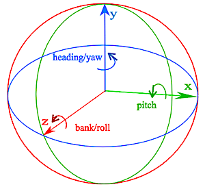

优点：

- 仅需要三个角度值，节省内存
- 表示直观（便于显示和输入方位）
- 任意三个数对于欧拉角都是合法的

缺点：

- 欧拉角之间求差值（角位移）困难
- 欧拉角的方位表达方式不唯一（n = n + 360）
- 由于三个角度不互相独立，可能产生：pich 135 = heading 180 + pich 45 + bank 180 的情况
  （通过限制角的范围解决，heading 和 bank 限制在 -180 ～ 180，pitch 限制在 -90 ～90）
- 万向锁问题（避免方法：**重新排列角度的旋转顺序**，但万向锁仍可能产生）

[万向锁](http://v.youku.com/v_show/id_XNzkyOTIyMTI=.html)：

- 当沿着任意角位移 90 度时，导致两个方向的旋转轴同线，导致三次旋转中有两次旋转的效果是一样的
  即：少了一个维度的旋转变化
- 在万向锁的情况下仍可以旋转到想要的位置，但必须同时旋转三个轴向，这时物体没有按照期望的方式旋转，下图的箭头如果是相机，则相机会发生抖动

|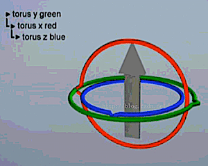| 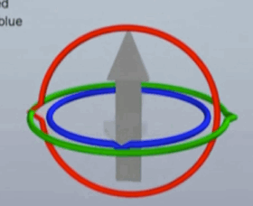 | 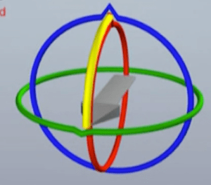 |
| :----: | :----: | :----: |
| 万向锁 |**发生万向锁后**的旋转|期望的旋转|

## 2. 四元数的相关知识

### 2.1 复数

[复数](https://en.wikipedia.org/wiki/Complex_number)是一种复合的数字，$C_{复数} = a + b \cdot i$ ，其中 a、b 为实数，$i$ 为虚数，$i^2 = -1$

- 复数通过 **实部 a 和 虚部 b** 构成的二维虚平面，将一维的数扩展到二维平面
- $i$ 只是区分 实部  a 和 虚部 b 的标记，这样可以把复数用二维的向量表示
  加法：$(a + bi) + (c + di) = (a + c) + (b+d)i$
  乘法：$(a + bi) *(c + di) = (ac - bd) + (bc+ad)i$
- 复数乘以 $i$ 的几何意义，在二维平面上逆时针旋转 90 度
  $(a + b \cdot i) * i = a*i + b*i^2 = -b + a \cdot i$ 

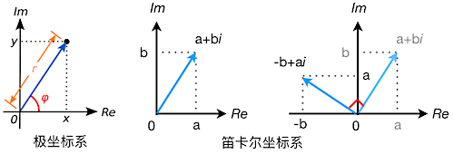

### 2.2 欧拉旋转定理

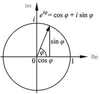

这里 $a = cos \phi, b = sin \phi, \phi$ 是从上一方位到当前方位的角位移，复数值表示当前方位 则 $c_{方位} =  a + b \cdot i$ 在极坐标下表示为 $e_{方位} = cos \phi + sin \phi \cdot i$
在极坐标下，复数能够更方便的表示旋转角的变化：

1. **连续的旋转可以用两个复数的乘积表示**
   例： $e_1$ 为先旋转 $\phi$，$e_2$ 再旋转 $\theta$，则根据 $i^2 = -1$ 以及[和差公式](https://en.wikipedia.org/wiki/Trigonometric_functions)可得最后的方位
   $$
   \begin{align}
   e_1 &= cos \phi + sin \phi \cdot i \\
   e_2 &= cos \theta + sin \theta \cdot i \\
   e &= cos(\phi + \theta) + sin(\phi + \theta) \cdot i \\
   &= (cos \phi \cdot cos \theta - sin \phi \cdot sin \theta) +(sin \phi \cdot cos \theta + cos \phi \cdot sin \theta) \cdot i \\
   &= (cos \phi + sin \phi \cdot i )(cos \theta + sin \theta \cdot i) \\
   &= e_1 \cdot e_2
   \end{align}
   $$

2. 在不知道当前角位移的情况下，**可以通过当前方位+角位移计算出之后的方位**

### 2.3 三维空间旋转的拆分

四元数在表示三维空间旋转的方式时采用**轴角式（Axis-angle）**的旋转
轴角式旋转方法如下图，v 绕过原点的方向向量 u 逆时针旋转 $\theta$ 得到 v ’ （图中采用右手坐标系，逆时针旋转方向为正方向）

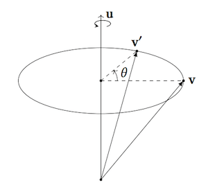

拆分轴角式旋转：

1. 如下图 A，假设 u 是单位向量（[求 v 到 u 的投影向量 v||](https://www.cnblogs.com/graphics/archive/2010/08/03/1791626.html)）
   $$
   \begin{align}
   v &= v_{||} + v_{\bot}\\
   v_{||} &= v_{||}'\\
   v_{||} &= proj_u(v) = {u \cdot v \over ||u||} \cdot {u \over ||u||} = {(u \cdot v)u \over ||u||^2} = (u \cdot v)u\\
   v_{\bot} &= v - v_{||} = v - (u \cdot v)u
   \end{align}
   $$

2. 如下图 B，C：w 既垂直于 u 又垂直于 $v_{\bot}$
   $$
   \begin{align}
   w &= u \times v_{\bot}\\
   ||w|| &= ||u \times v_{\bot}|| \\
   &= ||u|| \cdot ||v_{\bot}|| \cdot sin{\pi \over 2}\\
   &= ||v_{\bot}|| \\\\
   v_{\bot}' &= v_v' + v_w'\\
   &= v_{\bot} \cdot cos\theta + w \cdot sin\theta \\
   &= v_{\bot} \cdot cos\theta + (u \times v_{\bot})sin\theta
   \end{align}
   $$

3. 结合 1，2 可得
   $$
   v' = v \cdot cos\theta + (u\cdot v)u(1 - cos\theta)+(u \times v)sin\theta
   $$

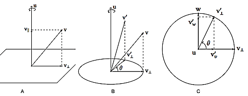

## 3. 四元数 (Quaternion)

> 相对于复数的二维空间，为了解决三维空间的旋转变化问题，爱尔兰数学家 William Rowan Hamilton 把复数进行了推广，也就是四元数
>
> **四元数包含旋转方向**： 3D 中的一个旋转对应正向和反向旋转的两个四元数，不是一一对应的

定义：**四元数表示角位移的大小**

- 与复数类似，四元数由 1 个实部 和 3 个虚部构成。其中，a、b、c 、d 为实数，$i$ 为虚数
  $\vec Q_{四元数} = a + b \cdot i_x + c \cdot i_y + d \cdot i_z$

- $i$ 代表旋转，$-i$ 代表反向旋转
  $$
  \begin{align}
  i_x * i_y * i_z &= i_x * i_x = i_y * i_y = i_z * i_z = -1\\
  i_x &= i_y * i_z  = - i_z * i_y = - i_x\\
  -i_y &= i_x * i_z \\
  \end{align}
  $$

 - 四元数的 3 个虚数 $i$ 之间的乘法与向量之间的点积结果形式很类似，于是四元数有了另外一种表示形式
$$
\begin{align}
\vec Q_{四元数} &= w + x \cdot i_x + y \cdot i_y + z \cdot i_z \\
&= (x, y, z, w) \\
&= (\vec u, w)
\end{align}
$$

优点：

- **平滑差值**：slerp 和 squad 提供了方位间的平滑差值**（矩阵和欧拉角都没有这个功能）**
- 快速连接和角位移求逆：
  多个角位移 ${四元数叉乘 \over \to}$ 单个角位移（比矩阵快）
  反角位移 = 四元数的共轭（比矩阵快）

缺点：

- 四元数比欧拉角多存储一个数（当保存大量角位移时尤为明显，如存储动画数据）
- 浮点数舍入误差和随意输入，会导致四元数不合法（可以通过四元数标准化解决，确保四元数为单位大小）
- 难以直接使用

### 3.1 四元数的运算

- **乘法，合并两个四元数的偏移量，得到总的角位移**
  四元数的乘法有很多种，其中最常用的一种是格拉丝曼积，与数学多项式乘法相同（与复数乘法概念相同）
  乘法满足结合律：abc = (ab)c = a(bc)
  但不符合交换律：ab != ba
  $$
  \begin{align}
  \vec Q_1 \vec Q_2 &= w_1w_2 - \vec u_1 \cdot \vec u_2 + w_1 \vec u_2 + w_2 \vec u_1 + \vec u_1 \times \vec u_2\\
  &= ((w_1 \vec u_2 + w_2 \vec u_1 +  \vec u_1 \times \vec u_2), (w_1w_2 - \vec u_1 \cdot \vec u_2))
  \end{align}
  $$

- 四元数与标量相乘、点积、加法、叉乘、单位化，均与四维向量的点积相同，以点积为例
  $$
  \begin{align}
  \vec Q_1 \cdot \vec Q_2 &= (w_1, x_1, y_1, z_1)(w_2, x_2, y_2, z_2) \\
  &= w_1w_2 + x_1 x_2 + y_1y_2 + z_1z_2
  \end{align}
  $$

- 求模：代表一个四维的长度，与向量的求模方法一致
  $$
  ||\vec Q|| = \sqrt{w^2 + \vec u \cdot \vec u} = \sqrt{w^2 + x^2 + y^2 + z^2}
  $$

- 共轭：实部相同，虚部相反（与复数共轭概念相同）
  $$
  \vec  Q^* \vec  Q = (-\vec u, w) (\vec u,w) = ||\vec Q||^2 = \vec Q \cdot \vec Q
  $$

- 求逆：**为了计算四元数的 "差"**，例
  给定方位 A 和 B，求 A 旋转到 B 的**角位移 d**，即：Ad = B，$d = A^{-1}B$
  $$
  \begin{align}
  \vec Q\vec Q^{-1} &= 1\\
  \vec Q^* \vec Q\vec Q^{-1} &= \vec Q^*\\
  ||\vec Q||^2 \cdot \vec Q^{-1} &= \vec Q^*\\
  \vec Q^{-1} &= {\vec Q^* \over ||\vec Q||^2}\\
  \end{align}
  $$

- 单位四元数：任意四元数乘以单位四元数后保持不变，$(\vec 0, \pm 1)$，模为 1
  **单位四元数的 逆 = 共轭**，由于共轭比逆好求出，一般用四元数的共轭代替逆使用
  几何上存在两个单位四元数 -u 和 u，因为他们几何意义相同都表示没有位移，但数学上只有 u
  $$
  Q_{单位} = {Q \over ||Q||}\\
  Q_{单位}Q_1 = Q_1Q_{单位} = Q_1\\
  ((w_1 \vec u + w \vec u_1 +  \vec u_1 \times \vec u), (w_1w - \vec u_1 \cdot \vec u)) = (\vec u_1, w_1)
  $$

### 3.2 四元数默认在极坐标下

**极坐标下的优势：使四元数的运算和向量的运算方法一致**

由 4.2.1 复数在笛卡尔坐标和极坐标的转换方式可得，四元数在

- 笛卡尔坐标下为
  $\vec Q = (x, y, z, w) = (\vec u, w)$
- 极坐标下为，其中 $\theta$ 为绕 $\vec u$ 旋转后的角位移（旋转方式见 4.2.3，[推导到极坐标](https://krasjet.github.io/quaternion/quaternion.pdf)）
  $\vec Q  = (x sin{\theta \over 2}, y sin{\theta \over 2},z sin{\theta \over 2}, cos{\theta \over 2}) = (\vec u sin{\theta \over 2}, cos{\theta \over 2})$

**只有旋转轴 u 为单位向量时，下面公式才成立**

- 用指数代替四元数：根据旋转角位移 $ \theta $ 和旋转轴 u 求出四元数
  $$
  e^{(\vec u {\theta \over 2}, 0)} = (\vec usin{\theta \over 2}, cos{\theta \over 2})
  $$

- 对数：根据四元数和旋转轴 u 求出旋转角位移 $\theta$
  $$
  log_e(（\vec u sin{\theta \over 2}, cos{\theta \over 2}）) = (\vec u {\theta \over 2}, 0)
  $$

- 将点 P 绕 $ \vec u $ 旋转 $ \theta $ 度
  $P_{旋转后} = aPa^{-1} = aPa^*, a = (\vec u sin{\theta \over 2}, cos{\theta \over 2})$

- 将点 P 绕 $ \vec u $ 旋转 $ \theta $ 度后再旋转 $\alpha$ 度（方位的叠加是点乘）
  $P_{旋转后} = baPa^{-1}b^{-1} = (ba)P(ba)^{-1},a = (\vec u  sin{\theta \over 2},cos{\theta \over 2}),b = (\vec u sin{\alpha \over 2},cos{\alpha \over 2})$

- **四元数求幂**：四元数的 x 次幂等同于将它的旋转角缩放 x 倍
  $$
  (\vec u sin{\theta \over 2}, cos{\theta \over 2})^x
  = (\vec u {sin({\theta \over 2}x)\over sin{\theta \over 2}}, cos({\theta \over 2}x))
  $$

四元数 * 向量 = 旋转后的向量，例：
设 用四元数 q = (u, w)，u 为单位向量，旋转三维向量 v，则
$$
\begin{align}
p &= (v, 0)\\
p'&= qpq^{-1} = qpq^* = (u,w)(v,0)(-u,w)\\
&= (2(u\cdot v)u + (w^2 -u\cdot v)v + 2w(u \times v),...)\\
&= (v',...)
\end{align}
$$

### 3.3 四元数的常用插值方法

所有插值用的旋转四元数**都是单位四元数**
插值要采用弧面最短路径

- $Q$ 和 $-Q$ 代表不同的旋转角度得到的相同方位，在插值时会有不同的结果，如下图：可以将 q0 和 q1（蓝色的弧）插值，这会导致 3D 空间的向量旋转接近 360 度，而实际上这两个旋转相差并没有那么多，所以 q0 和 -q1（红色的弧）的插值才是插值的最短路径
- 每次插值前要通过 $cos\theta = q_0 \cdot q_1$ 判断 q0 和 q1 的夹角是否为钝角，若为钝角将 q1 改为 -q1 来计算插值

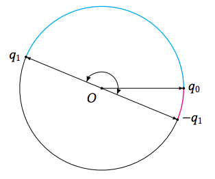

**线形插值**（Lerp：**L**inear Int**erp**olation）

- 对四元数插值后，得到的结果不是单位四元数，插值的弧度越大缺点越明显
- 公式：$Q_t = (1- t)Q_0 + t Q_1, t$ 为插值比例

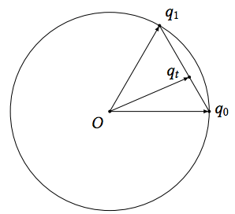

**正规化线性插值**（Nlerp：**N**ormalized **L**inear Int**erp**olation）

- 对四元数插值后，虽然把弦等分了，但是弦上对应的弧却不是等分的，插值的弧度越大缺点越明显
- 公式：$Q_t = {{ (1- t)Q_0 + tQ_1}\over{||(1- t)Q_0 + tQ_1||}}, t$ 为插值比例

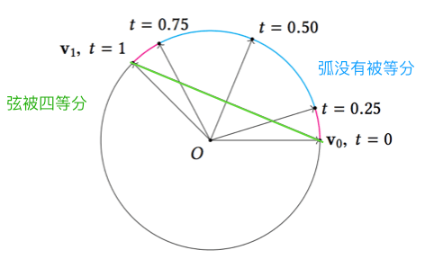

**旋转角度球面线性插值**（Slerp：**S**pherical **L**inear Int**erp**olation）

- 对单个角度做线形插值，做到固定角速度，无法平滑过渡连接不同方向的角度
- 公式 1：这里用的四元数都是单位四元数，所以有 $Q^{-1} = Q^*,  t$ 为插值比例
  $$
  Q_t = Q_0(Q_0^{-1}Q_1)^t = Q_0(Q_0^* Q_1)^t​
  $$

- 公式 2：效率比公式 1 高，其中 $\theta = cos^{-1}(Q_0\cdot Q_1)$
  $$
  Q_t = {sin((1 - t)\theta) \over sin\theta} Q_0 + {sin(t\theta) \over sin\theta}Q_1
  $$

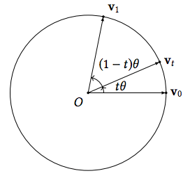

**Slerp 和 Nlerp 的比较**

- 效率上 Nlerp 比 Slerp 高
  效果上 Nlerp 和 Slerp 在单位四元数之间的夹⻆ θ 非常小时差别不大，夹角越大 Nlerp 的效果越差
- 单位四元数之间的夹⻆ θ 非常小，那么 sinθ 可能会由于浮点数的误差被近似为 0.0，从而导致除以 0 的错误。我们在实施 Slerp 之前，需要检查两个四元数的夹⻆是否过小一旦发现这种问题，我们就必须改用 Nlerp 对两个四元数进行插值，这时候 Nlerp 的误差非常小所以基本不会与真正的 Slerp 有什么区别 

### 3.4 贝塞尔曲线和 Squad 插值

**样条（Spline）**：在一个向量序列 $v_0,v_1,...,v_n$ 中分别对每对向量 $v_i,v_{i+1}$ 进行插值后互相连接得到的曲线

**贝塞尔曲线（Bézier）**：通过不断在现有点的基础上添加控制点，使最终得到的曲线更加平滑

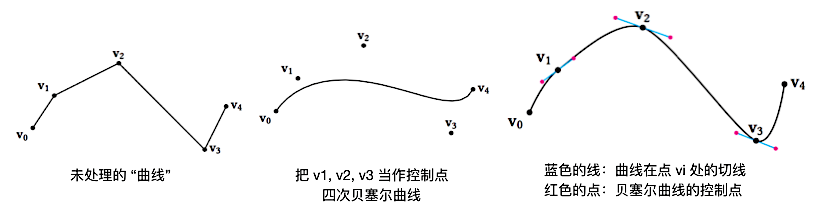

三次贝塞尔曲线：

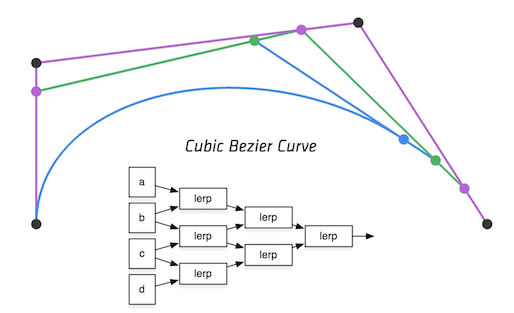

插值方式可以用 lerp、Slerp 等方式，上图采用 de Casteljau 算法构造贝塞尔曲线
上图采用 lerp 方式插值，插值方程为：
$$
v_t = (1 − t)^3v_0 + 3(1 − t)^2tv_1 + 3(1 − t)t^2v_2 + t^3v_3
$$
$de Casteljau$ 算法构造贝塞尔曲线的过程为：

- 第一次贝塞尔曲线，由相邻的基础点得到插值点 $v_{01}、v_{12}、v_{23}$
- 第二次贝塞尔曲线，由上次贝塞尔的插值点得到本次的插值点 $v_{012}、v_{123}$
- 第三次贝塞尔曲线，由上次贝塞尔的插值点得到本次的插值点 $v_{0123}$

**球面四边形插值**（Squad：**S**pherical and **Quad**rangle）

- 平滑过渡连接不同方向的旋转角，效率最低，效果最好
- Squad 的插值方法类似贝塞尔曲线的构造过程，**由于取基础点的方式不同，效率比构造贝塞尔曲线要高**
  Squad 的插值过程中可以用 lerp、Slerp 等方式插值
  如果使用 lerp 插值，**插值参数为 2t(1-t)，而非 t**
  插值方程为：

$$
v_t = (2t^2 − 2t + 1)(1 − t)v_0 + 2(1 − t)^2tv_1 + 2(1 − t)t^2v_2 + t(2t^2 − 2t + 1)v_3
$$

  插值步骤为：
1. 由基础点得到插值点 $v_{12}，v_{03}$
2. 根据上次的插值点得出本次的插值点 $v_{0312}$

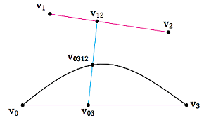

三次贝塞尔曲线和 Squad 插值构造的曲线对比：

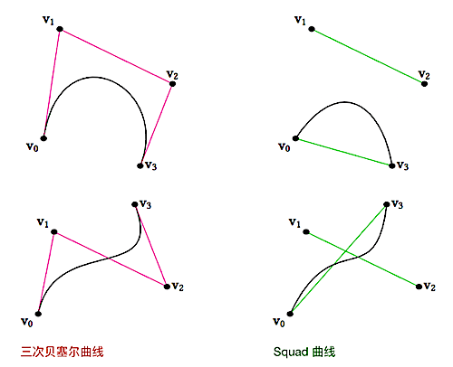

## 4 欧拉角、旋转矩阵、四元数的互相转换

### 4.1 欧拉角和旋转矩阵

[欧拉角](#4.1 欧拉角 (Euler angles)) $ \to $ 旋转矩阵

- 这里的旋转矩阵和 [2.4 Rotate](#2.4 Rotate)  类似，这里的欧拉角操作的模型的坐标系

- 设在**右手坐标系**，矩阵**列向量**存储，旋转角**逆时针**为正方向（改变的角度方向取反），则
  最后的转换矩阵为 Heading/Pich/Roll 按需要的顺序相乘的结果（HPR 为相机避免万向死锁的最佳顺序）
  $$
  \begin{align}
  Heading &= 
  \begin{bmatrix}
  cosH & 0 & sinH\\
  0 & 1 & 0\\
  -sinH & 0 & cosH
  \end{bmatrix} \\
  Pich &=
  \begin{bmatrix}
  1 & 0 & 0\\
  0 & cosP & -sinP\\
  0 & sinP & cosP
  \end{bmatrix} 
  \\
  Roll &=
  \begin{bmatrix}
  cosR & -sinR & 0\\
  sinR & cosR & 0\\
  0 & 0 & 1
  \end{bmatrix} \\
  M_{HPR} &= 
  \begin{bmatrix}
  cosHcosR+sinHsinPsinR & -cosHsinR+sinHsinPcosR & sinHcosP \\
  sinRcosP & cosRcosP & -sinP\\
  -sinHcosR+cosHsinPsinR & sinRsinH+cosHsinPcosR & cosHcosP
  \end{bmatrix}
  \end{align}\\
  $$

旋转矩阵 $ \to$ [欧拉角](#4.1 欧拉角 (Euler angles))

> 转换后的欧拉角是限制欧拉角，即 Heading 和 Roll 范围为 $\pm$180 度，Pich 的范围为 90 度 

当矩阵每列都是单位向量时，矩阵为正交矩阵，则
$$
M \cdot M^{-1} = M \cdot M^T = I\\
M^{-1} = M^T\\
$$

1. 若 $Pich \neq \pm 90$，由欧拉角转矩阵的公式可得：

$$
\begin{align}
\begin{bmatrix}
m11 & m12 & m13\\
m21 & m22 & m23\\
m31 & m32 & m33
\end{bmatrix}
&= 
\begin{bmatrix}
cosHcosR+sinHsinPsinR & -cosHsinR+sinHsinPcosR & sinHcosP \\
sinRcosP & cosRcosP & -sinP\\
-sinHcosR+cosHsinPsinR & sinRsinH+cosHsinPcosR & cosHcosP
\end{bmatrix}\\
\\
m23 &= -sinP\\
arcsin(-m23) &= P\\
\\
m13 &= sinHcosP\\
m33 &= cosHcosP\\
{m13 \over m33} &= tanH\\
arctan({m13 \over m33}) &= H\\
\\
m21 &= sinRcosP\\
m22 &= cosRcosP\\
arctan({m21 \over m22}) &= R\\
\end{align}
$$

2. 若 $Pich = \pm 90$，是万向锁情况，此时 Heading 和 Roll 绕同样的轴竖直旋转，默认旋转的最后一步 Roll 不转，即 Roll = 0 ，由欧拉角转矩阵的公式可得：

$$
\begin{align}
\begin{bmatrix}
m11 & m12 & m13\\
m21 & m22 & m23\\
m31 & m32 & m33
\end{bmatrix}
&= 
\begin{bmatrix}
cosH & sinHsinP & 0 \\
0 & 0 & -sinP\\
-sinH & cosHsinP & 0
\end{bmatrix}\\
\\
m11 &= cosH\\
m13 &= -sinH\\
-arctan({m13\over m11}) &= H
\end{align}
$$

### 4.2 四元数和旋转矩阵

[四元数](#4.3 四元数 (Quaternion)) $ \to$ 旋转矩阵 

设四元数为 $\vec Q = (\vec n, cos{ \theta \over 2 }) = (x,y,z,w)$，绕 n 旋转 $\theta$ ，由 [2.4 Rotate](#2.4 Rotate) 沿任意方向旋转的矩阵 得旋转矩阵 M：
$$
\begin{bmatrix}
(1-cos\theta)x^2 + cos\theta & (1-cos\theta)yx+sin\theta z & (1-cos\theta)zx - sin\theta y\\
(1-cos\theta)xy - sin\theta z & (1-cos\theta)y^2 + cos\theta & -(1-cos\theta)zy + sin\theta x\\
(1-cos\theta)xz + sin\theta y & (1-cos\theta)yz - sin\theta x & (1-cos\theta)z^2 + cos\theta
\end{bmatrix}
\to M = 
\begin{bmatrix}
1-2y^2-2z^2 & 2xy+2wz & 2xz-2wy\\
2xy-2wz & 1-2x^2-2z^2 & 2yz+2wx\\
2xz+2wy & 2yz-2wx & 1-2x^2-2y^2
\end{bmatrix}
$$

旋转矩阵 $\to $ [四元数](#4.3 四元数 (Quaternion))

1. 由四元数转旋转矩阵可知：

$$
\begin{align}
\begin{bmatrix}
m11 & m12 & m13\\
m21 & m22 & m23\\
m31 & m32 & m33
\end{bmatrix}
&= 
\begin{bmatrix}
1-2y^2-2z^2 & 2xy+2wz & 2xz-2wy\\
2xy-2wz & 1-2x^2-2z^2 & 2yz+2wx\\
2xz+2wy & 2yz-2wx & 1-2x^2-2y^2
\end{bmatrix}\\\\
m11+m22+m33
&= (1-2y^2-2z^2)+(1-2x^2-2z^2)+(1-2x^2-2y^2)\\
&= 3-4(x^2+y^2+z^2)\\
&= 3-4(1-w^2)\\
&= 4w^2-1\\
\\
w&={\sqrt{m11+m22+m33+1} \over 2}

\end{align}
$$

2. 使 m11、m22、m33 其中两个为负，一个为正可得：

$$
\begin{align}
x &={\sqrt{m11-m22-m33+1} \over 2}\\
y &={\sqrt{-m11+m22-m33+1} \over 2}\\
z &={\sqrt{-m11-m22+m33+1} \over 2}
\end{align}
$$

以上方法得到的**四元数总是正的**，没有判断四元数符号的依据

3. 在由：

$$
\begin{align}
m12 + m21 &= 4xy\\
m12 - m21 &= 4wz\\
m31 + m13 &= 4xz\\
m31 - m13 &= 4wy\\
m23 + m32 &= 4yz\\
m23 - m32 &= 4wx\\
\end{align}
$$

4. 综上可得：
$$
\begin{align}
x &= {m23-m32 \over 4w}\\
情况一、w ={\sqrt{m11+m22+m33+1} \over 2} \to  y &= {m31-m13 \over 4w}\\
z &= {m12-m21 \over 4w}\\
\\
w &= {m23-m32 \over 4x}\\
情况二、x ={\sqrt{m11-m22-m33+1} \over 2} \to  y &= {m12+m21 \over 4x}\\
z &= {m31+m13 \over 4x}\\
\\
w &= {m31-m13 \over 4y}\\
情况三、y ={\sqrt{-m11+m22-m33+1} \over 2} \to  x &= {m12+m21 \over 4y}\\
z &= {m23+m32 \over 4y}\\
\\
w &= {m12-m21 \over 4z}\\
情况四、z ={\sqrt{-m11-m22+m33+1} \over 2} \to  x &= {m31+m13 \over 4z}\\
y &= {m23+m32 \over 4z}
\end{align}
$$

5. 取 1、2 中得到的 w、x、y、z 的最大值是哪个来判断，选择哪种情况

### 4.3 欧拉角和四元数

[四元数](#4.3 四元数 (Quaternion)) $ \to $ [欧拉角](#4.1 欧拉角 (Euler angles))

由 旋转矩阵 转 四元数 和 旋转矩阵 转 欧拉角的条件可得：
$$
\begin{align}
P &= asin(-2(yz+wx)) \\
H &=
\begin{cases}
atan2(xz-wy, 0.5 - x^2 - y^2),& \cos P \neq 0 \\
atan2(-xz-wy, 0.5 - y^2 - z^2),& \cos P = 0
\end{cases}\\
R &=
\begin{cases}
atan2(xy-wz,0.5 - x^2 - z^2),& \cos P \neq 0\\
0,& \cos P = 0
\end{cases}
\end{align}
$$

[欧拉角](#4.1 欧拉角 (Euler angles)) $\rightarrow$ [四元数](#4.3 四元数 (Quaternion))

由四元数的公式得，在**右手坐标系**下的欧拉角列向量 H、P、R 为：
$$
HPR=
\begin{bmatrix}
cos{H \over 2}\\\\ 0 \\-sin{H \over 2}\\ 0
\end{bmatrix}
\begin{bmatrix}
cos{P \over 2}\\\\ -sin{H \over 2} \\0 \\0
\end{bmatrix}
\begin{bmatrix}
cos{R \over 2}\\\\ 0\\ 0\\-sin{H \over 2}
\end{bmatrix}
= 
\begin{bmatrix}
cos{H \over 2}cos{P \over 2}cos{R \over 2}+sin{H \over 2}sin{P \over 2}sin{R \over 2}\\\\ 
-cos{H \over 2}sin{P \over 2}cos{R \over 2}-sin{H \over 2}cos{P \over 2}sin{R \over 2} \\
cos{H \over 2}sin{P \over 2}sin{R \over 2}-sin{H \over 2}cos{P \over 2}cos{R \over 2} \\
sin{H \over 2}sin{P \over 2}cos{R \over 2}-cos{H \over 2}cos{P \over 2}sin{R \over 2} 
\end{bmatrix}
$$

## 5. SQT 变换

> 四元数只能表示旋转，但是 4 X 4 的矩阵却可以表示旋转、平移、缩放

SQT 变换矩阵：四元数、平移向量、缩放向量/缩放统一系数 构成的一个 4 X 3 的矩阵

使用 SQT 矩阵的目的：便于对 旋转、平移、缩放 的插值计算

# 引用

- [欧拉角，万向锁 视频解释](http://v.youku.com/v_show/id_XNzkyOTIyMTI)
- [四元数的可视化解释](https://www.bilibili.com/video/av33385105/#reply1117064951)
- [四元数的证明方式解释](https://krasjet.github.io/quaternion/)
- [四元数在三维计算的几何意义](https://qiita.com/HMMNRST/items/0a4ab86ed053c770ff6a)

