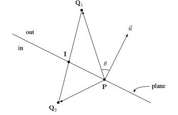
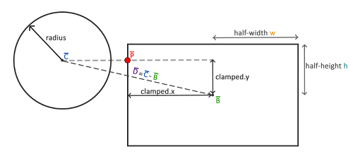

[TOC]

# 一、三角形

## 1. 内心

三角形内心（三角形内切圆的圆心）：三角形内角平分线的交点

已知三点坐标，求三角形内心坐标，[证明过程](https://www.zybang.com/question/272657890b84080ca669265cd181789c.html)


设 $a = |BC|, \space b = |AC|,\space c = |AB|$ 则
$$
(x_I,y_I) = {a(x_A,y_A)+b(x_B,y_B)+c(x_C,y_C) \over a+b+c}
$$


## 2. 垂心

三角形从顶点到其对边的三条高的交点


应用：三角形着色时，已知三个点的颜色，混合计算整个三角形的颜色（高度比求插值）
$$
\begin{align}
f_i &= d_i / h_i \\
Color &= f_i * Color_i + f_j * Color_j + f_k * Color_k
\end{align}
$$


## 3. 重心

三角形从顶点到其对边中点的交点，具体推到见 [纹理，重心坐标](../OpenGL/Part4_Texture.md)

应用：三角形着色时，已知三个点的颜色，混合计算整个三角形的颜色（面积比求插值）
$$
\begin{align}
f_i &= {area(x, x_j, x_k) \over area(x_i, x_j, x_k)} \\
Color &= f_i * Color_i + f_j * Color_j + f_k * Color_k
\end{align}
$$


## 4. 求面积

已知三点坐标，求证三角形面积 $S_{\Delta ABC} = {1 \over 2}[(x_2-x_1)(y_3-y_1) - (y_2-y_1)(x_3-x_1)]$


$$
\begin{align}
S_{\Delta ABC} 
&= {1 \over 2} |height||L_1| \\
&= {1 \over 2} |sin\theta||L_2||L_1| \\
&= {1 \over 2} \sqrt{1-(cos\theta)^2}|L_2||L_1| \\
&= {1 \over 2} \sqrt{1-({\vec {BA} \cdot \vec {CA} \over |L_2||L_1|})^2}\cdot |L_2||L_1| \\
&= {1 \over 2} \sqrt{(|L_1||L_2|)^2-(\vec {BA} \cdot \vec {CA})^2} \\
&= {1 \over 2} \sqrt{[(x_3 - x_1)^2 + (y_3-y_1)^2][(x_2-x_1)^2 + (y_2-y_1)^2]-[(x_2 - x_1)(x_3-x_1) + (y_2-y1)(y_3-y_1)]^2} \\
\end{align}
$$

设 $a=x_2-x_1, \space b=y_2-y_1, \space c=x_3-x_1, \space d=y_3-y_1$  则 

$$
\begin{align}
S_{\Delta ABC} 
&= {1 \over 2} \sqrt{(c^2 + d^2)(a^2 + b^2)-(ac + bd)^2} \\
&= {1 \over 2}|ad - bd| \\
&= {1 \over 2}|(x_2-x_1)(y_3-y_1) - (y_2-y_1)(x_3-x_1)|
\end{align}
$$


# 二、几何图元的数据描述

一般出于性能的考虑，使用**重叠**在物体上的更简单的外形（通常有较简单明确的数学定义，例：圆形，矩形）来进行碰撞检测是常用碰撞检测的方法
缺点：这些外形通常无法完全包裹物体，当检测到碰撞时，实际的物体可能并没有真正的碰撞


## 1. 基本数据

**常用的几何图元表示**

```c++
class Edge {
  vec3 PointStart;
  vec3 PointEnd;
};

class Line {
  vec3 Pos;
  vec3 Direction;
};

class Sphere {
  vec3 Center;
  vec3 Radius;
};

class Plan {      // 平面的普通表示 1
  vec3 Position;
  vec3 Direction; 
};

class Plan {      // 平面的化简表示 2
  vec3 Direction;
  vec3 Distance;  // 平面到原点的距离
};

class Triangle {
  vec3 Vector0;
  vec3 Vector1;
  vec3 Vector2;
};

class PlanBoundVolume {
  std::vector<Plane> Planes;
};
```


## 2. AABB

AABB 轴对齐碰撞箱（Axis-Aligned Bounding Box）

- 碰撞箱为 矩形/立方体，它的边与所包围物体的**世界坐标系对齐**（为了便于计算碰撞箱）
- 不会随所包装物体的旋转而旋转，只会**随所包装物体的旋转而缩放**
- 表示方法有很多，通常用两个坐标系各轴都是模型中的点 最大/最小 的点来表示
  描述 AABB 的几何结构为：碰撞箱的中心点 + 碰撞箱子各个坐标轴的半径（为了方便碰撞检测）

```c++
class AABB {
  vec3 Min; // 一般在左上角，也可以当做 Position 用
  vec3 Max;
};
```


# 三、距离检测

## 1. 点、直线

点到直线的**最近点**：其中 $L_{Dir}$ 是单位向量，$P_p,P_L,P_N$ 均为同一坐标系下点的坐标
$$
P_N = P_L + (L_{Dir} \cdot (P_p - P_L))L_{Dir}
$$


## 2. 点、线段

点到线段的**最近点**：其中 $L_{Dir}$ 是单位向量，$P_p,P_L,P_N,P_A$ 均为同一坐标系下点的坐标（截取思想）
$$
P_N = P_L + Clamp(L_{Dir} \cdot (P_p - P_L), 0, Length_{LA})L_{Dir}
$$


## 3. 点、AABB（点在 AABB 外）

点与 AABB 的**最短距离**：计算 $P$ 点和 $P_{nearest}$ 的距离，就是最短距离
$$
   P_{nearest} = AABB.Clamp(P)
$$

   ```c++
   vec2 AABBClamp(vec2 p, AABB b)
   {
     return new vec2(
       clamp(p.x, b.Min.x, b.Max.x),
       clamp(p.y, b.Min.y, b.Max.y)
     );
   }
   ```


## 4. 点、平面

点到平面的**最近点**：在三维空间中，需要 $Dir_{plan}$ 平面的方向（一般为单位向量），和平面中的任意一点 $P_{plan}$
$$
P_{Near} = P - Dir_{plan} \cdot (P - P_{plan})
$$


## 5. 点、三角形

点到三角形的**最近点**
步骤：求解点在三角形的哪个区域

1. 顶点区域（最近点是顶点）
2. 边区域（最近点是点到线短的距离）


## 6. 点、四面体

点到四面体（模型）的**最近点**：遍历四面体的四个三角面，将点在三角面上做**投影**，求点到三角形的最近点


## 7. 凸包与凸包

> 几何体与几何体之间的距离
>
> 凸包的性质：连接凸包任意两点的直线，都在这个凸包的内部


技巧：凸物体与球的最短距离，等价转换为凸膨胀体与点的距离

凸包与凸包之间的距离通用算法：GJK（Gilbert-Johnson-Keerthi distance algorithm）


**工程化的计算凸包和凸包的距离**：通过有限次数的迭代 Support 点来求得两个凸包的近似距离


# 四、区域检测

## 1. 点、面

对于平面 plane 和其法线 $\vec n$

- $(Q-P) \cdot \vec n > 0$，Q 在平面 plane 外侧 out
- $(Q-P) \cdot \vec n = 0$，Q 在平面 plane 上
- $(Q-P) \cdot \vec n < 0$，Q 在平面 plane 内侧 in


## 2. 线、面

对于任意一条直线 $Q_1Q_2$，则

- $(Q_1-P) \cdot \vec n > 0, \space (Q_2-P) \cdot \vec n > 0$，直线 $Q_1Q_2$ 在平面 plane 外侧 out
- $(Q_1-P) \cdot \vec n < 0, \space (Q_2-P) \cdot \vec n < 0$，直线 $Q_1Q_2$ 在平面 plane 内侧 in
- $((Q_1-P) \cdot \vec n )* ((Q_2-P) \cdot \vec n) < 0$，直线 $Q_1Q_2$ 与平面 plane 有交点




## 3. AABB、圆

检测物体中心距离：找到 AABB 上距离圆最近的一个点，如果圆到这一点的距离小于圆的半径，那么就产生了碰撞



```c++
bool isCollision(BallObject &circle, AABB &box)
{
    // 圆的中心坐标
    vec2 circleCenter(circle.Position + circle.Radius);
    vec2 boxSizeHalf((box.Max - box.Min) * 0.5f);
    vec2 boxCenter(box.Min + boxSizeHalf);
    // 获取两个中心的差矢量
    vec2 delta = circleCenter - boxCenter;
    vec2 clamped = clamp(delta, -boxSizeHalf, boxSizeHalf);
    // 得到了碰撞箱上距离圆最近的点closest
    vec2 p = boxCenter + clamped;
    // 获得圆心 C 和最近点 P 的矢量
    delta = p - circleCenter;
  	// 判断 p 是否在圆内
    return length(delta) < circle.Radius;
}
```


## 4. AABB 与 AABB

检测物体中心距离：两个物体的 AABB 碰撞箱的中心距离分别与两个 AABB 碰撞箱的**长总和**与**宽总和**比较

```c
bool isOverlap(AABB &box1, AABB &box2)
{
    vec3 box1Size = box1.Max - box1.Min;
    vec3 box2Size = box2.Max - box2.Min;
    vec3 box1Center = box1Size * 0.5f + box1.Min;
    vec3 box2Center = box2Size * 0.5f + box2.Min;
    vec3 boxCenterDistance = abs(box2Center - box1Center);
    vec3 boxSizeSumHalf = (box1Size +　box2Size) * 0.5f;
	
    return (
        boxCenterDistance.x <= boxSizeSumHalf.x && 
　　　　　boxCenterDistance.y <= boxSizeSumHalf.y &&
　　　　　boxCenterDistance.z <= boxSizeSumHalf.z
    );
}
```


## 5. 线段与线段


分层测检测：

1. 将线段套上 AABB 包围盒，做快速排斥检测

   ```c
   bool isOverlapRect(Edge& e1, Edge& e2)
   {
       return (
           // X 轴投影重叠
           min(e1.start.x, e1.end.x) <= max(e2.start.x, e2.end.x) &&
           max(e1.start.x, e1.end.x) >= min(e2.start.x, e2.end.x) &&
           // Y 轴投影重叠
           min(e1.start.y, e1.end.y) <= max(e2.start.y, e2.end.y) &&
           max(e1.start.y, e1.end.y) >= min(e2.start.y, e2.end.y)
       );
   }
   ```

2. 跨立实验

   根据两个向量 $P_1 Q_1、P_1Q_2$的与同一个向量 $P_1P_2$ 叉乘结果相反，来判断两个向量是否在那同一个向量的两侧

   

   ```c
   bool isLineSegmentOverlap(Edge& e1, Edge& e2)
   {
       // 1. 判断点 e2.start 和 e2.end 是否在 线 e1 两侧
       vec2 e2Start = e2.start - e1.start;
       vec2 e2End = e2.end - e1.start;
       vec2 start2End = e1.end - e1.start;
       long cross1 = cross(e2Start, start2End);
       long cross2 = cross(e2End, start2End);
       if ( !(0 == cross1 && 0 == cross2) && (cross1 & cross2 >= 0) ) return false;
       
       // 2. 判断点 e1.start 和 e1.end 是否在 线 e2 两侧
       e2Start = e1.start - e2.start;
       e2End = e1.end - e2.start;
       start2End = e2.end - e2.start;
       cross1 = cross(e2Start, start2End);
       cross2 = cross(e2End, start2End);
       if ( !(0 == cross1 && 0 == cross2) && (cross1 & cross2 >= 0) ) return false;
       
       return true;
   }
   ```

3. 交点计算（额外操作）
   前提：一定有交点
   设：射线段 $P_1 P_2、Q_1Q_2$ 相交与点 $A$，则

   
   $$
   \begin{align}
   |\vec {Q_1Q_2} \cross \vec {Q_1P_1}| &= |\vec {Q_1Q_2}|d_1 \\
   d_1 &= {|\vec {Q_1Q_2} \cross \vec {Q_1P_1}| \over |\vec {Q_1Q_2}|} \\
   d_2 &= {|\vec {Q_1Q_2} \cross \vec {P_2Q_2}| \over |\vec {Q_1Q_2}|} \\
   {d_1 \over d_2} &= {|\vec {P_1A}| \over |\vec {P_1P_2}| - |\vec {P_1A}|}  = {t \over 1- t}\\
   t &= {d_1 \over d_1 + d_2} = {|\vec {Q_1Q_2} \cross \vec {Q_1P_1}| \over |\vec {Q_1Q_2} \cross \vec {Q_1P_1}| + |\vec {Q_1Q_2} \cross \vec {P_2Q_2}|}\\
   \vec {P_1A} &= t\vec {P_1P_2}
   \end{align}
   $$


# 五、区域划分

根据划分条件的不同，可以采用不同的划分结构


## 1. 划分条件

### 1.1 传统划分

### 1.2 空间划分


## 2. 划分结构

### 2.1 BVH 划分

划分物体


### 2.2 K-D 树划分

### 2.3 Uniform Grids 划分


# 引用

1. [Distance Between Point and Triangle in 3D](https://www.geometrictools.com/Documentation/DistancePoint3Triangle3.pdf)
2. [Building a Collision Engine Part 1: 2D GJK Collision Detection](https://blog.hamaluik.ca/posts/building-a-collision-engine-part-1-2d-gjk-collision-detection/)
3. [Clipping using homegeneous coordinates by James F. Blinn and Martin E. Newell](https://link.zhihu.com/?target=https%3A//fabiensanglard.net/polygon_codec/clippingdocument/p245-blinn.pdf)
4. [CLIPPING by Kenneth I. Joy](https://link.zhihu.com/?target=https%3A//fabiensanglard.net/polygon_codec/clippingdocument/Clipping.pdf)
5. [Clipping implementation](https://link.zhihu.com/?target=https%3A//fabiensanglard.net/polygon_codec/)
6. [GJK 检测算法](https://www.cnblogs.com/alps/p/12822653.html)
7. [【计算几何】线段相交](https://www.cnblogs.com/dwdxdy/p/3230485.html)
8. [点到 AABB，点到 OBB 的最近点和距离](http://www.idivecat.com/archives/494)
9. [从零开始手敲次世代游戏引擎（四十五）](https://zhuanlan.zhihu.com/p/34344829?from_voters_page=true)

