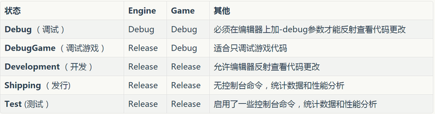
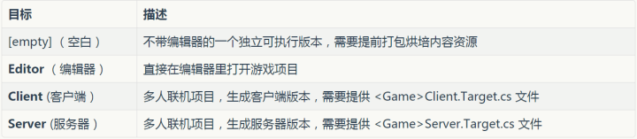
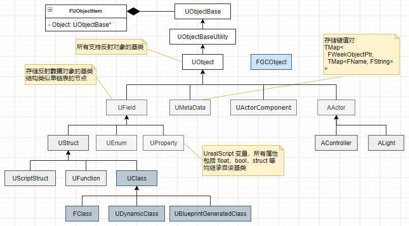
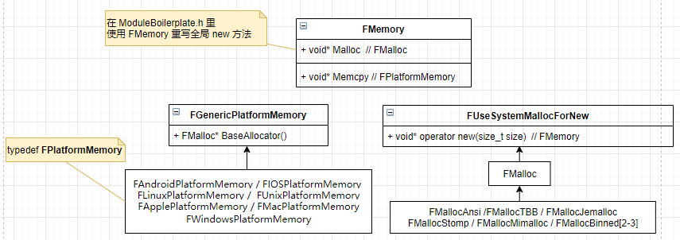

# 一、UE4 的开发流程

> 这里以 Win 平台的开发流程为例子，其他的平台在 **UE 4.21.0** 源码的 readme 和 [UE 开发者文档](https://docs.unrealengine.com/4.26/zh-CN/ProgrammingAndScripting/ProgrammingWithCPP/CPPTutorials/FirstPersonShooter/1/) 里都有说明

## 1. 环境配置

1. **软件配置**
   安装 Visual Studio 2017（或者用 [Rider for Unreal Engine](https://www.jetbrains.com/lp/rider-unreal/)，虽然付费但有[破解方式](https://iworkh.gitee.io/blog/2020/08/15/jetbrains-crack/)），Git
   由于 win 对于文件路径限制在 255 字符以内，建议将 UE 的源码直接放在**磁盘根目录下**
   
2. **平台依赖软件包准备**
   执行 `Setup.bat` 脚本，通过 Git 下载当前平台依赖的额外资源，它们存放在 UE 源码的 `FeaturePacks` 文件夹
   
   ```sh
   # Setup.bat 加速
   # 运行 setup.bat -help 可以看到参数说明
   # 在 set PROMPT_ARGUMENT=--prompt 这里使用多线程来加速
   # --exclude=排除不需要下载的库，Win 平台下使用时不要排除 Win32、VS2012、S2013，不然后期会出问题
   # --cache=E:\UE4.27.1\SetupCaches 防止重复下载
   set PROMPT_ARGUMENT=--prompt 
   --threads=20
   --exclude=Linux --exclude=HTML5 --exclude=IOS --exclude=Android
   --exclude=osx32 --exclude=osx64
   ```
   
3. **构建项目**
   执行 `GenerateProjectFiles.bat` 脚本，它会调用 `Engine/Build/BatchFiles` 下的 bat 脚本文件
   里面的脚本会自动调用 Unreal Build Tool 项目，生成 `Unreal Build Tool.exe` 
   通过另外的一个脚本调用 `Unreal Build Tool.exe` 传入一些参数创建解决方案  `UE4.sln`
   
4. **生成 UE 各种游戏开发软件**
   打开 `UE4.sln` 选择一种编译模式（如： Development Editor），选中解决方案 UE4，**生成 Build一下**
   在文件夹 `Engine/Binaries/Win64` 找到对应编译平台生成的 UE4Editor.exe 等软件
   
5. **UnrealVersionSelector**
   大部分用 UE Edtior 创建的不含有 C++ 文件的项目是不需要通过 Visual Studio 打开的，一般都需要用 UnrealVersionSelector 这个程序
   这个程序诞生于对 UE 解决方案的编译（Win 使用时需要先双击一下注册程序到 Win 的注册表）
   主要用来控制 UE Edtior 生成的 `.uproject` 文件（Win 选中后右键）在打开时使用哪个 UEEdtior 的版本（不同 UE 版本兼容性不太好）


## 2. 跨平台项目构建 Unreal Build Tool

Unreal Build Tool 是 UE 自己的跨平台构建工具，它代替了传统的 makefile 或 MS build
本质上是个命令行程序，通过运行脚本 `GenerateProjectFiles[.sh/.bat/.command]` 来执行：
生成工程文件、**解析所有依赖模块**、执行 Unreal Header Tool、为各种不同的平台个构建风格调用编译器（Compiler）和连接器（Linker）等功能

### 2.1 模块 Modules

**模块的分类**

- C# 模块
  使用 `.csproj`（Visual Studio C#工程描述文件）作为它的工程文件
- C++ 模块
  使用 `模块名.build.cs` 文件来定义（实际上是一个 C# 文件），这个文件跟 `vcxproj`（Visual Studio C++工程描述文件）类似
  模块项目里 Public 目录下是对外暴露的接口，Private 则是内部使用的接口


**模块的创建流程**
模块的创建多用于 GamePlay 项目 Runtime 阶段，而非引擎内部或编辑器中

1. 创建 Private、Public 文件夹

2. 创建 模块名.build.cs、 模块名.h、 模块名.cpp 文件

   ```c++
   // 目录结构
   /**
   /模块名
    |_ 模块名.build.cs
    |_ /Public
    |       |_ 模块名.h
    |       |_ [模块名PrivatePCH.h] // 可以将模块内通用的头文件发在这个头文件中来加快编译
    |_ /Private
            |_ 模块名.cpp
   */
   
   // 模块名.build.cs: ModuleDev.build.cs
   using UnrealBuildTool;
   
   // 类的名称与模块名称一致
   public class ModuleDev : ModuleRules
   {
       public ModuleDev(ReadOnlyTargetRules Target) : base(Target)
       {
           PublicDependencyModuleNames.AddRange(new string[] { "Core", "CoreUOject" });
           PrivateDependencyModuleNames.AddRange(new string[] { });
       }
   }
   
   // 模块名.h: ModuleDev.h
   #pragma once
   #include "ModuleDevPrivatePCH.h" // 如果有这个文件
   
   class FModuleDevModule : public IModuleInterface
   {
   public:
   	/** IModuleInterface implementation */
   	virtual void StartupModule() override;
   	virtual void ShutdownModule() override;
   };
   
   // 模块名.cpp: ModuleDev.cpp
   #include "ModuleDev.h"
   IMPLEMENT_MODULE(FModuleDevModule, ModuleDev);
   // or 至少有一个 primary 模块，其他模块可用 IMPLEMENT_GAME_MODULE 注册
   // IMPLEMENT_PRIMARY_GAME_MODULE(YourModuleNameClass, YourModuleName);
   ```

3. 引入模块

   Editor 类型模块：在 UEEditor 顶栏的 Edit/Plugins 中根据模块名称添加对应模块
   Runtime 类型模块：将模块代码放入 UE 工程文件的 Source 文件夹里，找到 `工程名.Target.cs` 文件

   ```c
   using UnrealBuildTool;
   using System.Collections.Generic;
   
   public class UE4GameTarget : TargetRules
   {
   	public UE4GameTarget(TargetInfo Target) : base(Target)
   	{
   		Type = TargetType.Editor;
   
   		ExtraModuleNames.Add("UE4Game");
           ExtraModuleNames.AddRange(new string[] { "ModuleDev" });
   	}
   }
   ```

4. 打开 `项目名.uproject` 文件

   ```c
   // 具体配置参数见 Engine\Source\Runtime\Projects\Public\ModuleDescriptor.h
   // PostConfigInit：引擎初始化阶段，在配置系统初始化完成后 PreLoadingScreen：引擎初始化阶段，可以在这里挂入 LoadingScreen 的注册
   // PreDefault：引擎初始化阶段，在 Default 阶段之前
   // Default：引擎初始化阶段，此时所有的游戏模块加载已经完成
   // PostDefault：引擎初始化阶段，在Default阶段之后
   // PostEngineInit：引擎初始化完成后
   // None：不会自动加载
   "Modules": [
       {
           "Name": "YourProject",
           "Type": "Runtime",
           "LoadingPhase": "Default"
       },
       {
           "Name": "YourModule",
           "Type": "Runtime",
           "LoadingPhase": "Default"
       },
       {
           "Name": "YourModuleEdit",
           "Type": "Editor",
           "LoadingPhase": "PreDefault" // 注意 Editor 类型的这里
       }
   ]
   ```
   
5. 重新生成项目
   为了防止文件冲突， 删除掉 `Engine/Binaries` 和 `Engine/Intermediate` 文件夹之后
   再点击 Uproject 右键 Generate


### 2.2 插件 Plugins

位置：`Engine/Plugins`，和 Source 在同一个文件夹

目录结构：

```c
/**
/插件名
 |_ /Resources
 |    |_ Icon128.png // 在 UEEditor 里的 Icon
 |_ /Source
 |    |_ 插件名
 |         |_ /Public
 |         |     |_ 插件名.h
 |         |     |_ [插件名PrivatePCH.h] // 可以将模块内通用的头文件发在这个头文件中来加快编译
 |         |_ /Private
 |               |_ 插件名.cpp
 |_ 插件名.uplugin
*/
```

插件的创建多用于对 UEEditor 和引擎的扩展，创建流程前三步和创建模块一样（游戏项目的插件可以在 UEEditor 内部创建）

4. 设置依赖模块
   修改 `插件名.uplugin`

   ```c
   {
       "FileVersion": 3,
       "Version": 1,
       "VersionName": "1.0",
       "FriendlyName": "插件名",
       "Description": "插件描述",
       "Category": "Other",
       "CreatedBy": "",
       "CreatedByURL": "",
       "DocsURL": "",
       "MarketplaceURL": "",
       "SupportURL": "",
       "Modules": [ // 在这里引入插件模块
           {
               "Name": "插件模块名称",
               "Type": "Editor",                 
               "LoadingPhase" : "PostEngineInit"  // 插件模块加载时机
           }
       ],
       "EnabledByDefault": true,
       "CanContainContent": true,
       "IsBetaVersion": false,
       "Installed": false
   }
   ```

5. 重新生成项目
   同模块的重新生成项目方法一致


模块和插件的加载流程：虽然插件和模块的加载时机可以在 uproject 或者 uplugin 文件配置在读取 .ini 文件前后加载，但总体的流程还是不变的

1. 加载 Platform File Module
2. 加载 CoreUObject
3. 加载 Render ... 等
4. 加载 Core
5. 加载 Networking
6. 加载 运行平台相关模块
7. 根据 Plugin 的启用状态加载 Plugin 模块


### 2.3 构建配置

状态 Status：



目标 Targets：




### 2.4 游戏项目目录结构

不管是 **引擎工程** 还是 **游戏工程** 都含有以下目录结构

- **Binaries：**
  存放编译生成的结果二进制文件
  
- **Config：**
  配置文件 `.ini`
  
- **Content：**
  平常最常用到，所有的资源和蓝图等都放在该目录里
  
- **DerivedDataCache（DDC）：**
  存储着引擎**针对平台特化后的资源**版本
  比如同一个图片，针对不同的平台有不同的适合格式，这个时候就可以在不改变原始的 uasset 的基础上，比较轻易的再生成不同格式资源版本
  
- **Intermediate：**
  中间文件，存放着一些临时生成的文件，有：
  - Build 的中间文件，.obj 和 预编译头 等
  - UHT 预处理生成的 .generated.h/.cpp 文件
  - VS .vcxproj 项目文件，可通过 .uproject 文件生成编译生成的 Shader 文件
  - AssetRegistryCache
    Asset Registry 系统的缓存文件，Asset Registry 可以简单理解为一个索引了所有 uasset 资源头信息的注册表。CachedAssetRegistry.bin 文件也是如此
  
- **Saved：**
  存储自动保存文件，其他配置文件，日志文件，引擎崩溃日志，硬件信息，烘培信息数据等
  
- **Source：**
  源代码文件


## 3. 普通用户的开发流程

1. 配置项目
   配置文件可用于为加载项目时将初始化的属性设置值

   ```c++
   // 1. 代码里设置 配置类的 配置属性
   UCLASS(Config=Game)
   class AExampleClass : public AActor
   {
       GENERATED_UCLASS_BODY()
   
       UPROPERTY(Config)
       float ExampleVariable; // 配置属性，可以被子类继承后继续使用
   };
   
   // 2. 在 Engine/Config/*.ini 文件设置配置类的初始值
   [/Script/ModuleName.ExampleClass]
   ExampleVariable=0.0f
   
   // 3. 系统将所有特定于项目和特定于平台的差异保存到
   [ProjectDirectory]/Saved/Config/[Platform]/[Category].ini
   ```

2. **创建、开发项目，使用 UE4Editor**
   如果 UE4Editor 是源码编译的项目，会打开 Visual Studio，创建的游戏项目在 Games 文件夹下
   生成并运行 Visual Studio 的游戏项目，UE4Editor 会重新运行，此时 UE4Editor 正编辑着刚创建的 UE4 项目

3. 编辑**项目中**的 C++ 代码，使用 Visual Studio

4. **编译、运行项目，使用 UE4Editor**
   会先调用 Unreal Header Tool 命令行程序，在调用相关的平台编译器

5. 调试项目中的 C++ 代码，使用 Visual Studio 打断点查看
   UE4 Editor console 命令行函数调试（游戏运行时按 `~` 出现的 console），方便调试游戏复现场景

   ```c++
   // 命令行里使用：DemoTest 调用 Trigger Function
   static FAutoConsoleCommand CVarStaticCommand(
       TEXT("DemoTest"), 	// The name of this CMD
       TEXT("Helper text for this CMD"),
       FConsoleCommandWithArgsDelegate::CreateStatic(
           [](const TArray<FString>& Platforms)
           {
               UE_LOG(LogTemp, Warning, TEXT("Trigger Function"));
           }
       )
   );
   
   // 从简单变量衍生而来，只用于 int,string,bool,在 TextureStreamingHelpers.cpp
   TAutoConsoleVariable<int32> CVarSetTextureStreaming(
   	TEXT("r.TextureStreaming"),
   	1,
   	TEXT("Allows to define if texture streaming is enabled, can be changed at run time.\n")
   	TEXT("0: off\n")
   	TEXT("1: on (default)"),
   	ECVF_Default | ECVF_RenderThreadSafe
   );
   ```
   
6. 调试项目，使用 UE4Editor 查看项目中 log 信息
   在 UE4Editor 的 输出日志窗口、消息日志窗口 查看 log 信息
   在 UE4Editor 的 运行游戏画面窗口，查看 `UEngine::AddOnScreenDebugMessage` 的 log 信息

7. **测试项目**
   在模块文件夹下的 `Private/Tests` 文件夹中新建 `模块名Test.cpp` 文件

   ```c
   #include "模块名PrivatePCH.h"
   #include "Misc/AutomationTest.h"
   
   DEFINE_LOG_CATEGORY_STATIC(TestLog, Log, All)
   IMPLEMENT_SIMPLE_AUTOMATION_TEST(FMultiThreadTest,
                                    "TestGroup.TestSubgroup.MultiThreadTest", 
                                    EAutomationTestFlags::EditorContext | EAutomationTestFlags::EngineFilter
   )
   
   bool FMultiThreadTest::RunTest(const FString& Parameters)
   {
       UE_LOG(TestLog, Log, TEXT("Hello"));
       
       return true; // 测试通过
   }
   ```

   重新生成 UProject，在重新编译 UEEditor，来执行[自动测试](https://docs.unrealengine.com/4.27/zh-CN/TestingAndOptimization/Automation/TechnicalGuide/)
   在 `Window/Developer Tools/Session Frontend` 里的 `Automation` 标签页里找到 **MultiThreadTest** 勾选后点击 `Start Tests` 
   然后通过 `Session Frontend` 里的 `Console`  标签页来查看 Log 信息

8. **性能分析**
   使用 RenderDoc 抓取 GPU 绘制信息 [RenderDoc | 虚幻引擎文档 (unrealengine.com)](https://docs.unrealengine.com/4.27/zh-CN/TestingAndOptimization/PerformanceAndProfiling/RenderDoc/)，[Render Doc 使用说明](https://zhuanlan.zhihu.com/p/80704313)

9. **转化 / 烘焙（Cook）项目**，使用 UE4Editor 的虚幻自动化工具（UAT，Unreal Automation Tool）
   将引擎内部使用的特定格式存储内容资源（如用 PNG 存储纹理）转换成打包平台下更节省内存或者性能更好的格式
   **调试 Cook** `.uproject -run=Cook  -TargetPlatform=WindowsNoEditor`，只能在 Cook 时调试，不能运行游戏
   **查看 Cook 后的资源，并在 VS 里使用 `-game` 命令才是 UE 真正 Runtime 的运行逻辑**
   
10. **打包项目**，使用 UE4Editor 
      将项目打包成平台原生的分发格式

11. 打补丁，使用 UE4Editor
      在最初的发布之后对其进行更新
      方法一：保留原始版本或之前版本中的文件，但添加一个指向新内容的指针
      方法二：使用二进制补丁转换原始版本中的内容


## 4. 扩展

### 4.1 游戏项目开发流程

**开发流程**

1. <u>策划设计</u>（策划提需求）
   策划：制作人、主策、数值、关卡、系统、剧情、文案
2. <u>主程分析和分配需求</u>（客户端、TA 是基于引擎软件在上层开发）
   程序：主程、引擎、服务器、客户端、工具、TA（工具和服务，**可外包**）
   美术：主美、原画、2D UI、角色、动作、场景、特效（原画、模型、动作，**可外包**）
3. <u>开发联调，方案审核</u>
4. <u>策划配置游戏数据和程序联调</u>
5. <u>策划自测游戏</u>
   逻辑测试
6. <u>策划通知程序合并分支</u>
   音频：作曲、音效、录音（**可外包**全部）
7. <u>QA 测试</u>
   测试开发
8. <u>版本发布</u>
   运营：市场、渠道、客服


**项目管理工具**

- 项目流程管理：JIRA
- 项目知识库：Confluence（防止不同的人在同一个问题上重复踩坑）
- 自动打包发布：Jenkins


### 4.2 配置文件介绍


# 二、UE4 的编译

> UE 相应的构建配置现在都通过名为 Engine/UE4 的 `vcxproj` 项目来编译


## 1. C++ 的反射

### 1.1 功能

反射在 Java 和 C# 等语言中比较常见，概括的说，反射数据描述了类在运行时的内容

1. 基本功能
   可以在**运行时**通过类名称（字符串）创建对象，通过字符串名称来获取类中申明的成员变量和方法并调用
2. 延申功能
   由于可以在运行时获得一个类或者对象的状态，反射功能方便了代码在运行时的调试和测试
   方便了脚本语言（动态语言）对 C++ （静态语言）的运行时调用和修改，方便[热更新](https://baike.baidu.com/item/%E7%83%AD%E6%9B%B4%E6%96%B0/20842716)的实现
   例：UE4 的蓝图功能通过 UI 操作配合 C++ 的反射，在运行时动态直观的增加游戏逻辑
3. 可选功能
   方便类能直观的在磁盘上存（序列化）取（反序列化）内容，进一步方便调试
   例：UE4 依靠对象序列化为字符串，方便进行网络变量复制功能（这样执行效率不是最高，序列化可以序列化为二进制，这是综合考虑开发效率和程序执行效率的较好结果）


### 1.2 实现方式

可以通过不同的编译器关键字来实现反射，在不同平台不同编译器都有不一样的实现，这样代价最小却失去了跨平台的一致性
编写跨平台一致性的反射功能还需要不依赖编译器特性，只通过编码实现反射功能，这就需要有：

1. **动态类**：所有具有反射功能的类
   存储 类属性名 和 类属性值 的 Map 集合，例：函数名 和 函数调用地址
2. **虚表**：使动态类对象具有多态功能
   存储 子类对象的虚函数调用表，方便实现多态
3. **类工厂**：全局的动态类注册机，生存类对象的
   存储 动态类名称 和 动态类构造函数 的 Map 集合
   每个动态类在编辑完成后都要到类工厂注册一下，这样才能通过类工厂找到所有支持反射的动态类


### 1.3 反射类的自动注册

手动注册方式

- 手动集中添加类，容易出错
- 集中添加类，独立性差，改动类时，需要额外改动集中 include 的类
- 注册顺序在代码里明确规定，确定可控

```c++
#include "ClassReflectA.h"
#include "ClassReflectB.h"
int main()
{
    ClassFactory::Get().Register<ClassReflectA>();
    ClassFactory::Get().Register<ClassReflectB>();
    [...]
}
```


自动注册方式

- 依靠共享的类来注册不同的类
- 独立性强，只需要在单独的类里修改
- 注册顺序取决于编译器，不同的编译器注册顺序不同
- 最好在动态链接的时候使用
  静态链接如果没有其他类引用，会绕过 static 的初始化，导致后续有人用的时候找不到该类
  若想在静态链接使用需要相应的项目编译配置


```c++
//StaticAutoRegister.h
template<typename TClass>
struct StaticAutoRegister
{
    StaticAutoRegister()
    {
    	Register(TClass::StaticClass());
    }
};

//MyClass.h
class MyClass
{
	//[...]
};
//MyClass.cpp
#include "StaticAutoRegister.h"
const static StaticAutoRegister<MyClass> AutoRegister;
```


## 2. 项目配置

每次项目配置文件都会存储**前一次运行时**各个对象的参数数据，便于我们查看和调试

```c++
// 一、目录结构：配置文件 .ini 存放的位置
Engine/Config			// 引擎项目目录
Engine/Saved/Config		// 引擎运行后生成 Saved
[ProjectName]/Config		// 游戏项目目录
[ProjectName]/Saved/Config	// 游戏项目运行后生成 Saved

// 二、类似于 BaseEngine.ini 的文件格式
[配置标题 Section1]
key1 = value1
key2 = value2

[配置标题 URL]
key1 = value1

// 三、存储对象属性的类声明格式
UCLASS(Config=SectionName)
class FiDemoClass 
{
    GENERATED_BODY()
private:
    // 在要保存的属性声明前添加
    UPROPERTY(Config)
	float iValue; // 要保存的属性
    
    
}

// 四、配置标题 Section 的种类
// 1. 系统定义类型
Compat				（兼容性）
DeviceProfiles		（设备概述文件）
Editor				（编辑器）
EditorGameAgnostic	（编辑器游戏未知的配置信息）
EditorKeyBindings	（编辑器按键绑定）
EditorUserSettings	（编辑器用户设置）
Engine	（引擎）
Game	（游戏）
Input	（输入）
Lightmass	（灯光构建相关）
Scalability	（可扩展性）
EditorLayout（编辑器布局）
SourceControlSettings	（源码控制设置，只存在于引擎和工程的Save目录）
TemplateDefs			（模板定义，只存在于引擎和工程的Save目录）
    
// 2. 自定义类型
// 已知：类名称 FiDemoClass, 类文件所在 Source 中的工程名 ProjModuleName
// 则，它的 Section 如下
[/Script/ProjModuleName.iDemoClass]
iValue = 1.0f
```


## 3. 预编译 UBT，UHT

Unreal Build Tool（UBT，C#）读取每个模块的 Target.cs、Build.cs，处理依赖关系，编译每个模块
Unreal Header Tool（UHT，C++）一个分析源码标记并生成代码的工具 ，在 UE Editor 里的编译是调用 UHT
为了更好的服务于 C++ 的反射功能，具备

1. 只在类代码里添加一些宏标记，不破坏原来的类声明结构

2. 在预编译阶段自己解析宏定义

3. 预编译阶段得到与编译器类似的信息，便于调试
   
   

UE 具有反射功能的类定义示例，具体使用方式是见 [Unreal 官方文档 | 游戏性架构 / 属性](https://docs.unrealengine.com/4.27/zh-CN/ProgrammingAndScripting/GameplayArchitecture/Properties/)
```c++
UCLASS()
class HELLO_API UMyClass : public UObject
{
	GENERATED_BODY()
public:
    // 蓝图属性
	UPROPERTY(BlueprintReadWrite, Category = "Test")
	float Score;

    // 蓝图方法
	UFUNCTION(BlueprintCallable, Category = "Test")
	void CallableFuncTest();
};
```


## 4. UE4 总体编译流程

1. Unreal Build Tool 根据编译脚本为了编译各个已经预编译好的模块
   调用 Unreal Header Tool 执行 UE 的预编译，生成反射所需要的文件 *.generated.h 
2. 调用平台特定的编译工具(VisualStudio, LLVM) 来编译各个模块
3. Unreal Build Tool 根据编译脚本链接各个模块，最终生成可执行文件
4. 引擎代码读取 `Engine/Config/*.ini` 下的配置类的值准备给配置类做初始化


# 三、UE4 的内存管理

## 1. 基础类继承树

**类命名前缀**
虚幻编辑器有一些命名规则，当类名不符合命名规则时，将触发警告或错误

- 继承 Actor 的类，使用 A 作为前缀，如，AController
- 继承 Object 的类，使用 U 作为前缀，如，UComponent
- 枚举类型 Enums，使用 E 作为前缀，如，EFortificationType
- 接口类 Interface，使用 I 作为前缀，如，IAbilitySystemInterface
- 模板类 Template，使用 T 作为前缀，如，TArray
- 继承 SWidget 的类(Slate UI)，使用前缀 S，如，SButton
- 除此之外的纯 C++ 命名都用 F 前缀，如，FVector
  （以前F代表的意思是Float，当时引擎的计算都是浮点数，但后来数学计算扩展到整数，而且引擎的传播很迅速，所以来不及改成更好的前缀字母了）




## 2. 内存分配



通过在 <u>ModuleBoilerplate.h</u> 文件里全局重载运算符 `new/delete` UE4 将我们每次 `new/delete` 对象时调用的内存分配函数重载为自己的内存分配器
UE4 支持多种内存分配器，具体包括：

- Ansi 内存分配器（标准 C）
  直接调用 malloc、free、realloc 函数

- TBB（Thread Building Blocks）内存分配器
  Intel 提供的第三方库的一个可伸缩内存分配器（Scalable Memory Allocator）

- Jemalloc 内存分配器（Linux / FreeBSD）
  适合多线程下的内存分配管理　http://www.canonware.com/jemalloc/

- Stomp
  用于查非法内存操作（如：内存越界，野指针）的管理方式，目前只支持 windows、mac、unix 等 pc 平台
  带命令行参数 -stompmalloc 来启用该分配器

- Mimalloc：https://github.com/microsoft/mimalloc

- UE4 内置的内存分配器
  1. Binned  （第一代箱式内存分配器）
  2. Binned2（第二代箱式内存分配器）
     FMallocBinned2 比 FMallocBinned 的分配方式会简单一些，会根据小块内存、对齐大小和是否开启线程缓存（默认开启）选择对应分配器和策略
  3. Binned3（第三代箱式内存分配器，仅支持 64 bits）
     实现方式 FMallocBinned2 类似，支持线程缓存


## 3. 经典 GC 算法

GC，GarbageCollection 垃圾回收，自动内存管理的一种形式

### 3.1 引用计数 Reference Counter

方法

1. 每个对象都有一个引用计数值，记录被其他对象引用的次数
2. 每次拷贝改对象时需要累加引用计数值后在将引用计数值也拷贝过去
3. 引用计数为 0 时，该对象被回收

优点

- 渐进式的，它能及时释放无用的对象，将内存管理的的开销实时的分布在用户程序运行过程中

缺点

- 调整引用计数需要同事调整新对象和旧对象的引用计数值，由于<u>考虑到多线程修改引用计数的问题</u>
  这增加了指针的复制成本，整体开销可能比标记-清楚方法大
- 实际应用中很多对象的生命周期很短，频繁的分配和释放导致内存碎片化严重
  **内存碎片**意味着可用内存在总数量上足够但由于不连续因而实际上不可用，同时增加内存分配的时间
- 环形引用问题（可以通过弱指针来解决）
  假如 A 引用 B，B 引用 C，C 引用 A，这样这个三个对象构成环形引用都无法被释放


### 3.2 GC 复制 GC Copy

方法

1. 初始化
   分两个堆管理内存对象，**源堆**存储被引用和新创建的对象，**目标堆**存储被释放的对象
2. 垃圾回收
   **源堆**有引用的对象都复制到**目标堆**
   源堆和目标堆**互换身份**

优点

- 不会产生内存碎片
- 时间复杂度比标记-清除的方法低，效率高

缺点

- 内存使用率低，需要两块相同大小的堆内存互相 copy 使用
- 为了便于 copy，对象内存块的大小需要有相关性
- 对于内存占用大，存活周期长的对象效率较低
- 是**非实时**的，它要求在垃圾收集器运行时暂停用户程序运行，这对于实时和交互式系统的影响非常大


### 3.3 标记 - 清除 Mark-Sweep

方法

1. **标记阶段**
   遍历所有已分配的对象，设置默认为未标记状态
   从根节点开始**深度遍历**其引用的子节点为标记状态
   <u>标记前要检测当前节点是否被标记，如果被标记，不需要深度遍历该节点及其子节点（对象的引用结构是图结构，不是树结构，防止循环引用）</u>
2. **清除阶段**
   遍历所有已分配的对象，回收那些没有被标记的对象

算法改进：**标记 - 压缩 Mark-Compress**

1. **标记阶段**
   同 标记-清除 方法的标记阶段一样
2. **清除阶段**
   改用 CG 复制方法，但不使用两个堆
   而是在<u>同一个堆内做内存移动</u>，具有引用的对象都移动到堆的一端（避免内存碎片）

优点

- 操作指针没有额外的开销
- 不需要考虑环形引用问题
- 操作与用户程序完全分离

缺点

- 是**非实时**的，它要求在垃圾收集器运行时暂停用户程序运行，这对于实时和交互式系统的影响非常大
- 通常在回收内存时会同时合并相邻空闲内存块，然而在系统运行一段时间后仍然难免会生成大量**内存碎片**


### 3.4 分代 GC Generational GC

> 分代 GC 被 JVM(JDK 11之前)，.Net Framework，V8 ，Lua(5.4）等主流语言和框架所使用

方法

1. 堆中的对象不仅有引用标记，还有**年龄属性**，记录存活时间（GC 次数）
2. 根据不同的年龄，对象具有不同的 CG 频率和 CG 算法

优点

- **单次年轻代的 GC 下大多数情况 GC 时间比 标记-清除 时间短**
- 操作指针没有额外的开销
- 不需要考虑环形引用问题
- 操作与用户程序完全分离

缺点

- 在强制 GC 或者同时发生新旧代 GC 时，分代 GC 效率较 标记 - 清除 低
- 是**非实时**的，它要求在垃圾收集器运行时暂停用户程序运行，这对于实时和交互式系统的影响非常大


### 3.5 增量 GC Incremental GC

方法
**一次 GC 时间太长，将这一次 GC 分散到多次执行中去**

1. 把对象按照 GC 的步骤分为三种颜色
   白色：还未搜索过的对象（需要被回收的对象）
   灰色：搜索过程中的对象（标记当前 GC 执行的位置，当 GC 被打断时可以继续上次的位置）
   黑色：已经完成搜索的对象（被引用的对象）
2. GC 所有对象刚开始**默认白色**
3. 从根节点开始**深度遍历**，并将子节点**标记为灰色**送入栈中
4. 从栈中取出节点**深度遍历**，并将子节点标记为灰色
   当灰色节点的所有子节点都为灰色后，它自己被涂成黑色（标记已经完成它的搜索）

优点

- **近似于实时的方法，每次执行时间可控**
- 操作指针没有额外的开销
- 不需要考虑环形引用问题
- 操作与用户程序完全分离

缺点

- 一次 GC 虽然分为多次进行，但**总体耗时会变长**
- 会有**内存碎片**产生


## 4. UE4 GC 流程

UE4 的 GC 通过追踪 UObject 极其子类的标记状态来实现，其 GC 方式是全量标记，增量清除的方法

### 4.1 触发 GC 的时机

每次 GC 都从 **Gameplay 线程（主线程）加锁**开始，让 Gameplay 以外的线程停止，等待 GC 的完成


**每一帧最多调用一次 GC**
所有 GC 调用前都会通过 `GFrameCounter` 来<u>防止同一帧里重复调用</u> GC

**手动 GC**
调用 `UEngine::ForceGarbageCollection(true)` 时

**自动 GC**
在 Game play 线程中 `UWorld::Tick(ELevelTick tickType, float delSeconds)`  的最后都会调用 `UEngine::ConditionalCollectionGarbage()` 
依次判断：

1. 是压力测试并且在异步加载时会**尝试全量 GC**（最多 10 次）
2. 配置文件中配置了每帧强制开启 GC 时会进行**全量 GC**
3. 只要有一个 `UWorld` 对象已经 `Actor::BeginPlay()` 并且上次增量清除已经完成时（此时，如果遇到异步加载时，需要等待异步加载完毕后进行 GC）
   如果是在服务器上并且有玩家连入，至少间隔 10 分钟进行**尝试全量 GC**（最多 10 次）
   或者如果是本地游戏，至少间隔 1 分钟进行**尝试全量 GC**（最多 10 次）
   注：间隔时间、尝试次数都可以在 UE4Editor 修改
4. 如果以上条件都不满足，会执行**增量清除**


### 4.2 全量标记 GC

**标记类型**

- 不会被回收的类型
  `EInternalObjectFlags::GarbageCollectionKeepFlags ` UClass、非 GamePlay 线程的对象、正在异步加载的对象
  `EInternalObjectFlags::RootSet`
  有除了 `EObjectFlags::RF_NoFlags` 标志其他以外的任何标志
- 垃圾回收的类型
  `EInternalObjectFlags::Unreachable`
  `EInternalObjectFlags::PendingKill `
- 可能会被回收的类型
  `EInternalObjectFlags::ClusterRoot`  簇
  簇的所有子节点是否被回收，**取决于簇本身**是否有对象引用它


**簇 Cluster**

- 作用：减少标记遍历时间，加速 Cook 后对象的回收

- 方法：一次标记一棵子引用关系图，Cluster 将一棵高度为 N 的树统一转换高度为 1（一个根节点指向这棵树的其他所有节点）

- 类 **FUObjectCluster** 的结构

  ```c++
  // 创建：与 UObject 类似，所有的 FUObjectCluster 创建后都会存储在 GUObjectClusters 里
  // 删除：与 UObject 类似，采用标记删除法，并没有真的删除，只是记录下其索引，共下次创建使用
  // 结构：所有创建的簇都在一个类似双向链的结构里
  int32 RootIndex; // 根节点的索引
  TArray<int32> ReferencedClusters; 	// 双亲 Cluster 索引数组
  TArray<int32> ReferencedByClusters; // 子 Cluster 索引数组
  TArray<int32> Objects; 		  // Cluster 包含所有的 UObject 索引数组
  TArray<int32> MutableObjects; // 那些正在变化过程中的 UObject 索引数组(异步加载）
  bool bNeedsDissolving; 		  // 是否需要释放此 Cluster (如某个引用对象被 PendingKill 的情况)
  ```

- **可以作为 Cluster root 的类**
  根据默认返回 false 的 `bool UObjectBaseUtility::CanBeClusterRoot()` 方法可以找到以下几个类能有一个 Cluster：
  `UMaterial`、`UParticleSystem`、`UBlueprintGeneratedClass`(需要配置)、`ULevelActorContainer`(代替 `ULevel`)

- FUObjectCluster 的**创建时机**
  ULevel 的 Cluster 是要在 Actor 的 Components 都加载完成之后才会触发创建
  其他类的 Cluster 在 自己被加载完后 `void EndLoad()` 里被创建


**FGCReferenceTokenStream**

- 作用：解析当前**类 UClass** 中对所需对象的引用
- 结构：存储了 `TArray<uint32> Tokens`，父类的 Tokens 会排在子类之前（考虑到 C++ 对象内存分配顺序 虚表、父类成员变量、子类成员变量）
  其中 `uint32` 其实是一个同尺寸的 `FGCReferenceInfo` 对象，它包含
  1. 引用对象类型标志 
  2. 引用对象在当前对象内存分布的 Offset
     方便通过 Offset 找到对象地址 = 对象指针地址 + 父类 Offset + 当前引用对象的 Offset
  3. 从当前对象到引用对象的嵌套层数
     `A->B->C` ，C 是 A 的引用对象，其嵌套层数为 2
- 生成方法：从顶层父类开始逐个遍历 `UPROPERTY` 标记的成员变量，然后到子类继续遍历


**标记流程**

1. 标记所有<u>可回收</u>对象为**不可达**
   使用 UE4 的 `ParallelFor` 来多线程标记**所有对象**，收集必然可达的对象
   其中如果簇没有被对象引用，簇所有 `UObject` 对象引用都会被回收
2. **遍历对象引用网络**来标记对象是否可达
   通过步骤 1 获取的必然可达对象，开始向后遍历对象引用的其他可达对象
   获取对象 `UClass` 类当前的 `ReferenceTokenStream` 类的值作为标记来判断是否可达
3. 删除没有被引用的簇（标记删除法）
4. 删除 `FGCArrayPool` 中不可达的弱指针对象引用


### 4.3 增量清除 GC

增量清除默认限制时间在 0.002 秒内清除标记为不可达的对象
增量清除全在 Gameplay 主线程里，流程如下

1. 将要清除对象调用 `UObject::ConditionalBeginDestroy()` 
2. 给要清除的对象标记 `EInternalObjectFlags::HadReferenceKilled`
3. 通知所有监听 GC 的代理对象
4. 检测将要清除的对象是否已经准备好被销毁
   如果没有准备好，加入到 `GGCObjectsPendingDestruction` 列表里，下次增量清楚再次询问
   如果准备好，进入下一步
5. 依次调用 `UObject::ConditionalFinishDestroy`、`UObject::~UObject`
6. 如果清楚对象不在永久对象池 `PermanentPool` 中，删除对象在操作系统中的内存
7. 调用 `FMemory::Trim()`


## 5. UE4 对于 GC 的使用

**UObject 及其子类**

```c++
// UObject 的创建和销毁
UObject* o = NewObject<UObject>(this); // 会被自动回收

// UObject 防止被回收
URPOPERTY()
UObject* obj;

UObject* instance = NewObject<UObject>();
instance->AddToRoot();
instance->RemoveFromRoot();
instance = nullptr;

// AActor 创建和销毁
AActor* a = NewObject<AActor>(this); // 会被自动回收
a->Destroy();						 // 提前标记要回收

UActorComponent* c = NewObject<AActor>(this); // 会被自动回收
c->DestroyComponent();						  // 提前标记要回收

// AActor 防止被回收
a->SetOwner(this);

// TArray, TMap
// 防止容器内对象被回收
UPROPERTY(EditAnywhere, BlueprintReadWrite, Category = "UCoolDownComponent")
TArray<UCoolDown*> array;

// 回收容器内对象
array->clear();
```


**自定义的类**
加入到 UE 的 GC 里需要继承 FGCObject，并重写 `AddReferencedObjects` 方法（毕竟 UObject 太大了，尽量避免继承它）

```c++
class FMyNormalClass : public FGCObject
{
public:
    UObject* SafeObject;
    
    FMyNormalClass(UObject* Object) : SafeObject(Object){ }
    
    void AddReferencedObjects(FReferenceCollector& Collector) override
    {
        // 手动添加一个硬引用，使其不能被垃圾回收
    	Collector.AddReferencedObject(SafeObject);
    }
}；
```


## 6. UObject 的序列化和反序列化

由于序列化（正向写入）和反序列化（反向读取）需要按照同样的方式进行，并且在反序列化时需要先有实例化对象在填充反序列化数据，UE 的序列化和反序列化都在函数 `void UObject::Serialize( FArchive& Ar )` 里

序列化面临的问题：指针互相引用问题（序列化包 A，但是 A 里面有指针指向了 不需要序列化的包 B 内的对象）
解决方法：UPackage 的序列化方法

- 建立 Imports table
  给 Package 内部的对象标记索引来代替对象地址，方便序列化时包内部对象指针地址替换成索引
- 建立 Exports table
  给 Package 外部的对象标记索引来代替对象地址，方便序列化时包外部对象指针地址替换成索引


# Reference

- [用 Launcher 引擎调试 UE4 源码的方法 - 知乎 (zhihu.com)](https://zhuanlan.zhihu.com/p/133172832)
- [Unreal Property System (Reflection) (unrealengine.com)](https://www.unrealengine.com/zh-CN/blog/unreal-property-system-reflection)
- [Unreal 官方文档 | 游戏性架构 / 属性](https://docs.unrealengine.com/4.27/zh-CN/ProgrammingAndScripting/GameplayArchitecture/Properties/)
- [Unreal 官方文档 | 游戏性架构 / 游戏模块](https://docs.unrealengine.com/4.27/zh-CN/ProgrammingAndScripting/GameplayArchitecture/Gameplay/)
- [Unreal 官方文档 | Content Cooking](https://docs.unrealengine.com/4.27/en-US/SharingAndReleasing/Deployment/Cooking/)
- [UE4 Config 配置文件详解（2017.4.1更新）_Jerish 的博客-CSDN博客](https://blog.csdn.net/u012999985/article/details/52801264)
- [UE4 中的配置文件](https://zhuanlan.zhihu.com/p/150373398)
- [深入研究虚幻 4 反射系统实现原理（一） - 风恋残雪 - 博客园 (cnblogs.com)](https://www.cnblogs.com/ghl_carmack/p/5701862.html)
- [C++ 反射机制的实现_ freshman94 的博客-CSDN 博客_C++ 反射](https://blog.csdn.net/qq_22660775/article/details/89713867)
- [UE4 GC机制解析（一）：GC信息收集](https://zhuanlan.zhihu.com/p/402403281)
- [《Exploring in UE4》配置文件详解 [原理分析]](https://zhuanlan.zhihu.com/p/34397162)
- [《InsideUE4》UObject（一）开篇 - 知乎 (zhihu.com)](https://zhuanlan.zhihu.com/p/24319968)
- [UE4 UObject 反射系列(一) Class 相关 - 知乎 (zhihu.com)](https://zhuanlan.zhihu.com/p/75533335)
- [Memory Management | UE4 Community Wiki](https://www.ue4community.wiki/memory-management-6rlf3v4i#garbage-collection)
- [编译配置参考 | 虚幻引擎文档 (unrealengine.com)](https://docs.unrealengine.com/4.26/zh-CN/ProductionPipelines/DevelopmentSetup/BuildConfigurations/)
- [深入研究虚拟机之垃圾收集（GC）算法实现 - 牧涛 - 博客园 (cnblogs.com)](https://www.cnblogs.com/superjt/p/5946059.html)
- [垃圾回收的算法与实践 - 中村成洋](https://book.douban.com/subject/26821357/)
- [UE4 垃圾回收 - 知乎 (zhihu.com)](https://zhuanlan.zhihu.com/p/341137213)
- [UE4 性能分析和优化](https://zhuanlan.zhihu.com/p/150110172)
- [UE4 使用自定义的 Console Command](https://blog.csdn.net/maxiaosheng521/article/details/107788415)
- [[UE4]console命令行常用命令(command)](https://dawnarc.com/2016/05/ue4console%E5%91%BD%E4%BB%A4%E8%A1%8C%E5%B8%B8%E7%94%A8%E5%91%BD%E4%BB%A4command/)
- [UE4: How To Write a Commandlet](https://www.oneoddsock.com/blog/2020/07/08/ue4-how-to-write-a-commandlet/)
- [UE4: Guide Book -- Exec Functions](https://unreal.gg-labs.com/wiki-archives/common-pitfalls/exec-functions)
- [【UE4】Rider For Unreal 体验报告](https://zhuanlan.zhihu.com/p/379911259)

